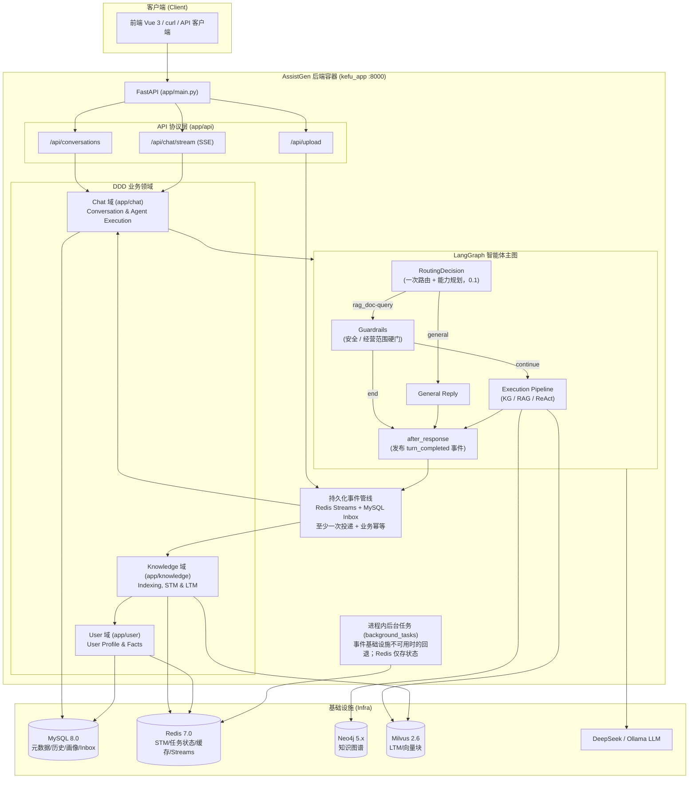

# AssistGen - 基于大语言模型构建的智能客服系统

基于 **FastAPI** 的智能客服**后端**（本仓库），支持 DeepSeek、Qwen2.5、Llama3 等多种大语言模型，覆盖 Agent、RAG、知识图谱在智能客服领域的主流应用场景。

> **前后端分离**：工程化前端见 `frontend/`（Vue 3 + Vite + TS）。  
> Docker：`http://localhost:8080`（Nginx）→ 反代 API 到 `app:8000`。

## 架构概览



## 功能特性

### 1. 通用问答 & 深度思考
- 支持 DeepSeek V3 / R1 在线 API
- 支持 Ollama 接入任意对话模型（Qwen2.5、Llama3 等）
- 通过 `CHAT_SERVICE` / `REASON_SERVICE` 环境变量灵活切换

### 2. 智能 Agent (LangGraph)
- 主图由一次统一路由决策、Guardrails 与执行器组成；复杂问题再进入 ReAct 子图，KG 内部再按需进入 Text2Cypher 子图
- 统一路由决策一次输出 `type` 与能力标签 `need_graph` / `need_rag` / `mode` / `complexity`，代码解析为 GRAPH_ONLY / RAG_ONLY / PARALLEL / GRAPH_THEN_RAG / AGENT_REACT；知识查询较旧链路少一次 LLM 调用
- Retriever 抽象接口（依赖倒置），策略模式（Cypher 生成），注册表模式（检索器管理）
- Prompt 注入 4 层防线：XML 隔离 + 结构化输出 + Guardrails + 写操作硬拦截
- 温度分级体系：RoutingDecision 0.1 → Cypher 0.2 → ReAct 0.4 → General 0.7

### 3. 分层记忆系统（优先级模型 P0-P3）
- **Redis 短期记忆**：ZSET 滑动窗口 + MsgPack 多级 Zstd 压缩 + LLM 压缩摘要
- **MySQL 用户画像**：结构化画像 + 事实版本追踪 + Redis 缓存层
- **Milvus 长期记忆**：混合检索（向量 + BM25 + RRF）+ 记忆衰减 + 敏感信息过滤
- **记忆优先级**：P0 最近消息 > P1 用户画像 > P2 会话摘要 > P3 长期记忆

### 4. Neo4j 知识图谱
- 电商知识图谱（8 节点 + 8 关系，16 个 CSV 初始化）
- 27 个预定义 Cypher 模板（bge-m3 语义匹配自动选择）
- Text2Cypher 动态生成（Few-Shot + 5 层验证 + 最多 3 次修正循环）
- 快速路径 + 兜底链路：PredefinedTemplateStrategy 命中模板，否则回退到 LLM 生成与校验链路

### 5. RAG 文档检索
- 支持 **Markdown（.md / .markdown）/ PDF / Word（.docx）** 上传 + 内置文档解析管道
- PDF 与 DOCX 先转为 Markdown，原生 Markdown 直接清洗分块后入库
- 混合检索（向量 + BM25 + RRF 融合）；BM25 由 **Milvus 服务端 Function** 计算，查询侧传原文
- **文档动态更新（策略 2）**：`is_deleted` + `version`；`mode=replace` + 稳定 `doc_id` 时软删旧 chunk 再写新版；检索默认排除软删
- **replace 幂等**：新文件 `content_hash` 与 MySQL 一致则 **跳过 reindex**（不建任务、不软删）
- **MySQL `user_documents`**：绑定 `doc_id` 与文件名/版本/状态；API `GET/DELETE /api/documents/user/{user_id}[/{doc_id}]`；前端「我的文档 / 更新」固定该行 `doc_id`
- **知识库为全局共享**：检索面向所有用户；`user_id` 只决定谁能替换/删除该文档（上传管理归属）。上传即全员生效，传错请用 DELETE 撤下
- **RAG 书面化改写**：进入文档检索前把口语问句改成书面检索问句（默认开、超时回退；不做 HYDE/退步）

### 6. 会话管理（身份来自令牌）
- MySQL `conversations` 表只存会话元信息（标题、时间、类型）
- 消息双轨：**MySQL `messages` 持久化历史（给人看）** + Redis STM 推理上下文（ZSET 滑动窗口，24h TTL，给模型看）
- 会话创建 / 列表 / 删除 / 改名 / **历史消息**（MySQL `messages` append-only，切回旧会话可见）；全部按令牌身份做归属校验（不符 404）
- **删除会话会联动清理记忆**：
  - MySQL：删除 `conversations` 元信息，并兼容清理历史 `messages` 表数据
  - Redis STM：删除该 `session_id` 下 messages/summary/meta/lock，及幂等用的
    `turns`/`turn_lock`
  - Milvus LTM：软删除带 `session_id` 的长期记忆（`is_deleted=true`）

### 7. 事件管线与后台执行（v3.35.0）
- Redis Streams 消费组：`turn_completed`（历史落库+记忆写入）、
  `document_index_requested`（文档索引）
- **进程崩溃自动续跑且业务幂等**：Streams 保持“至少一次投递”，MySQL
  `processed_events` Inbox 以 `(event_type,event_id)` 认领/完成事件；已完成
  事件重放只 ACK，不重复写历史、STM 或文档索引。payload hash 不一致会拒绝执行并
  最终进入死信流。
- 成功路径严格按 **Inbox claim → 业务 handler → Inbox completed → XACK**
  执行；若完成标记或 ACK 前进程崩溃，后续重放由业务落点的事件 ID 再次收敛。
  `turn_completed` 使用稳定的 `turn_id`：MySQL 历史以
  `(conversation_id, turn_event_id, sender)` 唯一键、Redis STM 以会话级
  `turns` 集合防重；`document_index_requested` 复用 `task_id`，以稳定
  chunk ID 和 Milvus upsert/reindex 检测防止重复索引。
- **既有 MySQL 环境**必须在发布前手工执行：

  ```bash
  mysql -u <user> -p <database> < configs/mysql-init/migration_stream_idempotency.sql
  ```

  MySQL 容器的 `init.sql` 只会在新建数据卷时自动执行；新环境已自动建表。
- 默认 app 进程内嵌消费；可 `EVENTS_INLINE_CONSUMER=0` + `python -m app.worker` 拆分部署
- SSE 按用户并发限流（429）；LLM 按角色超时；`X-Request-ID` 贯穿全链路日志
- RAG 离线评测：`make eval`（hit@k / MRR，golden set 24 条）

## 鉴权（v3.35.0 起）

除 `/health*` 与 `/api/auth/*` 外，**所有接口需要 `Authorization: Bearer <token>`**。
身份由服务端从令牌推导，任何接口不再接受自报 `user_id`。

```bash
# 注册（或用种子演示账号 demo_user / demo1234）
curl -s -X POST http://localhost:8000/api/auth/register \
  -H 'Content-Type: application/json' \
  -d '{"username": "alice", "password": "secret123"}'

# 登录拿 token
TOKEN=$(curl -s -X POST http://localhost:8000/api/auth/login \
  -H 'Content-Type: application/json' \
  -d '{"username": "demo_user", "password": "demo1234"}' | python -c 'import sys,json;print(json.load(sys.stdin)["access_token"])')

# 带 token 调用业务接口
curl -s http://localhost:8000/api/conversations -H "Authorization: Bearer $TOKEN"
```

生产部署：`SECRET_KEY` 必须换成强随机值，并删除 init.sql 的种子用户。

## 性能与工程约定

这几条是踩过坑之后固化下来的硬约定，改动相关代码前请先读。

### 1. 同步 SDK 一律走线程池，禁止在协程里直接调用

`pymilvus.MilvusClient` 和 LangChain 的 `Embeddings` **都是同步接口**。
在 `async def` 里直接调用它们，协程不会让出控制权——单进程 FastAPI 下，
一次 LTM 检索（embedding 推理 + Milvus 往返）会把**当前进程的所有并发请求**
一起卡住，包括健康检查和 SSE 心跳。

```python
from app.shared.core.async_bridge import run_blocking

vector = await run_blocking(self.embedding_model.embed_query, text)   # ✅
vector = self.embedding_model.embed_query(text)                       # ❌ 阻塞事件循环
```

### 2. 批量优先：embedding 与 Redis 往返

- 索引文档用 `embed_documents` 批量编码，不要逐 chunk `embed_query`
- 多条 Redis 命令用 `pipeline` 合并；写一轮对话用 `append_messages` 而非两次 `append_message`
- 多路无依赖的 IO 用 `asyncio.gather`（如 `before_agent` 的 STM / 画像 / LTM 三路）

### 3. BM25 稀疏检索：查询侧传原始文本

collection 上声明了服务端 BM25 `Function`，doc 侧 token id 由 **Milvus 自己的词表**生成。
查询侧必须同样把原文交给 Milvus，**不要在客户端分词或自己算 token id**——
客户端算出来的 id 和服务端对不上，稀疏分支会静默失效、RRF 退化成纯向量检索。

### 4. 降级要分级：外部故障 ≠ 代码缺陷

统一走 `app.shared.core.degradation.log_degradation`：

| 异常类别 | 日志级别 | 堆栈 |
|---|---|---|
| Redis 错误 / 超时 / 连接失败 / OSError | `warning` | 否 |
| 其余全部（TypeError、AttributeError…） | `error`（`logger.exception`） | **是** |

不要写裸的 `except Exception: return []`——那会让「代码写错了」和「网络抖了一下」
在日志里长得一模一样。本项目曾因此让长期记忆整条链路静默失效很久。

### 5. 后台任务不是分布式队列

`app/shared/background_tasks.py` 的任务协程跑在**当前进程内存**里，Redis 只存状态。
进程重启即丢失、不自动续跑、多副本不分担、无重试。重启后遗留任务会被标记为
`interrupted`。需要真正的队列语义请换 Redis Stream / ARQ / Celery。

### 6. 配置单一来源

embedding 模型统一由 `app.shared.core.embeddings.get_embedding_model()` 构造，
Milvus 连接参数统一取自 `settings`。**不要在模块里直接 `os.getenv` 另建一份默认值**——
LTM 与 RAG 必须使用同一个 embedding 模型，否则两边向量落在不同语义空间。

## 技术栈

- **后端**：FastAPI + SQLAlchemy (async) + LangGraph + LangChain
- **数据库**：MySQL 8.0 + Neo4j + Redis 7.0 + Milvus 2.6
- **LLM**：DeepSeek / Ollama（可切换）
- **Embedding**：bge-m3（1024 维）
- **前端**：`frontend/` Vue 3 控制台（会话 / SSE / 知识文档上传与更新）
- **OpenAPI**：`http://localhost:8000/docs` 或经前端网关 `http://localhost:8080/docs`
- **界面入口**：`http://localhost:8080/`（Docker）或 `npm run dev` → `:5173`

## 快速启动

### 1. 准备环境变量

先把根目录的环境变量模板复制到后端运行目录：

```bash
cp .env.example app/.env
```

然后只需要填写 API Key、模型配置等业务参数。

`.env.docker` 已内置容器网络下的 MySQL / Neo4j / Redis / Milvus 地址覆盖项，
也会自动覆盖 Compose 默认使用的数据库名、账号和密码，
不需要再把 `localhost` 或本地开发凭据手工改成容器服务配置。

### 2. Docker Compose 一键启动

```bash
docker compose up -d --build
```

启动流程会自动完成：
- MySQL / Neo4j / Redis / Milvus 基础设施启动
- `neo4j-importer` one-off job 会在检测到 `docker/neo4j-import/` 下存在完整 CSV 数据集时自动导入图谱；缺失时直接跳过，不阻塞启动
- `app` 服务启动前自动执行 MySQL 建表脚本
- `app` 通过 `.env.docker` 自动切换到容器内服务地址和默认凭据
- FastAPI 对外暴露 `http://localhost:8000`
- **前端** `frontend` 服务映射 `http://localhost:8080`（Nginx 反代 API）
- 只有 `app`/`frontend` 映射宿主机端口；MySQL / Neo4j / Redis / MinIO / Milvus 都只在 Compose 内部网络可见
- 持久化数据写入 Docker 命名卷，而不是项目目录下的 `docker_data/`
- 卷名固定为 `kefu_mysql_data`、`kefu_neo4j_data`、`kefu_redis_data`、`kefu_milvus_data` 等，和当前目录名解耦

如果宿主机 `8080` 已被其他服务占用，可以只覆盖前端端口：

```bash
FRONTEND_PORT=8081 docker compose up -d frontend
```

如果需要连同数据库和向量库数据一起清空：

```bash
docker compose down -v
```

如果只是查看当前命名卷：

```bash
docker volume ls | grep '^local.*kefu_'
```

如果后续要恢复 Neo4j 图谱初始化，把那 16 份 CSV 数据放进 `docker/neo4j-import/` 即可，无需再改 `compose`。

项目当前只保留 `docker compose` 这一种启动方式，不再保留其他应用启动入口。

### 3. 开发检查（可选）

根目录 [pyproject.toml](pyproject.toml) 收敛了 `pytest` / `ruff` / `mypy`；  
[pyrightconfig.json](pyrightconfig.json) 指定 **Pylance/basedpyright 只检查 `app/`**（排除 `tests/`）。

```bash
pytest
ruff check app scripts tests
mypy app
# 可选
basedpyright app --level error
```

## 项目结构

当前项目以 `app/` 作为唯一主代码树。业务域（`chat` / `knowledge` / `user`）统一为：

```text
domain/ → application/ → infrastructure/
```

全局共享**只有** `app/shared`；对话域内工具在 `app/chat/infrastructure/utils`（禁止再命名 shared）。

```
deepseek_agent/
├── app/                         # 主应用目录
│   ├── api/                     # FastAPI 路由
│   ├── chat/                    # 对话 / Agent / KG（domain+application+infrastructure）
│   ├── knowledge/               # 记忆 / 文档解析 / 索引（同上骨架）
│   ├── user/                    # 用户与画像（同上骨架）
│   ├── shared/                  # 唯一全局共享内核
│   │   ├── core/                #   配置 / 日志 / DB / async_bridge / degradation / embeddings
│   │   ├── retrieval/           #   Milvus 混合检索公共核
│   │   ├── streams.py           #   Redis Streams 消费组 / 重放 / 死信
│   │   └── background_tasks.py  #   任务状态协议 + 进程内回退
│   ├── platform/                # 应用容器 / 事件路由 / MySQL Inbox
│   │   ├── container.py          #   生命周期与消费者装配
│   │   ├── event_inbox.py        #   Inbox 租约 / 完成状态
│   │   └── events.py             #   事件 handler 路由
│   └── scripts/                 # Compose 内部脚本
├── configs/                     # Docker 初始化配置
├── docs/                        # 模块详细文档 (00–07 及面试手册)
├── scripts/                     # 仓库级辅助脚本
├── tests/                       # 与领域对齐的测试
├── docker-compose.yml
├── pyproject.toml
└── README.md
```

### 架构特点

- **领域驱动设计**：按业务场景（chat/knowledge/user）划分领域，骨架一致
- **分层架构**：`domain` → `application` → `infrastructure`；`api` 只调 application
- **依赖倒置**：领域契约不依赖框架细节；基础设施可替换
- **单一主树**：旧兼容目录已移除；假 shared（chat 内）已改为 `utils`

## 相关文档

- [docs/全流程文档索引.md](docs/全流程文档索引.md) — **全流程详细文档索引（推荐，模块 00–10）**
- [docs/modules/07-配置参数与数据字段全览.md](docs/modules/07-配置参数与数据字段全览.md) — **环境变量 / AppConfig / STM·LTM / MySQL·Redis·Milvus 字段（调参必看）**
- [specs/2026-07-21-config-and-storage-fields.md](specs/2026-07-21-config-and-storage-fields.md) — 配置与存储字段摘要（可提交）
- [docs/modules/00-全流程图集.md](docs/modules/00-全流程图集.md) — **Mermaid 全流程图集（强烈推荐）**
- [docs/superpowers/specs/2026-07-28-redis-stream-idempotency-design.md](docs/superpowers/specs/2026-07-28-redis-stream-idempotency-design.md) — Redis Stream Inbox 幂等设计与故障语义
- [specs/2026-07-20-domain-skeleton-align-design.md](specs/2026-07-20-domain-skeleton-align-design.md) — 域骨架对齐设计
- [CHANGELOG.md](CHANGELOG.md) — 版本更新日志
- [app/README.md](app/README.md) — 当前主代码树说明
- [app/chat/README.md](app/chat/README.md) / [app/knowledge/README.md](app/knowledge/README.md) / [app/user/README.md](app/user/README.md) / [app/shared/README.md](app/shared/README.md)
- [docs/modules/01-系统总览.md](docs/modules/01-系统总览.md) — 当前架构和目录边界
- [docs/AI应用后端实习面试手册.md](docs/AI应用后端实习面试手册.md) — 面试向的系统讲解
- [app/scripts/README.md](app/scripts/README.md) — 应用内维护脚本说明
- [app/shared/core/README.md](app/shared/core/README.md) — 共享基础设施说明
- [app/shared/security/README.md](app/shared/security/README.md) — Prompt 防护说明
- [app/user/infrastructure/models/README.md](app/user/infrastructure/models/README.md) — 持久化模型说明
- [app/chat/infrastructure/kg/README.md](app/chat/infrastructure/kg/README.md) — KG 子图说明

## License

MIT
