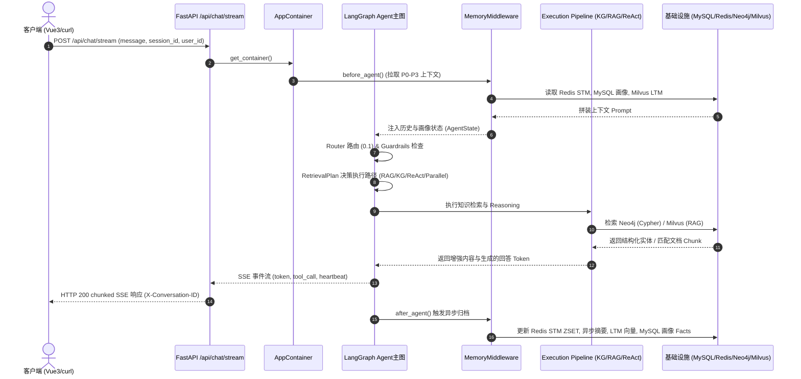

# AssistGen AI 应用后端实习面试手册

> 这份手册的目标很明确：帮你把这个项目讲清楚，而不是把文档背复杂。  
> 事实口径以当前源码为准：`app/`、`frontend/`、`docker-compose.yml`、`tests/`。  
> 使用原则：只讲你真实理解和真实参与过的部分，不要把文档模板原样冒充成“全部都是我做的”。

## 1. 先把项目理解对

### 1.1 这个项目是什么

一句话版本：

> 这是一个面向智能客服场景的 AI 应用后端项目，对外提供会话、文档上传、文档列表和 SSE 问答接口，内部用 LangGraph 编排 Agent，再结合 Neo4j、Milvus、Redis、MySQL 去处理结构化问答、文档问答和多轮上下文记忆。

### 1.2 它解决的不是“接一个大模型接口”这么简单

这个项目真正解决的是下面这类工程问题：

1. 用户问题类型不一样，不能全靠一个 Prompt 硬答。
2. 有的问题要查结构化关系，比如商品、订单、客户、售后规则。
3. 有的问题要查文档，比如政策、手册、说明书。
4. 有的问题要记住前文和用户偏好，才能连续对话。
5. 所以系统必须把路由、检索、记忆、写回和降级机制都建起来。

### 1.3 它和普通聊天机器人最大的区别

你可以直接这样讲：

1. 不是单次 LLM 调用，而是显式工作流编排。
2. 不是单一知识源，而是图谱和文档双链路。
3. 不是只记聊天历史，而是分层记忆。
4. 不是只返回答案，还要考虑 SSE、异步上传、排障和依赖降级。

## 2. 开场时怎么介绍项目

### 2.1 30 秒版本

> 我做的是一个智能客服方向的 AI 应用后端。对外用 FastAPI 提供会话管理、文档上传和流式问答接口，内部用 LangGraph 编排 Agent，根据问题类型决定走图谱查询、文档检索或者多步推理，再结合 Redis 短期记忆、MySQL 用户画像、Milvus 长期记忆和 Neo4j 结构化知识，提升客服场景里的问答准确性和多轮连续性。

### 2.2 90 秒版本

可以按下面顺序讲：

1. 先说业务目标：这是一个智能客服后端，不是普通聊天页，重点是让用户既能问通用问题，也能问商品、订单、售后政策和企业内部知识。
2. 再说主链路：请求从 FastAPI 进来后，不会直接丢给一个模型，而是先走 Router、Guardrails、Retrieval Plan，再决定走 Neo4j、Milvus 还是 ReAct。
3. 再说存储分工：会话元信息和用户画像在 MySQL，消息窗口和任务状态在 Redis，结构化业务关系在 Neo4j，文档向量和长期记忆在 Milvus。
4. 最后说工程点：这个项目比较值得讲的是 SSE 问答、上传异步索引、分层记忆，以及对依赖故障的降级处理。

### 2.3 3 分钟版本

如果面试官愿意听细一点，可以这样展开：

1. 项目定位：
   这是一个面向智能客服的 AI 应用后端，目标是把企业知识、结构化业务数据和多轮上下文结合起来，让回答更接近真实客服系统，而不是单纯闲聊。
2. 请求主线：
   用户问题进入 `/api/langgraph/query` 后，系统会先判断是一般聊天还是需要增强问答；如果需要增强，就继续做经营范围守卫、检索计划决策，再决定走图谱、文档检索、并行检索还是 ReAct 多步推理。
3. 知识来源：
   图谱链路适合结构化关系问题，文档链路适合政策、说明书、FAQ 这类文本问题；两条链路都统一挂在 Retriever 抽象下。
4. 记忆系统：
   最近消息、用户画像、会话摘要和长期记忆分层注入，避免把所有历史直接拼进 Prompt，也更容易控制噪声。
5. 工程设计：
   上传不走同步解析，而是落盘后异步建索引；问答用 SSE 返回；记忆和图谱、文档、任务状态都做了失败降级，避免一个依赖挂掉就把整个主流程拖死。

## 3. 一次请求在系统里怎么走



你要能按这个顺序口述：

```text
前端或调用方
→ POST /api/langgraph/query (或 /api/chat/stream)
→ agent_query_service.stream_agent_query
→ LangGraph 主图
→ Router / Guardrails / Retrieval Plan
→ KG / RAG / PARALLEL / GRAPH_THEN_RAG / AGENT_REACT
→ 生成答案并流式输出
→ after_response 写回 STM / 摘要 / LTM / 画像
```

这里最关键的不是背函数名，而是知道每一层各自解决什么问题：

1. API 层解决协议和 SSE。
2. 主图解决决策和执行路径。
3. 检索层解决“去哪里找知识”。
4. 记忆层解决“用户为什么能连续聊”。
5. 存储层解决“不同数据为什么要放在不同地方”。

## 4. 这几个设计为什么合理

### 4.1 为什么不是一个大 Prompt 直接做完

因为这类系统的问题类型太杂：

1. 闲聊问题和结构化查询问题不是一回事。
2. 文档检索和图谱查询使用的数据形态不同。
3. 多步推理的复杂问题不适合走最短路径。
4. 显式编排更容易控制安全、日志、降级和排障。

### 4.2 为什么同时用了 MySQL、Redis、Neo4j、Milvus

| 存储 | 用来放什么 | 为什么不用别的 |
|---|---|---|
| MySQL | 会话元信息、用户画像、文档元数据 | 这些是关系型、durable、需要事务的数据 |
| Redis | 最近消息、摘要、任务状态、缓存 | 读写频繁、适合热数据和 TTL |
| Neo4j | 商品、订单、客户、供应商等关系型知识 | 图关系查询比关系表和向量检索更自然 |
| Milvus | 文档 chunk、长期语义记忆 | 语义检索和相似性召回更适合向量库 |

### 4.3 为什么上传必须异步

1. PDF 和 DOCX 解析本身可能比较慢。
2. 向量化和入库也可能耗时较长。
3. 如果同步处理，会占着 HTTP worker 不放。
4. 异步返回 `task_id` 后，前端可以轮询状态，也更容易排障。

### 4.4 为什么记忆要做分层

1. 最近消息最权威，但不能无限增长。
2. 用户画像适合跨会话保留稳定偏好。
3. 会话摘要用来压缩旧轮次。
4. 长期记忆适合保留沉淀出的语义信息。

如果你把这四层混在一起，最终会得到一个既难控制又容易污染 Prompt 的大杂烩。

### 4.5 为什么用户画像不直接并到记忆系统里

因为画像和记忆不是一个层级的资产：

1. 画像是用户级、durable、跨会话的数据。
2. 记忆更多是会话级增强上下文。
3. 删会话应该清 STM/LTM，但不应该顺手把用户画像删掉。
4. 画像单独建模后，缓存一致性和版本化事实更清楚。

## 5. 如果面试官问“你做了什么”，可以怎么讲

你不要把项目所有模块都往自己身上揽。更稳的说法是按你真实参与方向来讲。

### 5.1 如果你主要做后端接口

1. 我重点理解和整理了会话、上传、文档列表和 SSE 问答接口。
2. 我比较关注接口契约是不是稳定，比如 `conversation_id`、`doc_id`、`task_id` 和 `X-Conversation-ID` 这些关键字段。
3. 我还把上传异步化和错误处理的调用链讲清楚了，方便联调和排障。

### 5.2 如果你主要做 Agent / RAG

1. 我重点梳理了 LangGraph 主图，弄清 Router、Guardrails、Retrieval Plan 和 ReAct 的边界。
2. 我比较关注图谱检索和文档检索为什么要保留两条独立路径。
3. 我还整理了 Text2Cypher、Hybrid Search、RRF 和 rerank 在实际链路里的作用。

### 5.3 如果你主要做记忆 / 画像

1. 我重点看了 Redis 短期记忆、Milvus 长期记忆和 MySQL 画像是怎么协作的。
2. 我比较关注 `before_agent` / `after_agent` 的读写顺序和降级策略。
3. 我还整理了画像缓存和 facts 版本化的实现理由。

### 5.4 如果你主要做文档与说明

1. 我做的重点不是增加文档数量，而是把项目介绍、设计理由和面试问答整理得更适合学习。
2. 我把核心主线收敛到系统总览、API、Agent、记忆、检索和画像这几条主线。
3. 我补充了更接近面试场景的问答，让项目更容易讲顺。

## 6. 当前实现、当前边界、下一步应该严格区分

### 6.1 当前已经有的能力

1. 会话创建、列表、删除、改名。
2. SSE 问答。
3. Markdown、PDF、DOCX 上传与异步索引。
4. KG + RAG 双检索。
5. STM + 画像 + LTM 分层记忆。

### 6.2 当前应该主动承认的边界

1. 当前没有完整 JWT 鉴权。
2. `user_id` 主要由调用方传入，安全模型偏演示 / 内部系统。
3. `background_tasks` 是进程内 asyncio 任务，不是独立 worker 集群；重启后遗留任务会被标记为 interrupted，不会自动续跑。
4. `/health` 只能说明 HTTP 进程活着，不等于所有依赖都健康。
5. 生产级审计、限流、细粒度权限控制还不完整。

### 6.3 如果面试官问“那你会怎么继续做”

可以按这个顺序回答：

1. 先补鉴权和会话归属校验。
2. 再把任务队列从进程内任务升级为独立 worker。
3. 再补限流、审计日志、CORS 白名单和更完整的健康检查。
4. 最后再考虑更细的画像治理、删除用户数据闭环和可观测性。

## 7. 高频面试问答

### Q1. 这个项目最核心的工程价值是什么？

答：不是“接了一个大模型”，而是把客服场景下的路由、检索、记忆、异步任务和流式输出组织成了一套可运行的后端系统。

### Q2. 为什么不用一个大模型直接回答所有问题？

答：因为问题类型不一样，知识来源也不一样。结构化关系问题更适合图谱，文档问答更适合 RAG，复杂问题还可能需要 ReAct 多步推理。全部塞进一个 Prompt，效果、可控性和排障性都会变差。

### Q3. 为什么问答要用 SSE？

答：用户体验更好，可以边生成边返回；同时也更符合大模型输出是流式 token 的特点。这个项目里 SSE 还顺手把 `X-Conversation-ID` 作为续聊契约显式暴露出来。

### Q4. 为什么消息不直接存 MySQL？

答：消息是高频热数据，主路径只关心最近窗口和摘要，更适合放 Redis。MySQL 主要存会话元信息和用户级 durable 数据，这样主流程更轻。

### Q5. 为什么删会话要清 Redis 和 Milvus，但不删画像？

答：因为 STM 和按 `session_id` 写入的 LTM 是会话级数据，而画像是用户级 durable 数据。删会话只清这个会话的上下文增强，不应该把用户长期偏好一起删掉。

### Q6. 为什么同时需要 Neo4j 和 Milvus？

答：因为它们处理的知识形态不同。Neo4j 处理实体和关系明确的问题，Milvus 处理语义相似检索。统一说成“两个库都在查知识”太粗糙。

### Q7. 为什么上传后不能立刻保证问得到？

答：因为上传成功只代表文件已经校验、落盘并提交了后台任务，不代表解析、切分、向量化和入库都完成了。真正能问到，要等索引任务完成。

### Q8. 为什么用户画像里的 facts 要版本化？

答：因为用户偏好和事实是会变化的。直接 `UPDATE` 会丢历史。版本化更方便追溯变化、排查抽取错误，也更符合用户画像的演进特性。

### Q9. 如果 Milvus 或 Neo4j 挂了，系统会怎样？

答：理想行为不是全站直接 500，而是尽量降级。这个项目里主路径对部分依赖失败做了降级处理，核心思路是尽量让主问答继续，只是少掉增强能力。

### Q10. 你觉得这个项目最像 AI 应用工程的地方是什么？

答：最像 AI 应用工程的地方不是模型调用本身，而是工作流编排、Prompt 安全、双路检索、记忆治理、异步上传和依赖降级这些工程化设计。

### Q11. 这个项目最大的不足是什么？

答：如果按生产标准看，当前最大的不足不是“模型不够强”，而是鉴权、授权、独立任务 worker、可观测性和更完整的数据治理还需要继续补。

### Q12. 如果面试官问“你怎么证明你真的看过源码”

答：最好的方式不是背目录，而是能把一条真实链路讲通，比如 `/api/langgraph/query` 怎么进主图、`conversation_id` 怎么变成 `thread_id`、`after_response` 怎么写回记忆、上传为什么返回 `task_id` 而不是同步等结果。

## 8. 现场演示时怎么讲

如果面试里允许你边讲边演示，可以按下面顺序：

1. 先创建会话：说明会话元信息进 MySQL。
2. 再发起 SSE 问答：说明流式输出和 `X-Conversation-ID`。
3. 再上传一个文档：说明为什么返回的是 `task_id`。
4. 再继续追问：说明为什么系统能利用上下文和知识源继续回答。
5. 最后补一句系统边界：比如当前没有 JWT、任务队列仍是进程内任务。

## 9. 面试前最后一轮怎么复习

推荐顺序：

1. 先看 [01-系统总览.md](modules/01-系统总览.md)，把项目边界和主线讲顺。
2. 再看 [03-对话与Agent主图.md](modules/03-对话与Agent主图.md)，把 Agent 路径讲顺。
3. 再看 [04-记忆系统.md](modules/04-记忆系统.md) 和 [05-知识检索与文档解析.md](modules/05-知识检索与文档解析.md)，把设计理由讲顺。
4. 最后看 [06-用户与画像.md](modules/06-用户与画像.md) 和 [07-配置参数与数据字段全览.md](modules/07-配置参数与数据字段全览.md)，补齐细节数字。

## 10. 最后提醒

1. 不要把“当前实现”和“理想优化”混为一谈。
2. 不要因为文档详细，就什么都往自己身上揽。
3. 真正有说服力的是：你能把一条请求链路、一个设计理由和一个系统边界讲完整。
4. 如果有地方你没做过，但你看过源码，就说“我重点理解和整理了这块实现”，不要硬说成“这是我主导开发的”。
