# 00 · 全流程可视化图集

> 本文件集中放**详细流程图**。  
> 支持 Mermaid 的编辑器（GitHub / VS Code Markdown Preview / Typora 等）可直接渲染。  
> 对应文字说明见 [全流程文档索引.md](../全流程文档索引.md) 各模块。

---

## 目录

1. [系统总架构](#1-系统总架构)
2. [Docker Compose 启动顺序](#2-docker-compose-启动顺序)
3. [App 进程生命周期](#3-app-进程生命周期)
4. [会话 CRUD 时序](#4-会话-crud-时序)
5. [智能问答主链路（SSE）](#5-智能问答主链路sse)
6. [LangGraph 主图状态机](#6-langgraph-主图状态机)
7. [Router / Guardrails / Plan 决策细节](#7-router--guardrails--plan-决策细节)
8. [检索执行（能力标签→路径）执行策略](#8-检索执行（能力标签→路径）执行策略)
9. [ExecutionPipeline 内部步骤](#9-executionpipeline-内部步骤)
10. [ReAct 子图完整循环](#10-react-子图完整循环)
11. [记忆 before_agent / after_agent](#11-记忆-before_agent--after_agent)
12. [记忆压缩与抽取](#12-记忆压缩与抽取)
13. [P0–P3 注入结构](#13-p0p3-注入结构)
14. [Text2Cypher 工作流](#14-text2cypher-工作流)
15. [文档上传与异步索引](#15-文档上传与异步索引)
16. [doc_parser 解析切分管线](#16-doc_parser-解析切分管线)
17. [画像读写](#17-画像读写)
18. [任务队列状态机](#18-任务队列状态机)
19. [数据落点全景](#19-数据落点全景)
20. [故障降级路径](#20-故障降级路径)

---

## 1. 系统总架构

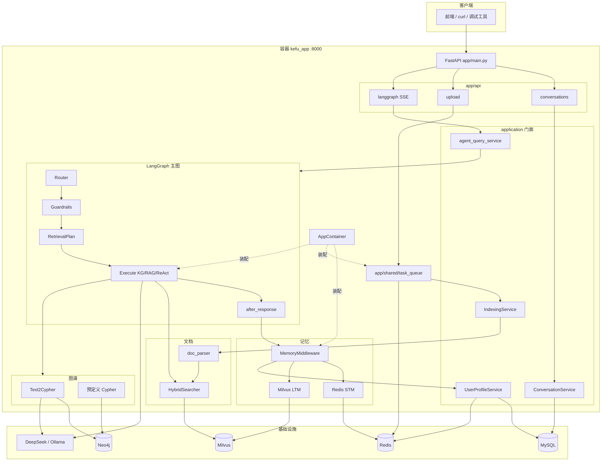
```mermaid
flowchart TB
    subgraph Client["客户端"]
        FE[前端 / curl / 调试工具]
    end

    subgraph AppContainer["容器 kefu_app :8000"]
        API["FastAPI app/main.py"]
        subgraph APILayer["app/api"]
            CAPI[conversations]
            UAPI[upload]
            LAPI[langgraph SSE]
        end
        subgraph AppLayer["application 门面"]
            CS[ConversationService]
            AQS[agent_query_service]
            IS[IndexingService]
            UPS[UserProfileService]
        end
        TQ[app/shared/task_queue]
        subgraph Agent["LangGraph 主图"]
            R[Router]
            G[Guardrails]
            P[RetrievalPlan]
            E[Execute KG/RAG/ReAct]
            AR[after_response]
        end
        subgraph Memory["记忆"]
            MM[MemoryMiddleware]
            STM[Redis STM]
            LTM[Milvus LTM]
        end
        subgraph KG["图谱"]
            T2C[Text2Cypher]
            PRE[预定义 Cypher]
        end
        subgraph Doc["文档"]
            DP[doc_parser]
            HS[HybridSearcher]
        end
        AC[AppContainer]
    end

    subgraph Infra["基础设施"]
        MY[(MySQL)]
        RD[(Redis)]
        NJ[(Neo4j)]
        MV[(Milvus)]
        LLM[DeepSeek / Ollama]
    end

    FE --> API
    API --> CAPI & UAPI & LAPI
    CAPI --> CS --> MY
    UAPI --> TQ --> IS --> DP --> HS --> MV
    LAPI --> AQS --> Agent
    R --> G --> P --> E --> AR
    E --> KG & HS
    E --> LLM
    AR --> MM
    MM --> STM & LTM & UPS
    STM --> RD
    LTM --> MV
    UPS --> MY & RD
    T2C --> NJ & LLM
    PRE --> NJ
    TQ --> RD
    AC -.->|装配| MM & TQ & E
```

---

## 2. Docker Compose 启动顺序

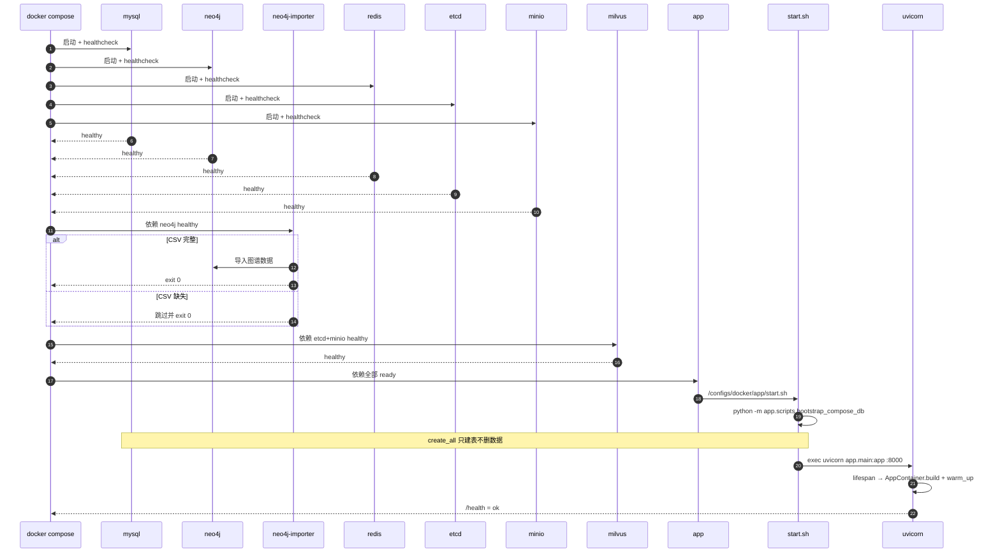
```mermaid
sequenceDiagram
    autonumber
    participant DC as docker compose
    participant MY as mysql
    participant NJ as neo4j
    participant IMP as neo4j-importer
    participant RD as redis
    participant ET as etcd
    participant MN as minio
    participant MV as milvus
    participant APP as app
    participant SH as start.sh
    participant UV as uvicorn

    DC->>MY: 启动 + healthcheck
    DC->>NJ: 启动 + healthcheck
    DC->>RD: 启动 + healthcheck
    DC->>ET: 启动 + healthcheck
    DC->>MN: 启动 + healthcheck

    MY-->>DC: healthy
    NJ-->>DC: healthy
    RD-->>DC: healthy
    ET-->>DC: healthy
    MN-->>DC: healthy

    DC->>IMP: 依赖 neo4j healthy
    alt CSV 完整
        IMP->>NJ: 导入图谱数据
        IMP-->>DC: exit 0
    else CSV 缺失
        IMP-->>DC: 跳过并 exit 0
    end

    DC->>MV: 依赖 etcd+minio healthy
    MV-->>DC: healthy

    DC->>APP: 依赖全部 ready
    APP->>SH: /configs/docker/app/start.sh
    SH->>SH: python -m app.scripts.bootstrap_compose_db
    Note over SH,MY: create_all 只建表不删数据
    SH->>UV: exec uvicorn app.main:app :8000
    UV->>UV: lifespan → AppContainer.build + warm_up
    UV-->>DC: /health = ok
```

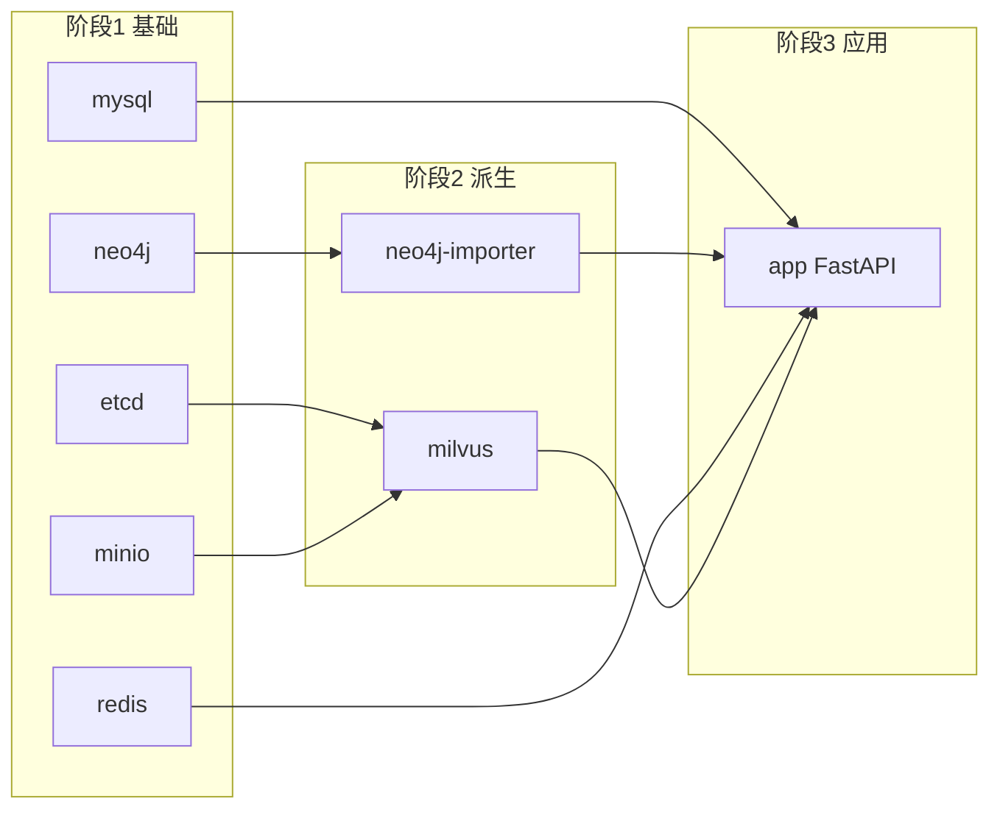
```mermaid
flowchart LR
    subgraph Phase1["阶段1 基础"]
        MY[mysql]
        NJ[neo4j]
        RD[redis]
        ET[etcd]
        MN[minio]
    end
    subgraph Phase2["阶段2 派生"]
        IMP[neo4j-importer]
        MV[milvus]
    end
    subgraph Phase3["阶段3 应用"]
        APP[app FastAPI]
    end
    MY --> APP
    NJ --> IMP --> APP
    RD --> APP
    ET --> MV
    MN --> MV
    MV --> APP
```

---

## 3. App 进程生命周期

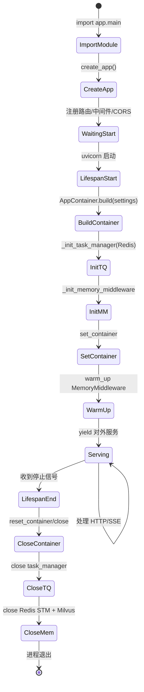
```mermaid
stateDiagram-v2
    [*] --> ImportModule: import app.main
    ImportModule --> CreateApp: create_app()
    CreateApp --> WaitingStart: 注册路由/中间件/CORS
    WaitingStart --> LifespanStart: uvicorn 启动
    LifespanStart --> BuildContainer: AppContainer.build(settings)
    BuildContainer --> InitTQ: _init_task_manager(Redis)
    InitTQ --> InitMM: _init_memory_middleware
    InitMM --> SetContainer: set_container
    SetContainer --> WarmUp: warm_up MemoryMiddleware
    WarmUp --> Serving: yield 对外服务
    Serving --> Serving: 处理 HTTP/SSE
    Serving --> LifespanEnd: 收到停止信号
    LifespanEnd --> CloseContainer: reset_container/close
    CloseContainer --> CloseTQ: close task_manager
    CloseTQ --> CloseMem: close Redis STM + Milvus
    CloseMem --> [*]: 进程退出
```

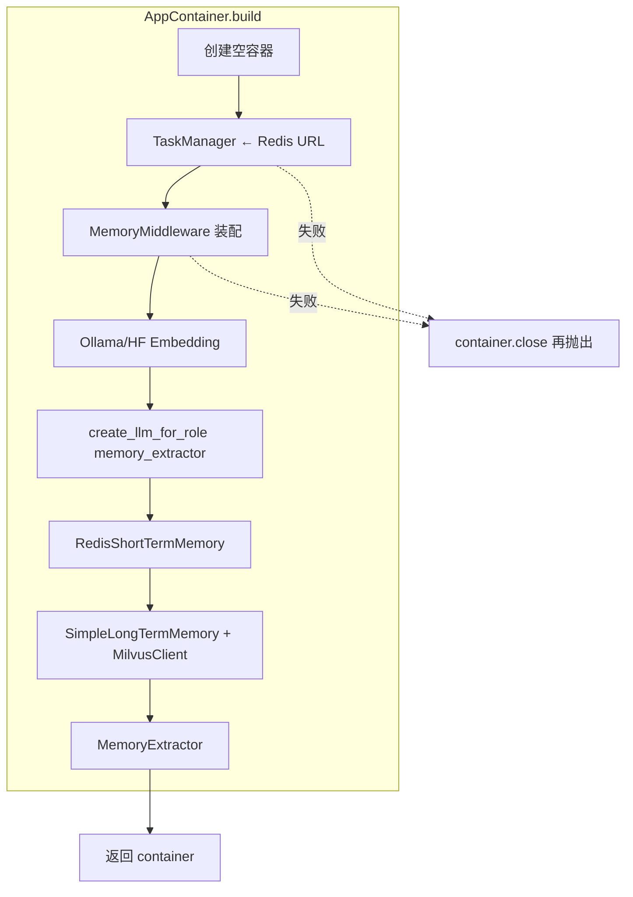
```mermaid
flowchart TB
    subgraph Build["AppContainer.build"]
        B1[创建空容器]
        B2[TaskManager ← Redis URL]
        B3[MemoryMiddleware 装配]
        B3a[Ollama/HF Embedding]
        B3b[create_llm_for_role memory_extractor]
        B3c[RedisShortTermMemory]
        B3d[SimpleLongTermMemory + MilvusClient]
        B3e[MemoryExtractor]
        B1 --> B2 --> B3
        B3 --> B3a --> B3b --> B3c --> B3d --> B3e
    end
    B3e --> OK[返回 container]
    B2 -.失败.-> CL[container.close 再抛出]
    B3 -.失败.-> CL
```

---

## 4. 会话 CRUD 时序

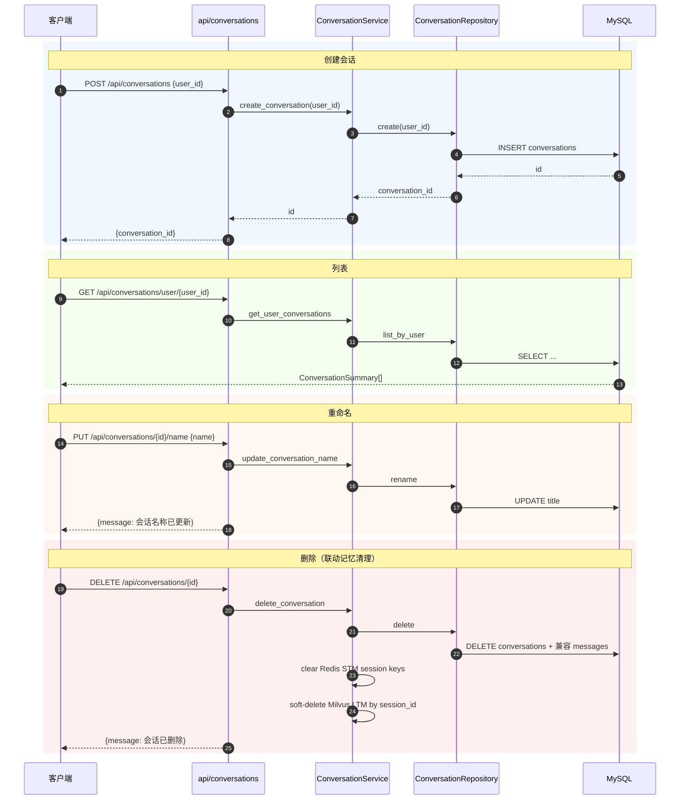
```mermaid
sequenceDiagram
    autonumber
    participant C as 客户端
    participant API as api/conversations
    participant S as ConversationService
    participant R as ConversationRepository
    participant DB as MySQL

    rect rgb(240,248,255)
    Note over C,DB: 创建会话
    C->>API: POST /api/conversations {user_id}
    API->>S: create_conversation(user_id)
    S->>R: create(user_id)
    R->>DB: INSERT conversations
    DB-->>R: id
    R-->>S: conversation_id
    S-->>API: id
    API-->>C: {conversation_id}
    end

    rect rgb(245,255,240)
    Note over C,DB: 列表
    C->>API: GET /api/conversations/user/{user_id}
    API->>S: get_user_conversations
    S->>R: list_by_user
    R->>DB: SELECT ...
    DB-->>C: ConversationSummary[]
    end

    rect rgb(255,248,240)
    Note over C,DB: 重命名
    C->>API: PUT /api/conversations/{id}/name {name}
    API->>S: update_conversation_name
    S->>R: rename
    R->>DB: UPDATE title
    API-->>C: {message: 会话名称已更新}
    end

    rect rgb(255,240,240)
    Note over C,DB: 删除（联动记忆清理）
    C->>API: DELETE /api/conversations/{id}
    API->>S: delete_conversation
    S->>R: delete
    R->>DB: DELETE conversations + 兼容 messages
    S->>S: clear Redis STM session keys
    S->>S: soft-delete Milvus LTM by session_id
    API-->>C: {message: 会话已删除}
    end
```

---

## 5. 智能问答主链路（SSE）

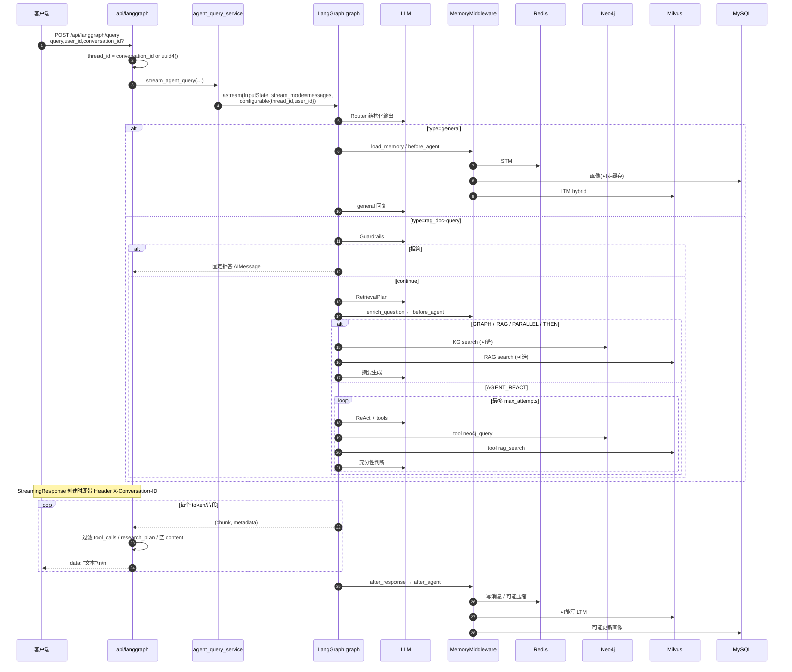
```mermaid
sequenceDiagram
    autonumber
    participant C as 客户端
    participant API as api/langgraph
    participant AQS as agent_query_service
    participant G as LangGraph graph
    participant LLM as LLM
    participant MM as MemoryMiddleware
    participant RD as Redis
    participant NJ as Neo4j
    participant MV as Milvus
    participant MY as MySQL

    C->>API: POST /api/langgraph/query<br/>query,user_id,conversation_id?
    API->>API: thread_id = conversation_id or uuid4()
    API->>AQS: stream_agent_query(...)
    AQS->>G: astream(InputState, stream_mode=messages,<br/>configurable{thread_id,user_id})

    G->>LLM: Router 结构化输出
    alt type=general
        G->>MM: load_memory / before_agent
        MM->>RD: STM
        MM->>MY: 画像(可走缓存)
        MM->>MV: LTM hybrid
        G->>LLM: general 回复
    else type=rag_doc-query
        G->>LLM: Guardrails
        alt 拒答
            G-->>API: 固定拒答 AIMessage
        else continue
            G->>LLM: RetrievalPlan
            G->>MM: enrich_question ← before_agent
            alt GRAPH / RAG / PARALLEL / THEN
                G->>NJ: KG search (可选)
                G->>MV: RAG search (可选)
                G->>LLM: 摘要生成
            else AGENT_REACT
                loop 最多 max_attempts
                    G->>LLM: ReAct + tools
                    G->>NJ: tool neo4j_query
                    G->>MV: tool rag_search
                    G->>LLM: 充分性判断
                end
            end
        end
    end

    Note over API,C: StreamingResponse 创建时即带 Header X-Conversation-ID

    loop 每个 token/片段
        G-->>API: (chunk, metadata)
        API->>API: 过滤 tool_calls / research_plan / 空 content
        API-->>C: data: "文本"\n\n
    end

    G->>MM: after_response → after_agent
    MM->>RD: 写消息 / 可能压缩
    MM->>MV: 可能写 LTM
    MM->>MY: 可能更新画像
```

---

## 6. LangGraph 主图状态机

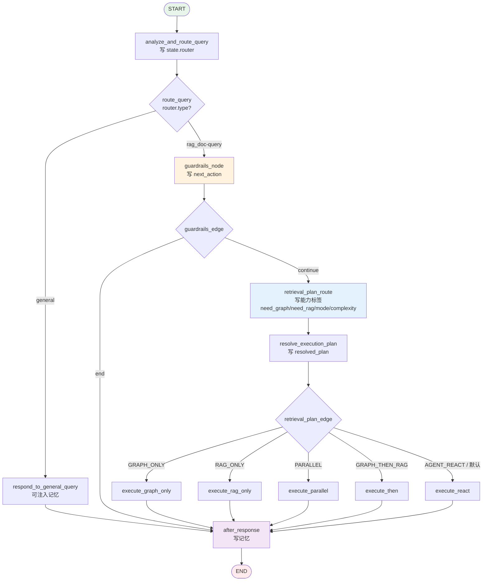
```mermaid
flowchart TD
    START([START]) --> A[analyze_and_route_query<br/>写 state.router]
    A --> RQ{route_query<br/>router.type?}

    RQ -->|general| GEN[respond_to_general_query<br/>可注入记忆]
    GEN --> AFTER[after_response<br/>写记忆]

    RQ -->|rag_doc-query| GRD[guardrails_node<br/>写 next_action]
    GRD --> GE{guardrails_edge}

    GE -->|end| AFTER
    GE -->|continue| PLAN[retrieval_plan_route<br/>写能力标签<br/>need_graph/need_rag/mode/complexity]

    PLAN --> RES[resolve_execution_plan<br/>写 resolved_plan]
    RES --> PE{retrieval_plan_edge}
    PE -->|GRAPH_ONLY| E1[execute_graph_only]
    PE -->|RAG_ONLY| E2[execute_rag_only]
    PE -->|PARALLEL| E3[execute_parallel]
    PE -->|GRAPH_THEN_RAG| E4[execute_then]
    PE -->|AGENT_REACT / 默认| E5[execute_react]

    E1 --> AFTER
    E2 --> AFTER
    E3 --> AFTER
    E4 --> AFTER
    E5 --> AFTER
    AFTER --> ENDN([END])

    style START fill:#e8f5e9
    style ENDN fill:#ffebee
    style GRD fill:#fff3e0
    style PLAN fill:#e3f2fd
    style AFTER fill:#f3e5f5
```

### 状态字段如何被写入

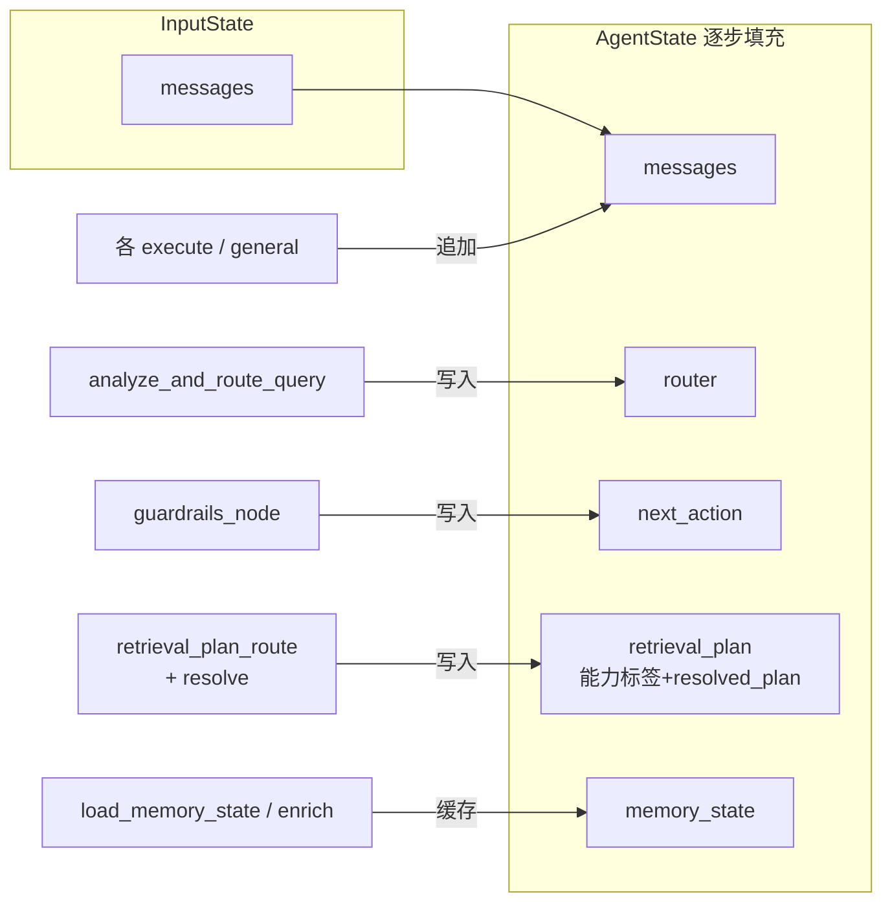
```mermaid
flowchart LR
    subgraph Input["InputState"]
        M[messages]
    end
    subgraph Agent["AgentState 逐步填充"]
        M2[messages]
        R[router]
        N[next_action]
        P[retrieval_plan<br/>能力标签+resolved_plan]
        MS[memory_state]
    end
    M --> M2
    A1[analyze_and_route_query] -->|写入| R
    A2[guardrails_node] -->|写入| N
    A3[retrieval_plan_route<br/>+ resolve] -->|写入| P
    A4[load_memory_state / enrich] -->|缓存| MS
    A5[各 execute / general] -->|追加| M2
```

---

## 7. Router / Guardrails / Plan 决策细节

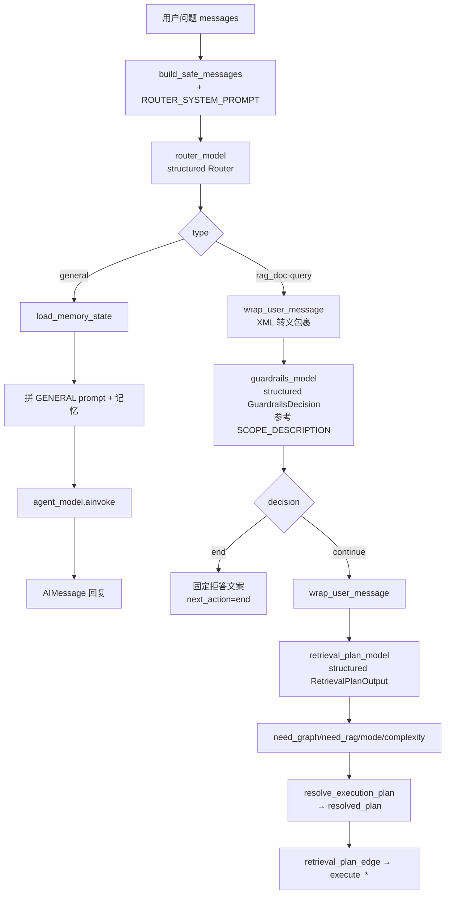
```mermaid
flowchart TB
    Q[用户问题 messages] --> SAFE1[build_safe_messages<br/>+ ROUTER_SYSTEM_PROMPT]
    SAFE1 --> RLLM[router_model<br/>structured Router]
    RLLM --> RT{type}

    RT -->|general| GMEM[load_memory_state]
    GMEM --> GCTX[拼 GENERAL prompt + 记忆]
    GCTX --> GANS[agent_model.ainvoke]
    GANS --> OUT1[AIMessage 回复]

    RT -->|rag_doc-query| WRAP1[wrap_user_message<br/>XML 转义包裹]
    WRAP1 --> GLLM[guardrails_model<br/>structured GuardrailsDecision<br/>参考 SCOPE_DESCRIPTION]
    GLLM --> GD{decision}
    GD -->|end| REJECT[固定拒答文案<br/>next_action=end]
    GD -->|continue| WRAP2[wrap_user_message]
    WRAP2 --> PLLM[retrieval_plan_model<br/>structured RetrievalPlanOutput]
    PLLM --> PLANV[need_graph/need_rag/mode/complexity]
    PLANV --> RES[resolve_execution_plan
→ resolved_plan]
    RES --> MAP[retrieval_plan_edge → execute_*]
```

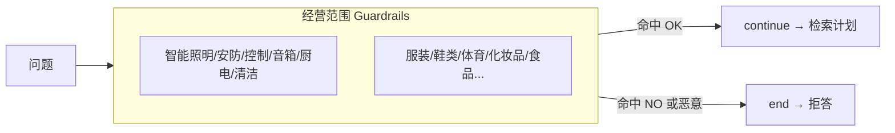
```mermaid
flowchart LR
    subgraph Scope["经营范围 Guardrails"]
        OK[智能照明/安防/控制/音箱/厨电/清洁]
        NO[服装/鞋类/体育/化妆品/食品...]
    end
    Q2[问题] --> Scope
    Scope -->|命中 OK| CONT[continue → 检索计划]
    Scope -->|命中 NO 或恶意| ENDX[end → 拒答]
```

---

## 8. 检索执行（能力标签→路径）执行策略

> 计划节点输出的是 **能力标签**，不是互斥五选一。  
> `resolve_execution_plan`：multi_hop→REACT；仅图→GRAPH_ONLY；仅文档→RAG_ONLY；  
> 两侧+sequential→GRAPH_THEN_RAG；两侧+parallel→PARALLEL；都 false→REACT。

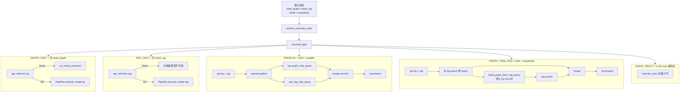
```mermaid
flowchart TB
    TAGS[能力标签<br/>need_graph / need_rag<br/>mode / complexity] --> RES[resolve_execution_plan]
    RES --> RP[resolved_plan]
    RP --> S1
    RP --> S2
    RP --> S3
    RP --> S4
    RP --> S5

    subgraph S1["GRAPH_ONLY = 仅 need_graph"]
        A1[get_retriever kg]
        A1 -->|None| F1[no_neo4j_response]
        A1 -->|OK| P1[Pipeline.execute_single kg]
    end

    subgraph S2["RAG_ONLY = 仅 need_rag"]
        A2[get_retriever rag]
        A2 -->|None| F2[文档检索暂不可用]
        A2 -->|OK| P2[Pipeline.execute_single rag]
    end

    subgraph S3["PARALLEL = both + parallel"]
        A3[get kg + rag]
        A3 --> G3[asyncio.gather]
        G3 --> K3[kg: graph_only_query]
        G3 --> R3[rag: rag_only_query]
        K3 --> M3[merge records]
        R3 --> M3
        M3 --> SUM3[summarize]
    end

    subgraph S4["GRAPH_THEN_RAG = both + sequential"]
        A4[get kg + rag]
        A4 --> K4[先 kg.search 原 query]
        K4 --> Q4[build_graph_then_rag_query<br/>拼入 kg records]
        Q4 --> R4[rag.search]
        K4 --> M4[merge]
        R4 --> M4
        M4 --> SUM4[summarize]
    end

    subgraph S5["AGENT_REACT = multi_hop 或兜底"]
        A5[execute_react 见第10节]
    end
```

---

## 9. ExecutionPipeline 内部步骤

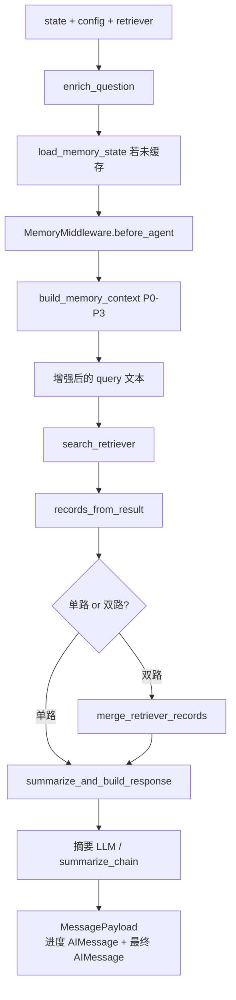
```mermaid
flowchart TD
    ST[state + config + retriever] --> EQ[enrich_question]
    EQ --> L1[load_memory_state 若未缓存]
    L1 --> BA[MemoryMiddleware.before_agent]
    BA --> CTX[build_memory_context P0-P3]
    CTX --> Q2[增强后的 query 文本]

    Q2 --> SR[search_retriever]
    SR --> REC[records_from_result]

    REC --> BR{单路 or 双路?}
    BR -->|单路| SUM
    BR -->|双路| MR[merge_retriever_records]
    MR --> SUM[summarize_and_build_response]

    SUM --> LLM[摘要 LLM / summarize_chain]
    LLM --> MSG[MessagePayload<br/>进度 AIMessage + 最终 AIMessage]
```

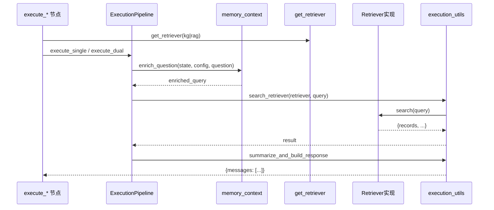
```mermaid
sequenceDiagram
    participant N as execute_* 节点
    participant P as ExecutionPipeline
    participant MC as memory_context
    participant RT as get_retriever
    participant R as Retriever实现
    participant EU as execution_utils

    N->>RT: get_retriever(kg|rag)
    N->>P: execute_single / execute_dual
    P->>MC: enrich_question(state, config, question)
    MC-->>P: enriched_query
    P->>EU: search_retriever(retriever, query)
    EU->>R: search(query)
    R-->>EU: {records, ...}
    EU-->>P: result
    P->>EU: summarize_and_build_response
    EU-->>N: {messages: [...]}
```

---

## 10. ReAct 子图完整循环

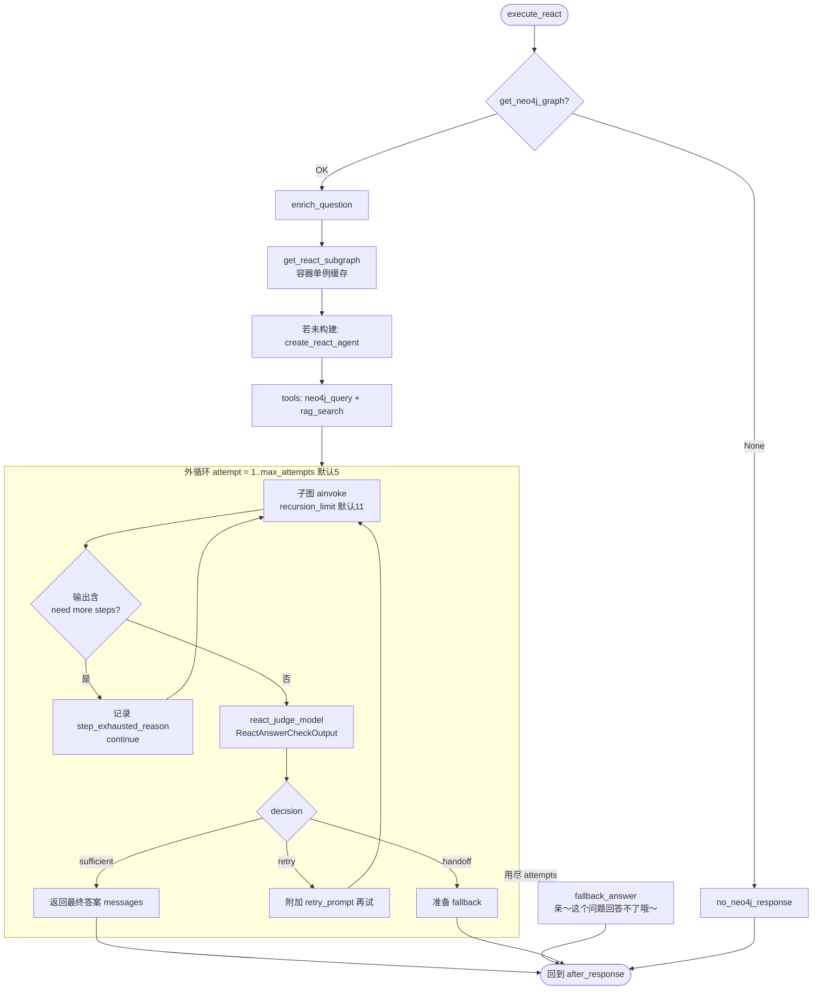
```mermaid
flowchart TD
    START([execute_react]) --> NJ{get_neo4j_graph?}
    NJ -->|None| FAIL[no_neo4j_response]
    NJ -->|OK| EQ[enrich_question]
    EQ --> SG[get_react_subgraph<br/>容器单例缓存]
    SG --> BUILD[若未构建: create_react_agent]
    BUILD --> TOOLS[tools: neo4j_query + rag_search]
    TOOLS --> LOOP

    subgraph LOOP["外循环 attempt = 1..max_attempts 默认5"]
        INV[子图 ainvoke<br/>recursion_limit 默认11]
        INV --> STEP{输出含<br/>need more steps?}
        STEP -->|是| RETRY1[记录 step_exhausted_reason<br/>continue]
        STEP -->|否| JUDGE[react_judge_model<br/>ReactAnswerCheckOutput]
        JUDGE --> D{decision}
        D -->|sufficient| OK[返回最终答案 messages]
        D -->|retry| RETRY2[附加 retry_prompt 再试]
        D -->|handoff| FB1[准备 fallback]
        RETRY1 --> INV
        RETRY2 --> INV
    end

    LOOP -->|用尽 attempts| FB[fallback_answer<br/>亲～这个问题回答不了哦～]
    OK --> AFTER([回到 after_response])
    FB --> AFTER
    FB1 --> AFTER
    FAIL --> AFTER
```

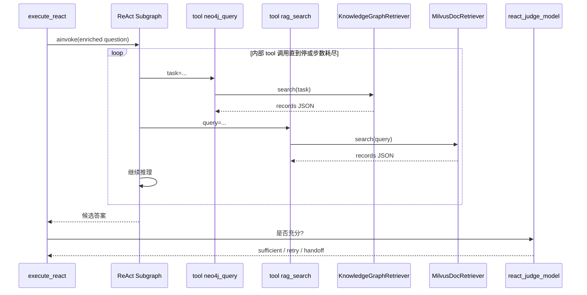
```mermaid
sequenceDiagram
    participant RE as execute_react
    participant SG as ReAct Subgraph
    participant T1 as tool neo4j_query
    participant T2 as tool rag_search
    participant KG as KnowledgeGraphRetriever
    participant RAG as MilvusDocRetriever
    participant J as react_judge_model

    RE->>SG: ainvoke(enriched question)
    loop 内部 tool 调用直到停或步数耗尽
        SG->>T1: task=...
        T1->>KG: search(task)
        KG-->>T1: records JSON
        SG->>T2: query=...
        T2->>RAG: search(query)
        RAG-->>T2: records JSON
        SG->>SG: 继续推理
    end
    SG-->>RE: 候选答案
    RE->>J: 是否充分?
    J-->>RE: sufficient / retry / handoff
```

---

## 11. 记忆 before_agent / after_agent

```mermaid
flowchart TB
    subgraph BEFORE["before_agent 读路径"]
        B0[tenant_id, user_id, session_id, user_input]
        B1[STM.get_summary]
        B2[STM.get_recent_messages]
        B3{user_id 数字 >0?}
        B4[profile_reader → UserProfileService]
        B5{ltm_enabled?}
        B6[LTM.hybrid_search]
        B7[组装 AgentMemoryState]
        B0 --> B1 --> B2 --> B3
        B3 -->|是| B4 --> B5
        B3 -->|否| B5
        B5 -->|是| B6 --> B7
        B5 -->|否| B7
        B1 -.Redis失败.-> D1["summary=None recent=[]"]
        B4 -.失败.-> D2["profile={}"]
        B6 -.失败.-> D3["ltm=[]"]
    end

    subgraph AFTER["after_agent 写路径"]
        A0[user_message + assistant_message]
        A1[meta.total_turns += 1]
        A2[append user MessageRecord]
        A3[append assistant MessageRecord]
        A4[save_meta + refresh_ttl]
        A5{should_compress?}
        A6[compress_session_memory + LLM 摘要]
        A7{压缩成功且 ltm_enabled?}
        A8[MemoryExtractor.extract]
        A9[dedup + save_memory × N]
        A10{profile 非空?}
        A11[profile_writer upsert]
        A12[可选 update_memory_hit_info]
        A0 --> A1 --> A2 --> A3 --> A4 --> A5
        A5 -->|是| A6 --> A7
        A5 -->|否| A12
        A7 -->|是| A8 --> A9 --> A10
        A7 -->|否| A12
        A10 -->|是| A11 --> A12
        A10 -->|否| A12
    end
```

### 主图挂载点

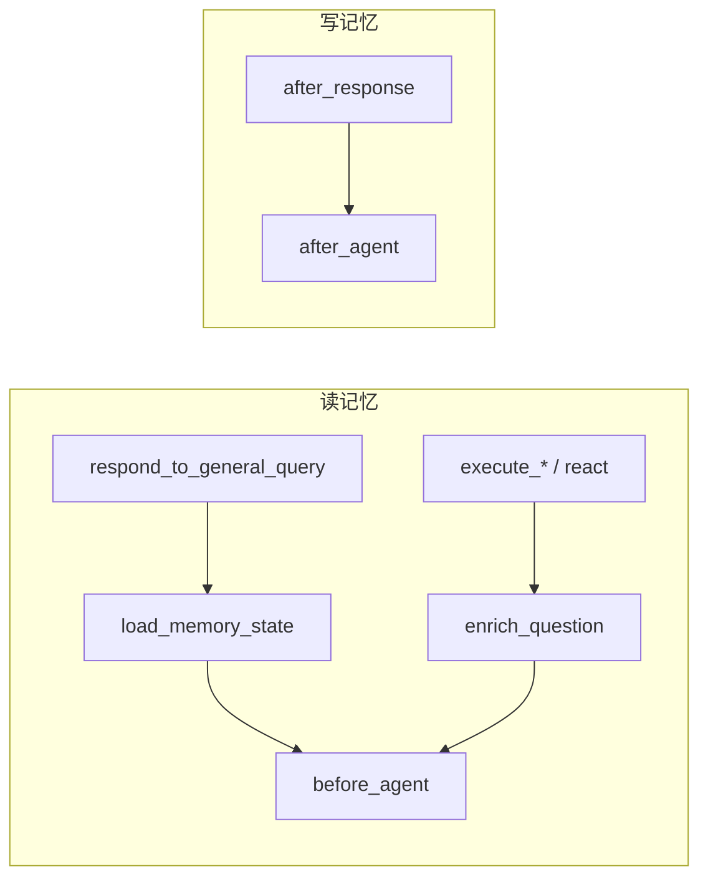
```mermaid
flowchart LR
    subgraph Read["读记忆"]
        GEN[respond_to_general_query]
        EX[execute_* / react]
        GEN --> LM[load_memory_state]
        EX --> EQ[enrich_question]
        LM --> BA[before_agent]
        EQ --> BA
    end
    subgraph Write["写记忆"]
        AR[after_response]
        AR --> AA[after_agent]
    end
```

---

## 12. 记忆压缩与抽取

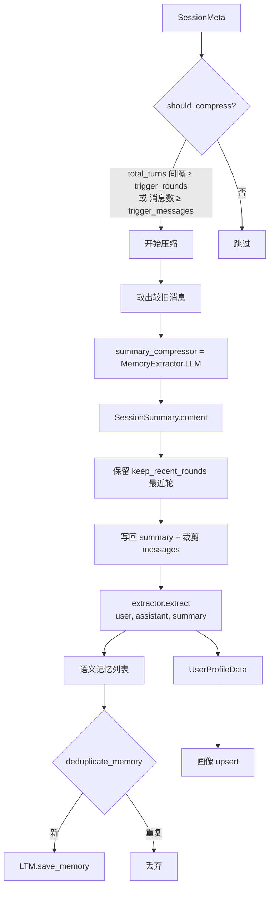
```mermaid
flowchart TD
    META[SessionMeta] --> CHK{should_compress?}
    CHK -->|total_turns 间隔 ≥ trigger_rounds<br/>或 消息数 ≥ trigger_messages| YES[开始压缩]
    CHK -->|否| SKIP[跳过]

    YES --> OLD[取出较旧消息]
    OLD --> LLM[summary_compressor = MemoryExtractor.LLM]
    LLM --> SUM[SessionSummary.content]
    SUM --> KEEP[保留 keep_recent_rounds 最近轮]
    KEEP --> SAVE[写回 summary + 裁剪 messages]

    SAVE --> EXT[extractor.extract<br/>user, assistant, summary]
    EXT --> SEM[语义记忆列表]
    EXT --> PROF[UserProfileData]

    SEM --> DEDUP{deduplicate_memory}
    DEDUP -->|新| SAVE_M[LTM.save_memory]
    DEDUP -->|重复| DROP[丢弃]
    PROF --> UP[画像 upsert]
```

---

## 13. P0–P3 注入结构

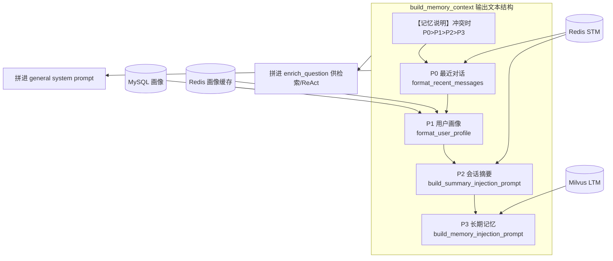
```mermaid
flowchart TB
    subgraph Inject["build_memory_context 输出文本结构"]
        I0["【记忆说明】冲突时 P0>P1>P2>P3"]
        P0["P0 最近对话<br/>format_recent_messages"]
        P1["P1 用户画像<br/>format_user_profile"]
        P2["P2 会话摘要<br/>build_summary_injection_prompt"]
        P3["P3 长期记忆<br/>build_memory_injection_prompt"]
        I0 --> P0 --> P1 --> P2 --> P3
    end

    STM[(Redis STM)] --> P0
    STM --> P2
    MY[(MySQL 画像)] --> P1
    RD[(Redis 画像缓存)] --> P1
    MV[(Milvus LTM)] --> P3

    Inject --> USE1[拼进 general system prompt]
    Inject --> USE2[拼进 enrich_question 供检索/ReAct]
```

---

## 14. Text2Cypher 工作流

```mermaid
flowchart TD
    TASK[task / question] --> PRE{预定义模板<br/>embed + cosine_similarity_score<br/>matcher≥0.5 / 工作流>0.6}

    PRE -->|命中| FILL[填充模板参数]
    FILL --> EXEC1[执行 Cypher 只读]
    EXEC1 -->|有 records| OUT1[返回 records]
    EXEC1 -->|失败/空| GEN

    PRE -->|未命中| GEN[LLM generate_cypher<br/>schema + fewshot]
    GEN --> VAL[validate_cypher]
    VAL --> V1[语法 EXPLAIN]
    V1 --> V2[禁写拦截 CREATE/MERGE/DELETE/SET...]
    V2 --> V3[关系方向修正]
    V3 --> V4[schema / LLM 语义校验]
    V4 --> VR{通过?}
    VR -->|否 且 attempts&lt;3| CORR[correct_cypher LLM]
    CORR --> VAL
    VR -->|否 且耗尽| ENDF[结束/错误]
    VR -->|是| EXEC2[execute_cypher]
    EXEC2 --> OUT2[CypherOutputState records]

    style V2 fill:#ffcdd2
```

```mermaid
sequenceDiagram
    participant RT as retriever_runtime
    participant T2C as text2cypher_workflow
    participant PRE as predefined matcher
    participant NW as northwind fewshot
    participant LLM as cypher_model
    participant VAL as validators
    participant NJ as Neo4j

    RT->>T2C: create_text2cypher_agent(...).ainvoke
    T2C->>PRE: 匹配模板描述
    alt 模板命中
        PRE-->>T2C: template + params
        T2C->>NJ: run cypher
    else 未命中
        T2C->>NW: get_examples(question)
        T2C->>LLM: generate cypher
        loop 最多 3 次
            T2C->>VAL: validate + correct
            VAL->>NJ: EXPLAIN / 只读检查
        end
        T2C->>NJ: execute
    end
    NJ-->>RT: records
```

---

## 15. 文档上传与异步索引

```mermaid
sequenceDiagram
    autonumber
    participant C as 客户端
    participant API as api/upload
    participant FS as 本地 uploads/
    participant DOC as DocumentService MySQL
    participant TQ as TaskManager
    participant RD as Redis
    participant JOB as document_indexing_job
    participant IS as IndexingService
    participant DP as parse_document
    participant HS as HybridSearcher
    participant MV as Milvus

    C->>API: POST /api/upload file+user_id+mode+doc_id?
    API->>API: validate / 读入 / 魔数 / sha256
    API->>FS: write_bytes 落盘
    API->>DOC: prepare_create 或 prepare_replace
    alt replace 且 content_hash 一致
        DOC-->>API: unchanged=true
        API-->>C: skipped 无 task_id
    else 需要索引
        API->>TQ: submit(run_document_indexing_job)
        TQ->>RD: pending
        TQ-->>API: task_id
        API->>DOC: bind_task_id
        API-->>C: file_info+doc_id+task_id
        par 后台
            TQ->>RD: running
            TQ->>JOB: file_info
            JOB->>IS: process_file
            IS->>DP: parse_document
            DP-->>IS: chunks
            alt mode=create
                IS->>HS: index(version=1)
            else mode=replace
                IS->>HS: reindex 软删+新 version
            end
            HS->>MV: insert / soft_delete upsert
            JOB->>DOC: apply_indexing_result ready|failed
            TQ->>RD: completed + result
        and 轮询
            C->>API: GET /api/upload/status/{task_id}
            RD-->>C: pending/running/completed/failed
        end
    end
```

```mermaid
flowchart TD
    U[上传请求] --> V1{扩展名 md/markdown/pdf/docx?}
    V1 -->|否| E400a[400 不支持的文件类型]
    V1 -->|是| V2{有 content_type?}
    V2 -->|否| E400b[400 无法识别文件类型]
    V2 -->|是| V3{size ≤ 50MB?}
    V3 -->|否| E400c[400 超过大小限制]
    V3 -->|是| V4{PDF/DOCX 魔数匹配?<br/>md 跳过}
    V4 -->|否| E400d[400 内容与扩展名不匹配]
    V4 -->|是| SAVE[落盘 uploads/user_uuid/time/]
    SAVE --> SUB[提交后台任务]
    SUB --> RET[返回 task_id]
```

---

## 16. doc_parser 解析切分管线

```mermaid
flowchart TD
    F[文件路径] --> EXT{扩展名}
    EXT -->|.md/.markdown| MDP[MarkdownFileParser 直读]
    EXT -->|.pdf| PDF[DoclingPDFParser]
    EXT -->|.docx| DOCX[DoclingDOCXParser]
    DOCX -->|失败| FB[DocxFallbackParser python-docx]

    MDP --> MD[Markdown 文本]
    PDF --> MD
    FB --> MD
    DOCX --> MD

    MD --> CL[markdown.cleaner 清洗]
    CL --> HD[heading_parser 章节树]
    HD --> BL[block_parser 块分类]

    BL --> T1[text_splitter 递归切分+overlap]
    BL --> T2[table_splitter 按行+重复表头]
    BL --> T3[code_splitter 函数/类边界]

    T1 --> CH[DocumentChunk 列表]
    T2 --> CH
    T3 --> CH

    CH --> OUT1[raw_text 干净原文]
    CH --> OUT2[embedding_text 带标题路径]
    CH --> OUT3[metadata section/type/doc_id]

    OUT2 --> IDX[HybridSearcher.index]
    IDX --> DENSE[Milvus 稠密向量]
    IDX --> BM25[BM25 稀疏]
    DENSE --> RRF[RRF 融合]
    BM25 --> RRF
    RRF --> RERANK[可选 BGE Reranker]
    RERANK --> HIT[检索命中 top-k]
```

---

## 17. 画像读写

```mermaid
sequenceDiagram
    participant MM as MemoryMiddleware
    participant AD as profile_adapter
    participant SV as UserProfileService
    participant RC as Redis cache
    participant RP as UserProfileRepository
    participant DB as MySQL

    Note over MM,DB: 读取 before_agent
    MM->>AD: load_user_profile(uid, redis)
    AD->>SV: get_profile(uid, redis)
    SV->>RC: GET user:profile:{uid}
    alt 缓存命中
        RC-->>SV: JSON
        SV-->>MM: UserProfilePayload
    else 未命中
        SV->>RP: get_profile(db, uid)
        RP->>DB: user_profiles + user_facts
        DB-->>SV: data
        SV->>RC: SETEX TTL
        SV-->>MM: UserProfilePayload
    end

    Note over MM,DB: 写入 after_agent 抽取后
    MM->>AD: save_user_profile(uid, profile, redis)
    AD->>SV: upsert_profile_data
    SV->>RP: upsert_profile_data
    RP->>DB: upsert fields + versioned facts
    SV->>RC: DELETE cache key
```

---

## 18. 任务队列状态机

```mermaid
stateDiagram-v2
    [*] --> pending: submit() 写 Redis
    pending --> running: 后台 task 开始执行
    running --> completed: process_file 成功
    running --> failed: 异常 error 字段
    completed --> [*]: TTL 到期删除
    failed --> [*]: TTL 到期删除
    pending --> [*]: 进程崩溃可能残留
    running --> [*]: 进程崩溃可能残留
```

```mermaid
flowchart LR
    SUB[submit coro] --> ID[task_id 12位 hex]
    ID --> K["Redis key = task:doc_parse:{id}"]
    K --> BG[asyncio.create_task]
    BG --> RUN[run_task_with_status_updates]
    RUN --> OK[completed + result]
    RUN --> ERR[failed + error]
```

---

## 19. 数据落点全景

```mermaid
flowchart TB
    subgraph ClientReq["一次问答请求"]
        Q[query]
        UID[user_id]
        TID[thread_id / conversation_id]
    end

    Q --> GRAPH[LangGraph]
    UID --> PROF[画像维]
    TID --> SESS[STM session 维]

    GRAPH --> ANS[回答 SSE]
    GRAPH --> STM[(Redis STM<br/>消息+摘要+meta)]
    GRAPH --> LTM[(Milvus LTM<br/>issue/solution)]
    GRAPH --> KG[(Neo4j 图谱)]
    GRAPH --> RAG[(Milvus rag_documents)]
    PROF --> MY1[(MySQL user_profiles/facts)]
    PROF --> RC[(Redis user:profile 缓存)]
    SESS --> STM

    subgraph ConvAPI["会话 API"]
        C1[创建/改名/删除] --> MY2[(MySQL conversations)]
    end

    subgraph UpAPI["上传 API"]
        U1[文件] --> FS[uploads 卷]
        U1 --> TK[(Redis task 状态)]
        U1 --> RAG
    end
```

---

## 20. 故障降级路径

```mermaid
flowchart TD
    REQ[用户提问] --> TRY[主路径执行]
    TRY --> R1{Redis 可用?}
    R1 -->|否| D1[无多轮记忆/无任务状态<br/>问答仍尽量返回]
    R1 -->|是| R2{MySQL 可用?}
    R2 -->|否| D2[会话 API 失败<br/>画像空 问答可继续]
    R2 -->|是| R3{Neo4j 可用?}
    R3 -->|否| D3[KG 节点友好提示<br/>可走 RAG/general]
    R3 -->|是| R4{Milvus 可用?}
    R4 -->|否| D4[无文档检索/无 LTM]
    R4 -->|是| R5{LLM 可用?}
    R5 -->|否| D5[路由/生成失败 500 或 fallback]
    R5 -->|是| OK[正常回答]

    style D1 fill:#fff9c4
    style D2 fill:#fff9c4
    style D3 fill:#ffe0b2
    style D4 fill:#ffe0b2
    style D5 fill:#ffcdd2
    style OK fill:#c8e6c9
```

---

## 如何阅读本图集

| 你想搞懂 | 先看图 |
|---|---|
| 系统全貌 | §1 + §19 |
| 如何启动 | §2 + §3 |
| 一次问答从头到尾 | §5 + §6 |
| 为什么走 KG 还是 RAG | §7 + §8 |
| ReAct 怎么重试 | §10 |
| 记忆何时读写 | §11 + §12 + §13 |
| Cypher 如何生成 | §14 |
| 上传如何异步 | §15 + §16 + §18 |
| 挂了会怎样 | §20 |

文字版细节仍以各模块文档为准；**图与源码冲突时以源码为准**。

---

## 21. 用本图集「只看文档学项目」的读法

1. **先扫 §1 架构 + §19 数据落点** — 建立全局坐标  
2. **§2–3 启动** — 服务从哪起来  
3. **§4–5 会话与 SSE** — 主用户路径  
4. **§6–10 Agent** — 决策与能力标签→路径 / ReAct  
5. **§11–13 记忆** — before/after 与 P0–P3  
6. **§14–16 检索与上传** — KG/RAG 与文档  
7. **§17–18 画像与任务** — 侧翼  
8. **§20 降级** — 故障时系统怎样活  

每张图对应详文：

| 图 | 详文 |
|---|---|
| §1–3 | 01 / 02 / 08 |
| §4–5 | 03 / 04 |
| §6–10 | 04 附录 A |
| §11–13 | 05 附录 B |
| §14–16 | 06 附录 C |
| §17 | 07 |
| §18–20 | 08 / 10 |

