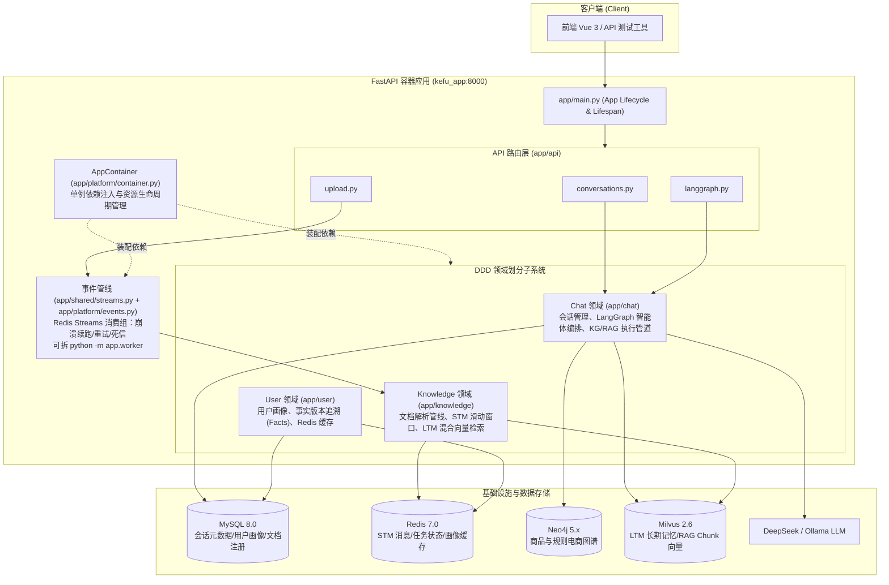

# 01 · 系统总览

> **流程图**：[00-全流程图集.md](00-全流程图集.md) §1 系统总架构、§19 数据落点。

## 0.1 学习导航

### 这一章要解决什么问题

这章不是给你背“项目介绍词”，而是帮你先把三个基础问题钉住：

1. 这个仓库的边界是什么，哪些能力在仓库里，哪些不在。
2. 为什么代码不是按 `services/` 平铺，而是按 `chat / knowledge / user / shared` 分域。
3. 一次请求从入口到数据落点，大体会经过哪些层。

### 读这一章前最好先知道什么

1. FastAPI 是协议层，不等于全部业务逻辑。
2. 一个 AI 应用后端往往不只有一个模型调用，而是多模块协作。
3. “系统总览”这一章的任务是先建全局地图，不是先抠单个函数。

### 这一章学完后你应该会什么

1. 能用 30 秒说清项目是做什么的。
2. 能说清 `app/api`、`app/chat`、`app/knowledge`、`app/user`、`app/shared` 的职责边界。
3. 能解释为什么消息不进 MySQL、为什么 Compose 是唯一官方启动方式。
4. 能把“仓库结构”和“业务链路”对应起来，而不是只会背目录树。

### 推荐阅读方法

1. 先读 §1、§2、§3，建立项目边界和业务目标。
2. 再读 §4，把目录树和分层规则对上。
3. 再读 §7、§8，理解数据落点和请求主路径。
4. 最后读“面试深挖”和“实习面试讲法”，把前面的理解转成表达。

### 常见误区

1. 只记住技术栈，不理解它们之间为什么这样组合。
2. 把 `frontend/` 的存在误讲成“这是一个前端主导项目”。
3. 觉得“系统总览”没技术含量，直接跳过去看 Agent 细节。

## 1. 是什么

**AssistGen / deepseek_agent** 是一个面向智能客服场景的 **后端** 系统（本仓库）：

- 用 **FastAPI** 提供 REST / SSE 接口
- 用 **LangGraph** 编排多策略 Agent（路由 → 守卫 → 检索计划 → 执行 → 记忆写回）
- 用 **分层记忆**（Redis 短期 + MySQL 画像 + Milvus 长期）提升多轮对话质量
- 用 **Neo4j 知识图谱 + RAG 文档检索** 回答商品/售后类问题
- 用 **Docker Compose** 一键拉起全部依赖（唯一官方启动方式）

### 1.0 系统总结构图



### 1.1 本仓库边界（介绍时别说错）

| 在本仓库 | 不在本仓库 |
|---|---|
| FastAPI 后端、`app/` 全量业务 | 独立移动端 / 小程序 / 第三方客服平台接入 |
| Docker Compose 全套依赖 | 独立 API 网关 / 统一鉴权中心 |
| `frontend/` Vue 3 + Vite + TS 控制台源码 | 完整 E2E 浏览器自动化（当前无） |
| OpenAPI：`/docs`、`/openapi.json` | 独立 API 网关 / 鉴权中心（当前 API **无 JWT**） |

**面试口径建议：**

1. 当前仓库里已经有 `frontend/`，但如果你投的是 **AI 应用 / 后端实习**，介绍重点仍应放在 `app/`、接口、Agent、记忆、检索和部署。
2. 不要把“仓库里有前端”误讲成“这个项目主要是前端项目”。

### 1.2 它和普通聊天机器人最本质的区别

如果面试官第一句就问“那这个项目和普通聊天机器人有什么区别”，可以直接抓 4 点：

1. 这里不是单次 LLM 调用，而是显式的工作流编排。
2. 这里不是单一知识源，而是图谱检索和文档检索双链路。
3. 这里不是只拼聊天记录，而是分层记忆。
4. 这里不是只看回答效果，还要考虑上传异步化、SSE、降级和数据边界。

---

## 2. 解决什么问题

| 客服能力 | 实现方式 |
|---|---|
| 闲聊 / 通用问答 | Router → `general` → 直接 LLM 回复 |
| 商品结构化查询（库存、订单、客户…） | KG / Text2Cypher / 预定义 Cypher 模板 |
| 售后政策 / 文档问答 | RAG（Markdown / PDF / DOCX 上传 → 混合检索） |
| 复杂问题多步推理 | ReAct 子图 + 充分性检查 + 有限重试 |
| 记住用户偏好与历史 | STM + 用户画像 + LTM |
| 会话列表管理 | MySQL 只存会话元信息（标题/时间），消息不进 MySQL |

### 2.1 为什么这张表很重要

这张表本质上回答的是两个面试高频问题：

1. 这个系统到底支持哪些业务能力？
2. 每一种能力背后到底依赖哪条技术链路？

你如果只能说“这个项目做智能客服”，但说不出能力和实现方式之间的对应关系，面试官会很快追问把你问散。

---

## 3. 技术栈

| 层级 | 技术 |
|---|---|
| Web | FastAPI、Uvicorn、SSE（`text/event-stream`） |
| Agent | LangGraph、LangChain、structured output |
| LLM | DeepSeek API / Ollama（可切换） |
| Embedding | 默认 bge-m3（Ollama 或 HuggingFace） |
| 关系库 | MySQL 8 + SQLAlchemy Async + aiomysql |
| 缓存 / STM / 任务 | Redis 7 |
| 图库 | Neo4j + langchain-neo4j |
| 向量库 | Milvus 2.6（依赖 etcd + MinIO） |
| 文档解析 | Markdown 直读 + Docling PDF/DOCX + python-docx fallback（`doc_parser`） |
| 部署 | Docker Compose only |

---

## 4. 仓库目录树与逐文件职责

> **约定：** 下列覆盖当前 `app/**/*.py` 全部业务文件；`__init__.py` 多为包导出/空壳，表中标「包初始化」。  
> 更细的函数说明见 03–08 各章。  
> **树状图**便于空间导航；**表格**写每个文件用途——两者都保留。

### 4.0 总览树状图

```text
deepseek_agent/
├── app/                              # 唯一主代码树
│   ├── main.py                       # FastAPI 工厂 + /health + lifespan
│   ├── api/                          # HTTP 协议层（详见 03）
│   │   ├── __init__.py
│   │   ├── common.py
│   │   ├── conversations.py
│   │   ├── upload.py
│   │   └── langgraph.py
│   ├── chat/                         # 对话域（详见 04）
│   │   ├── README.md
│   │   ├── domain/
│   │   │   └── schemas.py
│   │   ├── application/
│   │   │   ├── conversation_service.py
│   │   │   └── agent_query_service.py
│   │   └── infrastructure/
│   │       ├── utils/helpers.py
│   │       ├── models/conversation.py
│   │       ├── repository/conversation_repository.py
│   │       ├── graph/                # state/builder/nodes/utils...
│   │       ├── react/react.py
│   │       ├── retrievers/           # contracts/implementations/runtime
│   │       ├── kg/                   # neo4j/t2c/predefined/validation
│   │       └── modeling/             # models.py + prompts.py
│   ├── knowledge/                    # 记忆+文档（详见 05/06）
│   │   ├── README.md
│   │   ├── domain/                   # schemas + prompt_builder
│   │   ├── application/              # indexing_*
│   │   └── infrastructure/
│   │       ├── stm/
│   │       ├── ltm/
│   │       ├── orchestration/
│   │       └── doc_parser/           # pipeline/parsers/markdown/splitters/retrieval
│   ├── user/                         # 用户画像（详见 07）
│   │   ├── README.md
│   │   ├── domain/
│   │   ├── application/
│   │   └── infrastructure/           # models + repository
│   ├── shared/                       # 唯一全局 shared（详见 08）
│   │   ├── README.md
│   │   ├── core/                     # config*/database/logger/json
│   │   ├── security/
│   │   ├── retrieval/
│   │   └── background_tasks.py
│   ├── platform/container.py
│   └── scripts/                      # bootstrap/init_db/...
├── configs/
│   ├── docker/app/start.sh
│   ├── docker/neo4j-import/
│   └── mysql-init/init.sql
├── specs/
├── scripts/neo4j-import.sh
├── tests/{api,chat,knowledge,user,shared}/
├── docs/                             # 项目详细文档与面试资料
├── docker-compose.yml
├── Dockerfile
├── pyproject.toml
├── pyrightconfig.json
└── requirements.txt
```

### 4.1 顶层与入口

| 路径 | 用处 |
|---|---|
| `app/main.py` | FastAPI 工厂、CORS、`/health`、挂载 `/api`、lifespan 启停容器 |
| `app/README.md` | app 树与分层约定 |
| `docker-compose.yml` | 一键依赖 + app 服务 |
| `Dockerfile` | app 镜像构建 |
| `pyproject.toml` | 依赖、ruff/mypy/pytest |
| `pyrightconfig.json` | Pylance 仅扫 `app/` |
| `requirements.txt` | pip 依赖备份 |
| `Makefile` | test/lint/docker 快捷命令 |
| `.env.example` / `.env.docker` | 环境变量模板 / 容器覆盖 |
| `configs/docker/app/start.sh` | 容器入口：bootstrap DB + uvicorn |
| `configs/mysql-init/init.sql` | MySQL 首次初始化 |
| `configs/docker/neo4j-import/` | 图谱 CSV（可选） |
| `scripts/neo4j-import.sh` | Neo4j 导入脚本 |
| `specs/` | 可 Git 跟踪设计文档 |
| `docs/` | 项目详细文档与面试资料 |
| `tests/api|chat|knowledge|user|shared/` | 与域对齐的测试 |

### 4.2 `app/api/`（协议层，详见 03）

| 文件 | 用处 |
|---|---|
| `__init__.py` | 聚合 conversations/upload/langgraph 路由 |
| `common.py` | `run_api_action`、统一 500 文案、MessageResponse |
| `conversations.py` | 会话 CRUD HTTP |
| `upload.py` | 上传校验/落盘/提交任务/查状态 |
| `langgraph.py` | SSE 问答入口 |

### 4.3 `app/chat/`（对话域，详见 04）

| 文件 | 用处 |
|---|---|
| `README.md` | 域边界说明 |
| `domain/schemas.py` | 领域契约说明（状态仍在 graph） |
| `application/conversation_service.py` | 会话用例 + 删会话清记忆 |
| `application/agent_query_service.py` | `stream_agent_query` 门面 |
| `infrastructure/utils/helpers.py` | `question_from_state` / `no_neo4j_response` |
| `infrastructure/models/conversation.py` | Conversation ORM |
| `infrastructure/repository/conversation_repository.py` | 会话 SQL |
| `infrastructure/graph/state.py` | AgentState / InputState |
| `infrastructure/graph/builder.py` | 主图编译 `graph` |
| `infrastructure/graph/decision_nodes.py` | Router/Guardrails/Plan 节点 |
| `infrastructure/graph/retrieval_nodes.py` | 四路 execute_* |
| `infrastructure/graph/execution_pipeline.py` | 检索执行管道 |
| `infrastructure/graph/execution_utils.py` | 改写 query / 摘要 / search 工具 |
| `infrastructure/graph/memory_context.py` | 记忆加载与 P0–P3 拼装 |
| `infrastructure/graph/lifecycle_nodes.py` | `after_response` |
| `infrastructure/graph/message_utils.py` | 安全消息/进度消息构造 |
| `infrastructure/react/react.py` | ReAct 子图 + 充分性检查 |
| `infrastructure/retrievers/retriever_contracts.py` | Retriever 接口与注册表 |
| `infrastructure/retrievers/retriever_implementations.py` | KG/RAG 实现 |
| `infrastructure/retrievers/retriever_runtime.py` | get_retriever 懒注册 |
| `infrastructure/kg/neo4j_conn.py` | Neo4j 连接 |
| `infrastructure/kg/text2cypher_workflow.py` | Text2Cypher 图 |
| `infrastructure/kg/text2cypher_state.py` | T2C 状态类型 |
| `infrastructure/kg/northwind_retriever.py` | few-shot 示例检索 |
| `infrastructure/kg/predefined_cypher/cypher_dict.py` | 27 条模板 |
| `infrastructure/kg/predefined_cypher/descriptions.py` | 模板描述 |
| `infrastructure/kg/predefined_cypher/utils.py` | 向量匹配 + cosine |
| `infrastructure/kg/validation/validators.py` | Cypher 校验编排 |
| `infrastructure/kg/validation/models.py` | 校验结构 |
| `infrastructure/kg/validation/schema_validation_rules.py` | schema 规则 |
| `infrastructure/kg/validation/utils/cypher_extractors.py` | Cypher 抽取正则 |
| `infrastructure/modeling/models.py` | LLM 懒加载 + 温度 + 结构输出 |
| `infrastructure/modeling/prompts.py` | Prompt 字符串/YAML 加载 |

### 4.4 `app/knowledge/`（记忆+文档，详见 05/06）

| 文件 | 用处 |
|---|---|
| `README.md` | 域边界 |
| `domain/schemas.py` | MessageRecord/LTM/AgentMemoryState 等 |
| `domain/prompt_builder.py` | 压缩/注入 Prompt 拼装 |
| `application/indexing_service.py` | 上传后解析索引 |
| `application/indexing_contracts.py` | UploadFileInfo/IndexingResult 契约 |
| `infrastructure/stm/redis_short_term_memory.py` | Redis STM 实现 |
| `infrastructure/stm/stm_compressor.py` | MsgPack+Zstd 编解码 |
| `infrastructure/ltm/simple_long_term_memory.py` | LTM 读写检索 |
| `infrastructure/ltm/ltm_collection.py` | collection schema/字段常量 |
| `infrastructure/orchestration/memory_middleware.py` | before/after 编排 |
| `infrastructure/orchestration/memory_extractor.py` | 压缩后抽取 LTM/画像 |
| `infrastructure/orchestration/profile_adapter.py` | 调 user 域画像 |
| `infrastructure/doc_parser/pipeline.py` | parse_document 总入口 |
| `infrastructure/doc_parser/config.py` | ParserConfig |
| `infrastructure/doc_parser/exceptions.py` | 解析异常类型 |
| `infrastructure/doc_parser/models.py` | DocumentChunk 等 |
| `infrastructure/doc_parser/parsers/*` | MD/PDF/DOCX 解析器 |
| `infrastructure/doc_parser/markdown/*` | 清洗/标题/块/表工具 |
| `infrastructure/doc_parser/splitters/*` | 文本/表/代码切分 |
| `infrastructure/doc_parser/retrieval/*` | HybridSearcher/MilvusStore/Rerank |

### 4.5 `app/user/`（详见 07）

| 文件 | 用处 |
|---|---|
| `domain/schemas.py` | UserProfileData/Fact/Payload |
| `domain/profile_payload_support.py` | 规范化/校验 payload |
| `application/user_profile_service.py` | 画像缓存 + 用例 |
| `infrastructure/models/user.py` | User ORM |
| `infrastructure/repository/user_profile_repository.py` | 画像/facts SQL |

### 4.6 `app/shared/` + `platform/` + `scripts/`（详见 08）

| 文件 | 用处 |
|---|---|
| `shared/core/config_models.py` | pydantic-settings 环境变量模型 |
| `shared/core/config.py` | 全局 settings 聚合 |
| `shared/core/app_config.py` | 运行时常量（React/STM/LTM/上传） |
| `shared/core/database.py` | AsyncEngine / Session / Base |
| `shared/core/logger.py` | 日志配置与 format_log_context |
| `shared/core/json_utils.py` | 从 LLM 文本抽 JSON |
| `shared/security/__init__.py` | wrap_user_message |
| `shared/retrieval/milvus_hybrid_core.py` | 混合检索公共核 |
| `shared/background_tasks.py` | 文档解析后台任务（进程内执行，Redis 存状态） |
| `platform/container.py` | AppContainer 装配与生命周期 |
| `scripts/bootstrap_compose_db.py` | Compose 启动建表 |
| `scripts/init_db.py` | 初始化/维护入口 |
| `scripts/db_script_support.py` | 脚本公共支持 |

**业务域统一骨架：** `domain/` + `application/` + `infrastructure/`。  
**唯一 shared：** 仅 `app/shared`。

---

## 5. 领域依赖规则（硬约束）

```text
api
  → chat.application / knowledge.application / user.application / shared
  ✗ 禁止直接 import *.infrastructure

chat
  → shared
  → knowledge（记忆 schemas / middleware）
  → user.domain（画像类型）
  → Neo4j / LLM

knowledge
  → shared
  → user.application / user.domain（画像读写端口）
  ✗ 不拥有 durable 画像表

user
  → shared only
  ✗ 禁止 import knowledge

shared / platform
  → 不依赖业务领域包（platform 可装配 knowledge/chat 工厂）
```

**为什么这样划：**

1. 避免历史上的 `user ↔ knowledge` 导入环  
2. API 层稳定，底层实现可替换  
3. 画像是 durable 用户资产，归 user；记忆是对话资产，归 knowledge  

---

## 6. 核心概念词典

| 术语 | 含义 |
|---|---|
| **Router** | 顶层分流：`general` vs `rag_doc-query` |
| **Guardrails** | 业务范围守卫；不在经营范围则拒答 |
| **RetrievalPlan** | 检索策略：GRAPH_ONLY / RAG_ONLY / PARALLEL / GRAPH_THEN_RAG / AGENT_REACT |
| **Retriever** | 统一检索接口，实现有 KG 与 RAG 两路 |
| **Text2Cypher** | 自然语言 → Cypher；含预定义模板快路径 + LLM 生成 + 校验修正 |
| **STM** | Short-Term Memory，Redis 滑动窗口消息 + 摘要 |
| **LTM** | Long-Term Memory，Milvus 混合检索语义记忆 |
| **P0–P3** | 记忆注入优先级：最近消息 > 画像 > 摘要 > 长期记忆 |
| **AppContainer** | 应用级单例容器（任务队列、记忆中间件、检索器缓存等） |
| **thread_id** | LangGraph configurable 会话键，通常等于 conversation_id 字符串 |

---

### 6.5 v3.35 新增概念速查

| 概念 | 一句话 | 详见 |
|---|---|---|
| **写扩散** (fan-out on write) | 写入时把一轮对话物化成 5 个读视图（历史/窗口/摘要/LTM/画像），贵所以异步+事件化 | 04 §2.5 |
| **读扩散** (fan-out on read) | 读取时三路并发拉取异构存储组装上下文，总延迟=max 不是 sum | 04 §2.5 |
| Bearer 令牌 | 身份唯一来源（JWT HS256），业务层不再见到自报 user_id | 02 §4 |
| turn_completed / document_index_requested | 两类核心事件；Redis Streams 消费组，崩溃认领续跑 | 00 §24 |
| X-Request-ID | 贯穿一次请求全部日志的追踪键（contextvars + 日志 Filter） | 02 §8 |
| 消息双轨 | MySQL messages 给人看（全量），Redis STM 给模型看（窗口） | 00 §27 |
| interrupted | 进程内回退通道任务随进程消失的终态；stream 通道不会出现 | 02 §6.3 |

## 7. 数据落点原则

| 数据类型 | 存哪里 | 不存哪里 |
|---|---|---|
| 用户账号 | MySQL `users` | — |
| 会话标题/状态 | MySQL `conversations` | 消息正文 |
| 消息正文 | Redis STM | MySQL（设计上不存） |
| 用户画像 | MySQL `user_profiles` + facts；Redis 缓存 | knowledge 包内 |
| 长期语义记忆 | Milvus LTM collection | MySQL |
| 文档 chunk 向量 | Milvus（doc_parser 检索） | 本地文件仅 uploads |
| 图谱实体关系 | Neo4j | — |
| 上传任务状态 | Redis `task:doc_parse:*` | — |

---

## 8. 请求主路径（一句话版，v3.35）

```
登录换 JWT → 每请求 Bearer 验证 → SSE：限流 → 会话归属解析 →
LangGraph（节点计时）→ 读扩散取记忆 → 检索/生成 → 流式返回 →
发布 turn_completed → 消费者写扩散（历史+STM+摘要+LTM+画像）
```

### 原第 8 节

1. **会话管理**：API → ConversationService → Repository → MySQL  
2. **智能问答**：API → `stream_agent_query` → LangGraph →（路由/守卫/计划/执行）→ SSE；结束时 `after_response` 写记忆  
3. **文档上传**：API 落盘 → MySQL `user_documents` →（hash 未变则跳过）→ TaskQueue `run_document_indexing_job` → IndexingService index/reindex → 回写元数据 → 轮询 task  

详细时序建议对照 [00-全流程图集.md](00-全流程图集.md) 与 [03-对话与Agent主图.md](03-对话与Agent主图.md) 一起看。

---

## 9. 测试布局与源码对应

| 测试目录 | 对应源码 |
|---|---|
| `tests/api/` | `app/api/` |
| `tests/chat/` | chat application + graph + kg + react |
| `tests/knowledge/` | 记忆 + indexing + doc_parser |
| `tests/user/` | 画像 service / repository |
| `tests/shared/` | config / db / background_tasks / security |
| `tests/test_main.py` | 应用工厂与 lifespan |
| `tests/test_script_entrypoints.py` | 启动脚本与结构守卫 |

---


---

## 面试深挖：系统架构

### Q1. 为什么不用单体 `services/` 而用 chat/knowledge/user？

**答：** 按**业务能力**切，而不是按技术层横切。

| 域 | 业务资产 | 若混在一起会怎样 |
|---|---|---|
| chat | 会话元数据、Agent 编排、检索策略 | 和记忆/画像循环依赖 |
| knowledge | 对话记忆、文档知识 | 误把 durable 画像写进向量库 |
| user | 用户身份、durable 画像 | 被 memory 反向 import 形成环 |

历史问题就是 `knowledge ↔ user` 画像双归属；现在规则是 **user 拥有画像，knowledge 只通过 adapter 调用**。

### Q2. 为什么消息不进 MySQL？

1. **写放大**：每轮 2 条消息，客服高峰 QPS 高  
2. **窗口语义**：Agent 只要最近 N 轮 + 摘要，不需要永久聊天归档  
3. **TTL 自然过期**：Redis 24h 符合会话热度  
4. MySQL 只做**列表/改名/归属**（冷数据）

**追问：合规要留存聊天记录怎么办？**  
可加异步归档到对象存储/冷表，但**主路径仍 STM**，不要同步双写拖慢问答。

### Q3. 为什么只有 Docker Compose 启动？

依赖矩阵：MySQL + Redis + Neo4j + Milvus(+etcd+minio) + LLM。本地直启极易「半套环境绿、全套挂」。Compose 用 healthcheck 串依赖，保证 app 起来时基础设施已就绪。

### Q4. 依赖倒置在本项目如何体现？

- 主图节点依赖 `Retriever` 接口，不直接依赖 Text2Cypher 细节  
- API 依赖 `agent_query_service` / `conversation_service`，不依赖 graph builder  
- MemoryMiddleware 依赖 `ProfileReader/Writer` 可注入函数，默认 adapter  

### Q5. 一句话画请求路径

```text
HTTP → API → Application → (Graph/Memory/Repo) → Redis/MySQL/Neo4j/Milvus/LLM
```

**禁止** API 直达 infrastructure。

## 10. 文档阅读提示

各业务章（尤其 **03–07**）内含 **关键函数** 扩写：签名、参数、返回、错误与调用关系。  
查函数时优先打开对应业务章，不必另找独立手册。

**想「只看文档就详细了解项目」：** 先看 [全流程文档索引.md](../全流程文档索引.md) 的阅读顺序，再把重头戏放在 **04 附录 A / 05 附录 B / 06 附录 C**。

### 10.1 心智模型一句话

```text
协议(api) → 用例(application) → 图/记忆/检索(infrastructure)
                ↑
        唯一容器 AppContainer 装配 Redis/Milvus/Neo4j/LLM
消息热数据在 Redis；会话冷元数据在 MySQL；知识在 Neo4j+两套 Milvus。
```

### 10.2 读这一章时一定要同步做的事

1. 打开仓库目录，和文档里的目录树一一对照。
2. 看到 `chat / knowledge / user / shared` 时，立刻问自己“它们的边界为什么不是别的切法”。
3. 看到一个存储，就立刻问自己“它存什么，为什么不交给另一个存储”。

## 11. 实习面试讲法

### 11.1 30 秒版本

```text
这是一个智能客服后端项目。对外用 FastAPI 提供会话、文档上传和 SSE 问答接口，内部用 LangGraph 编排 Agent，再结合 Neo4j 图谱、Milvus 文档检索、Redis 多轮记忆和 MySQL 会话/画像存储，去回答商品咨询、售后政策和多轮上下文问题。
```

### 11.2 90 秒版本

可以按这个顺序讲：

1. 先说业务目标：做智能客服，不只是普通聊天，而是要能回答企业业务知识。
2. 再说主链路：用户问题进入 API 后，Agent 会先路由，再做经营范围判断，再决定走图谱、文档检索或者 ReAct 多步推理。
3. 再说数据分工：会话元信息和画像在 MySQL，消息窗口在 Redis，文档与长期记忆在 Milvus，结构化关系知识在 Neo4j。
4. 最后说工程点：上传是异步索引，记忆做了分层，系统对依赖故障有降级和排障设计。

### 11.3 最容易讲错的 4 个边界

1. **消息正文不进 MySQL**，主要在 Redis STM。
2. **`conversation_id` 和 LangGraph `thread_id` 在接口层对齐使用**，但 MySQL 的会话主键和图执行的线程键是两个概念。
3. 当前仓库里 **已有 `frontend/`**，但项目主线仍是后端和 AI 应用工程。
4. 当前实现 **没有 JWT**，这是面试时应该主动说明的边界，不要回避。

## 12. 下一步

- 接口与 `run_api_action` / 上传函数 → [02-API接口.md](02-API接口.md)  
- Agent / 会话 Service / 节点函数 → [03-对话与Agent主图.md](03-对话与Agent主图.md)  
- 关键数字、Redis key、Milvus 字段 → [07-配置参数与数据字段全览.md](07-配置参数与数据字段全览.md)

## 学习自测

1. 如果让你不用看文档介绍这个仓库，你能不能先讲清“它是什么”，再讲“它为什么这么分层”？
2. 你能不能解释为什么 `shared` 不能继续膨胀成一个什么都放的黑盒目录？
3. 你能不能讲清会话元信息、消息、画像、长期记忆为什么分别落在不同存储？
4. 你能不能把目录树和一次问答主链路对应起来？
