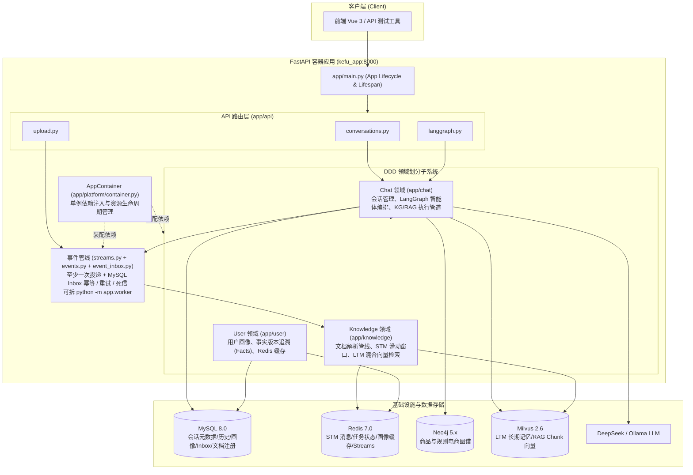

# 01 · 系统总览

> 📖 **函数级明细**：本文末 [附录 A · 共享内核与平台函数手册](#附录-a--函数手册共享内核appshared与平台层appplatform)——shared/platform 全部函数的签名/参数/异常/调用关系。


> **流程图**：[00-全流程图集.md](00-全流程图集.md) §1 系统总架构、§19 数据落点。

## 0.1 学习导航

### 这一章要解决什么问题

这章不是给你背“项目介绍词”，而是帮你先把三个基础问题钉住：

1. 这个仓库的边界是什么，哪些能力在仓库里，哪些不在。
2. 为什么代码不是按 `services/` 平铺，而是按 `chat / knowledge / user / shared` 分域。
3. 一次请求从入口到数据落点，大体会经过哪些层。

### 读这一章前最好先知道什么

1. FastAPI 是协议层，不等于全部业务逻辑。
2. 一个 AI 应用后端往往不只有一个模型调用，而是多模块协作。
3. “系统总览”这一章的任务是先建全局地图，不是先抠单个函数。

### 这一章学完后你应该会什么

1. 能用 30 秒说清项目是做什么的。
2. 能说清 `app/api`、`app/chat`、`app/knowledge`、`app/user`、`app/shared` 的职责边界。
3. 能解释为什么消息采用 MySQL 历史 + Redis STM 双轨，以及为什么 Compose 是唯一官方启动方式。
4. 能把“仓库结构”和“业务链路”对应起来，而不是只会背目录树。

### 推荐阅读方法

1. 先读 §1、§2、§3，建立项目边界和业务目标。
2. 再读 §4，把目录树和分层规则对上。
3. 再读 §7、§8，理解数据落点和请求主路径。
4. 最后读“面试深挖”和“实习面试讲法”，把前面的理解转成表达。

### 常见误区

1. 只记住技术栈，不理解它们之间为什么这样组合。
2. 把 `frontend/` 的存在误讲成“这是一个前端主导项目”。
3. 觉得“系统总览”没技术含量，直接跳过去看 Agent 细节。

## 1. 是什么

**AssistGen / deepseek_agent** 是一个面向智能客服场景的 **后端** 系统（本仓库）：

- 用 **FastAPI** 提供 REST / SSE 接口
- 用 **LangGraph** 编排多策略 Agent（统一路由决策 → 守卫 → 执行 → 记忆写回）
- 用 **分层记忆**（Redis 短期 + MySQL 画像 + Milvus 长期）提升多轮对话质量
- 用 **Neo4j 知识图谱 + RAG 文档检索** 回答商品/售后类问题
- 用 **Docker Compose** 一键拉起全部依赖（唯一官方启动方式）

### 1.0 系统总结构图



### 1.1 本仓库边界（介绍时别说错）

| 在本仓库 | 不在本仓库 |
|---|---|
| FastAPI 后端、`app/` 全量业务 | 独立移动端 / 小程序 / 第三方客服平台接入 |
| Docker Compose 全套依赖 | 独立 API 网关 / 统一鉴权中心 |
| `frontend/` Vue 3 + Vite + TS 控制台源码 | 完整 E2E 浏览器自动化（当前无） |
| OpenAPI：`/docs`、`/openapi.json`、JWT 鉴权 | 独立 API 网关 / 统一鉴权中心 |

**面试口径建议：**

1. 当前仓库里已经有 `frontend/`，但如果你投的是 **AI 应用 / 后端实习**，介绍重点仍应放在 `app/`、接口、Agent、记忆、检索和部署。
2. 不要把“仓库里有前端”误讲成“这个项目主要是前端项目”。

### 1.2 它和普通聊天机器人最本质的区别

如果面试官第一句就问“那这个项目和普通聊天机器人有什么区别”，可以直接抓 4 点：

1. 这里不是单次 LLM 调用，而是显式的工作流编排。
2. 这里不是单一知识源，而是图谱检索和文档检索双链路。
3. 这里不是只拼聊天记录，而是分层记忆。
4. 这里不是只看回答效果，还要考虑上传异步化、SSE、降级和数据边界。

---

## 2. 解决什么问题

| 客服能力 | 实现方式 |
|---|---|
| 闲聊 / 通用问答 | RoutingDecision → `general` → 直接 LLM 回复 |
| 商品结构化查询（库存、订单、客户…） | KG / Text2Cypher / 预定义 Cypher 模板 |
| 售后政策 / 文档问答 | RAG（Markdown / PDF / DOCX 上传 → 混合检索） |
| 复杂问题多步推理 | ReAct 子图 + 充分性检查 + 有限重试 |
| 记住用户偏好与历史 | STM + 用户画像 + LTM |
| 会话列表管理 | MySQL `conversations` 元信息 + `messages` 完整历史；Redis STM 只供模型上下文 |

### 2.1 为什么这张表很重要

这张表本质上回答的是两个面试高频问题：

1. 这个系统到底支持哪些业务能力？
2. 每一种能力背后到底依赖哪条技术链路？

你如果只能说“这个项目做智能客服”，但说不出能力和实现方式之间的对应关系，面试官会很快追问把你问散。

---

## 3. 技术栈

| 层级 | 技术 |
|---|---|
| Web | FastAPI、Uvicorn、SSE（`text/event-stream`） |
| Agent | LangGraph、LangChain、structured output |
| LLM | DeepSeek API / Ollama（可切换） |
| Embedding | 默认 bge-m3（Ollama 或 HuggingFace） |
| 关系库 | MySQL 8 + SQLAlchemy Async + aiomysql |
| 缓存 / STM / 任务 | Redis 7 |
| 图库 | Neo4j + langchain-neo4j |
| 向量库 | Milvus 2.6（依赖 etcd + MinIO） |
| 文档解析 | Markdown 直读 + Docling PDF/DOCX + python-docx fallback（`doc_parser`） |
| 部署 | Docker Compose only |

---

## 4. 仓库目录树与逐文件职责

> **约定：** 下列覆盖当前 `app/**/*.py` 全部业务文件；`__init__.py` 多为包导出/空壳，表中标「包初始化」。  
> 更细的函数说明见 03–08 各章。  
> **树状图**便于空间导航；**表格**写每个文件用途——两者都保留。

### 4.0 总览树状图

```text
deepseek_agent/
├── app/                              # 唯一主代码树
│   ├── main.py                       # FastAPI 工厂 + /health + lifespan
│   ├── api/                          # HTTP 协议层（详见 03）
│   │   ├── __init__.py
│   │   ├── common.py
│   │   ├── conversations.py
│   │   ├── upload.py
│   │   └── langgraph.py
│   ├── chat/                         # 对话域（详见 04）
│   │   ├── README.md
│   │   ├── domain/
│   │   │   └── schemas.py
│   │   ├── application/
│   │   │   ├── conversation_service.py
│   │   │   └── agent_query_service.py
│   │   └── infrastructure/
│   │       ├── utils/helpers.py
│   │       ├── models/conversation.py
│   │       ├── repository/conversation_repository.py
│   │       ├── graph/                # state/builder/nodes/utils...
│   │       ├── react/react.py
│   │       ├── retrievers/           # contracts/implementations/runtime
│   │       ├── kg/                   # neo4j/t2c/predefined/validation
│   │       └── modeling/             # models.py + prompts.py
│   ├── knowledge/                    # 记忆+文档（详见 05/06）
│   │   ├── README.md
│   │   ├── domain/                   # schemas + prompt_builder
│   │   ├── application/              # indexing_*
│   │   └── infrastructure/
│   │       ├── stm/
│   │       ├── ltm/
│   │       ├── orchestration/
│   │       └── doc_parser/           # pipeline/parsers/markdown/splitters/retrieval
│   ├── user/                         # 用户画像（详见 07）
│   │   ├── README.md
│   │   ├── domain/
│   │   ├── application/
│   │   └── infrastructure/           # models + repository
│   ├── shared/                       # 唯一全局 shared（详见 08）
│   │   ├── README.md
│   │   ├── core/                     # config*/database/logger/json
│   │   ├── security/
│   │   ├── retrieval/
│   │   ├── streams.py                # Streams 消费组 / PEL / 死信
│   │   └── background_tasks.py       # 状态协议 + 进程内回退
│   ├── platform/
│   │   ├── container.py              # 生命周期 / 消费者装配
│   │   ├── event_inbox.py            # MySQL 消费 Inbox
│   │   └── events.py                 # 事件 handler 路由
│   └── scripts/                      # bootstrap/init_db/...
├── configs/
│   ├── docker/app/start.sh
│   ├── docker/neo4j-import/
│   └── mysql-init/
│       ├── init.sql
│       └── migration_stream_idempotency.sql
├── specs/
├── scripts/neo4j-import.sh
├── tests/{api,chat,knowledge,user,shared}/
├── docs/                             # 项目详细文档与面试资料
├── docker-compose.yml
├── Dockerfile
├── pyproject.toml
├── pyrightconfig.json
└── requirements.txt
```

### 4.1 顶层与入口

| 路径 | 用处 |
|---|---|
| `app/main.py` | FastAPI 工厂、CORS、`/health`、挂载 `/api`、lifespan 启停容器 |
| `app/README.md` | app 树与分层约定 |
| `docker-compose.yml` | 一键依赖 + app 服务 |
| `Dockerfile` | app 镜像构建 |
| `pyproject.toml` | 依赖、ruff/mypy/pytest |
| `pyrightconfig.json` | Pylance 仅扫 `app/` |
| `requirements.txt` | pip 依赖备份 |
| `Makefile` | test/lint/docker 快捷命令 |
| `.env.example` / `.env.docker` | 环境变量模板 / 容器覆盖 |
| `configs/docker/app/start.sh` | 容器入口：bootstrap DB + uvicorn |
| `configs/mysql-init/init.sql` | MySQL 首次初始化 |
| `configs/mysql-init/migration_stream_idempotency.sql` | 已有 MySQL 的 Inbox / 历史消息幂等迁移 |
| `configs/docker/neo4j-import/` | 图谱 CSV（可选） |
| `scripts/neo4j-import.sh` | Neo4j 导入脚本 |
| `specs/` | 可 Git 跟踪设计文档 |
| `docs/` | 项目详细文档与面试资料 |
| `tests/api|chat|knowledge|user|shared/` | 与域对齐的测试 |

### 4.2 `app/api/`（协议层，详见 03）

| 文件 | 用处 |
|---|---|
| `__init__.py` | 聚合 conversations/upload/langgraph 路由 |
| `common.py` | `run_api_action`、统一 500 文案、MessageResponse |
| `conversations.py` | 会话 CRUD HTTP |
| `upload.py` | 上传校验/落盘/提交任务/查状态 |
| `langgraph.py` | SSE 问答入口 |

### 4.3 `app/chat/`（对话域，详见 04）

| 文件 | 用处 |
|---|---|
| `README.md` | 域边界说明 |
| `domain/schemas.py` | 领域契约说明（状态仍在 graph） |
| `application/conversation_service.py` | 会话用例 + 删会话清记忆 |
| `application/agent_query_service.py` | `stream_agent_query` 门面 |
| `infrastructure/utils/helpers.py` | `question_from_state` / `no_neo4j_response` |
| `infrastructure/models/conversation.py` | Conversation ORM |
| `infrastructure/repository/conversation_repository.py` | 会话 SQL |
| `infrastructure/graph/state.py` | AgentState / InputState |
| `infrastructure/graph/builder.py` | 主图编译 `graph` |
| `infrastructure/graph/decision_nodes.py` | 统一路由决策、Guardrails 与执行边 |
| `infrastructure/graph/retrieval_nodes.py` | 四路 execute_* |
| `infrastructure/graph/execution_pipeline.py` | 检索执行管道 |
| `infrastructure/graph/execution_utils.py` | 改写 query / 摘要 / search 工具 |
| `infrastructure/graph/memory_context.py` | 记忆加载与 P0–P3 拼装 |
| `infrastructure/graph/lifecycle_nodes.py` | `after_response` |
| `infrastructure/graph/message_utils.py` | 安全消息/进度消息构造 |
| `infrastructure/react/react.py` | ReAct 子图 + 充分性检查 |
| `infrastructure/retrievers/retriever_contracts.py` | Retriever 接口与注册表 |
| `infrastructure/retrievers/retriever_implementations.py` | KG/RAG 实现 |
| `infrastructure/retrievers/retriever_runtime.py` | get_retriever 懒注册 |
| `infrastructure/kg/neo4j_conn.py` | Neo4j 连接 |
| `infrastructure/kg/text2cypher_workflow.py` | Text2Cypher 图 |
| `infrastructure/kg/text2cypher_state.py` | T2C 状态类型 |
| `infrastructure/kg/northwind_retriever.py` | few-shot 示例检索 |
| `infrastructure/kg/predefined_cypher/cypher_dict.py` | 27 条模板 |
| `infrastructure/kg/predefined_cypher/descriptions.py` | 模板描述 |
| `infrastructure/kg/predefined_cypher/utils.py` | 向量匹配 + cosine |
| `infrastructure/kg/validation/validators.py` | Cypher 校验编排 |
| `infrastructure/kg/validation/models.py` | 校验结构 |
| `infrastructure/kg/validation/schema_validation_rules.py` | schema 规则 |
| `infrastructure/kg/validation/utils/cypher_extractors.py` | Cypher 抽取正则 |
| `infrastructure/modeling/models.py` | LLM 懒加载 + 温度 + 结构输出 |
| `infrastructure/modeling/prompts.py` | Prompt 字符串/YAML 加载 |

### 4.4 `app/knowledge/`（记忆+文档，详见 05/06）

| 文件 | 用处 |
|---|---|
| `README.md` | 域边界 |
| `domain/schemas.py` | MessageRecord/LTM/AgentMemoryState 等 |
| `domain/prompt_builder.py` | 压缩/注入 Prompt 拼装 |
| `application/indexing_service.py` | 上传后解析索引 |
| `application/indexing_contracts.py` | UploadFileInfo/IndexingResult 契约 |
| `infrastructure/stm/redis_short_term_memory.py` | Redis STM 实现 |
| `infrastructure/stm/stm_compressor.py` | MsgPack+Zstd 编解码 |
| `infrastructure/ltm/simple_long_term_memory.py` | LTM 读写检索 |
| `infrastructure/ltm/ltm_collection.py` | collection schema/字段常量 |
| `infrastructure/orchestration/memory_middleware.py` | before/after 编排 |
| `infrastructure/orchestration/memory_extractor.py` | 压缩后抽取 LTM/画像 |
| `infrastructure/orchestration/profile_adapter.py` | 调 user 域画像 |
| `infrastructure/doc_parser/pipeline.py` | parse_document 总入口 |
| `infrastructure/doc_parser/config.py` | ParserConfig |
| `infrastructure/doc_parser/exceptions.py` | 解析异常类型 |
| `infrastructure/doc_parser/models.py` | DocumentChunk 等 |
| `infrastructure/doc_parser/parsers/*` | MD/PDF/DOCX 解析器 |
| `infrastructure/doc_parser/markdown/*` | 清洗/标题/块/表工具 |
| `infrastructure/doc_parser/splitters/*` | 文本/表/代码切分 |
| `infrastructure/doc_parser/retrieval/*` | HybridSearcher/MilvusStore/Rerank |

### 4.5 `app/user/`（详见 07）

| 文件 | 用处 |
|---|---|
| `domain/schemas.py` | UserProfileData/Fact/Payload |
| `domain/profile_payload_support.py` | 规范化/校验 payload |
| `application/user_profile_service.py` | 画像缓存 + 用例 |
| `infrastructure/models/user.py` | User ORM |
| `infrastructure/repository/user_profile_repository.py` | 画像/facts SQL |

### 4.6 `app/shared/` + `platform/` + `scripts/`（详见 08）

| 文件 | 用处 |
|---|---|
| `shared/core/config_models.py` | pydantic-settings 环境变量模型 |
| `shared/core/config.py` | 全局 settings 聚合 |
| `shared/core/app_config.py` | 运行时常量（React/STM/LTM/上传） |
| `shared/core/database.py` | AsyncEngine / Session / Base |
| `shared/core/logger.py` | 日志配置与 format_log_context |
| `shared/core/json_utils.py` | 从 LLM 文本抽 JSON |
| `shared/security/__init__.py` | wrap_user_message |
| `shared/retrieval/milvus_hybrid_core.py` | 混合检索公共核 |
| `shared/streams.py` | Redis Streams 发布、消费组、PEL 重放、死信与 ACK 顺序 |
| `shared/background_tasks.py` | 上传任务状态协议；事件设施不可用时的进程内回退 |
| `platform/container.py` | AppContainer 装配与生命周期 |
| `platform/event_inbox.py` | MySQL 消费 Inbox：事件认领、租约、完成和失败审计 |
| `platform/events.py` | `turn_completed` / `document_index_requested` handler 路由 |
| `scripts/bootstrap_compose_db.py` | Compose 启动建表 |
| `scripts/init_db.py` | 初始化/维护入口 |
| `scripts/db_script_support.py` | 脚本公共支持 |

**业务域统一骨架：** `domain/` + `application/` + `infrastructure/`。  
**唯一 shared：** 仅 `app/shared`。

---

## 5. 领域依赖规则（硬约束）

```text
api
  → chat.application / knowledge.application / user.application / shared
  ✗ 禁止直接 import *.infrastructure

chat
  → shared
  → knowledge（记忆 schemas / middleware）
  → user.domain（画像类型）
  → Neo4j / LLM

knowledge
  → shared
  → user.application / user.domain（画像读写端口）
  ✗ 不拥有 durable 画像表

user
  → shared only
  ✗ 禁止 import knowledge

shared / platform
  → 不依赖业务领域包（platform 可装配 knowledge/chat 工厂）
```

**为什么这样划：**

1. 避免历史上的 `user ↔ knowledge` 导入环  
2. API 层稳定，底层实现可替换  
3. 画像是 durable 用户资产，归 user；记忆是对话资产，归 knowledge  

---

## 6. 核心概念词典

| 术语 | 含义 |
|---|---|
| **RoutingDecision** | 一次结构化输出：顶层 `type`、能力标签及代码解析的 `resolved_plan` |
| **Guardrails** | 业务范围守卫；不在经营范围则拒答 |
| **resolved_plan** | 由能力标签确定的执行路径：GRAPH_ONLY / RAG_ONLY / PARALLEL / GRAPH_THEN_RAG / AGENT_REACT |
| **Retriever** | 统一检索接口，实现有 KG 与 RAG 两路 |
| **Text2Cypher** | 自然语言 → Cypher；含预定义模板快路径 + LLM 生成 + 校验修正 |
| **STM** | Short-Term Memory，Redis 滑动窗口消息 + 摘要 |
| **LTM** | Long-Term Memory，Milvus 混合检索语义记忆 |
| **P0–P3** | 记忆注入优先级：最近消息 > 画像 > 摘要 > 长期记忆 |
| **AppContainer** | 应用级单例容器（事件管线、记忆中间件、检索器缓存等） |
| **thread_id** | LangGraph configurable 会话键，通常等于 conversation_id 字符串 |

---

### 6.5 v3.35 新增概念速查

| 概念 | 一句话 | 详见 |
|---|---|---|
| **写扩散** (fan-out on write) | 写入时把一轮对话物化成 5 个读视图（历史/窗口/摘要/LTM/画像），贵所以异步+事件化 | 04 §2.5 |
| **读扩散** (fan-out on read) | 读取时三路并发拉取异构存储组装上下文，总延迟=max 不是 sum | 04 §2.5 |
| Bearer 令牌 | 身份唯一来源（JWT HS256），业务层不再见到自报 user_id | 02 §4 |
| turn_completed / document_index_requested | 两类核心事件；Streams 至少一次投递，Inbox 按 `(type,event_id)` 认领；完成后才 ACK | 00 §24 |
| X-Request-ID | 贯穿一次请求全部日志的追踪键（contextvars + 日志 Filter） | 02 §8 |
| 消息双轨 | MySQL messages 给人看（全量），Redis STM 给模型看（窗口） | 00 §27 |
| interrupted | 进程内回退通道任务随进程消失的终态；stream 通道不会出现 | 02 §6.3 |

## 7. 数据落点原则

| 数据类型 | 存哪里 | 不存哪里 |
|---|---|---|
| 用户账号 | MySQL `users` | — |
| 会话标题/状态 | MySQL `conversations` | — |
| 会话消息 | MySQL `messages`（完整历史给人看）+ Redis STM（窗口给模型看） | — |
| 用户画像 | MySQL `user_profiles` + facts；Redis 缓存 | knowledge 包内 |
| 长期语义记忆 | Milvus LTM collection | MySQL |
| 文档 chunk 向量 | Milvus（doc_parser 检索） | 本地文件仅 uploads |
| 图谱实体关系 | Neo4j | — |
| 上传任务状态 | Redis `task:doc_parse:*` | — |

---

## 8. 请求主路径（一句话版，v3.35）

```
登录换 JWT → 每请求 Bearer 验证 → SSE：限流 → 会话归属解析 →
LangGraph（节点计时）→ 读扩散取记忆 → 检索/生成 → 流式返回 →
发布 turn_completed → 消费者写扩散（历史+STM+摘要+LTM+画像）
```

### 原第 8 节

1. **会话管理**：API → ConversationService → Repository → MySQL  
2. **智能问答**：API → `stream_agent_query` → LangGraph →（统一路由决策/守卫/执行）→ SSE；`after_response` 发布带 `turn_id` 的事件 → Inbox 认领后写历史/记忆
3. **文档上传**：API 落盘 → MySQL `user_documents` →（hash 未变则跳过）→ Redis Streams `document_index_requested(task_id)` → Inbox 认领 → IndexingService 幂等 index/reindex → 回写元数据 → 轮询 task

详细时序建议对照 [00-全流程图集.md](00-全流程图集.md) 与 [03-对话与Agent主图.md](03-对话与Agent主图.md) 一起看。

---

## 9. 测试布局与源码对应

| 测试目录 | 对应源码 |
|---|---|
| `tests/api/` | `app/api/` |
| `tests/chat/` | chat application + graph + kg + react |
| `tests/knowledge/` | 记忆 + indexing + doc_parser |
| `tests/user/` | 画像 service / repository |
| `tests/shared/` | config / db / background_tasks / security |
| `tests/test_main.py` | 应用工厂与 lifespan |
| `tests/test_script_entrypoints.py` | 启动脚本与结构守卫 |

---


---

## 面试深挖：系统架构

### Q1. 为什么不用单体 `services/` 而用 chat/knowledge/user？

**答：** 按**业务能力**切，而不是按技术层横切。

| 域 | 业务资产 | 若混在一起会怎样 |
|---|---|---|
| chat | 会话元数据、Agent 编排、检索策略 | 和记忆/画像循环依赖 |
| knowledge | 对话记忆、文档知识 | 误把 durable 画像写进向量库 |
| user | 用户身份、durable 画像 | 被 memory 反向 import 形成环 |

历史问题就是 `knowledge ↔ user` 画像双归属；现在规则是 **user 拥有画像，knowledge 只通过 adapter 调用**。

### Q2. 为什么消息同时进 MySQL 和 Redis，而不是只选一个？

1. **读取对象不同**：MySQL `messages` 是 append-only 完整历史，服务前端回看与审计；Redis STM 是模型的近期上下文窗口。
2. **生命周期不同**：历史随会话持久保存；STM 有窗口、压缩与 TTL，避免 Prompt 无限增长。
3. **性能路径不同**：SSE 结束时只发布 `turn_completed`，消费者异步写双轨，用户无需等待归档。
4. **重放语义不同**：同一 `turn_id` 在 MySQL 由 `(conversation_id, turn_event_id, sender)` 唯一键防重，在 STM 由 `turns` 标记防重。

**追问：为什么不只靠 Inbox？**
Inbox 防止正常重放再次进入 handler；若业务已成功但 Inbox 完成标记或 `XACK` 失败，
落点的事件 ID 仍能把重放收敛，避免两层之间的故障窗口造成重复历史或上下文。

### Q3. 为什么只有 Docker Compose 启动？

依赖矩阵：MySQL + Redis + Neo4j + Milvus(+etcd+minio) + LLM。本地直启极易「半套环境绿、全套挂」。Compose 用 healthcheck 串依赖，保证 app 起来时基础设施已就绪。

### Q4. 依赖倒置在本项目如何体现？

- 主图节点依赖 `Retriever` 接口，不直接依赖 Text2Cypher 细节  
- API 依赖 `agent_query_service` / `conversation_service`，不依赖 graph builder  
- MemoryMiddleware 依赖 `ProfileReader/Writer` 可注入函数，默认 adapter  

### Q5. 一句话画请求路径

```text
HTTP → API → Application → (Graph/Memory/Repo) → Redis/MySQL/Neo4j/Milvus/LLM
```

**禁止** API 直达 infrastructure。

## 10. 文档阅读提示

各业务章（尤其 **03–07**）内含 **关键函数** 扩写：签名、参数、返回、错误与调用关系。  
查函数时优先打开对应业务章，不必另找独立手册。

**想「只看文档就详细了解项目」：** 先看 [全流程文档索引.md](../全流程文档索引.md) 的阅读顺序，再把重头戏放在 **04 附录 A / 05 附录 B / 06 附录 C**。

### 10.1 心智模型一句话

```text
协议(api) → 用例(application) → 图/记忆/检索(infrastructure)
                ↑
        唯一容器 AppContainer 装配 Redis/Milvus/Neo4j/LLM
完整会话历史在 MySQL；Redis 只保留最近消息/摘要等热窗口；知识在 Neo4j+两套 Milvus。
```

### 10.2 读这一章时一定要同步做的事

1. 打开仓库目录，和文档里的目录树一一对照。
2. 看到 `chat / knowledge / user / shared` 时，立刻问自己“它们的边界为什么不是别的切法”。
3. 看到一个存储，就立刻问自己“它存什么，为什么不交给另一个存储”。

## 11. 实习面试讲法

### 11.1 30 秒版本

```text
这是一个智能客服后端项目。对外用 FastAPI 提供会话、文档上传和 SSE 问答接口，内部用 LangGraph 编排 Agent，再结合 Neo4j 图谱、Milvus 文档检索、Redis 多轮记忆和 MySQL 会话/画像存储，去回答商品咨询、售后政策和多轮上下文问题。
```

### 11.2 90 秒版本

可以按这个顺序讲：

1. 先说业务目标：做智能客服，不只是普通聊天，而是要能回答企业业务知识。
2. 再说主链路：用户问题进入 API 后，Agent 用一次结构化决策同时完成路由和能力规划；知识问题再做经营范围判断，随后按确定性执行路径走图谱、文档检索或 ReAct 多步推理。
3. 再说数据分工：会话元信息、完整历史和画像在 MySQL，模型窗口在 Redis，文档与长期记忆在 Milvus，结构化关系知识在 Neo4j。
4. 最后说工程点：上传和记忆写入走 Redis Streams；MySQL Inbox 让崩溃重放不重复产生业务副作用。

### 11.3 最容易讲错的 4 个边界

1. **消息是双轨**：MySQL `messages` 给人看完整历史，Redis STM 给模型看有 TTL 的窗口。
2. **`conversation_id` 和 LangGraph `thread_id` 在接口层对齐使用**，但 MySQL 的会话主键和图执行的线程键是两个概念。
3. 当前仓库里 **已有 `frontend/`**，但项目主线仍是后端和 AI 应用工程。
4. 当前接口已使用 JWT；生产环境仍需继续完善权限、审计与密钥轮换治理。

## 12. 下一步

- 接口与 `run_api_action` / 上传函数 → [02-API接口.md](02-API接口.md)  
- Agent / 会话 Service / 节点函数 → [03-对话与Agent主图.md](03-对话与Agent主图.md)  
- 关键数字、Redis key、Milvus 字段 → [07-配置参数与数据字段全览.md](07-配置参数与数据字段全览.md)

## 学习自测

1. 如果让你不用看文档介绍这个仓库，你能不能先讲清“它是什么”，再讲“它为什么这么分层”？
2. 你能不能解释为什么 `shared` 不能继续膨胀成一个什么都放的黑盒目录？
3. 你能不能讲清会话元信息、消息、画像、长期记忆为什么分别落在不同存储？
4. 你能不能把目录树和一次问答主链路对应起来？

---

## 附录 A · 函数手册：共享内核（app/shared）与平台层（app/platform）

> **读法**：每条 = 与源码逐字一致的签名 + 参数/返回/异常 + 调用关系 + 实现要点（WHY）。
> 行号对齐 v3.35.1。图例：📌 热路径（每请求经过）｜🔒 有并发语义｜⚠️ 有历史踩坑。
> 配置三件套（config.py / config_models.py / app_config.py）的函数级明细在 [07 附录 G](07-配置参数与数据字段全览.md)；
> 共享检索核 milvus_hybrid_core 在 [05 附录 E](05-知识检索与文档解析.md)。

### A.1 `shared/core/async_bridge.py` — 同步 SDK → 事件循环桥接

**模块职责**：pymilvus / LangChain Embeddings 是**同步** SDK；在 `async def`
里直接调用，协程不让出控制权——单进程下一次几百毫秒的调用卡住**所有**
并发请求（v3.33 修复的 P0）。

#### 📌 `async def run_blocking(func, /, *args, **kwargs) -> R`

| 项 | 说明 |
|---|---|
| 参数 | `func` 任意同步可调用；`*args/**kwargs` 原样透传（`ParamSpec` 保持类型贯通） |
| 返回 | `func` 的返回值 |
| 异常 | **原样上抛**——调用方 try/except 语义不变，这是刻意契约 |
| 实现 | `asyncio.to_thread(func, *args, **kwargs)`（默认线程池） |
| 调用方 | milvus_hybrid_core 全部检索、ltm_collection 全部数据面、milvus_store 全部数据面、platform/health 探测 |

要点：embedding 推理（torch）计算时释放 GIL；网络调用本就不占 GIL——
两类负载都能真并行。`/` 使 func 仅位置传参，避免与 kwargs 同名键冲突。

#### `async def run_blocking_method(obj, method_name, /, *args, **kwargs) -> Any`

按名调用对象同步方法；方法缺失在进线程池**之前**抛 `AttributeError`
（便于 hasattr 探测不同 pymilvus 版本方法集）。预留入口，暂无生产调用方。

**测试**：`tests/shared/test_async_bridge.py`——断言**线程身份**与**循环存活**，
而不只是返回值；退化成直接调用会失败。

### A.2 `shared/core/identity.py` — 请求级身份与追踪上下文

contextvars 承载 request_id 与已认证 user_id；`create_task` 自动快照继承。

| 函数 | 签名 | 说明 |
|---|---|---|
| 📌 `set_request_id` | `(request_id: str) -> None` | 中间件请求入口调用 |
| 📌 `get_request_id` | `() -> str` | 日志 Filter 每条日志调用；无上下文返回 `"-"` |
| `set_current_user_id` | `(user_id: int \| None) -> None` | `get_current_user` 验令牌后调用 |
| `get_current_user_id` | `() -> int \| None` | RAG 分域过滤读取；匿名/脚本返回 None |

WHY 不显式传参：request_id 要出现在**每条**日志、user 要下沉到检索层，
途经中间件→6 节点→检索器→存储；改所有签名的侵入性远大于请求局部变量。

### A.3 `shared/core/degradation.py` — 降级日志分级

⚠️ 教训：LTM 配置被当 dict 下标抛 TypeError，被裸 except 吞掉，长期记忆
静默失效——"外部抖动"与"代码写错"必须在日志里长得不一样。

- 常量 `EXTERNAL_DEPENDENCY_ERRORS = (redis.RedisError, asyncio.TimeoutError, TimeoutError, ConnectionError, OSError)`
- `def is_external_dependency_error(exc) -> bool`：isinstance 判定，独立成函数便于测试枚举分类表
- 📌 `def log_degradation(logger, operation, exc, **context) -> bool`：
  外部故障 → warning 无堆栈返回 True；其余 → `logger.exception`
  **带完整堆栈** + 文案标"疑似代码缺陷"返回 False。
  调用方：STM/LTM 全部降级点、memory_middleware `_degrade_once`、
  streams 消费循环、document_service 删除链。

### A.4 `shared/core/errors.py`

`class ResourceNotFoundError(Exception)`：`__init__(message="资源不存在")`，
暴露 `.message`。Service/Repo 表达"不存在**或不属于请求方**"的唯一方式；
`run_api_action` 统一映射 404。不设 403——区分"不存在/不是你的"等于给
枚举者 oracle。⚠️ 曾用裸 ValueError 被包装成 500。

### A.5 `shared/core/rate_limit.py` — SSE 并发限流

- `class ConcurrencyLimitExceededError(Exception)`：携带 `.limit`
- `class SseConcurrencyLimiter.__init__(redis_client, *, max_concurrent, slot_ttl_seconds)`；key `ratelimit:sse:{user_id}`

#### 🔒 `async def acquire(self, user_id: int) -> None`

`INCR → EXPIRE(slot_ttl) → 超限则 DECR 回滚 + raise`。
Redis 故障 **fail-open**（warning + 放行）：护栏自身故障不能带走主功能。
每次续 TTL ⇒ 崩溃未 release 的槽位最多泄漏 300s 自动回收。

#### `async def release(self, user_id: int) -> None`

DECR；结果 <0（TTL 清零后多余 release）则 `SET 0` 钳制；失败静默 debug。

调用点（api/langgraph.py）：acquire 在**会话解析之前**（否则 429 请求
每次留空会话行，v3.35.1 修正）；release 在流 finally + 解析失败分支。

### A.6 `shared/core/embeddings.py` — embedding 唯一构造入口

⚠️ 曾双真相：LTM 读 settings、RAG 读 os.getenv，各建一份。

- `def create_embedding_model(config=settings) -> Any`：按 `EMBEDDING_TYPE`
  分支 Ollama / HuggingFace；config 可注入测试替身
- 📌 `@lru_cache(maxsize=1) def get_embedding_model() -> Any`：进程共享。
  **LTM 与 RAG 必须同一实例**（向量同源）；bge-m3 权重 ~2GB 不该存两份
- `def reset_embedding_model() -> None`：cache_clear（配置变更/测试隔离）

调用方：容器 `_create_memory_middleware`、`MilvusStore._resolve_embedding_model`。

### A.7 `shared/core/logger.py`

`LOG_FORMAT` 第三列为 request_id（v3.35）。

| 函数 | 说明 |
|---|---|
| 📌 `class RequestContextFilter(logging.Filter)` | `.filter()` 从 contextvars 取 request_id 写入 record；挂 handler ⇒ 全 logger 生效、业务零改动 |
| `format_log_context(**context) -> str` | 过滤 None/空后拼 `k=v` |
| `configure_noisy_loggers(level=WARNING)` | 压 sqlalchemy/pymilvus/httpx 等噪音 |
| `configure_root_logger(root, *, level, format_str, date_format)` | 幂等挂 StreamHandler+Formatter+Filter |
| `setup_logging(...)` | 幂等入口；main.py 与 worker.py 各调一次 |
| `get_logger(name)` | getLogger 薄封装（统一入口便于替换） |

### A.8 `shared/core/database.py`

| 对象 | 定义 | 要点 |
|---|---|---|
| `class Base(DeclarativeBase)` | 全项目 ORM 基类 | 模型必须被 import 才进 metadata（⚠️ bootstrap 曾漏 Message，v3.35.1 修） |
| `engine` | `create_async_engine(DATABASE_URL, pool_pre_ping=True, pool_size=5, max_overflow=10)` | pre_ping 防 MySQL 闲断连 |
| `AsyncSessionLocal` | `async_sessionmaker(bind=engine, expire_on_commit=False)` | commit 后对象属性仍可读，不触发懒加载再查询 |

### A.9 `shared/core/json_utils.py`

- `def extract_first_json_object(content: str) -> str | None`：手写括号
  配平状态机，跟踪 in_string/escape——**字符串字面量里的花括号不计深度**
  （朴素 find/rfind 会在 LLM 输出含 `"{x}"` 时配错）
- `def parse_first_json_object(content) -> dict | None`：提取+loads+仅收 dict；
  任何失败 None。调用方：STM 摘要解析、KG 参数提取。

### A.10 `shared/streams.py` — Redis Streams 事件内核 ⭐

消费组 + 崩溃认领 + 重试上限 + 死信；零新依赖。常量：block 5s、
claim_idle 60s、max_deliveries 3、batch 16。投递语义仍是**至少一次**，
但容器注入的 MySQL Inbox（`platform/event_inbox.py`）按
`(event_type,event_id)` 认领，已完成事件直接 ACK，因此业务效果不会重复。

- `encode_event/decode_event`：entry = `{type, data(JSON)}`；decode 兼容
  bytes 键值（客户端 decode_responses=False）；畸形返回 None → ACK 丢弃
- `class RedisStreamQueue.__init__(redis_client, *, stream, group, consumer_name=None, ...)`：
  consumer 名带 8 位随机后缀——多副本共享 group 互不顶替；
  `dead_letter_stream = f"{stream}:dead"`

| 方法 | 行为 |
|---|---|
| `publish(event_type, payload) -> str` | XADD，返回 entry id |
| 🔒 `ensure_group()` | XGROUP CREATE mkstream；吞 BUSYGROUP（幂等） |
| `_handle_entry(handlers, id, fields, *, deliveries)` | 状态机：畸形→ACK 丢弃；无 handler→ACK 跳过；Inbox 已完成→ACK；Inbox 租约忙→留 PEL；业务完成→Inbox completed→ACK；失败且 deliveries≥3→死信+ACK；否则留 PEL 等认领 |
| `_claim_stale(handlers)` | XAUTOCLAIM(idle≥60s) 认领遗留逐条重放；自身异常仅降级记录 |
| `_delivery_count(id) -> int` | XPENDING RANGE 取 times_delivered；失败按 1（宁多试不误判毒消息） |
| 📌 `run_consumer(handlers, stop_event)` | ensure_group → 循环{claim → XREADGROUP ">" → 处理}；读失败 sleep(1) 退避；Cancelled 上抛 |

**测试**：test_streams.py 自研 FakeStreamRedis 实现消费组语义——
失败重放到成功、毒消息进死信、未知类型跳过、ensure_group 幂等，以及重复
`event_id` 只执行一次 handler、payload hash 冲突拒绝副作用。

### A.10.1 `platform/event_inbox.py` — MySQL 消费 Inbox ⭐

`processed_events` 是 Streams 的持久化消费收件箱，而不是生产端 outbox。
它不改变 Redis 的至少一次投递，只把“谁可以执行业务 handler”与“何时确认完成”
持久化下来：

| 对象/方法 | 行为 |
|---|---|
| `stable_payload_hash(payload)` | 对规范化 JSON 做 SHA-256；相同 `event_id` 却有不同载荷时拒绝副作用，避免生产者误复用 ID |
| `resolve_event_id(...)` | 优先 `event_id` → `turn_id` → `task_id`；旧 PEL 缺 ID 时由 stream entry 派生 `legacy_*` ID |
| 📌 `EventInbox.claim(...)` | 唯一键 `(event_type,event_id)` 插入或读取记录；返回 `PROCESS` / `SKIP_COMPLETED` / `BUSY` / `PAYLOAD_CONFLICT` |
| `mark_completed(...)` | 仅持有当前租约的消费者可完成；清理租约，调用方随后才 `XACK` |
| `mark_failed(...)` | 写最近错误；普通失败可在租约过期后重试，达到 delivery 上限时标记 dead-lettered |

默认租约为 120 秒。Inbox 不可用时消费者不应 ACK，留 PEL 等下一次重试；已完成
后才 ACK 的顺序是故意的，落点事件 ID 用于覆盖这两个动作之间的崩溃窗口。

**迁移**：已有数据库必须执行
`configs/mysql-init/migration_stream_idempotency.sql`；Compose 的 `init.sql` 只覆盖新建
MySQL 数据卷。

### A.11 `shared/background_tasks.py` — 任务状态协议 + 回退执行

定位（⚠️ 曾名 task_queue 误导）：**非分布式队列**；v3.35 后主要是
「状态协议」（stream 与回退通道共用）+ 回退执行器。

- `TaskStatus`：PENDING/RUNNING/COMPLETED/FAILED/**INTERRUPTED**；
  `WORKER_ID` 进程随机 12 hex
- `build_task_status_payload(task_id, status, *, result=None, error=None, worker_id=WORKER_ID, origin=None)`：
  origin="stream" 标记事件流通道
- `load_task_status_payload(raw) -> payload | None`：缺字段/类型错返回
  None（脏数据不炸轮询接口）
- `is_orphaned_task(payload, *, current_worker_id) -> bool`：未终结 ∧
  非本进程 ∧ **origin≠"stream"**（stream 消息会被认领重跑，标
  interrupted 是误报）
- 📌 `run_task_with_status_updates(redis, logger, task_id, coro_func, *args, origin=None, **kwargs)`：
  RUNNING→执行→COMPLETED/FAILED，全程带 origin；两通道共用
- `class _TaskManager`：`submit`（回退通道：PENDING + spawn_tracked_task）/
  `get_status` / `reconcile_orphaned_tasks`（启动扫描孤儿→INTERRUPTED；
  失败返回 0 不阻断启动）/ `close`（只关连接不动在跑任务）
- `spawn_tracked_task(pending, task_id, coro)`：⚠️ 无引用的 task 可能被
  GC，异常静默丢——引用集合 + done_callback discard
- `create_redis_client(url)`：decode_responses=True（状态是 JSON 文本，
  安全；对比 STM 消息必须二进制客户端）

### A.12 `shared/security/__init__.py`

`def wrap_user_message(raw_input: str) -> tuple[str, str]`：
`html.escape(quote=False)` + `<user_message>` 包裹；返回
（嵌 prompt 用，原文存记忆用）。四层注入防线的第一层。

### A.13 `platform/container.py` — 应用容器 ⭐

- `class KnowledgeGraphComponents`：cypher_example_retriever +
  text2cypher_agent + clear()——一组昂贵且必须同生同灭的对象；聚合后
  chat 域不再摸容器私有字段
- `AppContainer.build(config)`：task_manager（含孤儿 reconcile）→
  事件基础设施（一个 decode_responses=False 客户端服务 queue+limiter，queue 注入
  `EventInbox`）→
  memory_middleware；**任一步失败 close() 后 raise**，绝不留半初始化单例
- `start_background_jobs()`：幂等；`_start_event_consumer`
  （EVENTS_INLINE_CONSUMER=0 可关）+ `_start_ltm_purge`
- `stop_background_jobs / close`：停后台→task_manager→memory 资源→
  events redis→清缓存；每步独立 try/except——**停机路径一个失败不能拦
  后面的释放**
- 🔒 `get_container()`：已初始化直返；否则双检锁构建
- `get_container_if_initialized()`：**只读不建**——事件发布/健康探测/
  上传投递这类机会型访问点用；容器不在就降级
- `_create_memory_middleware()`：STM（⚠️ 必须 create_stm_redis_client
  二进制客户端）+ LTM（⚠️ MILVUS_URL 必须带 scheme）+ Extractor；
  embedding 走共享工厂

### A.14 `platform/events.py`

常量：stream `agent:events`、group `core`、两个事件类型。

- 📌 `handle_turn_completed(payload)`：载荷不完整→warning 丢弃；
  解析 `turn_id/event_id` 后，① `_persist_turn_history`（独立降级，传入
  `turn_event_id`）② `after_agent`（记忆链，传入 `turn_id`）。
  只有②抛出触发 stream 重试——"单环失败只缺对应视图"
- `_persist_turn_history(session_id, u, a, turn_event_id=...)`：session 非纯数字
  （历史 uuid 线程）跳过；MessageRepository 的 MySQL 唯一键是历史落点的最终防线
- `handle_document_index_requested(payload)`：复用
  run_task_with_status_updates(origin="stream")，把 `task_id` 透传为 `event_id`——
  索引层据此稳定化 chunk ID 并用 Milvus upsert；轮询接口对执行通道无感知；
  task_manager 缺失 raise 交给重试
- `build_core_handlers()`：路由表；内嵌消费与 worker 共用

### A.15 `platform/health.py`

`CHECK_TIMEOUT_SECONDS=2.0`。`_check_mysql(SELECT 1)` /
`_check_redis(STM ping)` / `_check_milvus(list_collections)` /
`_check_neo4j(RETURN 1，未配置返回 "disabled" 不拖垮整体)`。
`_probe` 统一 wait_for + 异常收敛（detail 截 200 字）；
`run_deep_health_check()` 四路并发，核心全 ok 且 neo4j∈{ok,disabled}
→ "ok"，否则 "degraded"（main 据此 200/503）。

### A.16 `worker.py`

`run_worker()`：build 容器 → set_container → 注册 SIGINT/SIGTERM →
run_consumer 直到信号 → finally reset_container。
`main()`：setup_logging + asyncio.run。`python -m app.worker`；
配套 app 侧 EVENTS_INLINE_CONSUMER=0。

### A.17 函数 → 测试对照

| 模块 | 测试 |
|---|---|
| async_bridge / degradation / rate_limit / embeddings | tests/shared/test_{async_bridge,degradation,rate_limit,embeddings}.py |
| config（MILVUS_URL scheme 回归） | tests/shared/test_config.py |
| streams / background_tasks（孤儿+origin 豁免） | tests/shared/test_{streams,background_tasks}.py |
| container 关闭链 | tests/shared/test_background_tasks.py |
| events | tests/test_platform_events.py |
| json_utils / logger / database | tests/shared/test_{json_utils,logger,database}.py |
