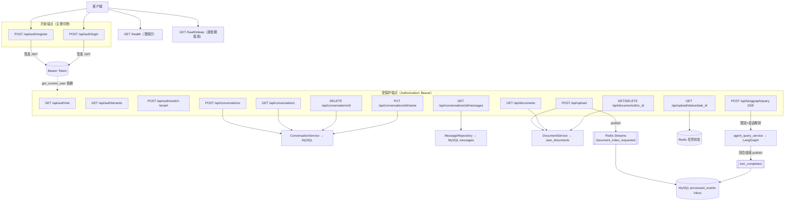
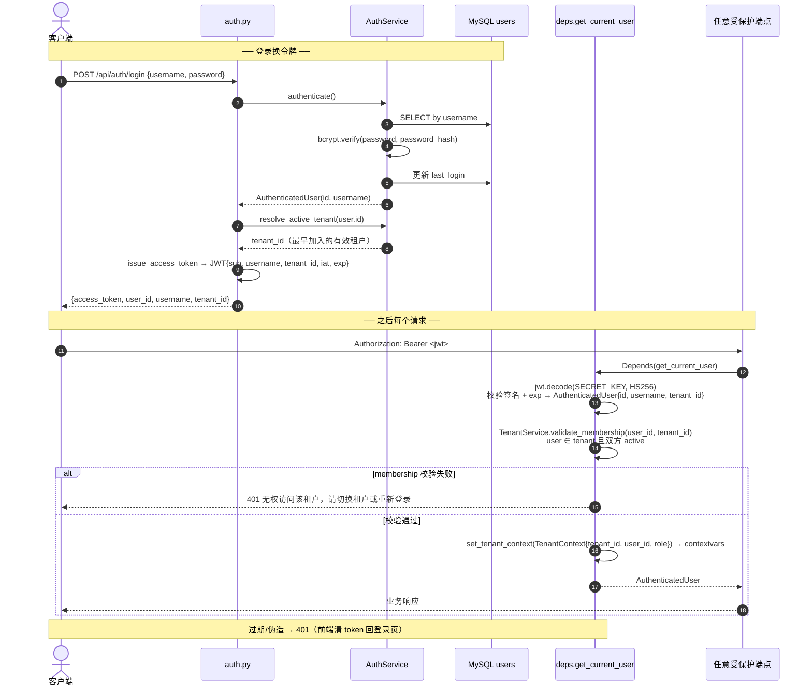
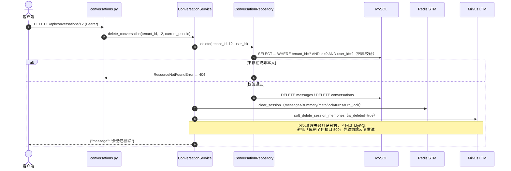
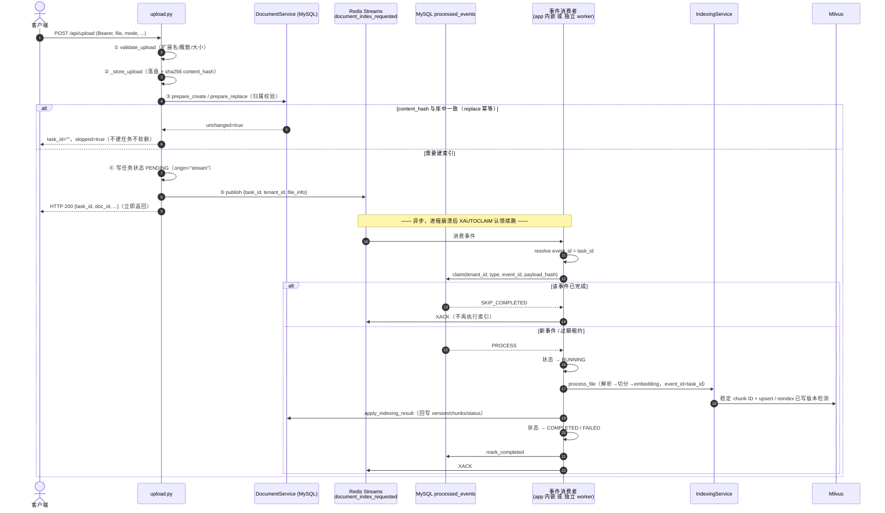
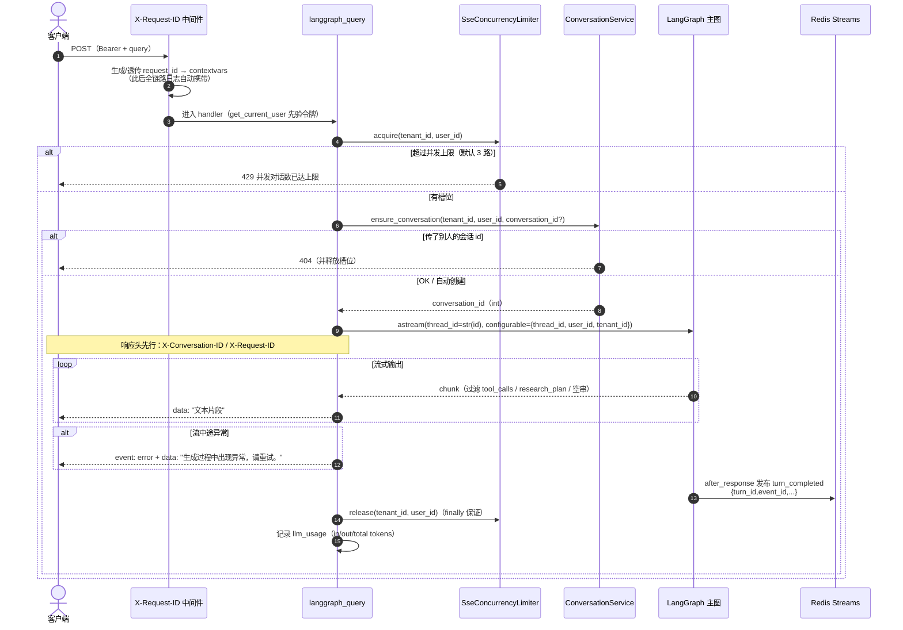

# 02 · API 层全解析（v3.37 对齐版）

> 📖 **函数级明细**：本文末 附录 F · API 层逐函数手册（main.py 与 api/* 每个函数的签名/错误映射/排障速查）。


> **流程图**：[00-全流程图集.md](00-全流程图集.md) §4 会话时序、§5 SSE 问答、§15 上传索引、§31+ 鉴权/事件管线。
> **本文对齐代码版本**：v3.37。所有路径、参数、错误文案均与 `app/api/` 源码逐一核对。

## 0.1 学习导航

**这一章你将学会：**
1. 一个"身份由令牌推导"的 API 层是怎么组织的（对比"自报 user_id"的旧世界）
2. 四类接口契约：鉴权 / 会话+历史 / 文档上传管理 / SSE 流式问答
3. 四个横切机制：统一错误映射（404/500）、并发限流（429）、请求追踪（X-Request-ID）、**请求层幂等（X-Request-ID 去重）**
4. 长耗时任务如何经 Redis Streams 异步化、崩溃可续跑且业务幂等

**前置**：无。这是读整套文档的最佳入口——每个接口背后指向哪个域，本文都给了跳转。

---

## 0.2 API 总览（图）



---

## 1. 定位与完整模块地图

`app/api/` **只做协议层**：解析 HTTP → 验证身份 → 调 application → 转换响应/SSE → 错误映射。
**禁止**：写 SQL、直接调 graph infrastructure、实现检索算法。

在 `main.py`：`app.include_router(api_router, prefix="/api")`；另有 `GET /health`、`GET /health/deep`（不在 `/api` 下）。

### 1.1 树状图

```text
app/
├── main.py                 # 工厂 / health / CORS / lifespan / X-Request-ID 中间件
└── api/
    ├── __init__.py         # api_router 聚合五个子路由
    ├── common.py           # run_api_action（错误映射 404/500）/ MessageResponse
    ├── deps.py             # get_current_user：Bearer → AuthenticatedUser（唯一身份来源）
    ├── auth.py             # 注册 / 登录 / 当前用户 / 租户列表与切换
    ├── conversations.py    # 会话 CRUD + 历史消息
    ├── upload.py           # 上传（→ 事件流索引）+ 任务状态
    ├── documents.py        # 我的文档 列表/详情/删除
    └── langgraph.py        # SSE 问答（限流 + 会话解析 + error 事件）
```

### 1.2 逐文件职责

| 文件 | 用处 |
|---|---|
| `app/api/deps.py` | `get_current_user`：验证 JWT → membership 校验 → `AuthenticatedUser{id, username, tenant_id}`，并把 `TenantContext` 写入 contextvars（供日志/检索分域） |
| `app/api/auth.py` | `POST /auth/register`、`POST /auth/login`、`GET /auth/me`、`GET /auth/tenants`、`POST /auth/switch-tenant` |
| `app/api/common.py` | `run_api_action`：HTTPException 透传 / `ResourceNotFoundError`→404 / 其余→500 |
| `app/api/conversations.py` | 会话五端点 → `conversation_service`（全部按令牌身份做归属） |
| `app/api/upload.py` | 校验/落盘/MySQL 元数据/hash 短路 → **发布索引事件**（失败回退进程内任务） |
| `app/api/documents.py` | `GET /documents`、`GET/DELETE /documents/{doc_id}` |
| `app/api/langgraph.py` | 限流 → 会话解析 → `graph.astream` → SSE（含 `event: error`、usage 日志） |
| `app/main.py` | 应用工厂、CORS、health（浅/深）、X-Request-ID 中间件、lifespan 启停 `AppContainer` |

**直接依赖的 application / platform（不在 api 包内但必知）：**

| 文件 | 被谁调用 |
|---|---|
| `user/application/auth_service.py` | auth 路由 + deps（令牌签发/验证/bcrypt） |
| `chat/application/conversation_service.py` | conversations、langgraph（ensure_conversation） |
| `chat/application/agent_query_service.py` | langgraph 路由 |
| `knowledge/application/document_service.py` | upload / documents 路由 |
| `shared/streams.py` + `platform/events.py` + `platform/event_inbox.py` | Redis Stream 发布/消费、业务 handler 路由，以及 Inbox 认领、完成标记与 ACK 顺序 |
| `shared/background_tasks.py` | 任务状态读写（stream 与回退路径共用协议） |
| `shared/core/rate_limit.py` | langgraph 的每用户并发限流 |

---

## 2. 公共工具与关键函数

### 2.1 `get_current_user`（`deps.py`）—— 一切受保护端点的入口

```python
CurrentUser = Annotated[AuthenticatedUser, Depends(get_current_user)]

@router.get("/conversations")
async def get_my_conversations(current_user: CurrentUser) -> ...:
```

流程摘要：`Authorization: Bearer <jwt>` → JWT 验签 → `validate_membership` 校验
→ `set_tenant_context`。**完整 async 流程见 附录 F.2**（唯一权威版，本节不重复）。

| 失败场景 | 响应 |
|---|---|
| 缺少令牌 | 401 `缺少访问令牌，请先登录` |
| 过期 | 401 `登录已过期，请重新登录` |
| 签名不符/畸形 | 401 `无效的访问令牌` |
| **membership 校验失败**（user ∉ tenant 或任一方 inactive） | 401 `无权访问该租户，请切换租户或重新登录` |

> **教学要点：为什么身份必须从令牌推导？**
> v3.35 之前所有接口接受自报 `user_id`（前端 localStorage 一个数字），
> 服务端全盘信任——归属校验只能防误操作，防不了改个数字冒充别人。
> 令牌由服务端签名，客户端**无法伪造 user_id**；这是其余一切访问控制的前提。
> v3.37 起令牌里的 `tenant_id` 同样不可信——membership 才是租户边界的最终裁判。
> 写入 contextvars 的副产品：日志与 RAG 分域过滤能拿到身份而无需层层传参。

### 2.2 `run_api_action`（`common.py`）—— 统一错误映射

```python
async def run_api_action(action_name, operation, *, logger, **context) -> ApiResult
```

| 异常 | 映射 | 说明 |
|---|---|---|
| `HTTPException` | 原样透传 | handler 自己定的语义（400/401/429…） |
| `ResourceNotFoundError` | **404** | 业务层"不存在/不属于你"，**不打堆栈**（正常控制流） |
| 其余 `Exception` | 500 | `logger.error` 带上下文与堆栈 |

**常见坑**：Service/Repo 层要表达"资源没了"请抛 `ResourceNotFoundError`
（`app/shared/core/errors.py`），抛裸 `ValueError` 会被打成 500——
这正是 v3.34 修掉的历史 bug。

### 2.3 上传私有 helper（`upload.py`）

| 函数 | 职责 |
|---|---|
| `validate_upload` | 扩展名 ∈ `{.pdf,.docx,.md,.markdown}` + content_type 存在，否则 400 |
| `read_upload_content` | 读全文件；超限 400；pdf/docx 魔数校验（md 无魔数） |
| `_store_upload` | 目录 `{UPLOAD_DIR}/{tenant_id}/{user_uuid}/{时间戳}/`（租户隔离，防跨租户路径枚举）；算 `content_hash` |
| `resolve_chunk_visibility` | `(visibility, tenant_id, user_id) -> (owner_id, tenant_id, visibility)`；`global\|tenant\|private` 三值（global 的 owner 取自配置） |
| `_submit_indexing` | **优先发布 Redis Streams 事件**（崩溃可续跑）；`task_id` 同时是稳定事件 ID，失败才回退进程内任务 |

会话/上传/文档接口普遍用 `run_api_action`；SSE **自行 try/except**（见 §8.5）。

---

## 3. 健康检查（浅探针 + 深探针）

| 项 | `GET /health` | `GET /health/deep` |
|---|---|---|
| 用途 | 容器编排高频探活 | 运维排障：是哪个依赖挂了 |
| 检查 | 仅进程/HTTP 栈存活 | MySQL(`SELECT 1`) / Redis(ping) / Milvus(list_collections) / Neo4j(可选) |
| 单项超时 | — | 2s（`asyncio.wait_for`，深探针也不能被挂死的依赖拖住） |
| 响应 | 恒 200 `{"status":"ok"}` | 全绿 200；任一核心依赖故障 **503** + 各组件明细 |
| Neo4j 特殊 | — | 未配置返回 `disabled`，**不**影响整体 ok（可选增强） |

```json
// GET /health/deep 示例（Milvus 故障时，HTTP 503）
{"status": "degraded", "components": {
  "mysql": {"status": "ok"}, "redis": {"status": "ok"},
  "milvus": {"status": "error", "detail": "timeout>2.0s"},
  "neo4j": {"status": "disabled"}}}
```

---

## 4. 鉴权 API

文件：[`app/api/auth.py`](../../app/api/auth.py) ·
服务：[`app/user/application/auth_service.py`](../../app/user/application/auth_service.py) ·
租户：[`app/user/application/tenant_service.py`](../../app/user/application/tenant_service.py)

### 4.1 端点

| 方法 | 路径 | 请求体 | 成功响应 |
|---|---|---|---|
| POST | `/api/auth/register` | `{"username","password"}` | `{access_token, token_type:"bearer", user_id, username, tenant_id}`（注册即登录，自动创建个人租户） |
| POST | `/api/auth/login` | 同上 | 同上（`tenant_id` 为用户最早加入的有效租户） |
| GET | `/api/auth/me` | —（带 Bearer） | `{user_id, username, tenant_id, role}`（前端启动探活令牌用） |
| GET | `/api/auth/tenants` | —（带 Bearer） | `[{tenant_id, tenant_name, role, status}]`（用户全部租户归属） |
| POST | `/api/auth/switch-tenant` | `{"tenant_id"}` | TokenResponse（切换活跃租户后重新签发令牌） |

规则（与 `auth_service.py` 对齐）：

- 用户名 2–50 字符；密码 ≥6 位；违规 → 400
- 用户名占用 → 400 `用户名已被占用`
- 登录失败 → 401 **统一文案**`用户名或密码错误`
  （不区分"用户不存在/密码错"——区分会泄露注册状态，方便撞库）
- 演示种子账号：`demo_user / demo1234`（生产部署删除）
- **多租户鉴权链**（v3.37 起）：JWT 验签 → `tenant_memberships` 校验
  `user ∈ tenant 且双方 active` → 建立 `TenantContext{tenant_id, user_id, role}`
  写入 contextvars；令牌声明的租户不可信，membership 是最终裁判。
  校验失败 → 401 `无权访问该租户，请切换租户或重新登录`。

### 4.2 令牌生命周期（时序图）



### 4.3 密码与令牌的存储事实

| 项 | 实现 | WHY |
|---|---|---|
| 口令哈希 | bcrypt（passlib，自带盐与成本因子） | 数据库泄露也无法还原明文 |
| 令牌算法 | JWT HS256，密钥 `SECRET_KEY`（env） | 无状态验证，不查库 |
| 有效期 | `ACCESS_TOKEN_TTL_SECONDS`（默认 24h） | 过期强制重登 |
| 客户端存放 | `localStorage["ag_token"]` | 无 cookie ⇒ CORS 不需要 credentials |

> **教学要点：为什么 `/auth/me` 值得存在？**
> 前端启动时本地可能有一个"看起来还在"的 token。与其等第一个业务请求 401
> 才发现过期，不如启动先打一次 `/auth/me`——有效则直进工作台并拿到最新
> username，无效则落登录门。一次廉价请求换启动路径的确定性。

---

## 5. 会话 API（含历史消息）

文件：[`app/api/conversations.py`](../../app/api/conversations.py)
（身份一律来自 `CurrentUser`，路径/请求体没有任何 user_id）

### 5.1 端点速览

| 方法 | 路径 | 请求 | 成功响应 |
|---|---|---|---|
| POST | `/api/conversations` | 空 body | `{"conversation_id": 12}` |
| GET | `/api/conversations` | — | `[{id,title,created_at,status,dialogue_type}]`（**过滤默认标题「新会话」**） |
| GET | `/api/conversations/{id}/messages` | — | `[{role,content,created_at}]` 时间正序 |
| PUT | `/api/conversations/{id}/name` | `{"name": "..."}` | `{"message":"会话名称已更新"}` |
| DELETE | `/api/conversations/{id}` | — | `{"message":"会话已删除"}` |

所有按 id 操作：不存在**或不属于当前用户** → 404 `会话不存在或不属于当前用户`
（统一文案，防止用 404/403 差异枚举他人会话 id）。

### 5.2 历史消息端点：双轨中的"给人看"那一轨

`GET /{id}/messages` 读的是 **MySQL `messages` 表**（append-only，由
`turn_completed` 事件消费者写入），与 Redis STM 完全独立：

| | MySQL messages | Redis STM |
|---|---|---|
| 读者 | **人**（前端历史、审计） | **模型**（P0 上下文） |
| 生命周期 | 永久（随会话删除级联） | 16 条窗口 + 24h TTL |
| 本端点 | ✅ 读这里 | ❌ 不暴露 |
| Stream 重放防重 | `(conversation_id, turn_event_id, sender)` 唯一键 | session `turns` 标记 + 原子 `append_turn_once` |

> 产品意义：v3.35 之前消息只在 STM，切回昨天的会话一片空白
> （"隔天失忆"）。现在会话列表承诺的历史真的能兑现。

### 5.3 删除会话：一次删除，四处清理（时序图）



**为什么删除必须做归属校验？** 删除联动清空该会话的 STM/LTM 记忆——
按 id 裸删等于允许任何人清空他人记忆（v3.34 修复的 IDOR）。

---

## 6. 文档上传 API

文件：[`app/api/upload.py`](../../app/api/upload.py)

### 6.1 上传并异步索引

```http
POST /api/upload            （Bearer）
Content-Type: multipart/form-data

file: <binary>
mode: create | replace          # 默认 create
doc_id: <string, optional>      # replace 必填；create 可省略（服务端生成）
visibility: global | tenant | private    # 默认 global；tenant=组织共享；private 仅在分域开关开启后影响检索
```

### 6.2 处理流水线（对齐 v3.35 事件化路径）



> **教学要点：为什么状态里有 `origin="stream"`？**
> 任务状态协议同时服务两条执行通道：事件流（首选）与进程内回退。
> 启动时的孤儿回收会把"别的进程留下的 pending/running"标成
> `interrupted`——但 stream 任务崩溃后会被自动认领**重跑**，标它是误报。
> `origin` 字段就是让孤儿回收认得出"这条不用你管"。

> **幂等边界**：Redis Streams 仍是“至少一次投递”，不能把 `XACK` 当成业务
> 去重。消费者先在 MySQL Inbox 以 `(tenant_id, event_type, event_id)` 认领
> （`task_id` 即 `event_id`，租户是审计/清理/死信的一级维度）；成功后先写
> `completed` 再 `XACK`。若进程恰好在这两个动作之间退出，索引层仍以 `task_id`
> 派生 chunk ID 并使用 Milvus upsert / 版本检测收敛重放。

### 6.3 任务状态查询

```http
GET /api/upload/status/{task_id}     （Bearer）
```

| 状态 | 含义 | 前端动作 |
|---|---|---|
| pending / running | 排队 / 解析索引中 | 继续轮询 |
| completed | 完成，`result` 含 doc_id/version/chunks | 停止轮询 |
| failed | 业务失败，`error` 有原因 | 展示错误 |
| interrupted | **回退通道**的任务随进程消失，不会续跑 | 提示重新上传 |

存储：Redis `tenant:{tenant_id}:task:doc_parse:{task_id}`（租户域隔离），TTL 24h；不存在 → 404。

### 6.4 常见 400

| 条件 | detail |
|---|---|
| 扩展名不支持 | `不支持的文件类型: {ext}` |
| 无 content_type | `无法识别文件类型` |
| 超过大小（默认 50MB） | `文件大小超过限制 ({N}MB)` |
| 魔数不匹配 | `文件内容与扩展名不匹配: {ext}`（pdf=`%PDF`，docx=`PK\x03\x04`） |
| mode 非法 | `mode 仅支持 create 或 replace` |
| visibility 非法 | `visibility 仅支持 global、tenant 或 private` |
| replace 无 doc_id | `replace 模式必须提供 doc_id…` |
| replace 非本人文档 | `文档不存在或不属于当前用户: {doc_id}` |

---

## 7. 文档管理 API

文件：[`app/api/documents.py`](../../app/api/documents.py)

| 方法 | 路径 | 说明 |
|---|---|---|
| GET | `/api/documents` | 我的文档列表（doc_id/title/version/status/chunk_count） |
| GET | `/api/documents/{doc_id}` | 单条元信息；非本人 404 |
| DELETE | `/api/documents/{doc_id}` | MySQL 删行 + Milvus 软删该 doc_id 全部 chunk；返回 `soft_deleted_chunks` |

> **语义提醒**：列表是"**上传管理**视角"（谁能替换/删除）。知识库检索默认
> 全局共享——你上传的文档所有用户都检索得到，传错请立刻 DELETE 撤下
> （软删后检索立即排除）。私有域见 05 文档 C6.5。

---

## 8. LangGraph 问答 API（SSE）

文件：[`app/api/langgraph.py`](../../app/api/langgraph.py)

### 8.1 请求

```http
POST /api/langgraph/query        （Bearer）
Content-Type: multipart/form-data

query=<用户问题>
conversation_id=<int, 可选>
```

| 参数 | 必填 | 说明 |
|---|---|---|
| `query` | 是 | 用户自然语言 |
| `conversation_id` | 否 | **必须是自己的会话 id**（否则 404）；缺省服务端自动创建 |

### 8.2 全链路（时序图）



### 8.3 响应

| 项 | 值 |
|---|---|
| Content-Type | `text/event-stream` |
| Header | `X-Conversation-ID`（续聊键）、`X-Request-ID`（排障键） |
| 正常帧 | `data: "文本片段"\n\n`（JSON 字符串） |
| 错误帧 | `event: error\ndata: "..."\n\n`（流开始后无法再改 HTTP 状态码） |
| 流前失败 | 401（令牌）/ 404（会话归属）/ 429（并发）/ 500 |

### 8.4 会话标识（v3.35 唯一化后的简单世界）

```text
thread_id ≡ str(conversation_id) ≡ STM/LTM 的 session_id
```

服务端是唯一的 id 来源：传 id 必须归属校验，不传就创建。
从此不存在"uuid 孤儿线程的记忆无法被会话删除清理"的问题。
前端唯一要做的：把响应头 `X-Conversation-ID` 存下来续聊。

### 8.5 为什么 SSE 不用 `run_api_action`？

流一旦开始，HTTP 200 已经发出——中途异常**无法**再变成 5xx。
统一包装器只会在"流创建前"有用。所以 SSE 分两段处理：
流前异常走正常 HTTP 状态码；流中异常在 generator 里捕获并发
`event: error` 帧（否则客户端只看到连接静默断掉，无从区分
"生成完了"和"后端炸了"）。

---

## 9. 跨 API 的安全机制（v3.37 现状）

| 项 | 现状 |
|---|---|
| 用户鉴权 | **JWT Bearer**（HS256 + bcrypt）；身份不可自报 |
| 资源授权 | 会话/文档全部按令牌身份归属校验；不存在与非本人统一 404 防枚举 |
| 限流 | SSE 并发限流**双层**：租户级 `sse_max_concurrent_per_tenant`（默认 0=不启用）+ 用户级（默认 3）；Redis 计数 + TTL 兜底；限流器故障放行 |
| 上传 | 扩展名 + MIME + 大小 + 魔数 |
| Prompt 注入 | graph 决策节点 `wrap_user_message`（XML+escape）+ Guardrails + Cypher 禁写 |
| CORS | origins=`*`，**credentials=False**（无 cookie；规范禁止 `*`+credentials） |
| 可追踪性 | `X-Request-ID` 贯穿全链路日志 |
| 请求幂等 | **`X-Request-ID` 去重**（v3.37）：`POST /conversations`、`POST /upload` 重复请求返回首次缓存响应；`POST /langgraph/query`（SSE 不可重放）重复一律 409；无头放行兼容老客户端。表 `request_idempotency`，键 `(user_id, request_id)` |
| 生产前仍需 | SECRET_KEY 换强随机值、删种子用户、CORS 白名单、HTTPS 终止 |

---

## 10. 接口一览表

| 方法 | 路径 | 鉴权 | 同步/异步 | 下游 |
|---|---|---|---|---|
| GET | `/health` | 无 | 同步 | 无 |
| GET | `/health/deep` | 无 | 同步(2s/项) | MySQL+Redis+Milvus+Neo4j 探测 |
| POST | `/api/auth/register` | 无 | 同步 | MySQL users |
| POST | `/api/auth/login` | 无 | 同步 | MySQL users |
| GET | `/api/auth/me` | Bearer | 同步 | 验令牌 + membership 校验 |
| GET | `/api/auth/tenants` | Bearer | 同步 | MySQL tenant_memberships（全部归属） |
| POST | `/api/auth/switch-tenant` | Bearer | 同步 | MySQL tenant_memberships + 重签令牌 |
| POST | `/api/conversations` | Bearer | 同步 | MySQL |
| GET | `/api/conversations` | Bearer | 同步 | MySQL |
| GET | `/api/conversations/{id}/messages` | Bearer | 同步 | MySQL messages |
| DELETE | `/api/conversations/{id}` | Bearer | 同步 | MySQL + Redis STM + Milvus LTM |
| PUT | `/api/conversations/{id}/name` | Bearer | 同步 | MySQL |
| POST | `/api/upload` | Bearer | **事件异步** | MySQL + Redis Streams → 索引 |
| GET | `/api/upload/status/{task_id}` | Bearer | 同步 | Redis 任务状态 |
| GET | `/api/documents` | Bearer | 同步 | MySQL user_documents |
| GET | `/api/documents/{doc_id}` | Bearer | 同步 | MySQL user_documents |
| DELETE | `/api/documents/{doc_id}` | Bearer | 同步 | MySQL 删行 + Milvus 软删 |
| POST | `/api/langgraph/query` | Bearer | SSE 长连接 | 限流 + LangGraph 全栈 + `turn_completed` 事件发布 |

---

## 11. 面试时怎么讲 API 层

1. **信任边界清晰**：身份只来自 JWT；`get_current_user` 是唯一入口，业务层拿到的 user_id 天然可信。
2. **分层克制**：API 只做协议转换与错误映射；SQL、检索、图编排都不在这层。
3. **错误语义分级**：401（身份）/ 404（归属，统一文案防枚举）/ 429（并发护栏）/ 500（真异常，带 request_id 可追）。
4. **长耗时事件化**：上传立即返回 task_id，索引经 Redis Streams 执行；Inbox
   与 task_id/Milvus 落点共同抵抗 ACK 前重放——既能续跑，也不会重复索引。
5. **流式契约完整**：SSE 除了 data 帧还有 error 帧；响应头前置回传会话键与追踪键。

### 面试式追问

**Q1. 为什么 SSE 问答不用普通 JSON 接口？**
模型输出天然流式，SSE 首 token 更快；`X-Conversation-ID` 在响应头即刻可读，续聊不用等 body。

**Q2. 令牌过期用户正在流式对话会怎样？**
验令牌发生在流开始前——流中不再验。已建立的流不受影响；下一次请求 401，前端清 token 回登录页。

**Q3. 为什么 404 不区分"不存在"和"不是你的"？**
区分就等于提供了"探测他人资源 id 是否存在"的 oracle。统一 404 让枚举无收益。

**Q4. 上传接口返回成功，文档就能检索到了吗？**
不能。返回只代表校验+落盘+事件已投递；解析/切分/向量化在消费者里异步进行，以 `status=completed` 为准。

**Q5. `/health` 全绿但用户报错，第一步看什么？**
`/health/deep` 定位哪个依赖故障；再拿用户报错响应头里的 `X-Request-ID` 去日志串完整链路。

**Q6. 限流器 Redis 挂了会拒绝所有请求吗？**
不会，fail-open：护栏自身故障时放行并告警。护栏的可用性不能高于被保护的功能。

---

## 12. 下一步

- 主图内部节点与会话 Service → [03-对话与Agent主图.md](03-对话与Agent主图.md)
- 记忆读写与写扩散/读扩散 → [04-记忆系统.md](04-记忆系统.md) §2.5
- 上传后的解析与索引 → [05-知识检索与文档解析.md](05-知识检索与文档解析.md)
- 鉴权服务实现（bcrypt/JWT） → [06-用户与画像.md](06-用户与画像.md)

---

## 附录 · API 调用示例全集（联调/自测）

> Base：`http://localhost:8000`。需栈已 `docker compose up`。
> **先拿令牌，后面所有请求带 `-H "Authorization: Bearer $TOKEN"`。**

## E0. 登录拿令牌

```bash
# 演示账号（或先 register）
TOKEN=$(curl -s -X POST http://localhost:8000/api/auth/login \
  -H 'Content-Type: application/json' \
  -d '{"username":"demo_user","password":"demo1234"}' \
  | python -c 'import sys,json;print(json.load(sys.stdin)["access_token"])')

curl -s http://localhost:8000/api/auth/me -H "Authorization: Bearer $TOKEN"
# {"user_id": 3, "username": "demo_user", "tenant_id": "t_xxxx", "role": "owner"}

# 我的租户列表 / 切换活跃租户（重新签发令牌）
curl -s http://localhost:8000/api/auth/tenants -H "Authorization: Bearer $TOKEN"
# [{"tenant_id": "t_xxxx", "tenant_name": "…", "role": "owner", "status": "active"}]

curl -s -X POST http://localhost:8000/api/auth/switch-tenant \
  -H "Authorization: Bearer $TOKEN" -H 'Content-Type: application/json' \
  -d '{"tenant_id":"<目标租户>"}'
# {access_token, token_type, user_id, username, tenant_id}（新令牌）
```

## E1. 健康检查

```bash
curl -s http://localhost:8000/health          # {"status":"ok"}
curl -s http://localhost:8000/health/deep     # 各依赖明细；故障时 HTTP 503
```

## E2. 会话

```bash
# 创建（空 body）
curl -s -X POST http://localhost:8000/api/conversations \
  -H "Authorization: Bearer $TOKEN"
# {"conversation_id": 12}

# 我的列表（排除标题仍为「新会话」的）
curl -s http://localhost:8000/api/conversations -H "Authorization: Bearer $TOKEN"

# 历史消息（MySQL 持久化，切回旧会话可见）
curl -s http://localhost:8000/api/conversations/12/messages \
  -H "Authorization: Bearer $TOKEN"

# 改名
curl -s -X PUT http://localhost:8000/api/conversations/12/name \
  -H "Authorization: Bearer $TOKEN" -H 'Content-Type: application/json' \
  -d '{"name":"保修咨询"}'

# 删除（清 MySQL/STM/LTM；非本人 404）
curl -s -X DELETE http://localhost:8000/api/conversations/12 \
  -H "Authorization: Bearer $TOKEN"
```

## E3. 上传与轮询

```bash
curl -s -X POST http://localhost:8000/api/upload \
  -H "Authorization: Bearer $TOKEN" \
  -F 'file=@./售后手册.pdf;type=application/pdf'
# {task_id, doc_id, ...}；重复上传同内容（replace）会 skipped=true

curl -s http://localhost:8000/api/upload/status/<task_id> \
  -H "Authorization: Bearer $TOKEN"
# status: pending|running|completed|failed|interrupted

# 文档管理
curl -s http://localhost:8000/api/documents -H "Authorization: Bearer $TOKEN"
curl -s -X DELETE http://localhost:8000/api/documents/<doc_id> \
  -H "Authorization: Bearer $TOKEN"
```

## E4. SSE 问答

```bash
# 新会话（不传 conversation_id，服务端自动创建）
curl -N -X POST http://localhost:8000/api/langgraph/query \
  -H "Authorization: Bearer $TOKEN" \
  -F 'query=智能门锁保修多久' -D - -o /tmp/sse.txt
# 响应头含 X-Conversation-ID 与 X-Request-ID

# 续聊同一会话
curl -N -X POST http://localhost:8000/api/langgraph/query \
  -H "Authorization: Bearer $TOKEN" \
  -F 'query=那电池怎么换' \
  -F 'conversation_id=<上一步的 X-Conversation-ID>'
```

## E5. OpenAPI

浏览器：`http://localhost:8000/docs`（Authorize 按钮粘贴 token 即可试受保护接口）

## E6. 常见联调错误

| 现象 | 原因 |
|---|---|
| 401 缺少访问令牌 | 忘带 `Authorization: Bearer`；或 token 过期/被清 |
| 404 会话不存在或不属于当前用户 | id 打错，或试图操作他人会话（防枚举统一文案） |
| 429 | 同一用户并发 SSE 超过上限（默认 3 路） |
| 列表看不到刚建会话 | 标题仍是「新会话」，被 list 过滤（发首条消息后前端会改名） |
| 上传 400 | 扩展名 / 魔数 / 大小 / visibility 取值 |
| status 一直 pending | 消费者未运行（内嵌被关且没起 worker）/ 解析卡住 |
| status 变 interrupted | **回退通道**任务随进程消失；stream 通道会自动续跑不出现此态 |
| SSE 无输出 | 全是 tool/research_plan 被过滤；拿 X-Request-ID 查后端日志 |
| SSE 收到 `event: error` | 流中途后端异常；已生成内容有效，整条重试即可 |

---

## 附录 F · 函数手册：API 层逐函数明细

> 签名与源码逐字一致（v3.37）。📌=热路径 ⚠️=历史踩坑。
> 共享依赖（run_blocking/log_degradation 等）见 [01 附录 A](01-系统总览.md)。

### F.1 `app/main.py`

| 函数 | 签名 | 要点 |
|---|---|---|
| `warm_up_runtime_resources` | `async (runtime_logger) -> None` | lifespan 里预热 MemoryMiddleware，首请求不吃初始化延迟 |
| `close_runtime_resources` | `async () -> None` | 即 `reset_container()`（关闭全部外部连接） |
| `build_lifespan` | `(runtime_logger, *, warm_up=…, close_runtime=…)` | 返回 asynccontextmanager：build 容器→set→warm_up→start_background_jobs（FakeContainer 无此方法则跳过）→yield→close。warm_up/close 可注入，测试替换 |
| `configure_cors` | `(app, *, allow_origins, allow_methods, allow_headers)` | ⚠️ credentials=False：规范禁止 `*`+credentials；expose `X-Conversation-ID` |
| 📌 `register_middleware` | `(app, runtime_logger, *, clock=time.time)` | `log_requests`：取/造 request_id → contextvars → 调用链 → 响应头回写 + 一行访问日志（方法/路径/状态/耗时ms）。clock 可注入测耗时 |
| `register_routes` | `(app, *, app_api_router, health_status)` | 挂 `/api` + `/health`（浅）+ `/health/deep`（内联调 run_deep_health_check，degraded→503） |
| `register_static_files` | `(app, *, static_dir, runtime_logger)` | 目录存在才挂载（前端独立部署时跳过） |
| `create_app` | `(*, runtime_logger=…, app_api_router=…, static_dir=…, health_status=…) -> FastAPI` | 装配序：lifespan→CORS→中间件→路由→静态。全参可注入=可测工厂 |

### F.2 `app/api/deps.py`

#### 📌 `def get_current_user(credentials: Annotated[HTTPAuthorizationCredentials | None, Depends(_bearer_scheme)]) -> AuthenticatedUser`

- `_bearer_scheme = HTTPBearer(auto_error=False)`：缺头时**自己**给中文
  401（框架默认是 403 且无文案控制）
- async 流程：无凭据→401「缺少访问令牌，请先登录」→ `verify_access_token`
  抛 `AuthError`→401（过期/伪造各自文案）+ `WWW-Authenticate: Bearer` →
  `tenant_service.validate_membership(user_id, tenant_id)`（user ∈ tenant
  且双方 active；返回 None→401「无权访问该租户，请切换租户或重新登录」）→
  `set_tenant_context(TenantContext{tenant_id, user_id, role})`（contextvars，
  供日志/检索分域）→ 返回 `AuthenticatedUser{id, username, tenant_id}`
- `CurrentUser = Annotated[AuthenticatedUser, Depends(get_current_user)]`
  ——业务 handler 的唯一身份入口；**任何 handler 不得再收 user_id/tenant_id 参数**

### F.3 `app/api/common.py`

| 函数 | 签名 | 要点 |
|---|---|---|
| `build_message_response` | `(message: str) -> MessageResponse` | `{"message": str}` |
| 📌 `run_api_action` | `async (action_name, operation: Awaitable, *, logger, **context) -> ApiResult` | 异常映射：HTTPException 透传；ResourceNotFoundError→404（**不打堆栈**，正常控制流）；其余→error 日志(带 format_log_context 上下文+堆栈)+500。⚠️ operation 是**已构造协程**不是函数引用 |

### F.4 `app/api/auth.py`

| 函数 | 签名 | 错误映射 |
|---|---|---|
| `_token_response` | `(user_id, username, tenant_id) -> TokenResponse` | 组装 `{access_token, token_type:"bearer", user_id, username, tenant_id}`；JWT 携带 `tenant_id` claim |
| `register` | `async (request: CredentialsRequest) -> TokenResponse` | RegistrationError→400（占用/不合规）；注册即登录，自动创建个人租户 |
| `login` | `async (request) -> TokenResponse` | AuthError→401 统一「用户名或密码错误」（防撞库探测）；tenant_id 取最早加入的有效租户 |
| `me` | `async (current_user: CurrentUser) -> ProfileResponse` | 前端启动探活；经 get_current_user 已完成 membership 校验；返回 `{user_id, username, tenant_id, role}` |
| `list_tenants` | `async (current_user: CurrentUser) -> list[TenantItem]` | 列出全部租户归属 `{tenant_id, tenant_name, role, status}` |
| `switch_tenant` | `async (request: SwitchTenantRequest, current_user) -> TokenResponse` | 切换活跃租户后重新签发令牌（新 token 携带新 tenant_id） |

### F.5 `app/api/conversations.py`

五个 handler 全部 `CurrentUser` 注入 + `run_api_action` 包装：

| handler | 转发 | 归属失败 |
|---|---|---|
| `create_conversation()` | `service.create_conversation(tenant_id, uid)` | — |
| `get_my_conversations()` | `service.get_user_conversations(tenant_id, uid)`（过滤「新会话」默认标题） | — |
| `get_conversation_messages(conversation_id)` | `service.list_messages(tenant_id, cid, uid)`——**先归属校验再读 MySQL messages** | 404 |
| `delete_conversation(conversation_id)` | `service.delete_conversation(tenant_id, cid, uid)`（MySQL+STM+LTM 四处清理） | 404 |
| `update_conversation_name(conversation_id, request)` | `service.update_conversation_name(tenant_id, cid, uid, name)` | 404 |

### F.6 `app/api/upload.py`

| 函数 | 签名 | 要点 |
|---|---|---|
| `_document_magic_signatures` | `(extension) -> tuple[bytes, ...]` | `.pdf→(%PDF,)`、`.docx→(PK\x03\x04,)`；md 空元组 |
| `_optional_str` | `(value) -> str \| None` | strip 后空→None |
| `_require_doc_id` | `(file_info) -> str` | 注册元数据后 doc_id 必在；缺失=内部错误 500 |
| `validate_upload` | `(file: UploadFile) -> None` | 扩展名白名单 + content_type 存在；400 |
| `read_upload_content` | `async (file, *, max_upload_size_bytes, file_size_exceeded_detail, content_extension_mismatch_detail) -> bytes` | 读全量→限长→魔数前缀校验；文案参数化便于测试 |
| `_normalize_upload_mode` | `(mode) -> str` | 复用领域层 `normalize_upload_mode` 唯一实现，仅把 ValueError 翻 400（⚠️ 曾两处各写一份会分叉） |
| `_store_upload` | `async (file, user_id, tenant_id, *, doc_id=None, mode='create') -> StoredUploadFileInfo` | 目录 `{UPLOAD_DIR}/{tenant_id}/{user_uuid}/{ts}/`（租户隔离）；sha256 content_hash；⚠️ UPLOAD_DIR 必须绝对路径且对齐卷挂载点 |
| `_register_document_metadata` | `async (file_info) -> StoredUploadFileInfo` | create→prepare_create / replace→prepare_replace（租户+归属+hash 幂等）；ValueError→400；unchanged 时带回 version/chunk_count |
| `resolve_chunk_visibility` | `(visibility, tenant_id, user_id) -> tuple[str, str, str]` | 返回 `(owner_id, tenant_id, visibility)`：global→`(global_owner, "", "global")`（与检索过滤同源）；tenant→`("", tenant_id, "tenant")`；private→`(str(user_id), tenant_id, "private")`；非法 400 `visibility 仅支持 global、tenant 或 private` |
| 📌 `_submit_indexing` | `async (file_info: dict) -> str` | **get_container_if_initialized 机会型访问**：容器在→写 PENDING(origin="stream", tenant_id)+发布携带 `task_id/tenant_id` 的事件；消费者将其解析为 `event_id` 后由 Inbox 认领。否则/失败→回退 task_manager.submit。返回 12 位 task_id |
| 📌 `_run_upload` | `async (file, user_id, tenant_id, doc_id, mode, visibility='global') -> UploadAcceptedResponse` | 主编排：校验→resolve_chunk_visibility→落盘→注册元数据→unchanged 短路（task_id=""）→提交→bind_task_id |
| `upload_file` | handler | CurrentUser 提供 user_id/tenant_id（**不信任客户端自报租户**）；run_api_action 包装 |
| `get_upload_status / _run_get_upload_status` | `async (task_id, tenant_id)` | 经 `task_manager.get_status(task_id, tenant_id=...)` 读**租户域**状态；None→404「任务不存在」。需登录；task_id 在租户内随机不可枚举故暂不做归属绑定 |

### F.7 `app/api/documents.py`

| handler | 转发 | 要点 |
|---|---|---|
| `list_my_documents()` | `document_service.list_user_documents(tenant_id, uid)` | 上传管理视角（检索是全局的） |
| `get_my_document(doc_id)` | `get_user_document(tenant_id, uid, doc_id)`；None→404 | |
| `delete_my_document(doc_id)` | `delete_document(tenant_id, uid, doc_id)` | MySQL 删行+Milvus 软删；响应带 `soft_deleted_chunks` |

### F.8 `app/api/langgraph.py`

| 函数 | 签名 | 要点 |
|---|---|---|
| `format_sse_data` | `(payload) -> str` | `data: {json}\n\n` |
| `format_sse_error` | `(message) -> str` | `event: error\ndata: {json}\n\n`——流开始后无法再改 HTTP 状态码，必须帧内表达错误 |
| `_chunk_tags` | `(metadata) -> list[str]` | 容错提取字符串 tags |
| 📌 `_should_emit_sse_chunk` | `(chunk, metadata) -> bool` | 过滤：空 content / additional_kwargs.tool_calls / tags 含 research_plan（内部规划不外泄） |
| `_merge_usage` | `(total: dict, chunk) -> None` | 累计 usage_metadata 的 in/out/total（模型不上报则保持空） |
| `_get_sse_limiter` | `async () -> limiter \| None` | 机会型取容器限流器；None=放行（测试/未初始化） |
| 📌 `langgraph_query` | `async (current_user, query=Form, conversation_id: int\|None=Form) -> StreamingResponse` | 顺序：**limiter.acquire(tenant_id, user_id)**（在会话解析前，429 不留空会话行） → ensure_conversation(tenant_id, user_id, conversation_id)（404 时释放槽位）→ thread=str(id) → astream(configurable={thread_id, user_id, tenant_id}) → 流内 try/except 发 error 帧 → finally release(tenant_id, user_id)+usage 日志。响应头 X-Conversation-ID 于流开始前写入 |

### F.9 面向排障的函数级速查

| 症状 | 看哪个函数 |
|---|---|
| 全部 401 | `deps.get_current_user`（SECRET_KEY 是否与签发端一致） |
| 上传后永远 pending | `_submit_indexing`（事件是否投递成功）→ events.handle_document_index_requested |
| 上传/重放后 chunk 重复 | `processed_events` 是否 completed、`task_id` 是否被解析并透传为 `event_id`、Milvus chunk_id 是否为 `evt_{task_id}_*` |
| SSE 只断流无错误帧 | `langgraph_query` 内层 except 是否被改掉 |
| 删除报 500 而非 404 | Service/Repo 是否抛了裸异常而非 ResourceNotFoundError |
