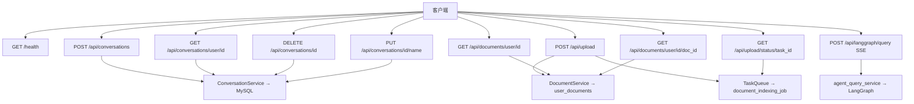
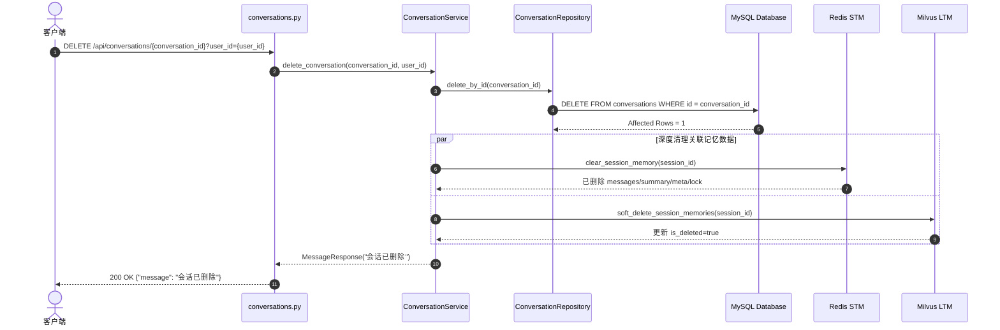

# 02 · API 层全解析

> **流程图**：[00-全流程图集.md](00-全流程图集.md) §4 会话时序、§5 SSE 问答、§15 上传索引。

## 0. API 总览（图）



## 1. 定位与完整模块地图

`app/api/` **只做协议层**：解析 HTTP → 调 application → 转换响应/SSE → 错误包装。  
**禁止**：写 SQL、直接调 graph infrastructure、实现检索算法。

在 `main.py`：`app.include_router(api_router, prefix="/api")`；另有 `GET /health`（不在 `/api` 下）。

### 1.1 树状图

```text
app/
├── main.py                 # 工厂 /health / CORS / lifespan
└── api/
    ├── __init__.py         # api_router 聚合子路由
    ├── common.py           # run_api_action / MessageResponse
    ├── conversations.py    # 会话 CRUD HTTP
    ├── upload.py           # 上传 + 任务状态（create/replace + MySQL 元数据）
    ├── documents.py        # 用户文档列表/详情
    └── langgraph.py        # SSE 问答
```

### 1.2 逐文件职责

| 文件 | 用处 |
|---|---|
| `app/api/__init__.py` | 创建 `api_router`，`include_router` 三个子路由 |
| `app/api/common.py` | `run_api_action`、`build_message_response`、`MessageResponse`、500 文案常量 |
| `app/api/conversations.py` | `POST/GET/DELETE/PUT` 会话接口 → `conversation_service` |
| `app/api/upload.py` | `validate_upload` / `read_upload_content` / `_store_upload` / `upload_file` / `get_upload_status` |
| `app/api/langgraph.py` | `langgraph_query` Form+SSE，调 `stream_agent_query`，设 `X-Conversation-ID` |
| `app/main.py` | 应用工厂、CORS、health、挂载 api、lifespan 启停 `AppContainer` |

**直接依赖的 application（不在 api 包内但必知）：**

| 文件 | 被谁调用 |
|---|---|
| `chat/application/conversation_service.py` | conversations 路由 |
| `chat/application/agent_query_service.py` | langgraph 路由 |
| `knowledge/application/indexing_service.py` | upload 提交的后台任务 |
| `shared/background_tasks.py` | upload 提交/查状态 |

---

## 2. 公共工具与关键函数

### 2.1 `run_api_action`

**文件：** `app/api/common.py`

**作用：** 统一执行 API 异步动作；业务 `HTTPException` 原样抛出；其它异常记日志并转 **HTTP 500**。

**签名：**

```python
async def run_api_action(
    action_name: str,
    operation: Awaitable[ApiResult],
    *,
    logger: logging.Logger,
    **context: object,
) -> ApiResult
```

| 参数 | 说明 |
|---|---|
| `action_name` | 日志动作名，如 `"upload_file"`、`"delete_conversation"` |
| `operation` | **已构造的协程对象**（`await operation`），不是函数引用 |
| `logger` | 模块 logger |
| `**context` | 写入 `format_log_context` 的键值（user_id、filename…） |

| 返回 | 成功时 `operation` 的返回值 |
|---|---|
| 错误 | `HTTPException` 透传；其它 → 500，`detail="Internal server error"` |

**常见坑：** 业务要 4xx 必须 `raise HTTPException`；`raise ValueError` 会被打成 500。

### 2.2 `build_message_response`

```python
def build_message_response(message: str) -> MessageResponse  # {"message": str}
```

删除/改名成功时的轻量响应。

### 2.3 上传私有 helper（`upload.py`）

#### `validate_upload(file: UploadFile) -> None`

- 扩展名 ∈ `{.pdf,.docx,.md,.markdown}`（`supports_document_indexing`）
- 必须有 `content_type`
- 失败：`HTTP 400`

#### `read_upload_content(file, *, max_upload_size_bytes, ...) -> bytes`

- 读全文件；超限 → 400  
- pdf/docx 做魔数前缀校验；**md 无魔数**  

#### `_store_upload(file, user_id) -> StoredUploadFileInfo`

- 目录 `uploads/{uuid5(user_id)}/{timestamp}/`  
- 返回 path / size / original_name 等元信息  

会话与上传接口普遍用 `run_api_action`；LangGraph SSE **自行 try/except**（流式场景不宜统一包装）。

---

## 3. 健康检查

| 项 | 值 |
|---|---|
| 方法/路径 | `GET /health` |
| 实现 | `main.register_routes` 内联 |
| 响应 | `{"status": "ok"}` |
| 用途 | Compose healthcheck / 探活 |

**注意：** 健康检查**不**探测 MySQL/Redis/Milvus 是否可用，只表示进程与 HTTP 栈存活。

---

## 4. 会话 API

文件：[`app/api/conversations.py`](../../app/api/conversations.py)  
服务：`app.chat.application.conversation_service.conversation_service`

### 4.1 创建会话

```http
POST /api/conversations
Content-Type: application/json

{"user_id": 1}
```

| 项 | 说明 |
|---|---|
| 成功响应 | `{"conversation_id": <int>}` |
| 调用链 | API → `ConversationService.create_conversation` → `ConversationRepository.create` → MySQL |
| 副作用 | 插入 `conversations` 行（默认标题等由 repository/model 决定） |

### 4.2 用户会话列表

```http
GET /api/conversations/user/{user_id}
```

| 项 | 说明 |
|---|---|
| 成功响应 | `ConversationSummary[]`：`id/title/created_at/status/dialogue_type` |
| 过滤逻辑 | 由 repository 决定（例如过滤默认标题会话） |

### 4.3 删除会话



| 项 | 说明 |
|---|---|
| 必填参数 | query `user_id` —— **归属校验**（v3.34.0 起）：会话必须属于该用户，否则 404。删除会联动清空该会话 STM/LTM 记忆，绝不允许按 id 裸删他人会话 |
| 成功响应 | `{"message": "会话已删除"}` |
| 不存在/非本人 | **404** `会话不存在或不属于当前用户`（统一文案防 id 枚举；此前误报 500） |
| 调用链 | API → `ConversationService.delete_conversation` → Repository 删 MySQL → 清理 Redis STM / Milvus LTM |
| 清理范围 | 1) MySQL `conversations` 元信息<br>2) MySQL 历史 `messages` 表（若存在，兼容清理）<br>3) Redis STM：`messages/summary/meta/lock`（按 tenant/user/session）<br>4) Milvus LTM：`session_id` 匹配的长期记忆软删除（`is_deleted=true`） |
| 失败策略 | MySQL 删除成功后，记忆清理失败只记日志、不回滚会话删除，避免前端反复 500 |
| 边界 | 历史未写入 `session_id` 的 LTM 记录不会被会话删除命中（防止误删跨会话记忆） |

### 4.4 重命名会话

```http
PUT /api/conversations/{conversation_id}/name
Content-Type: application/json

{"user_id": 1, "name": "新标题"}
```

| 项 | 说明 |
|---|---|
| 必填字段 | `user_id` —— 归属校验（v3.34.0 起），不符返回 404 |
| 成功响应 | `{"message": "会话名称已更新"}` |
| 不存在/非本人 | **404**（此前误报 500） |

### 4.5 错误行为

- Service/DB 异常 → `run_api_action` 记录 error 日志并转 500（或透传已有 HTTPException）  
- 无鉴权中间件：`user_id` 由调用方信任传入（当前版本安全模型）  

---

## 5. 文档上传 API

文件：[`app/api/upload.py`](../../app/api/upload.py)

### 5.1 上传并异步索引

```http
POST /api/upload
Content-Type: multipart/form-data

file: <binary>
user_id: <int>
mode: create | replace          # 默认 create
doc_id: <string, optional>      # replace 必填；create 可省略（服务端生成）
```

#### 处理步骤（非常重要，对齐 `app/api/upload.py`）

```mermaid
sequenceDiagram
    autonumber
    actor Client as 客户端 (Vue3/curl)
    participant API as upload.py (POST /api/upload)
    participant DocSvc as DocumentService (MySQL)
    participant TaskQ as TaskQueue (Redis)
    participant Indexer as IndexingService (Background)
    participant Parser as doc_parser Pipeline
    participant Milvus as Milvus Vector Store

    Client->>API: POST /api/upload (file, user_id, mode, doc_id)
    API->>API: 1. validate_upload (扩展名/魔数校验)
    API->>API: 2. _store_upload (计算 content_hash & 落盘)
    API->>DocSvc: 3. prepare_create / prepare_replace
    
    alt 内容未发生变化 (content_hash 一致)
        DocSvc-->>API: unchanged=true (跳过 reindex)
        API-->>Client: 返回 task_id="", skipped=true
    else 需建索引 (新文件/变更文件)
        DocSvc-->>API: mark indexing (MySQL user_documents)
        API->>TaskQ: task_manager.submit(run_document_indexing_job)
        TaskQ-->>API: 返回 12位 Hex task_id
        API-->>Client: HTTP 200 (task_id, doc_id, filename)
        
        async Background Indexing
        TaskQ->>Indexer: run_document_indexing_job(file_info)
        Indexer->>Parser: parse_document(file_path)
        Parser-->>Indexer: 返回分块数据 Chunks
        Indexer->>Milvus: HybridSearcher.index / reindex (软删旧版+写新版)
        Milvus-->>Indexer: 向量构建完成
        Indexer->>DocSvc: apply_indexing_result(status=SUCCESS)
        DocSvc->>DocSvc: 更新 MySQL user_documents 为 active
        TaskQ->>TaskQ: 更新 TaskStatus 为 COMPLETED
    end
```

```text
1. validate_upload
   - 扩展名必须 .md / .markdown / .pdf / .docx
   - content_type 必须存在
2. _store_upload
   - user_uuid = uuid5(NAMESPACE_DNS, f"user_{user_id}")
   - 目录 uploads/{user_uuid}/{YYYYMMDD_HHMMSS}/
   - 读文件全部内容到内存
   - 大小 ≤ settings.app_config.upload.max_upload_size_mb（默认 50MB）
   - 魔数校验：
       .pdf  → 以 %PDF 开头
       .docx → 以 PK\x03\x04 开头（zip）
       .md / .markdown → 无魔数（纯文本，不校验签名）
   - content_hash = sha256(content)
   - 落盘 write_bytes
3. _register_document_metadata → DocumentService
   - create：prepare_create → MySQL user_documents pending + 分配/校验 doc_id
   - replace：prepare_replace → 归属校验
       · 若 content_hash 与库中一致 → unchanged=true，**不提交任务**
       · 否则 mark indexing
4. 若 unchanged：立即返回 task_id="" + skipped/unchanged + message（跳过 reindex）
5. 否则 task_manager.submit(run_document_indexing_job, file_info)
   - 后台：IndexingService.process_file → apply_indexing_result 回写 MySQL
6. bind_task_id；返回 task_id + doc_id + 文件元信息
```

#### 成功响应字段（逻辑结构）

| 字段 | 含义 |
|---|---|
| `filename` | 落盘文件名 |
| `original_name` / `title` | 原始上传名 / 展示名 |
| `size` | 字节数 |
| `type` | content_type |
| `path` | 相对路径 |
| `user_id` / `user_uuid` | 用户标识 |
| `upload_time` / `directory` | 时间戳目录 |
| `doc_id` | 稳定文档 ID（与 Milvus chunk.doc_id / MySQL 对齐） |
| `mode` / `content_hash` | 入库模式 / 内容哈希 |
| `task_id` | 后台任务 ID（12 位 hex）；**unchanged 时为空串** |
| `unchanged` / `skipped` | hash 一致跳过 reindex |
| `message` | 轮询提示或「内容未变化…」 |

#### 常见 400

| 条件 | detail |
|---|---|
| 扩展名不支持 | `不支持的文件类型: {ext}` |
| 无 content_type | `无法识别文件类型` |
| 超过大小 | `文件大小超过限制 ({N}MB)` |
| 魔数不匹配 | `文件内容与扩展名不匹配: {ext}` |
| mode 非法 | `mode 仅支持 create 或 replace` |
| replace 无 doc_id | `replace 模式必须提供 doc_id…` |
| replace 无归属/不存在 | DocumentService 抛出后转 400 |

### 5.2 查询任务状态

```http
GET /api/upload/status/{task_id}
```

| 项 | 说明 |
|---|---|
| 存储 | Redis key 前缀 `task:doc_parse:`（可配） |
| 不存在 | HTTP 404 `任务不存在: {task_id}` |
| 状态枚举 | pending / running / **completed** / failed / **interrupted**（见 `TaskStatus`，非 success） |
| TTL | 默认 24h |

### 5.3 上传与索引的边界

| 层 | 负责 |
|---|---|
| API (`upload.py`) | 校验、落盘、MySQL 元数据、hash 短路、提交任务 |
| DocumentService | `user_documents` CRUD / 索引结果回写 |
| TaskQueue | 状态机、后台 asyncio 任务 |
| `run_document_indexing_job` | 调 IndexingService + apply_indexing_result |
| IndexingService | parse_document + HybridSearcher.index/reindex |
| doc_parser / MilvusStore | 切分；策略 2 软删 + version 写入 |

---

## 6. LangGraph 问答 API（SSE）

文件：[`app/api/langgraph.py`](../../app/api/langgraph.py)  
门面：[`app/chat/application/agent_query_service.py`](../../app/chat/application/agent_query_service.py)

### 6.1 请求

```http
POST /api/langgraph/query
Content-Type: application/x-www-form-urlencoded

query=<用户问题>
user_id=<int>
conversation_id=<可选字符串>
```

| 参数 | 必填 | 说明 |
|---|---|---|
| `query` | 是 | 用户自然语言 |
| `user_id` | 是 | 写入 LangGraph configurable，供记忆使用 |
| `conversation_id` | 否 | 缺省则 `uuid4()`；用作 `thread_id` |

### 6.2 调用链

```text
langgraph_query
  → thread_id = conversation_id or uuid4()
  → stream_agent_query(query, user_id, thread_id)
       → graph.astream(
            InputState(messages=[HumanMessage(query)]),
            stream_mode="messages",
            config={configurable: {thread_id, user_id}}
         )
  → StreamingResponse 过滤 chunk：
       跳过：无 content / 有 tool_calls / tags 含 research_plan
       输出：data: <json.dumps(content)>\n\n
  → 创建 StreamingResponse 时即设置响应头 X-Conversation-ID: thread_id（流开始即可读到）
```

### 6.3 响应

| 项 | 值 |
|---|---|
| Content-Type | `text/event-stream` |
| Header | `X-Conversation-ID` |
| 事件体 | `data: "文本片段"\n\n`（JSON 字符串） |
| 异常 | 500 + `INTERNAL_SERVER_ERROR_DETAIL`，并 `logger.exception` |

### 6.4 前端集成注意

1. 应用 **Form**，不是 JSON body  
2. 用上次返回的 `X-Conversation-ID` 作为下次 `conversation_id`，才能对齐记忆 session  
3. SSE 中 tool 中间态被过滤，用户主要看到最终自然语言 token/片段  
4. 主图内部记忆写回在 `after_response`，与 SSE 并行生命周期相关：流结束后图会跑完写回  

### 6.5 `conversation_id`、`thread_id` 与前端状态的关系

这个点很适合面试时主动讲，因为它体现了你是否真的看过调用链。

```text
前端 createConversation
  → POST /api/conversations
  ← {"conversation_id": 12}

前端发送 SSE
  → form.conversation_id = "12"
  → API langgraph_query 把它当作 thread_id
  → StreamingResponse Header: X-Conversation-ID = "12"
```

当前前端 `frontend/src/stores/chat.ts` 的做法是：

1. 先调 `POST /api/conversations` 拿到 MySQL `conversation_id`。
2. 再把这个整数转成字符串，放进前端 `threadId`。
3. SSE 问答时把这个字符串作为 `conversation_id` 传给 `/api/langgraph/query`。
4. 后端缺省时会自己生成 `uuid4()`，但前端正常路径下通常直接复用已有会话 id。

**面试怎么讲：**

1. MySQL 会话主键解决“列表、改名、删除、归属”。
2. LangGraph `thread_id` 解决“记忆会话串联”。
3. 当前前端为了简化状态管理，直接把 `conversation_id` 复用了为 `thread_id` 字符串。
4. 这是一个契约选择，不是数据库主键和图执行键天然必须同构。

---

## 7. 跨 API 的安全现状

| 项 | 现状 |
|---|---|
| 用户鉴权 | **无** JWT/Session；调用方自报 user_id |
| CORS | 默认 `*`（开发友好，生产需收紧） |
| 上传 | 扩展名 + 魔数 + 大小限制 |
| Prompt 注入 | 在 graph 决策节点用 `wrap_user_message` XML 转义，不在 API 层 |

---

## 8. 接口一览表

| 方法 | 路径 | 同步/异步 | 下游 |
|---|---|---|---|
| GET | `/health` | 同步 | 无 |
| POST | `/api/conversations` | 同步 | MySQL |
| GET | `/api/conversations/user/{id}` | 同步 | MySQL |
| DELETE | `/api/conversations/{id}?user_id=` | 同步 | MySQL + Redis STM + Milvus LTM（归属校验） |
| PUT | `/api/conversations/{id}/name` | 同步 | MySQL（body 带 user_id 归属校验） |
| POST | `/api/upload` | 异步任务 | Redis + 后台索引 |
| GET | `/api/upload/status/{task_id}` | 同步读 Redis | Redis |
| GET | `/api/documents/user/{id}` | 同步 | MySQL `user_documents` |
| GET | `/api/documents/user/{id}/{doc_id}` | 同步 | MySQL `user_documents` |
| DELETE | `/api/documents/user/{id}/{doc_id}` | 同步 | MySQL 删行 + Milvus 软删 chunk（归属校验） |
| POST | `/api/langgraph/query` | SSE 长连接 | LangGraph 全栈 |

---

## 9. 面试时怎么讲 API 层

如果面试官问“你这个后端接口层做得有什么特点”，可以按下面顺序答：

1. **分层清楚**：API 只做协议转换，不直接写 SQL，也不直接拼 Agent 节点逻辑。
2. **契约稳定**：会话、上传、文档列表、SSE 问答四类接口边界清楚。
3. **长耗时异步化**：上传先返回 `task_id`，后续轮询，不阻塞请求线程。
4. **流式响应明确**：SSE 通过 `X-Conversation-ID` 把续聊 session 显式暴露给前端。
5. **错误处理统一**：普通接口通过 `run_api_action` 做统一日志和 500 包装；SSE 单独处理异常。

如果继续追问“你读代码后最关注哪个接口契约”，优先讲：

1. `/api/langgraph/query` 的 Form + SSE + `X-Conversation-ID`
2. `/api/upload` 的 `mode=create|replace` + `doc_id`
3. `/api/documents/user/{user_id}` 文档列表如何支撑前端“我的文档 / 更新”

### 9.1 面试式追问：API 层最容易被继续问什么

**Q1. 为什么 SSE 问答不用普通 JSON 接口？**  
答：因为模型输出天然是流式的，SSE 能更快把内容往前端推；同时 `X-Conversation-ID` 也能在响应头里立刻返回，方便续聊。

**Q2. 为什么 `conversation_id` 要在问答接口里重复传？**  
答：因为问答链路需要一个稳定的会话键去对齐 LangGraph `thread_id` 和记忆读取，如果不传就只能让后端临时生成，续聊会变得不稳定。

**Q3. 为什么上传接口不直接返回“文档已可检索”？**  
答：因为上传成功只代表文件已经校验、落盘并提交了后台任务，不代表解析、切分、向量化和索引写入都已经完成。

**Q4. 为什么 `/health` 不能当成整套系统都健康？**  
答：因为它只说明 HTTP 进程活着，不代表 MySQL、Redis、Milvus、Neo4j 都能正常工作。这是一个很典型的面试边界题。

**Q5. 为什么普通接口和 SSE 的错误处理方式不同？**  
答：普通接口适合统一包进 `run_api_action`，但 SSE 是长连接流式输出，异常处理和响应生成时机不一样，所以它单独做 try/except 更合理。

---

## 10. 安全边界（并入，不再单独成册）

### 10.1 已有防护

```text
上传：扩展名 + MIME + 大小 + 魔数
问答：wrap_user_message(XML+escape) → Router/Guardrails → structured output
图谱：Cypher 禁写硬拦截
记忆：抽取阶段手机号脱敏、敏感 pattern 过滤
```

### 10.2 明确未做

| 项 | 现状 |
|---|---|
| 登录鉴权 | 无；user_id 调用方自报 |
| 资源授权 | 无 conversation 级 ACL |
| CORS | 默认 origins=`*` 且 **allow_credentials=True**（浏览器规范下 `*`+credentials 组合有隐患，生产必须改白名单） |
| 限流 | 无 |
| SSE 鉴权 | 无 |

生产至少补：鉴权、CORS 白名单、上传/问答限流、改默认库密码。

### 10.3 静态资源与 OpenAPI

- 前端独立服务 `frontend`（:8080）；后端可选挂载 `STATIC_DIR`（默认不存在则跳过）  
- Swagger：`/docs`；OpenAPI：`/openapi.json`  
- SSE 在 Swagger 中体验有限，建议 curl/前端验证  


---

## 面试深挖：API 层

### Q1. 为什么 LangGraph 用 Form 不是 JSON？

历史/前端 multipart 习惯；与 upload 一致用表单。不是技术限制，面试承认「契约选择」，OpenAPI 对 SSE+Form 体验一般。

### Q2. run_api_action 解决什么？

统一：执行协程 → 捕获异常 → 结构化日志（format_log_context）→ HTTPException 透传 / 其它转 500。避免每个 handler 复制 try/except。

### Q3. 上传魔数校验防什么？

只改扩展名的假文件（`.pdf` 实为 exe）。PDF 看 `%PDF`，DOCX 看 ZIP 头 `PK\x03\x04`。Markdown 为纯文本无稳定魔数，只做扩展名 + 大小限制。

### Q4. 上传为何先落盘再异步？

解析 PDF 可能数十秒；同步会卡住 HTTP worker。落盘后立即返回 task_id，解析失败文件仍可排障。

### Q5. task 一直 pending 最可能？

1. process_file 卡在 Docling/Milvus  
2. 未真正 submit（异常被吞）— 看 app 日志  

> 「进程重启把 asyncio 任务丢了，但 Redis 仍停在 pending/running」这一条自
> v3.33.0 起已被覆盖：任务状态带 `worker_id`，新进程启动时会把上一代 worker
> 遗留的 pending/running 记录改成 **`interrupted`** 并附带原因。
> 看到 `interrupted` 即表示任务已随进程消失、需要重新提交（不会自动续跑）。

### Q6. 无鉴权如何答辩？

「当前是内部/演示架构，user_id 信任调用方；生产应 JWT，user_id 从 token 取，并做 conversation 归属校验。」诚实 + 改造路径。

## 11. 下一步

- Agent 内部节点与会话 Service 函数 → [03-对话与Agent主图.md](03-对话与Agent主图.md)  
- 上传后索引 `process_file` / `parse_document` → [05-知识检索与文档解析.md](05-知识检索与文档解析.md)  
- 记忆 `before_agent` / `after_agent` → [04-记忆系统.md](04-记忆系统.md)


---

## 附录 · API 调用示例全集（联调/自测）

> Base：`http://localhost:8000`。需栈已 `docker compose up`。

## E1. 健康检查

```bash
curl -s http://localhost:8000/health
# {"status":"ok"}
```

## E2. 会话

```bash
# 创建
curl -s -X POST http://localhost:8000/api/conversations \
  -H 'Content-Type: application/json' \
  -d '{"user_id":1}'
# {"conversation_id": 12}

# 列表（排除标题仍为「新会话」的）
curl -s http://localhost:8000/api/conversations/user/1

# 改名
curl -s -X PUT http://localhost:8000/api/conversations/12/name \
  -H 'Content-Type: application/json' \
  -d '{"name":"保修咨询"}'

# 删除（会清 STM/LTM）
curl -s -X DELETE http://localhost:8000/api/conversations/12
```

## E3. 上传与轮询

```bash
# PDF / DOCX / MD 均可
curl -s -X POST http://localhost:8000/api/upload \
  -F 'user_id=1' \
  -F 'file=@./售后手册.pdf;type=application/pdf'
# 返回 task_id, path, ...

curl -s http://localhost:8000/api/upload/status/<task_id>
# status: pending|running|completed|failed|interrupted
```

## E4. SSE 问答

```bash
# 新建 thread（不传 conversation_id）
curl -N -X POST http://localhost:8000/api/langgraph/query \
  -F 'query=智能门锁保修多久' \
  -F 'user_id=1' \
  -D - -o /tmp/sse.txt
# 响应头含 X-Conversation-ID
# body: data: "..." 多行

# 续聊同一 session
curl -N -X POST http://localhost:8000/api/langgraph/query \
  -F 'query=那电池怎么换' \
  -F 'user_id=1' \
  -F 'conversation_id=<上一步的 X-Conversation-ID>'
```

## E5. OpenAPI

浏览器：`http://localhost:8000/docs`

## E6. 常见联调错误

| 现象 | 原因 |
|---|---|
| 列表看不到刚建会话 | 标题仍是「新会话」，被 list 过滤 |
| 记忆串台 | conversation_id 与 X-Conversation-ID 不一致 |
| 上传 400 | 扩展名或魔数 |
| status 一直 pending | process_file 卡住 / submit 时异常被吞 |
| status 变 interrupted | 执行该任务的进程已重启，任务不会续跑，需重新提交 |
| SSE 无输出 | 全是 tool/research_plan 被过滤；看后端日志 |
| SSE 收到 `event: error` | 流中途后端异常（v3.34.0 起不再静默断流）；已生成内容有效，整条重试即可 |


## 附录 · v3.31 用户文档 API

| 方法 | 路径 | 说明 |
|---|---|---|
| GET | `/api/documents/user/{user_id}` | 列表：doc_id / title / version / status / chunk_count |
| GET | `/api/documents/user/{user_id}/{doc_id}` | 单条元信息 |
| DELETE | `/api/documents/user/{user_id}/{doc_id}` | 删除文档（MySQL 删行 + Milvus 软删该 doc_id 全部 chunk；归属不符 404） |
| POST | `/api/upload` Form: `file,user_id,mode=create\|replace,doc_id?` | create 写 MySQL pending；replace 必须已有 doc_id 且归属校验 |
| GET | `/api/upload/status/{task_id}` | 任务结果含 doc_id / version / chunks |

**更新文档约定**：前端列表展示 `title` + `doc_id`；点「更新」时上传新文件并固定传同一 `doc_id` + `mode=replace`，与 MySQL/Milvus 对齐。
