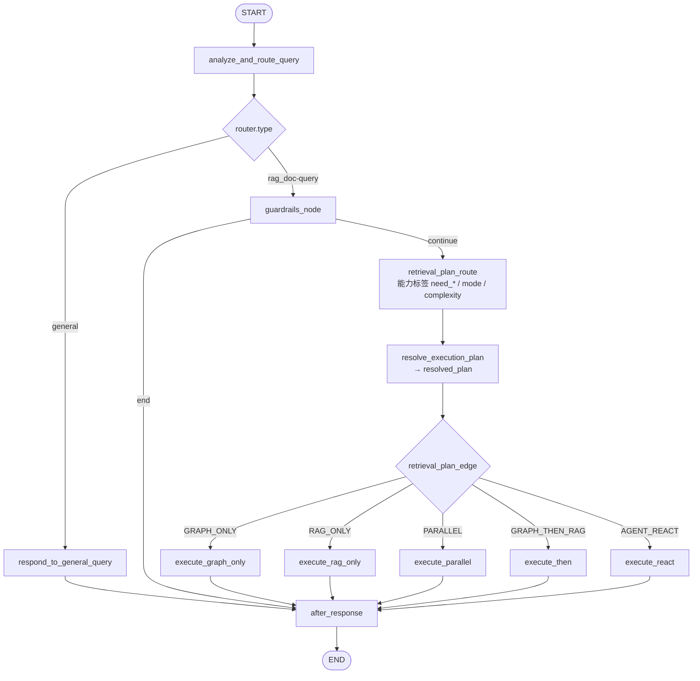
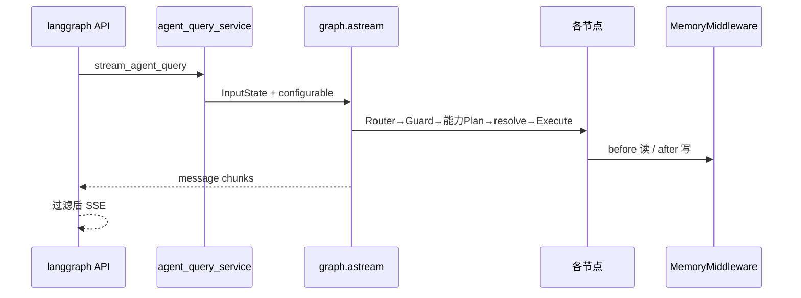
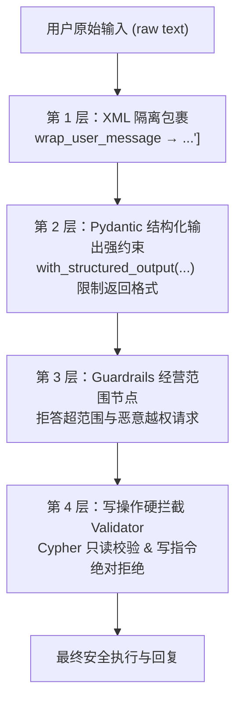

# 03 · 对话域与 Agent 主图全解析

> 📖 **函数级明细**：本文末 附录 G · Chat 域逐函数手册（图节点/ReAct/检索器/KG/建模层全函数）。


> **流程图（必看）**：[00-全流程图集.md](00-全流程图集.md) 的 §5 SSE 主链路、§6 主图状态机、§7 决策细节、§8 能力标签检索编排、§9 Pipeline、§10 ReAct。

## 0.1 学习导航

### 这一章为什么最重要

如果你面试投的是 AI 应用 / Agent / 后端方向，这一章通常是最值得深挖的部分，因为它回答的是：

1. 为什么系统不是一次 LLM 调用就结束。
2. 为什么要有 Router、Guardrails、Retrieval Plan 和 ReAct。
3. 为什么主图要把“决策”和“执行”拆开。

### 读这一章前最好先知道什么

1. `02-API接口` 解决的是“怎么进来”，这一章解决的是“进来以后怎么跑”。
2. 这里的重点不是记住每个函数名，而是理解状态机的分支理由。
3. 你读这一章时，应该一直带着“为什么要这么编排，而不是更简单一点”的问题。

### 这一章学完后你应该会什么

1. 能画出主图状态机。
2. 能讲清 `general`、`GRAPH_ONLY`、`RAG_ONLY`、`PARALLEL`、`GRAPH_THEN_RAG`、`AGENT_REACT` 的差异。
3. 能解释 Router、Guardrails、Plan 的先后顺序。
4. 能说明为什么 ReAct 要做双层限制和安全过滤。

### 推荐阅读方法

1. 先看 §0 图，再读 §4 状态机，不要一上来扎进 §15 的实现细节。
2. 再看 §5 决策节点，理解“怎么决定走哪条路”。
3. 再看 §6 和 §7，理解“决定完之后具体怎么执行”。
4. 最后回头看附录 A，把整条链路转成面试表达。

### 常见误区

1. 只会说“用了 LangGraph”，但讲不清状态图里每一步解决什么问题。
2. 把 ReAct 看成“更高级的问答”，却不知道它为什么只在部分复杂问题里触发。
3. 只背执行路径，不解释为什么系统要先做 Guardrails。

## 0. 主图总览（图）





## 1. 模块地图（树状图 + 逐文件）

> 覆盖 `app/chat/` 下全部业务文件；`__init__.py` 在树中保留、表中可略。

### 1.0 树状图

```text
app/chat/
├── README.md
├── __init__.py
├── domain/
│   ├── __init__.py
│   └── schemas.py                    # 领域契约说明
├── application/
│   ├── __init__.py
│   ├── conversation_service.py       # 会话 CRUD + 清记忆
│   └── agent_query_service.py        # stream_agent_query
└── infrastructure/
    ├── __init__.py
    ├── utils/
    │   ├── __init__.py
    │   └── helpers.py                # question_from_state / no_neo4j
    ├── models/
    │   ├── __init__.py
    │   └── conversation.py           # Conversation ORM
    ├── repository/
    │   ├── __init__.py
    │   └── conversation_repository.py
    ├── graph/
    │   ├── __init__.py
    │   ├── state.py
    │   ├── builder.py
    │   ├── decision_nodes.py
    │   ├── retrieval_nodes.py
    │   ├── execution_pipeline.py
    │   ├── execution_utils.py
    │   ├── memory_context.py
    │   ├── lifecycle_nodes.py
    │   └── message_utils.py
    ├── react/
    │   ├── __init__.py
    │   └── react.py
    ├── retrievers/
    │   ├── __init__.py
    │   ├── retriever_contracts.py
    │   ├── retriever_implementations.py
    │   └── retriever_runtime.py
    ├── modeling/
    │   ├── __init__.py
    │   ├── models.py
    │   └── prompts.py
    └── kg/
        ├── README.md
        ├── __init__.py
        ├── neo4j_conn.py
        ├── text2cypher_workflow.py
        ├── text2cypher_state.py
        ├── northwind_retriever.py
        ├── predefined_cypher/
        │   ├── __init__.py
        │   ├── cypher_dict.py
        │   ├── descriptions.py
        │   └── utils.py
        └── validation/
            ├── __init__.py
            ├── validators.py
            ├── models.py
            ├── schema_validation_rules.py
            └── utils/
                ├── __init__.py
                └── cypher_extractors.py
```

### 1.1 域根与 application / domain

| 文件 | 用处 |
|---|---|
| `app/chat/README.md` | 域边界、禁止再造 shared |
| `app/chat/domain/schemas.py` | 领域契约说明（AgentState 仍在 graph） |
| `app/chat/domain/__init__.py` | 包说明 |
| `app/chat/application/conversation_service.py` | 会话 CRUD；删会话清 STM/LTM |
| `app/chat/application/agent_query_service.py` | `stream_agent_query` 封装 graph.astream |
| `app/chat/application/__init__.py` | 包初始化 |

### 1.2 infrastructure · 会话持久化与工具

| 文件 | 用处 |
|---|---|
| `infrastructure/models/conversation.py` | Conversation ORM、`DialogueType` 枚举 |
| `infrastructure/repository/conversation_repository.py` | create/list/delete/rename SQL |
| `infrastructure/utils/helpers.py` | `question_from_state`、`no_neo4j_response` |
| `infrastructure/utils/__init__.py` | 导出 helpers |

### 1.3 infrastructure · graph 主图

| 文件 | 用处 |
|---|---|
| `graph/state.py` | `InputState` / `AgentState` / Router / RetrievalPlan 类型 |
| `graph/builder.py` | `StateGraph` 组边编译，导出模块级 `graph` |
| `graph/decision_nodes.py` | 路由、闲聊回复、守卫、检索计划节点与边 |
| `graph/retrieval_nodes.py` | `execute_graph_only/rag_only/parallel/then` |
| `graph/execution_pipeline.py` | 检索执行管道（enrich→search→summarize） |
| `graph/execution_utils.py` | query 改写、`search_retriever`、摘要响应 |
| `graph/memory_context.py` | load/enrich 记忆，P0–P3 文本拼装 |
| `graph/lifecycle_nodes.py` | `after_response` 写记忆 |
| `graph/message_utils.py` | `build_safe_messages`、进度/简单 AIMessage |

### 1.4 infrastructure · react / retrievers / modeling

| 文件 | 用处 |
|---|---|
| `react/react.py` | ReAct 子图构建、`execute_react`、充分性检查循环 |
| `retrievers/retriever_contracts.py` | `Retriever` ABC、`RetrieverRegistry`、名称常量 |
| `retrievers/retriever_implementations.py` | `KnowledgeGraphRetriever`、`MilvusDocRetriever` |
| `retrievers/retriever_runtime.py` | `get_retriever` 懒加载注册到容器 |
| `modeling/models.py` | `LazyModelProxy`、温度表、结构输出模型、各 role LLM |
| `modeling/prompts.py` | 系统 Prompt 常量与 YAML 覆盖加载 |

### 1.5 infrastructure · kg（图谱，细节亦见 06）

| 文件 | 用处 |
|---|---|
| `kg/README.md` | KG 子模块说明 |
| `kg/neo4j_conn.py` | Neo4j 连接与健康 |
| `kg/text2cypher_workflow.py` | Text2Cypher 子图：预定义匹配+生成校验执行 |
| `kg/text2cypher_state.py` | Cypher 输入/输出状态 TypedDict |
| `kg/northwind_retriever.py` | few-shot Cypher 示例检索（给 LLM） |
| `kg/predefined_cypher/cypher_dict.py` | 27 条预定义模板 |
| `kg/predefined_cypher/descriptions.py` | 模板语义描述（向量匹配用） |
| `kg/predefined_cypher/utils.py` | 匹配器、`cosine_similarity_score`、抽参 |
| `kg/validation/validators.py` | 语法/禁写/schema/LLM 校验编排 |
| `kg/validation/models.py` | 校验任务与结果结构 |
| `kg/validation/schema_validation_rules.py` | 纯 schema 规则 |
| `kg/validation/utils/cypher_extractors.py` | 从 Cypher 抽属性/关系模式 |

---

## 2. 会话子系统

### 2.1 数据模型

文件：`app/chat/infrastructure/models/conversation.py`

- 表：`conversations`  
- 只存**元信息**（标题、状态、类型、时间、user_id）  
- **不存**逐条消息  
- 与 `User` 通过 SQLAlchemy relationship 双向关联（字符串名 + 显式 import 注册）  

`DialogueType` 源码枚举（存库用中文 value）：

| 成员 | value |
|---|---|
| `NORMAL` | 普通对话 |
| `DEEP_THINKING` | 深度思考 |
| `WEB_SEARCH` | 联网检索 |
| `RAG` | RAG 问答 |

创建会话时固定 `NORMAL` + 标题「新会话」。  
**注意：** `WEB_SEARCH` 在模型里存在，但当前主图**没有**独立联网检索节点；`SERPAPI_KEY` 在配置里有，主问答链路未调用（面试别说已实现联网）。

### 2.2 Repository

文件：`conversation_repository.py`

典型方法：

| 方法 | 作用 |
|---|---|
| `create(user_id)` | 插入会话，返回 id |
| `list_by_user(user_id)` | 列表摘要 |
| `delete(conversation_id)` | **仅 MySQL**：删会话元信息 + 兼容 `messages` 表 |
| `rename(conversation_id, name)` | 改标题 |

### 2.3 Service 与关键函数

文件：`conversation_service.py`

#### `run_db_operation`

```python
async def run_db_operation(
    session_factory,
    logger,
    action_name: str,
    operation: Callable[..., Awaitable[T]],
    *operation_args,
    **context,
) -> T
```

`async with session_factory() as db: return await operation(db, *args)`；异常打日志后 **re-raise**（API 层再变 500）。

#### `ConversationService` 方法

| 方法 | 签名 | 返回 / 行为 |
|---|---|---|
| `create_conversation` | `(user_id: int) -> int` | 新会话 id |
| `get_user_conversations` | `(user_id: int) -> list[ConversationSummary]` | id/title/created_at/status/dialogue_type |
| `delete_conversation` | `(conversation_id: int) -> None` | 见下 |
| `update_conversation_name` | `(conversation_id: int, name: str) -> None` | 改标题 |

**`delete_conversation` 步骤：**

1. `Repository.delete`：MySQL 会话 + 兼容 `messages`  
2. `_clear_conversation_memories(user_id=str(...), session_id=str(id))`  
   - `redis_stm.clear_session(tenant, user, session)`  
   - `milvus_ltm.soft_delete_session_memories(...)`  
   - 失败 **只日志，不回滚 MySQL**  

单例：`conversation_service = ConversationService()`。

**Repository 行为细节：**

| 方法 | 细节 |
|---|---|
| `create` | title 固定 `"新会话"`，`DialogueType.NORMAL`，commit+refresh 返回 id |
| `list_by_user` | `title != "新会话"`，`created_at desc` |
| `delete`/`rename` | 不存在 → `ValueError`；经 API 多为 **HTTP 500**（非 404） |

---

### 2.4 Agent 查询门面函数

文件：`agent_query_service.py`

```python
def stream_agent_query(
    *,
    query: str,
    user_id: int | str,
    thread_id: str,
) -> AsyncIterator[tuple[chunk, metadata]]
```

| 参数 | 说明 |
|---|---|
| `query` | → `InputState(messages=[HumanMessage(...)])` |
| `user_id` | `configurable.user_id`（str） |
| `thread_id` | `configurable.thread_id`，与 STM session 对齐 |

内部：`graph.astream(..., stream_mode="messages")`。  
**不负责** SSE 协议（API 层负责过滤 tool_calls / `research_plan`）。

---

### 2.5 主图小工具（`infrastructure/utils/helpers.py`）

```python
def question_from_state(state: AgentState) -> str
```

取最后一条消息 content；支持 str 或 content 块列表。

```python
def no_neo4j_response() -> dict[str, object]
```

固定降级文案：`抱歉，知识库服务暂时不可用，请稍后重试。`


---

## 3. Agent 查询门面

文件：`agent_query_service.py`

```python
stream_agent_query(query, user_id, thread_id)
  → graph.astream(
      InputState(messages=[HumanMessage(query)]),
      stream_mode="messages",
      config={"configurable": {"thread_id": thread_id, "user_id": str(user_id)}},
    )
```

**API 只应依赖此门面**，不要直接 import `graph.builder`。

---

## 4. 主图状态机

文件：`graph/state.py`、`graph/builder.py`

### 4.1 状态结构

| 类型 | 字段 | 含义 |
|---|---|---|
| `InputState` | `messages` | 入口消息（add_messages 归约） |
| `AgentState` | + `router` | `{logic, type}` type∈{general, rag_doc-query} |
| | + `next_action` | guardrails：`continue` / `end` |
| | + `retrieval_plan` | `{logic, need_graph, need_rag, mode, complexity, resolved_plan}` |
| | + `memory_state` | 请求内缓存的 AgentMemoryState |

### 4.2 节点与边（完整）

```text
START
  → analyze_and_route_query
       │ route_query
       ├─ general ──────────→ respond_to_general_query ──→ after_response → END
       └─ rag_doc-query ────→ guardrails_node
                                  │ guardrails_edge
                                  ├─ end ──→ after_response → END
                                  └─ continue → retrieval_plan_route
                                       │ 写 need_graph/need_rag/mode/complexity
                                       │ + resolve_execution_plan → resolved_plan
                                       └─ retrieval_plan_edge(resolved_plan)
                                            ├─ execute_graph_only ─┐
                                            ├─ execute_rag_only ───┤
                                            ├─ execute_parallel ───┼→ after_response → END
                                            ├─ execute_then ───────┤
                                            └─ execute_react ──────┘
```

编译产物：模块级 `graph = StateGraph(...).compile()`。

### 4.3 builder 边注册（与源码一致）

文件：`graph/builder.py`

```text
START → analyze_and_route_query
analyze_and_route_query --route_query-->
    "respond_to_general_query" → respond_to_general_query
    "retrieval_plan_router"    → guardrails_node     # 注意映射名≠节点名

respond_to_general_query → after_response → END

guardrails_node --guardrails_edge-->
    "retrieval_plan_route" → retrieval_plan_route
    "after_response"       → after_response

retrieval_plan_route --retrieval_plan_edge-->
    execute_graph_only | execute_rag_only | execute_parallel
    | execute_then | execute_react

上述 5 个 execute_* 均 → after_response → END
```

**易错点：** `route_query` 返回的路径键是 `retrieval_plan_router`，实际进的是 **`guardrails_node`**（先守卫再计划）。

---

## 5. 决策节点详解

文件：`graph/decision_nodes.py`

节点函数统一形态（多数）：

```python
async def some_node(state: AgentState, *, config: RunnableConfig) -> dict[str, object]
```

边函数：`def some_edge(state: AgentState) -> Literal[...]`，只读 `state` 路由。

### 5.1 `analyze_and_route_query`

```python
async def analyze_and_route_query(state, *, config) -> dict[str, object]
# 返回 {"router": {type, logic}}  type ∈ {general, rag_doc-query}
```

```text
build_safe_messages(ROUTER_SYSTEM_PROMPT, state.messages)
  → router_model.with_structured_output(Router).ainvoke
  → return {"router": {type, logic}}
```

- 模型：`router_model`（低温，见 modeling）  
- 输出类型：`Router`  

### 5.2 `route_query`

- `type == "general"` → `respond_to_general_query`  
- 否则 → `guardrails_node`（图中映射名 `retrieval_plan_router` 实际进守卫）  

### 5.3 `respond_to_general_query`

```text
build_general_query_system_prompt
  → load_memory_state（可选注入记忆）
  → GENERAL_QUERY_SYSTEM_PROMPT + memory_context
build_safe_messages → agent_model.ainvoke
return {"messages": [AIMessage]}
```

### 5.4 `guardrails_node`

```text
wrap_user_message(question)   # XML 转义 + <user_message> 包裹
ainvoke_structured_question_output(
  GUARDRAILS_SYSTEM_PROMPT,
  SCOPE_DESCRIPTION,          # 智能家居经营范围
  guardrails_model,
  GuardrailsDecision,
)
if decision == "end":
  固定拒答文案 + next_action=end
else:
  next_action=continue
```

经营范围摘要（源码常量）：智能照明/安防/控制/音箱/厨电/清洁等；不含服装鞋帽美妆食品等。

#### 5.4.1 是否还需要 `guardrails_node`？

**建议：现阶段保留，但职责要收窄、可观测。**

| 维度 | 说明 |
|---|---|
| **要它的理由** | 挡住明显超经营范围与注入试探，避免白跑 KG/RAG/REACT；拒答文案统一；structured 输出可测 |
| **可砍的理由** | 与 Router 有重叠（general 已分流闲聊）；多一次 LLM 调用（延迟+费用）；误杀边界题 |
| **更好形态（演进）** | ① 轻量规则/关键词预过滤 → ② 仅可疑流量走 LLM 守卫；或并入 Router 的第三类 `out_of_scope` |
| **现在别做的** | 直接删节点却不补替代防护（安全与成本都会变差） |

**结论：** 主图「Router → Guardrails → Plan」对客服场景仍合理；优化方向是**降调用次数**，不是立刻删除。


### 5.5 `retrieval_plan_route` / `retrieval_plan_edge`（能力标签方案 A）

**LLM 输出（能力标签，非五选一）：**

| 字段 | 含义 |
|---|---|
| `need_graph` | 是否查 Neo4j |
| `need_rag` | 是否查文档 RAG |
| `mode` | `single` / `parallel` / `sequential`（两侧都要时有意义） |
| `complexity` | `simple` / `multi_hop`（多跳→ReAct） |
| `logic` | 理由 |

**代码解析 `resolve_execution_plan` → `resolved_plan`：**

```text
multi_hop                         → AGENT_REACT
need_graph only                   → GRAPH_ONLY
need_rag only                     → RAG_ONLY
both + sequential                 → GRAPH_THEN_RAG
both + parallel/single            → PARALLEL
neither                           → AGENT_REACT（兜底）
```

**边：** `retrieval_plan_edge` 读 `resolved_plan` → 对应 `execute_*`；缺失 → `execute_react`。

---

## 6. 执行节点与 ExecutionPipeline

文件：`retrieval_nodes.py`、`execution_pipeline.py`、`execution_utils.py`

### 6.1 执行节点签名

```python
async def execute_graph_only(state, *, config) -> MessagePayload | dict[str, object]
async def execute_rag_only(state, *, config) -> ...
async def execute_parallel(state, *, config) -> ...
async def execute_then(state, *, config) -> ...   # GRAPH_THEN_RAG
# ReAct 在 react/react.py:
async def execute_react(state, *, config) -> dict[str, object]

async def after_response(state, *, config) -> dict[str, object]
# 写 STM / 触发 after_agent 记忆链路
```

### 6.2 工具函数（`execution_utils.py`）

| 函数 | 作用 |
|---|---|
| `build_graph_only_query(q)` | 问题后缀「仅结构化数据」提示 |
| `build_rag_only_query(q)` | 问题后缀「仅文档知识」提示 |
| `build_graph_then_rag_query(q, records)` | 已知 records + 原问题 |
| `search_retriever(retriever, query)` | 空 retriever → 空结果；否则 `retriever.search` |
| `merge_retriever_records(*results)` | 合并多路 records |
| `summarize_and_build_response(...)` | 摘要链 + 进度/最终 AIMessage |

### 6.3 通用管道

`ExecutionPipeline`：

1. `enrich_question`：注入记忆上下文到问题文本  
2. `search_retriever`：调用 Retriever  
3. （双路）`merge_retriever_records`  
4. `summarize_and_build_response`：LLM 摘要 + 进度/兜底文案  

### 6.4 四策略

| 节点 | 行为 |
|---|---|
| `execute_graph_only` | 仅 KG；KG 不可用 → 无 Neo4j 友好提示 |
| `execute_rag_only` | 仅 RAG；不可用 → “文档检索服务暂不可用” |
| `execute_parallel` | asyncio.gather(KG, RAG)，查询模板不同 |
| `execute_then` | 先 KG，用 KG records 构造再查 RAG 的 query |

并行/串行时 query 构造：

- `build_graph_only_query(query)`  
- `build_rag_only_query(query)`  
- `build_graph_then_rag_query(query, kg_records)`  

### 6.3 Retriever 运行时

文件：`retrievers/retriever_runtime.py` + contracts + implementations

```text
get_retriever(name)
  → AppContainer.retriever_registry（懒初始化）
  → KG：Neo4j 可用时装配
       NorthwindCypherRetriever（few-shot）
       create_text2cypher_agent(...)
       KnowledgeGraphRetriever(t2c_agent)
  → RAG：MilvusDocRetriever（内部 HybridSearcher）
```

合约要点（`retriever_contracts.py`）：

- 名称常量：`KG_RETRIEVER_NAME`、`RAG_RETRIEVER_NAME`  
- `Retriever.search(query) -> dict`，至少含 `records`  

---

## 7. ReAct 子图

文件：`react/react.py`

### 7.1 何时进入

RetrievalPlan = `AGENT_REACT`，或未知 plan 默认。

### 7.2 执行流程

```mermaid
flowchart TD
    Start([进入 execute_react]) --> NeoCheck{Neo4j 图谱可用?}
    NeoCheck -- "否 (Null)" --> Degrade[no_neo4j_response 降级]
    Degrade --> End([结束返回])
    
    NeoCheck -- "是" --> Enrich[enrich_question 注入 P0-P3 记忆]
    Enrich --> SubGraph[get_react_subgraph 装配 ReAct 子图]

    subgraph Loop["ReAct 循环 (Max Attempts = 5)"]
        InitMsg[构造输入消息 list] --> ExecSG["sg.ainvoke (Recursion Limit = 11)\n调用 neo4j_query / rag_search"]
        ExecSG --> MarkerCheck{包含 Exhausted Marker?}
        MarkerCheck -- "是" --> StepReason[设置 Exhausted 原因]
        MarkerCheck -- "否" --> JudgeModel["react_judge_model\nStructured Answer Check"]
        JudgeModel --> DecisionCheck{Decision == sufficient?}
        DecisionCheck -- "是" --> ReturnSuff[返回 [Progress AIMessage, Answer AIMessage]]
        DecisionCheck -- "否" --> RetryReason[提取 check.reason 记录原因]
        StepReason --> NextTurn[拼接 retry_prompt 开启下一轮]
        RetryReason --> NextTurn
        NextTurn --> Counter{Attempt <= Max Attempts?}
        Counter -- "是" --> ExecSG
    end

    Counter -- "超出次数" --> Fallback[返回 progress_message + fallback_answer]
    ReturnSuff --> End
    Fallback --> End
```

```text
execute_react
  1. get_neo4j_graph() 为空 → no_neo4j_response
  2. enrich_question
  3. get_react_subgraph(builder)  # 容器级单例缓存
       builder:
         tools:
           neo4j_query(task) → kg.search
           rag_search(query) → rag.search
         create_react_agent(react_model, tools, REACT_SYSTEM_PROMPT)
  4. 循环最多 max_attempts（默认 5）:
       调用子图（recursion_limit 默认 11）
       react_judge_model 结构化判断 sufficient/retry/handoff
       sufficient → 返回答案
       retry → 带上 retry_prompt 继续
       handoff / 耗尽 → fallback_answer
```

配置来源：`settings.app_config.react.*`（见 09 文档）。

---


### 7.3 ReAct 外循环实现细节（react.py）

```text
execute_react(state, config):
  if get_neo4j_graph() is None → no_neo4j_response()
  q = enrich_question(...)
  sg = get_react_subgraph(build_fn)   # AppContainer 单例 + lock
  subgraph_config["recursion_limit"] = react.recursion_limit  # 默认 11
  react_messages = [{role:user, content:q}]
  insufficiency_reason = react.initial_reason

  for attempt in 1..react.max_attempts:          # 默认 5
    if attempt > 1:
      追加 user: retry_prompt + "不足原因：" + insufficiency_reason
    result = await sg.ainvoke({messages: react_messages}, config)
    last_answer = 最后一条 message.content 或 "未能确定回答～"

    if step_exhausted_marker in last_answer.lower():   # "need more steps"
      insufficiency_reason = step_exhausted_reason
    else:
      截取最近 transcript_window 条消息拼 transcript
      check = react_judge_model.structured(ReactAnswerCheckOutput)
            .ainvoke(system=REACT_ANSWER_CHECK, user=问题+过程+候选答案)
      if check.decision == "sufficient":
        return [progress_message AIMessage, last_answer AIMessage]
      insufficiency_reason = check.reason or default_insufficiency_reason

    # 准备下一轮：只保留 原问题 + 上一轮候选答案
    react_messages = [user:q, assistant:last_answer]

  # 用尽
  return [progress_message, fallback_answer]
```

工具（构建子图时）：

| 工具 | 行为 |
|---|---|
| `neo4j_query(task)` | `kg.search(task)` → JSON records；kg 空则 error JSON |
| `rag_search(query)` | `rag.search(query)` → JSON records |


## 7.5 节点计时与请求追踪（v3.35）

所有节点在 builder 注册时经 `timed_node` 包装
（`app/chat/infrastructure/graph/timing.py`）：

```text
2026-.. | INFO | a1b2c3d4e5f6 | app.chat.graph.timing | node=analyze_and_route_query elapsed=812.4ms
2026-.. | INFO | a1b2c3d4e5f6 | app.chat.graph.timing | node=execute_rag_only elapsed=2310.7ms
```

第三列是 `X-Request-ID`（中间件写入 contextvars，日志 Filter 自动注入）——
一次请求经过哪些节点、各花多久，按 request_id 过滤即得完整画像，
不必再对相邻日志时间戳做减法。

## 8. 记忆在主图中的挂载点

> **v3.35 变更**：`after_response` 不再直接（也不再 fire-and-forget）执行
> 记忆写入，而是**发布 `turn_completed` 事件**到 Redis Streams；
> 消费者做"MySQL 历史落库 + after_agent 记忆链"。收益：崩溃可重放、
> 失败有重试与死信、SSE 关键路径零等待。事件基础设施不可用时回退为
> 进程内后台协程（`flush_pending_memory_writes()` 供测试等待）。
> 每轮事件都会带稳定的 `turn_id/event_id`：MySQL history 以该 ID 唯一约束，
> STM 以会话级回合集合防重；因此 ACK 前崩溃重放不会重复追加同一轮对话。
> 全景见 [00-全流程图集.md](00-全流程图集.md) §24-25、[04](04-记忆系统.md) §2.5。

### 原第 8 节内容

文件：`graph/memory_context.py`、`lifecycle_nodes.py`

### 8.1 读（before）

| 调用点 | 函数 | 用途 |
|---|---|---|
| general 回复 | `load_memory_state` + `build_memory_context` | 系统提示注入 |
| 执行节点 | `enrich_question` | 问题文本拼接记忆 |
| ReAct | `enrich_question` | 同上 |

`configurable_scope(config)` 解析：

- `tenant_id` 默认 `default`  
- `user_id` 默认 `anonymous`  
- `session_id` ← `thread_id` 默认 `default`  

### 8.2 写（after）

`after_response`：

```text
middleware = MemoryMiddleware
find_last_user_message + find_last_assistant_message
middleware.after_agent(tenant, user, session, user_msg, assistant_msg)
异常：warning 日志，不中断主响应
```

---

## 9. Prompt 安全

文件：`app/shared/security/__init__.py`  
使用点：guardrails / retrieval_plan 的用户问题包裹；message_utils 也可包裹。



```text
html.escape(raw) → <user_message>\n...\n</user_message>
返回 (wrapped_for_prompt, original_for_display)
```

配合 structured output，降低“指令逃逸”概率（仍非完整安全方案）。

---

## 10. Modeling 层

文件：`modeling/models.py`、`prompts.py`

职责见 **§16**（温度表、LazyModel、YAML 覆盖、各 Prompt 职责）。  
`create_llm_for_role(role)` 供 AppContainer 创建 MemoryExtractor 等复用。

---

## 11. 主图一次问答的时序（完整）

```text
POST /api/langgraph/query
  agent_query_service.stream_agent_query
    graph.astream
      analyze_and_route_query          # LLM 路由
      [general 分支] respond_to_general_query (+memory)
      [业务 分支] guardrails_node      # 范围守卫
      retrieval_plan_route             # 能力标签 + resolve
      execute_* / execute_react        # 检索+生成
      after_response                   # STM/LTM/画像
    SSE 过滤输出
```

---

## 12. 相关测试

- `tests/chat/test_lg_nodes.py`、`test_lg_react.py`、`test_lg_retrievers.py`  
- `tests/chat/test_conversation_service.py`、`test_conversation_repository.py`  
- `tests/api/test_langgraph.py`  

---


---

## 14. message_utils 细节

文件：`graph/message_utils.py`

| 函数 | 行为 |
|---|---|
| `build_safe_messages(system, messages)` | 系统消息 + 历史；用户内容可走 `wrap_user_message` |
| `build_progress_response(text)` | 构造「正在…」类进度 AIMessage 载荷 |
| `build_simple_message_response(text)` | 单条 AIMessage |
| `find_last_user_message` | 从后往前找 human/user |
| `find_last_assistant_message` | 从后往前找 AI，**跳过 content 含「正在」的进度消息** |

`after_response` 依赖后两个函数提取本轮真实问答再写 STM。

---

## 15. execution_utils 细节

文件：`graph/execution_utils.py`

```text
search_retriever(retriever, query)
  → retriever 为 None 则空结果
  → await retriever.search(query) → RetrieverResult

summarize_records(question, records)
  → 使用容器缓存的 summarize_chain
  → Prompt: 电商客服口吻 + 事实 {results} + 问题
  → cypher_model | StrOutputParser

summarize_and_build_response(...)
  → 进度 AIMessage + 摘要 AIMessage
  → records 空则用 fallback 文案
```

查询改写见 06 文档 §4.7。

---

## 16. Modeling / Prompt 细节（原独立「模型文档」并入）

### 16.1 角色温度（MODEL_TEMPERATURES）

| 角色 | 温度 | 用途 |
|---|---|---|
| router | 0.1 | 顶层分流 |
| retrieval_plan | 0.1 | 能力标签计划 |
| guardrails | 0.1 | 范围/安全 |
| react_judge | 0.1 | 充分性 |
| cypher | 0.2 | Text2Cypher/摘要 |
| memory_extractor | 0.3 | 记忆抽取 |
| react | 0.4 | ReAct 工具循环 |
| agent | 0.7 | general 闲聊 |

### 16.2 LazyModelProxy

模块级 `router_model` 等为懒代理：首次 `.ainvoke` / `.with_structured_output` 才创建，缓存在 `AppContainer.llm_models`。  
后端：`AGENT_SERVICE==deepseek` → ChatDeepSeek，否则 ChatOllama。

### 16.3 Prompt 加载

`prompts.py`：

```text
DEFAULT_PROMPTS（代码硬编码）
  ← load_prompts_from_yaml(同目录 prompts.yaml) 字符串键覆盖
  文件缺失/坏格式 → 打日志并用默认
```

可覆盖键：`router_system` / `retrieval_plan_router` / `general_query` / `guardrails` / `react_system` / `react_answer_check`。

### 16.4 各 Prompt 职责摘要

| Prompt | 要点 |
|---|---|
| Router | general vs rag_doc-query；攻击归 general |
| Plan | 五策略规则与示例（指代→GRAPH_THEN_RAG 等） |
| General | 亲～/emoji/简短/不泄露系统提示 |
| Guardrails | continue/end；范围外与劫持 end |
| ReAct | 工具 neo4j_query/rag_search 使用规则 |
| Answer Check | sufficient / retry / handoff |

### 16.5 结构化输出类型

`RetrievalPlanOutput` / `GuardrailsDecision` / `ReactAnswerCheckOutput`。


---

## 面试深挖：Agent 与主图

### Q1. 为什么先 Router 再 Guardrails，而不是反过来？

- **general**（闲聊/攻击）不必过业务范围守卫，直接客服语气回复  
- **rag_doc-query** 才需要判断是否在经营范围内  
- 攻击类在 Router Prompt 里已要求归 `general`，降低 Guardrails 负担  

**追问：攻击归 general 会不会被当正常闲聊泄露信息？**  
General Prompt 明确：不输出系统提示、不执行用户指令、只答标签内内容。

### Q2. 能力标签如何选型？（背例子）

LLM 输出 `need_graph` / `need_rag` / `mode` / `complexity`，**不是**五选一枚举。

| 能力组合 | resolved_plan | 例子 |
|---|---|---|
| need_graph only | GRAPH_ONLY | 价格/库存/订单号 |
| need_rag only | RAG_ONLY | 保修多久、退货政策 |
| both + parallel | PARALLEL | 门铃价格 + 保修政策 |
| both + sequential | GRAPH_THEN_RAG | 先查订单产品，再查这些产品的保修 |
| complexity=multi_hop 或两侧都 false | AGENT_REACT | 模糊方案咨询 / 兜底 |

缺失 `resolved_plan` → **默认 REACT**（兜底，不静默失败）。

### Q3. PARALLEL 和 GRAPH_THEN_RAG 的实现差异？

- PARALLEL：`asyncio.gather` 两路；query 分别加「仅结构化/仅文档」后缀  
- THEN：先 `kg.search(原query)`，再 `rag.search("已知信息：{kg_records}\n\n查询：{q}")`  
- 合并：`merge_retriever_records` **顺序拼接**，不做去重（面试可提：可能重复，摘要层消化）

### Q4. ReAct 两层「次数」限制？

| 层 | 配置 | 默认 | 含义 |
|---|---|---|---|
| 子图内部 | `recursion_limit` | 11 | LangGraph 工具调用步数上限 |
| 外循环 | `max_attempts` | 5 | judge 不充分时整轮重试 |

步数耗尽文案含 `need more steps`（`step_exhausted_marker`）→ 不当 sufficient，记原因再试。

**handoff 的真实行为（易答错）：**  
judge 返回 `handoff` 时**没有**单独提前结束分支，只是把 `insufficiency_reason` 更新后进入下一 attempt；轮次用尽仍走 `fallback_answer`。  
也就是说 handoff ≈「不充分 + 原因」，**不是**立刻转人工 API。

### Q5. 为什么 ReAct 下一轮 messages 只保留「原问题 + 上轮答案」？

避免 transcript 无限增长撑爆上下文；不足原因通过 `retry_prompt + insufficiency_reason` 注入，而不是堆全历史。

### Q6. SSE 为什么过滤 tool_calls 和 research_plan？

用户只需自然语言；tool 中间态是 Agent 内部观察。过滤后前端简单，也避免泄露工具协议。

### Q7. after_response 失败为何不抛给用户？

记忆是**增强**不是**正确性必要条件**。写 STM 失败应降级，不能让用户已生成的答案变 500。

### Q8. 会话列表为何排除标题「新会话」？

`list_by_user` 过滤 `title != "新会话"`：创建后未改名的占位会话不污染列表；用户 rename 后才出现。

### Q9. conversation_id 整数 vs thread_id 字符串？

MySQL 主键是 int；LangGraph configurable 是 str。前端应把 `X-Conversation-ID` **原样回传**。若混用随机 uuid 与 MySQL id，STM session 会分裂。

### Q10. 温度为什么 Router 0.1、Agent 0.7？

- 路由/守卫/计划/judge：要**稳定离散标签** → 低温度  
- Cypher：要可执行字符串 → 较低  
- ReAct：要探索但别疯 → 中  
- 闲聊：要亲和 → 较高  

## 17. 下一步

- 记忆 `before_agent` / `after_agent` → [04-记忆系统.md](04-记忆系统.md)  
- KG/RAG / `parse_document` → [05-知识检索与文档解析.md](05-知识检索与文档解析.md)

## 学习自测

1. 为什么这里不是“一个 Prompt + 两个工具”就结束，而要显式分出 Router、Guardrails、Plan、Execute？
2. `PARALLEL` 和 `GRAPH_THEN_RAG` 的差异，不看文档你能口头讲清吗？
3. 为什么 `after_response` 失败通常不该影响用户已生成的回答？
4. 为什么 SSE 输出要过滤 `tool_calls` 和中间研究痕迹？


---

## 附录 A · 面试重头戏：对话与 Agent（函数级通关稿）

> 目标：能在白板上画出主图，并背出每个关键函数的**输入、输出、失败行为**。

## A1. 30 秒背诵链路

```text
POST /api/langgraph/query (Form: query, user_id, conversation_id?)
  → thread_id = conversation_id or uuid4()
  → stream_agent_query → graph.astream(stream_mode="messages", configurable={thread_id,user_id})
  → analyze_and_route_query  # Router: general | rag_doc-query
       ├ general → respond_to_general_query → after_response → END
       └ rag_doc-query → guardrails_node
            ├ end → after_response → END          # 超范围拒答
            └ continue → retrieval_plan_route     # 能力标签→路径
                 → execute_* / execute_react → after_response → END
  → SSE 过滤 tool_calls / research_plan / 空 content
  → Header X-Conversation-ID = thread_id（创建 StreamingResponse 时就有）
```

## A2. 关键函数速查表（必须能口述）

### A2.1 应用门面

| 函数 | 文件 | 入参 | 出参 | 失败 |
|---|---|---|---|---|
| `stream_agent_query` | agent_query_service | query, user_id, thread_id | astream 迭代器 | 异常上抛到 API |
| `ConversationService.delete_conversation` | conversation_service | conversation_id:int | None | Repo ValueError→API 500；记忆清理不抛 |

### A2.2 决策节点

| 函数 | 写回 state 的关键字段 | 模型温度角色 |
|---|---|---|
| `analyze_and_route_query` | `router.type/logic` | router 0.1 |
| `respond_to_general_query` | `messages` AIMessage | agent 0.7 + 记忆注入 |
| `guardrails_node` | `next_action` continue/end；可能拒答 message | guardrails 0.1 |
| `retrieval_plan_route` | `need_graph/need_rag/mode/complexity` + `resolved_plan` | retrieval_plan 0.1 |

边：

| 边函数 | 读 | 去向 |
|---|---|---|
| `route_query` | router.type | general 节点 / guardrails |
| `guardrails_edge` | next_action | after_response / plan |
| `retrieval_plan_edge` | resolved_plan | 五 execute_*；缺失→execute_react |

### A2.3 执行节点

| 函数 | 检索 | 问题改写 | 空服务降级文案要点 |
|---|---|---|---|
| `execute_graph_only` | KG | graph_only 后缀 | Neo4j 不可用→helpers.no_neo4j_response |
| `execute_rag_only` | RAG | rag_only 后缀 | 文档检索服务暂不可用 |
| `execute_parallel` | KG+RAG 合并 | 各自改写后 merge | 单路空则另一路顶上 |
| `execute_then` | 先 KG 再 RAG | graph_then_rag 用 records 增强 | 顺序依赖 |
| `execute_react` | 工具动态 | enrich_question | Neo4j 空直接 no_neo4j |

### A2.4 记忆挂载

| 函数 | 时机 | 行为 |
|---|---|---|
| `load_memory_state` | general / enrich 前 | 缓存到 state.memory_state；失败 None |
| `enrich_question` | 执行前 | `build_enriched_question` = 记忆段 + 当前问题 |
| `build_memory_context` | 纯函数 | P0→P1→P2→P3 段落 + 冲突说明 |
| `configurable_scope` | 读 config | tenant/user/session 默认 default/anonymous/default |
| `after_response` | 图末 | find last user/assistant → middleware.after_agent；异常 warning |

### A2.5 ReAct 双限制（必背数字）

| 配置 | 默认 | 含义 |
|---|---|---|
| `react.max_attempts` | **5** | 外循环：充分性检查后的重试轮数 |
| `react.recursion_limit` | **11** | 内循环：子图内 tool call 步数上限 |
| `react.transcript_window` | 20 | 送给 judge 的过程消息窗口 |
| judge decision | sufficient / retry / handoff | **handoff 不会调外部坐席 API**，只是决策枚举；用尽→fallback 文案 |

## A3. 白板：能力标签 → 执行路径

**LLM 不直接五选一**，输出能力组合；代码解析：

| 能力组合 | resolved_plan | 场景 |
|---|---|---|
| graph only | GRAPH_ONLY | 价格/库存/订单 |
| rag only | RAG_ONLY | 保修/说明书 |
| both + parallel | PARALLEL | 价格+保修独立 |
| both + sequential | GRAPH_THEN_RAG | 先订单产品再保修 |
| multi_hop / 两侧都 false | AGENT_REACT | 模糊多跳 / 兜底 |

执行层仍是五类 `execute_*` 节点，只是**计划语义**从互斥枚举改为标签编排。

## A4. 温度表（MODEL_TEMPERATURES）

| 角色 | 温度 | WHY |
|---|---|---|
| router / retrieval_plan / guardrails / react_judge | 0.1 | 离散标签要稳 |
| cypher | 0.2 | 可执行字符串 |
| memory_extractor | 0.3 | 略创造但可控 |
| react | 0.4 | 探索与稳定折中 |
| agent | 0.7 | 闲聊亲和 |

## A5. Prompt 四层防线（面试安全题）

1. **XML 隔离**：`wrap_user_message` → html.escape + `<user_message>`  
2. **Structured output**：Router/Guardrails/Plan/Judge 用 Pydantic/Typed 结构  
3. **Guardrails 经营范围**：非智能家居 → end + 拒答  
4. **Cypher 禁写**：校验层拦截 CREATE/MERGE/DELETE/SET…（详见 06）  

## A6. 高频追问 15 题（短答）

1. **消息为何不进 MySQL？** 写放大 + 只需窗口；MySQL 只管列表元数据。  
2. **thread_id vs conversations.id？** 字符串会话键 vs 整数 PK；前端应用 `X-Conversation-ID` 原样回传。  
3. **删会话清什么？** Service：MySQL + STM clear + LTM soft delete by session_id；Repo 只 MySQL。  
4. **WEB_SEARCH？** 枚举有，主图无节点；别吹联网。  
5. **general 也读记忆吗？** 会，经 load_memory_state 注入 system。  
6. **enrich 和 build_memory_context 区别？** enrich=加载+拼问题；context=纯拼装字符串。  
7. **memory_state 缓存？** state 上缓存，同请求不重复 before_agent。  
8. **no_neo4j 文案？** 「抱歉，知识库服务暂时不可用，请稍后重试。」  
9. **RAG 不可用文案？** 「文档检索服务暂不可用。」（与 Neo4j 不同）  
10. **PARALLEL 如何合并？** merge_retriever_records 后统一 summarize。  
11. **ReAct 工具返回格式？** JSON 字符串 records。  
12. **sufficient 提前退出？** 是，外循环 break 返回答案。  
13. **handoff 真人？** 否，仅 judge 枚举/文案路径。  
14. **utils 为何不叫 shared？** 全局只有 app.shared；域内 helpers 防撞名。  
15. **API 为何不直接 import graph？** 分层：api→application→infrastructure。

## A7. 口述演示脚本（2 分钟）

「用户问保修政策：Router 判 rag_doc-query → Guard 确认在智能家居范围 → Plan 标 need_rag → resolved RAG_ONLY → enrich_question 注入 P0–P3 → MilvusDocRetriever 混合检索 → summarize 成自然语言 → after_response 写 STM。若问题是订单号查物流：Plan need_graph → GRAPH_ONLY 走 Text2Cypher。若问题又模糊又要多跳：AGENT_REACT，最多 5 轮充分性检查。」

---

## 附录 G · 函数手册：Chat 域逐函数明细

> 签名与源码逐字一致（v3.35.1）。📌=热路径 🔒=并发语义 ⚠️=历史踩坑。

### G.1 `application/agent_query_service.py`

#### 📌 `def stream_agent_query(*, query, user_id: int | str, thread_id: str) -> GraphStream`

组 `InputState(messages=[HumanMessage(query)])` →
`graph.astream(stream_mode="messages", config={configurable:
{thread_id, user_id: str(user_id)}})`。configurable 是记忆与检索的
作用域约定：thread_id≡STM/LTM session、user_id≡画像/分域。
非 async 函数——返回异步迭代器本身。

### G.2 `application/conversation_service.py`

- `run_db_operation(session_factory, logger, action_name, operation, *args, **context)`：
  统一 session 生命周期；**ResourceNotFoundError 直接放行不打堆栈**
  （正常控制流），其余异常 error+堆栈后 raise
- `ConversationService` 方法：`create_conversation(user_id)` /
  `get_user_conversations`（过滤默认标题）/
  `delete_conversation(cid, uid)`（repo 删→`_clear_conversation_memories`：
  STM clear_session + LTM soft_delete_session_memories，**失败只记日志
  不回滚**——避免"库删了但接口 500"）/
  📌 `ensure_conversation(uid, cid|None) -> int`（传 id→归属校验；None→
  创建；⚠️ 会话 id 三位一体的唯一来源，杜绝 uuid 孤儿线程）/
  `list_messages(cid, uid)`（先归属后读 MessageRepository）/
  `update_conversation_name(cid, uid, name)`
- 模块私有 `_create_conversation/_get_user_conversations/_delete_conversation/
  _update_conversation_name/_get_owned_conversation/_list_messages`：
  repo 适配函数（db 会话第一参）

### G.3 `infrastructure/repository/`

**conversation_repository.py**：`create`（默认标题「新会话」）/
`get_by_id` / `list_by_user`（排除默认标题+时间倒序）/
`get_owned(cid, uid)`（**id∧user_id 双条件**）/
`delete(cid, uid)`（⚠️ 归属校验→兼容清理历史 messages 表（表缺失
rollback 后重载对象）→删行；非本人 ResourceNotFoundError 统一文案防
枚举）/ `rename(cid, uid, name)`。

**message_repository.py**：`add_turn(cid, user_content, assistant_content)`
（两行一次提交，append-only）/ `list_by_conversation(cid)`（id 正序→
`{role, content, created_at(iso)}`）。写入方：turn_completed 消费者。

### G.4 `infrastructure/graph/state.py`

`Router{type, logic}` / `RetrievalPlan{logic, need_graph, need_rag, mode,
complexity, resolved_plan}` / `InputState{messages}` /
`AgentState`（+router/retrieval_plan/next_action/memory_state——
memory_state 是**请求内缓存**，见 load_memory_state）。

### G.5 `infrastructure/graph/decision_nodes.py`

| 函数 | 要点 |
|---|---|
| `resolve_execution_plan(*, need_graph, need_rag, mode, complexity) -> ExecutionPlanType` | 纯函数决策表：multi_hop→AGENT_REACT；双真∧sequential→GRAPH_THEN_RAG；双真→PARALLEL；单真→对应 ONLY；全假→REACT 兜底 |
| `_normalize_retrieval_mode/_normalize_complexity` | 白名单归一（LLM 输出防脏）；⚠️ 曾与上传模式校验同名 `_normalize_mode` 跨文件看串 |
| `build_general_query_system_prompt(*, state, config, general_query_system_prompt)` | 模板 format(router.logic) + 记忆上下文追加（load 失败仅用基础模板） |
| 📌 `analyze_and_route_query(state, *, config)` | build_safe_messages→router_model 结构化输出 Router |
| `route_query(state) -> GeneralRouteName` | general→通用回复；否则→guardrails（path map 键，builder 里映射真实节点） |
| `respond_to_general_query(state, *, config)` | 记忆增强 system + agent_model.ainvoke |
| `guardrails_node(state, *, config)` | wrap_user_message 后判定 end/continue；end→固定拒答文案 + next_action="end" |
| `guardrails_edge(state)` | end→after_response（跳过检索直接收尾） |
| `retrieval_plan_route(state, *, config)` | 结构化输出 RetrievalPlanOutput→归一化→resolve→存 RetrievalPlan（含 resolved_plan） |
| `retrieval_plan_edge(state) -> RetrievalEdgeName` | 读 resolved_plan；缺失→读 legacy plan→再缺→按能力重算；全兜底 REACT |

### G.6 `infrastructure/graph/execution_pipeline.py` / `retrieval_nodes.py`

`ExecutionPipeline(progress_message, fallback)`：
- 📌 `execute_single(state, config, retriever, *, …)`：enrich_question→
  search_retriever→summarize_and_build_response
- 📌 `execute_dual(state, config, kg, rag, *, mode="parallel"|"sequential", …)`：
  parallel→`asyncio.gather` 双路（各自专用查询构造器）；sequential→
  先 KG 后把其 records 拼进 RAG 查询；merge→摘要

四个节点 `execute_graph_only/rag_only/parallel/then`：get_retriever 取
实例→KG 缺失时 `no_neo4j_response()` 降级→委托 pipeline 对应方法。

### G.7 `infrastructure/graph/execution_utils.py`

| 函数 | 要点 |
|---|---|
| `records_from_result(result)` | 安全取 records（缺失/非 list→[]） |
| `merge_retriever_records(*results)` | 顺序合并（KG 在前——图谱结构化数据权威度高） |
| `build_graph_only_query / build_rag_only_query / build_graph_then_rag_query` | 路径专用查询模板；then 版把图谱 records JSON 拼进文档查询 |
| `search_retriever(retriever, query)` | None→空结果占位（KG 不可用时 pipeline 不炸） |
| `ainvoke_structured_question_output(*, system_prompt, human_prompt, model, output_schema, question)` | "system+单问题模板"结构化链的统一封装（guardrails/plan 共用） |
| `summarize_records(query, records, fallback)` | 空 records→fallback；否则摘要 LLM |
| 📌 `summarize_and_build_response(query, records, *, progress_message, fallback)` | 摘要 + 两段式 MessagePayload（进度条消息+正文，SSE 体验） |

### G.8 `infrastructure/graph/memory_context.py`

| 函数 | 要点 |
|---|---|
| `build_memory_section(title, body)` | 空 body→""（空段不注入） |
| `format_recent_messages / format_user_profile` | P0/P1 文本化（角色中文标签；画像字段+tags+facts） |
| 📌 `build_memory_context(summary, recent, ltm, profile)` | P0→P3 顺序拼装 + 冲突优先级说明头；全空→"" |
| `build_enriched_question(question, memory_state)` | 上下文 + 「用户当前问题：」 |
| `configurable_scope(config) -> (tenant, user, session)` | configurable 缺省值兜底（default/anonymous/default） |
| 📌 `load_memory_state(state, config, user_input)` | **state.memory_state 请求内缓存**——一次请求多节点要记忆时只打一次 before_agent；失败 warning→None（无记忆继续） |
| `enrich_question(state, config, question)` | load→None 原句；否则增强 |

### G.9 `infrastructure/graph/message_utils.py`

`build_safe_messages(system_prompt, messages)`：system + 逐条转 dict，
**user 消息经 wrap_user_message XML 隔离**（防注入第一层）。
`build_progress_response/build_simple_message_response`：MessagePayload
构造。`find_last_user_message/find_last_assistant_message`：after_response
取本轮对话（assistant 版跳过进度提示条）。`_message_role`：兼容
dict/LangChain Message。

### G.10 `infrastructure/graph/lifecycle_nodes.py` / `timing.py` / `builder.py`

- 📌 `after_response(state, *, config)`：缺任一侧消息跳过（拒答路径防脏
  会话）→`_publish_turn_completed`（get_container_if_initialized 机会型
  取 event_queue；成功即返回——写扩散交消费者）→失败回退
  `_write_turn_memory` fire-and-forget（引用集合防 GC；
  `flush_pending_memory_writes()` 供测试/停机等待）
- `timed_node(node_name, handler)`：functools.wraps 包装计时；异常也记
  elapsed+outcome=error 后原样抛
- builder 模块级装配：`_NODE_REGISTRATIONS` 十节点（全部过 timed_node）
  + 三组条件边 + 执行节点统一汇 after_response → `graph = compile()`
  （无 checkpointer——会话记忆由自建 STM 承担，thread_id 仅作用域键）

### G.11 `infrastructure/react/react.py`

- 🔒 `get_react_subgraph(builder)`：容器缓存 + 双检锁（子图编译一次）
- 📌 `execute_react(state, *, config)`：Neo4j 不可用→no_neo4j_response；
  enrich 问题→懒建子图（`create_react_agent(react_model, [neo4j_query,
  rag_search], REACT_SYSTEM_PROMPT)`，两工具闭包捕获检索器、结果
  JSON 化）→循环 ≤max_attempts(5)：ainvoke(recursion_limit=11)→
  step_exhausted 标记检测→否则取窗口 20 条 transcript 交
  react_judge_model 结构化判定 sufficient/retry→充分即两段式返回；
  不足带 reason 重试（消息重置为 原问题+上轮候选，防上下文膨胀）→
  轮次耗尽→固定 fallback_answer

### G.12 `infrastructure/retrievers/`

**contracts.py**：`Retriever` Protocol（`search(task) -> dict`
统一 `{task, records, errors, steps}`）；`RetrieverRegistry`
register/get/`__contains__`；常量 KG_RETRIEVER_NAME/RAG_RETRIEVER_NAME。

**retriever_runtime.py**：
- 📌 `get_retriever(name)`：锁外快判 `_registry_ready`（两检索器齐）直
  返；否则 🔒 registry_lock 内 `_ensure_registry`（⚠️ 曾锁外创建，
  并发双建互覆盖）→`await _register_kg_retriever`（Neo4j 缺→静默跳过，
  RAG 仍可用）→`await _register_rag_retriever`。⚠️ v3.35.2：两个注册器
  的重构造（Neo4j 连接/模板 embedding/子图编译/Milvus 连接/权重加载）
  经 `run_blocking` 下线程池，且容器 `warm_up` 启动期预建——冷构造
  不再由首个提问用户买单
- `_ensure_text2cypher_agent(container, graph)`：kg_components 缓存
  NorthwindCypherRetriever + create_text2cypher_agent（⚠️ 曾直接读写
  容器下划线私有字段）

**retriever_implementations.py**：
- `MilvusDocRetriever.__init__(*, formalize_fn=None, formalize_enabled=None, searcher=None)`：
  searcher 缺省 **get_shared_searcher()**（与索引侧共用连接与模型）
- `_rewrite_for_rag(task)`：开关关/空→原句；改写变化才记日志；异常回原句
- 📌 `search(task)`：书面化→searcher.search→前 5 条投影字段；
  ImportError/异常→占位 records + errors；改写生效附 rewritten_query
- `KnowledgeGraphRetriever.search(task)`：t2c_agent.ainvoke→
  records/cyphers 两种返回形态归一化（dict/list/标量全兼容）

**rag_query_formalize.py**：`light_normalize_query`（去口语前缀）/
`formalize_rag_query(question, *, config=None, model=None,
structured_invoke=None)`——`asyncio.wait_for(timeout=3s)` 包 LLM 结构化
改写；关闭/超时/失败逐级回退轻清洗或原句；`_clip` 限长 256。

### G.13 `infrastructure/kg/`

- **neo4j_conn.py**：`get_neo4j_graph()`（async 门面）/
  `_get_neo4j_graph(container)`：容器缓存 + 周期健康检查时间戳；连接
  失败缓存 None（不可用状态也缓存，避免每请求重试风暴）
- **northwind_retriever.py**：`NorthwindCypherRetriever.get_examples(query, k=5)`
  ——27 组内置 CypherExample 语义匹配返回 few-shot 文本
- **predefined_cypher/utils.py**：embedding 请求构造/零向量回退/
  `extract_parameter_names`（$param 提取）/`extract_parameters_with_rules`
  （规则法参数抽取）/`parse_json_response`/`cosine_similarity_score`/
  `_VectorQueryMatcher`（match_query 语义匹配模板 top_k；
  extract_parameters 规则→可选 LLM 兜底）/`create_vector_query_matcher`
- **text2cypher_workflow.py**（⚠️ v3.35.2：节点内全部同步 RTT——模板
  语义匹配的 requests embedding、graph.query、EXPLAIN 校验、方向纠正、
  schema 校验——均经 `run_blocking` 下线程池，此前每次 KG 查询阻塞
  全部并发请求）：`create_text2cypher_agent(llm, graph,
  cypher_example_retriever, llm_cypher_validation=True, max_attempts=3,
  attempt_cypher_execution_on_final_attempt=False,
  predefined_cypher_dict=None, query_descriptions=None) -> CompiledStateGraph`
  ——子图：**预定义模板快路径**（语义命中直接执行）→未命中走
  guardrails→generate（few-shot）→validate→correct（≤3 修正循环）→execute
- **validation/**：`validate_cypher_query_syntax`（EXPLAIN）/
  `correct_cypher_query_relationship_direction`（LangChain
  CypherQueryCorrector）/`validate_cypher_query_with_llm`/
  `validate_cypher_query_with_schema`（属性名/枚举值/数值范围三组，
  见 schema_validation_rules 的 build_validation_task_groups +
  三个 validate_property_*）/
  ⚠️ `validate_no_writes_in_cypher_query`（CREATE/DELETE/MERGE/SET/
  REMOVE 等写子句硬拦截——注入防线第四层）；
  models.py 的 `Neo4jStructuredSchema` 及其 get_*_enum/range 族提供
  校验数据源；cypher_extractors 抽取待验证实体

### G.14 `infrastructure/modeling/`

**models.py**：
- `MODEL_TEMPERATURES`（agent .7/router .1/plan .1/guardrails .1/
  cypher .2/react .4/judge .1/extractor .3）+
  `MODEL_TIMEOUTS_SECONDS`（决策类 10s/cypher 20s/生成类 60s）+
  重试 1 次——⚠️ v3.35 前无任何超时，上游挂起即无限等待
- `class LazyModelProxy`：`__getattr__` 转发时才真正建模型（import 期
  不连外部服务）；`__slots__` 防误设属性
- `_get_model(name, temperature)`：有运行循环→容器 llm_models 缓存；
  无循环（脚本/测试）→直建
- `_create_model`：按 AGENT_SERVICE 分支 ChatDeepSeek（timeout+
  max_retries）/ ChatOllama（client_kwargs.timeout）
- `create_llm_for_role(role)`：容器装配用统一工厂
- 结构化输出模型：RetrievalPlanOutput/GuardrailsDecision/
  ReactAnswerCheckOutput

**prompts.py**：`load_prompts_from_yaml(logger, yaml_path)` 可选覆盖 +
七个 prompt 常量（ROUTER/GENERAL/GUARDRAILS/RETRIEVAL_PLAN/REACT/
REACT_ANSWER_CHECK/SUMMARIZE）。

**utils/helpers.py**：`question_from_state(state)`（兼容多模态 content
列表取文本）/`no_neo4j_response()`（KG 专属降级文案，与 RAG 不可用区分）。

### G.15 函数 → 测试对照

| 范围 | 测试 |
|---|---|
| 决策/边/plan 解析 | tests/chat/test_lg_nodes.py（含 after_response 后台化回归） |
| 执行工具/查询构造 | test_lg_execution_utils.py |
| 记忆上下文/注入 | test_lg_context.py、test_lg_memory_prompt.py、test_lg_memory_runtime.py |
| message_utils | test_lg_message_utils.py |
| 模型工厂（超时断言） | test_lg_models.py |
| prompts | test_lg_prompts.py |
| ReAct 循环 | test_lg_react.py |
| 检索器/运行时注册 | test_lg_retrievers.py |
| 书面化改写 | test_rag_query_formalize.py |
| Neo4j 连接缓存 | test_lg_neo4j_conn.py |
| 预定义模板/验证链 | test_predefined_cypher_utils.py、test_northwind_cypher_retriever.py、test_text2cypher_validation.py、test_text2cypher_workflow.py |
| 会话服务/仓库 | test_conversation_service.py、test_conversation_repository.py、test_delete_conversation_memory_cleanup.py |
