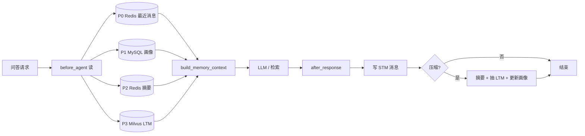
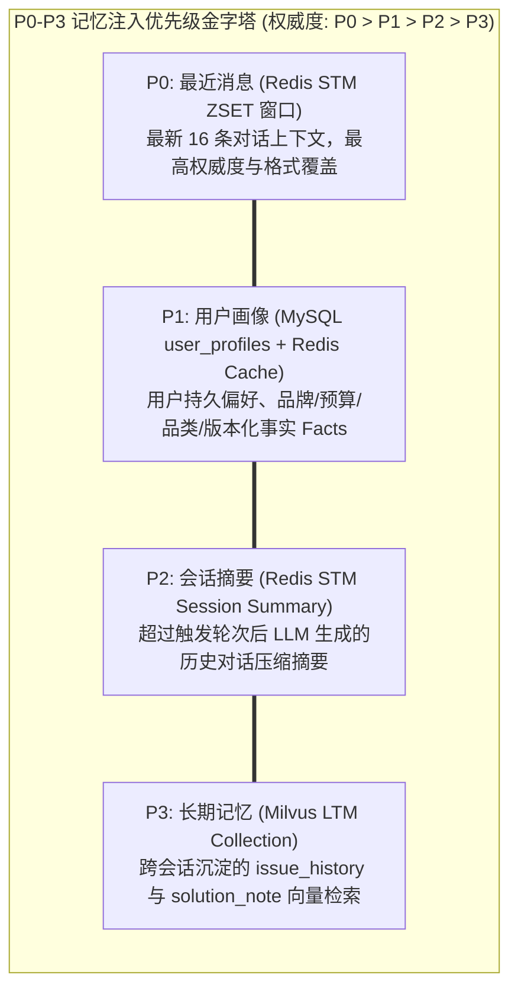
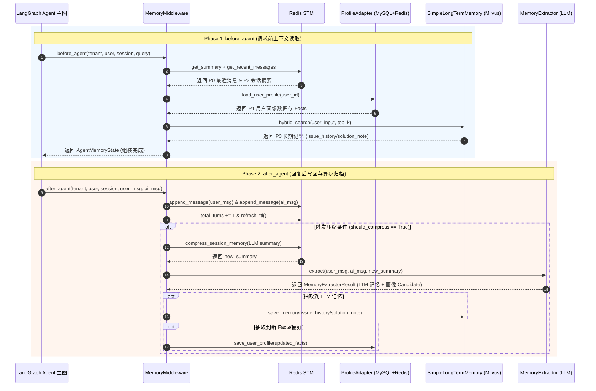

# 04 · 记忆系统全解析

> **流程图（必看）**：[00-全流程图集.md](00-全流程图集.md) 的 §11 before/after、§12 压缩抽取、§13 P0–P3 注入。

## 0.1 学习导航

### 这一章的核心目标

你不是要把“记忆系统”当成一个抽象名词记住，而是要回答清楚：

1. 为什么这里不是简单地把历史消息全拼进 Prompt。
2. 为什么要有 P0、P1、P2、P3 四层。
3. 为什么记忆读写要挂在 `before_agent` / `after_agent`。

### 读这一章前最好先知道什么

1. 记忆系统并不只等于 Redis。
2. 画像、摘要、长期记忆虽然都和“记住用户”有关，但作用完全不同。
3. AI 应用里的记忆重点不只是“能记住”，还包括“记错了怎么办、依赖挂了怎么办”。

### 这一章学完后你应该会什么

1. 能解释 P0-P3 分层及其优先级。
2. 能讲清 `before_agent` 读什么、`after_agent` 写什么。
3. 能解释 STM 为什么要压缩，LTM 为什么要检索和去重。
4. 能讲清删除会话时为什么要连带清理 STM / LTM。

### 推荐阅读方法

1. 先看 §0 图和 §1 分层，建立整体视图。
2. 再看 §3 MemoryMiddleware 编排，把读写顺序吃透。
3. 再看 §4 STM、§5 LTM，区分短期和长期能力。
4. 最后看“面试深挖”和附录 B，转成面试问答。

### 常见误区

1. 把画像和长期记忆混成一个概念。
2. 只会说“Redis 存历史消息”，但讲不清为什么还需要摘要和压缩。
3. 认为记忆失败就等于主对话一定失败，没有意识到这里做了降级。

## 0. 记忆总览（图）





## 1. 目标与分层

| 层级 | 存储 | 时效 | 职责 |
|---|---|---|---|
| **P0 最近消息** | Redis STM ZSET 窗口 | TTL 默认 24h | 当前会话权威上下文 |
| **P1 用户画像** | MySQL + Redis cache | durable | 品牌/预算/品类/标签/facts |
| **P2 会话摘要** | Redis STM summary | 随会话 | 压缩后的旧轮次 |
| **P3 长期记忆** | Milvus LTM | durable + 衰减/命中 | issue_history / solution_note |

冲突时优先级：**P0 > P1 > P2 > P3**（注入文案写死在 `memory_context.py`）。

### 1.1 完整模块地图（树状图 + 逐文件）

#### 树状图（记忆相关）

```text
app/knowledge/
├── README.md
├── domain/
│   ├── schemas.py              # MessageRecord / LTM / AgentMemoryState...
│   └── prompt_builder.py       # 压缩与注入 Prompt
└── infrastructure/
    ├── stm/
    │   ├── redis_short_term_memory.py
    │   └── stm_compressor.py
    ├── ltm/
    │   ├── simple_long_term_memory.py
    │   └── ltm_collection.py
    └── orchestration/
        ├── memory_middleware.py    # before/after 中枢
        ├── memory_extractor.py
        └── profile_adapter.py

app/chat/infrastructure/graph/
├── memory_context.py           # load/enrich/P0–P3 拼装
└── lifecycle_nodes.py          # after_response

app/user/                       # P1 画像（详见 07）
├── domain/schemas.py
├── domain/profile_payload_support.py
├── application/user_profile_service.py
└── infrastructure/repository/user_profile_repository.py

app/shared/core/app_config.py   # STM/LTM 默认配置
app/shared/retrieval/milvus_hybrid_core.py
app/platform/container.py       # 装配 middleware
```

#### knowledge 域（记忆主体）

| 文件 | 用处 |
|---|---|
| `app/knowledge/README.md` | 域边界：记忆+索引，非 HTTP |
| `domain/schemas.py` | `MessageRecord`/`SessionMeta`/`SessionSummary`/`LongTermMemory`/`AgentMemoryState`/`MemorySearchResult`/`MemoryExtractorResult` |
| `domain/prompt_builder.py` | 压缩 Prompt、LTM/摘要注入 Prompt 拼装 |
| `infrastructure/stm/redis_short_term_memory.py` | STM 读写、压缩触发、`clear_session` |
| `infrastructure/stm/stm_compressor.py` | `compress_message`/`decompress_message`（MsgPack+Zstd） |
| `infrastructure/ltm/simple_long_term_memory.py` | `save_memory`/`hybrid_search`/`deduplicate`/`soft_delete_session_memories`/hit 更新 |
| `infrastructure/ltm/ltm_collection.py` | collection 名、字段列表、`MEMORY_OUTPUT_FIELDS`、filter 构造 |
| `infrastructure/orchestration/memory_middleware.py` | `before_agent` / `after_agent` 编排中枢 |
| `infrastructure/orchestration/memory_extractor.py` | 压缩后 LLM 抽取语义记忆+画像候选 |
| `infrastructure/orchestration/profile_adapter.py` | `load_user_profile`/`save_user_profile` → user 域 |

#### chat 域（主图挂载点）

| 文件 | 用处 |
|---|---|
| `chat/infrastructure/graph/memory_context.py` | `load_memory_state`/`enrich_question`/`build_memory_context`/P0–P3 标题 |
| `chat/infrastructure/graph/lifecycle_nodes.py` | `after_response` 调 middleware.after_agent |
| `chat/application/conversation_service.py` | 删会话时 `_clear_conversation_memories` |

#### user 域（画像持久化，P1）

| 文件 | 用处 |
|---|---|
| `user/domain/schemas.py` | `UserProfileData`/`UserProfileFact`/`UserProfilePayload` |
| `user/domain/profile_payload_support.py` | 规范化 tags/facts/可选文本 |
| `user/application/user_profile_service.py` | get/upsert + Redis 缓存 |
| `user/infrastructure/repository/user_profile_repository.py` | MySQL 画像与 facts 版本 |

#### 配置与共享

| 文件 | 用处 |
|---|---|
| `shared/core/app_config.py` | `STMConfig`/`LTMConfig`/`MemoryConfig` 默认值 |
| `shared/retrieval/milvus_hybrid_core.py` | LTM hybrid 底层 dense/sparse |
| `platform/container.py` | `_create_memory_middleware` 装配 |

---

## 2. 核心类型

文件：`app/knowledge/domain/schemas.py`、`app/user/domain/schemas.py`

| 类型 | 所属 | 字段要点 |
|---|---|---|
| `MessageRecord` | knowledge | message_id, role, content, created_at, turn_index |
| `SessionMeta` | knowledge | total_turns, last_updated_at, last_compressed_turn |
| `SessionSummary` | knowledge | content, compressed_at, compressed_round |
| `LongTermMemory` | knowledge | memory_id, tenant/user, **session_id**, type, content, hit_count, is_deleted… |
| `MemorySearchResult` | knowledge | memory + score |
| `MemoryExtractorResult` | knowledge | 抽取候选项 |
| `AgentMemoryState` | knowledge | 一次请求快照：summary/recent/ltm/profile |
| `UserProfileData` | **user** | preferred_brand/budget_range/preferred_category/tags/facts |
| `UserProfilePayload` | **user** | + user_id |

**边界：** 画像类型在 user 域；记忆快照在 knowledge 域引用它。

---

## 3. MemoryMiddleware 编排

文件：`app/knowledge/infrastructure/orchestration/memory_middleware.py`  
装配：`app/platform/container.py::_create_memory_middleware`



依赖注入：

- `redis_stm: RedisShortTermMemory`  
- `milvus_ltm: SimpleLongTermMemory`  
- `memory_extractor: MemoryExtractor`  
- `profile_reader/writer` 默认 `profile_adapter.load/save_user_profile`  

### 3.1 `before_agent(tenant, user, session, user_input)`

三路读取落在三套互不相干的存储上、彼此无数据依赖，因此 **并发发起**
（`asyncio.gather`）——耗时从「三者之和」降为「三者最大值」。
这是每轮对话的必经路径，其中 LTM 还要跑 embedding + 向量检索，通常最慢。

```text
并发执行以下三路，任一路失败只降级该路：

  A. _read_short_term:  get_summary ‖ get_recent_messages
                        失败 → (None, [])
  B. _read_user_profile: user_id 可解析为 >0 才读 profile_reader(uid, redis)
                        匿名 → None（不覆盖默认画像）；失败 → {}
  C. _read_long_term:   ltm_enabled 才 milvus_ltm.hybrid_search(...)
                        未启用或失败 → []

汇总为 AgentMemoryState 返回
```

> 并发的副作用：三路降级告警的**到达顺序不确定**，断言时不要依赖顺序。

### 3.2 `after_agent(...)`

> **执行时机（v3.34.0 起）**：`after_response` 图节点只负责把本函数调度成
> **后台任务**（fire-and-forget + 引用跟踪），不再同步 await。
> 触发压缩的轮次要跑"摘要 LLM + 抽取 LLM"数秒——答案已经发给用户，
> 不该让 SSE 连接为记忆落盘挂着转圈。测试/停机可用
> `flush_pending_memory_writes()` 等待在途写入。

```text
1. 读取 SessionMeta，total_turns += 1
2. append_messages(user + assistant)   ← 一轮两条合并成一次 Redis 往返
3. save_meta + refresh_ttl
4. 复用第 1 步的 meta（不再重读一次），若 should_compress:
     compress_session_memory(summary_compressor=LLM)
     若压缩成功且 ltm_enabled:
       extractor.extract(user, assistant, new_summary)
       → 语义记忆 dedup + save_memory
       → profile 非空则 profile_writer
5. 可选：update_memory_hit_infos(全部命中)  ← 一次批量 upsert，不逐条往返
```

所有 Redis/Milvus 异常以**降级 + 单次告警**为主，避免刷屏和拖垮主对话。

**降级日志分级（v3.33.0 起）**——统一走 `app.shared.core.degradation.log_degradation`：

| 异常类别 | 判定 | 日志级别 | 是否带堆栈 |
|---|---|---|---|
| Redis 错误 / 超时 / 连接失败 / OSError | 可预期的外部依赖故障 | `warning` | 否 |
| 其余全部（TypeError、AttributeError…） | **疑似代码缺陷** | `error`（`logger.exception`） | **是** |

> WHY 要分级：此前两类共用一句无异常信息的 warning，代码缺陷和网络抖动在日志里
> 长得一模一样。项目真实踩过——LTM 配置是 frozen dataclass 却被按 dict 下标取值，
> 每次调用抛 `TypeError` 被吞掉，表现为「长期记忆静默失效」：不报错，
> 只是永远检索不到、也永远写不进去。

---

## 3.9 STM Redis 客户端：必须二进制安全

STM 消息经 `compress_message` 压缩为二进制 MsgPack/Zstd（首字节 `\x00`-`\x03`），
**不是合法 UTF-8**。因此 STM 客户端必须用
`create_stm_redis_client()`（`decode_responses=False`）构造。

> 踩坑记录（v3.34.0 修复）：曾用 `decode_responses=True` 的客户端——
> 写入正常，`zrevrange` 读取时 redis-py 严格 UTF-8 解码抛
> `UnicodeDecodeError`，被降级逻辑吞掉，表现为**短期记忆写得进、读不出，
> 每轮对话拿到的最近消息恒为空**。读路径（`decode_model`/`decode_messages`）
> 原生支持 bytes；画像缓存存 JSON 文本，`json.loads` 同样接受 bytes。

## 4. 短期记忆 STM（Redis）

文件：`stm/redis_short_term_memory.py`、`stm/stm_compressor.py`  
配置：`AppConfig.memory.stm`（`app_config.py`）

### 4.1 默认配置

配置对象：`AppConfig.memory.stm`（嵌套，非扁平）：

| 路径 | 默认 |
|---|---|
| `stm.enabled` | True |
| `stm.time_window_seconds` | 86400 |
| `stm.redis.key_prefix` | `agent:stm` |
| `stm.redis.ttl_seconds` | 86400 |
| `stm.redis.lock_ttl_seconds` | 10 |
| `stm.window.max_messages` | 16 |
| `stm.compression.enabled` | True |
| `stm.compression.trigger_rounds` | 6 |
| `stm.compression.trigger_messages` | 20 |
| `stm.compression.keep_recent_rounds` | 4 |

### 4.2 关键操作

| 方法 | 作用 |
|---|---|
| `append_message` | 写入消息（压缩存储，见 compressor） |
| `get_recent_messages` | 窗口内最近消息 |
| `get_summary` / **`save_summary`** | 会话摘要读写 |
| `get_meta` / `save_meta` | 轮次元信息 |
| `should_compress` | 是否触发压缩 |
| `compress_session_memory` | 旧消息 → LLM 摘要，保留最近 K 轮 |
| `refresh_ttl` | 滑动过期 |
| `clear_session` | 删除会话全部 STM key（messages/summary/meta/lock） |

### 4.3 压缩存储

`stm_compressor.py`：MsgPack + Zstd 多级压缩，降低 Redis 内存占用。

### 4.4 Key 设计（逻辑）

通常按 `tenant/user/session` 维度区分消息列表、meta、summary、锁；具体 key 拼接以 `STMRedisConfig.key_prefix` 与实现为准。

---

## 5. 长期记忆 LTM（Milvus）

文件：`ltm/simple_long_term_memory.py`、`ltm/ltm_collection.py`  
共享检索核：`app/shared/retrieval/milvus_hybrid_core.py`

### 5.1 能力

| 方法 | 作用 |
|---|---|
| `hybrid_search` | 向量 + 关键词类融合检索（RRF 思路） |
| `save_memory` | 写入语义记忆（含可选 `session_id`） |
| `deduplicate_memory` | 近重复抑制 |
| `update_memory_hit_info` | 命中次数/时间 |
| `soft_delete_session_memories` | 按 `session_id` 软删除会话级 LTM |

### 5.2 类型

仅两种语义类型进入 LTM：

- `issue_history`  
- `solution_note`  

用户画像**不再**作为 LTM 类型写入（走 MySQL 画像链路）。

### 5.3 Embedding

容器创建时：

- `EMBEDDING_TYPE == ollama` → `OllamaEmbeddings`  
- 否则 → `HuggingFaceEmbeddings`  

模型名来自 settings（默认 bge-m3 相关配置）。

---


### 5.4 SimpleLongTermMemory 方法过程

文件：`ltm/simple_long_term_memory.py` + `ltm_collection.py`

| 方法 | 过程 |
|---|---|
| `save_memory` | 生成 memory_id；embed content；写入 `session_id`（可空）；`insert_records` 写 dense+sparse；时间戳 |
| `deduplicate_memory` | 同 tenant/user/type 下向量近邻检索；score≥阈值则视为重复不写 |
| `hybrid_search` | filter：`tenant_id`+`user_id`+`is_deleted==false`；dense+sparse hybrid；limit 常为 top_k 的倍数再截断 |
| `update_memory_hit_info` | hit_count+1、last_hit_at=now，upsert |
| `soft_delete_session_memories` | query 匹配 tenant/user/session_id 且未删除记录 → partial upsert `is_deleted=true` |

过滤构造示例逻辑：

```text
tenant_id == "..." and user_id == "..." and is_deleted == false
# 可选 and memory_type == "issue_history"
```

与文档 RAG 的 **collection 名必须分离**（LTM vs `rag_documents`）。


## 6. 记忆抽取器

文件：`orchestration/memory_extractor.py`

```text
extract(user_message, assistant_message, session_summary?)
  → LLM JSON 输出
  → 过滤寒暄/敏感/无价值
  → (List[MemoryExtractorResult], UserProfileData)
```

画像字段通过 `user.domain.profile_payload_support.normalize_profile_data` 规范化。

---

## 7. 画像适配器（跨域端口）

文件：`orchestration/profile_adapter.py`

```text
load_user_profile(user_id, redis) → user_profile_service.get_profile
save_user_profile(user_id, profile, redis) → upsert_profile_data
```

**允许** knowledge → user.application；**禁止** user → knowledge。

---

## 8. 主图侧组装

文件：`chat/.../graph/memory_context.py`

### 8.1 `build_memory_context`

按 P0–P3 拼装带标题的多段文本 + 冲突优先级说明。

### 8.2 `enrich_question`

`原始问题 + 记忆上下文` → 供检索/ReAct 使用的增强问题。

### 8.3 `load_memory_state`

- 若 `state.memory_state` 已有则复用  
- 否则调 middleware.before_agent 并写回 state（请求内缓存）  

---

## 9. 与 API / 会话 ID 的关系

| 来源 | 映射 |
|---|---|
| Form `user_id` | configurable.user_id → 画像 + LTM 用户维 |
| Form `conversation_id` / 生成的 UUID | configurable.thread_id → STM session_id |
| tenant | 默认 `default`（多租户预留） |

**重要：** MySQL `conversations.id` 是整数；LangGraph `thread_id` 是字符串。前端应把 SSE 返回的 `X-Conversation-ID` 原样回传，才能命中同一 STM 会话。若只传 MySQL 数字 id 的字符串形式，需保证创建会话与问答使用同一约定。

---

## 10. 失败降级矩阵

| 故障 | before_agent | after_agent |
|---|---|---|
| Redis 挂 | 无短期上下文 | 写失败，对话仍返回用户 |
| MySQL 画像挂 | 空画像 | 画像更新失败 debug 日志 |
| Milvus 挂 | 无 LTM | 不落长期记忆 |
| LLM 抽取挂 | — | 压缩/抽取跳过 |

原则：**记忆从不可用不应导致主回答 500**（after_response 已吞异常）。

---

## 11. 相关测试

- `tests/knowledge/test_memory_middleware.py`  
- `tests/knowledge/test_redis_short_term_memory_support.py`  
- `tests/knowledge/test_simple_long_term_memory.py`  
- `tests/knowledge/test_memory_extractor.py`  
- `tests/knowledge/test_stm_clear_session.py`  
- `tests/knowledge/test_ltm_soft_delete_session.py`  
- `tests/chat/test_delete_conversation_memory_cleanup.py`  
- `tests/chat/test_lg_memory_runtime.py`、`test_lg_context.py`  

---


---

## 13. Redis 键精确格式（运维对照）

源码：`build_session_keys`（`redis_short_term_memory.py`）

```text
{prefix}:{tenant_id}:{user_id}:{session_id}:messages
{prefix}:{tenant_id}:{user_id}:{session_id}:summary
{prefix}:{tenant_id}:{user_id}:{session_id}:meta
{prefix}:{tenant_id}:{user_id}:{session_id}:lock
```

默认 `prefix = agent:stm`。

| 后缀 | 内容 |
|---|---|
| `messages` | 压缩后的 MessageRecord（MsgPack+Zstd，见 stm_compressor） |
| `summary` | SessionSummary JSON |
| `meta` | SessionMeta JSON（total_turns / last_compressed_turn…） |
| `lock` | 压缩时防并发 |

画像缓存（user 域服务）：

```text
user:profile:{user_id}   # TTL ≈ user_profile_cache_ttl，写成功则 DELETE
```

示例：`tenant=default, user_id=1, thread_id=42`

```text
agent:stm:default:1:42:messages
agent:stm:default:1:42:summary
agent:stm:default:1:42:meta
user:profile:1
```

排查：`docker compose exec redis redis-cli` → `SCAN`/`GET`（生产避免无约束 KEYS）。

---

## 14. MemoryExtractor 内部过程

文件：`orchestration/memory_extractor.py`

```text
extract(user_message, assistant_message, session_summary?)
  1. extract_summary_text(session_summary)  # SessionSummary→纯文本
  2. 组 prompt，调用 self.llm_client.ainvoke
  3. extract_response_text(response)  # 兼容 str / content list
  4. parse_llm_response → parse_first_json_object
  5. build_semantic_memories(parsed):
       - 只保留配置允许的 memory_type（issue_history / solution_note）
       - 过滤寒暄集合（你好/谢谢/…）
       - 过滤过短 content
       - 手机号脱敏 1xx****xxxx；身份证/银行卡/邮箱 pattern 处理
       - 敏感词 pattern 命中则丢弃
  6. profile = normalize_profile_data(parsed.get("profile"))
  7. 返回 (semantic_memories, profile)
```

调用点：仅在 `after_agent` **压缩成功且 ltm_enabled** 时触发（不是每轮都抽）。

---

## 15. STM 压缩触发与步骤（实现级）

```text
should_compress(total_turns, last_compressed_turn, msg_count):
  默认 compression.enabled
  且 (total_turns - last_compressed_turn >= trigger_rounds=6
      或 msg_count >= trigger_messages=20)

compress_session_memory(...):
  1. 加 lock key
  2. 取较旧消息（保留 keep_recent_rounds=4 对应的最近消息）
  3. summary_compressor(old_summary, old_messages) → LLM 文本
  4. 解析/保存 SessionSummary
  5. 裁剪 messages 窗口
  6. 更新 last_compressed_turn
  7. 释放 lock
```

消息编解码：`compress_message` / `decompress_message`（MsgPack，可选 Zstd）。


---

## 面试深挖：记忆系统

### Q1. P0>P1>P2>P3 的业务理由？

| 优先级 | 可信度逻辑 |
|---|---|
| P0 最近对话 | 用户刚说的，最新意图 |
| P1 画像 | 跨会话稳定偏好，但可能过时 |
| P2 摘要 | 压缩有损，可能丢细节 |
| P3 LTM | 历史语义，噪声/过期风险最高 |

冲突时以最近对话为准，避免「旧画像锁死新需求」。

### Q2. 消息压缩的字节格式？（非常容易被问）

`compress_message`：

| packed 长度 | 前缀 flag | 算法 |
|---|---|---|
| ≤2KB | `0x00` | 仅 MsgPack |
| ≤4KB | `0x01` | MsgPack + Zstd level 1 |
| ≤16KB | `0x02` | MsgPack + Zstd level 3 |
| >16KB | `0x03` | MsgPack + Zstd level 9 |

解压：flag∈{1,2,3} 走 ZstdDecompressor，否则纯 MsgPack。**解压端不需要知道 level**。

### Q3. 为何不是每轮都抽 LTM？

只在 **压缩成功且 ltm_enabled** 时 `extract`：  
- 控制 LLM 成本  
- 压缩点=信息沉淀点，语义更完整  
- 减少寒暄轮次污染长期库  

### Q4. 敏感信息怎么处理？

配置 `SENSITIVE_PATTERNS`：密码/验证码/身份证/银行卡/token/手机号。  
Extractor：手机号脱敏 `138****5678` 式；命中敏感则丢弃该条语义记忆。

### Q5. before_agent 部分失败会怎样？

Redis 挂 → 空 STM；画像挂 → {}；Milvus 挂 → []。  
**warn_once** 同类警告只打一次，防日志雪崩。主对话继续。

### Q6. session 维度是什么？

`tenant_id`（默认 default）+ `user_id` + `session_id(=thread_id)`。  
多租户预留 tenant；当前单租户即可。

### Q6.1 删除会话会清哪些记忆？

`DELETE /api/conversations/{id}` 成功后会联动：

| 存储 | 行为 |
|---|---|
| MySQL | 删会话元信息；兼容清理历史 `messages` 行 |
| Redis STM | `clear_session` 删除 messages/summary/meta/lock |
| Milvus LTM | 按 `session_id` 软删除（`is_deleted=true`） |

注意：

- LTM 写入时会带上当前 `session_id`（`after_agent` → `save_memory`）
- 历史无 `session_id` 的 LTM 不会被会话删除命中，避免误删跨会话记忆
- 记忆清理失败不回滚 MySQL 删除（只打日志）

### Q7. LTM 去重阈值 0.88 vs 检索 0.72？

- 检索 0.72：召回可稍松  
- 去重 0.88：更严，避免近重复写入  
面试可说「写路径比读路径更保守」。

## 15.5 关键函数（编排与清理）

### `MemoryMiddleware.before_agent`

```python
async def before_agent(
    self,
    tenant_id: str,
    user_id: str,
    session_id: str,
    user_input: str,
) -> AgentMemoryState
```

三路并发（`asyncio.gather`），任一路失败只降级该路：

| 读取 | 失败降级 |
|---|---|
| `_read_short_term`：`get_summary` ‖ `get_recent_messages` | summary=None，messages=[] |
| `_read_user_profile`：`profile_reader(uid)`（uid 可转 int） | `{}`（匿名返回 None） |
| `_read_long_term`：`milvus_ltm.hybrid_search(...)`（ltm_enabled） | `[]` |

同类错误用 `_degrade_once` 按 key 去重，避免刷屏；首次记录会经
`log_degradation` 分级——外部故障 warning，非预期异常 error + 完整堆栈。

### `MemoryMiddleware.after_agent`（职责摘要）

写入本轮 user/assistant（`append_messages` 单次往返）→ `should_compress` 则压缩 → 抽取 LTM / 更新画像 → 可选 `update_memory_hit_infos`（批量刷新命中）。  
实现细节见上文 §3 / §14–15。

### STM / LTM 清理（删会话用）

```python
# RedisShortTermMemory
async def clear_session(tenant_id, user_id, session_id) -> int  # 删除的 key 数

# SimpleLongTermMemory
async def soft_delete_session_memories(tenant_id, user_id, session_id) -> int
```

由 `ConversationService._clear_conversation_memories` 调用，**不**在 Repository。

### 画像 adapter

```python
async def load_user_profile(user_id: int, redis_client=None) -> UserProfileData
async def save_user_profile(user_id: int, profile: UserProfileData, redis_client=None) -> bool
```

文件：`orchestration/profile_adapter.py` → 转调 `user` 域。

## 16. 下一步

- 画像持久化细节 → [06-用户与画像.md](06-用户与画像.md)  
- LTM 与文档检索共享 → [05-知识检索与文档解析.md](05-知识检索与文档解析.md)

## 学习自测

1. 为什么优先级是 `P0 > P1 > P2 > P3`，而不是把长期记忆放得更高？
2. 为什么系统不直接把全部消息原样塞回 Prompt？
3. 为什么 `after_agent` 里要区分“先写 STM”再“可选压缩 + 抽取 + 更新画像”？
4. 会话删除时，为什么除了 MySQL 元信息，还要去清 Redis 和 Milvus？


---

## 附录 B · 面试重头戏：记忆系统（函数级通关稿）

## B1. 30 秒背诵

```text
读路径 before_agent（可被 load_memory_state 调用）:
  STM.get_summary + get_recent_messages
  profile_reader → user_profile_service
  LTM.hybrid_search(user_input)   # ltm_enabled
  → AgentMemoryState
  → build_memory_context: P0>P1>P2>P3 注入

写路径 after_response → after_agent:
  meta.total_turns++
  append user+assistant MessageRecord（MsgPack/Zstd）
  save_meta + refresh_ttl
  if should_compress:
      compress_session_memory(LLM summary)
      if compressed and ltm_enabled:
          extractor.extract → dedup → save_memory(session_id=...)
          profile 非空 → profile_writer
  可选 update_memory_hit_info

删会话:
  MySQL delete → clear_session + soft_delete_session_memories
  记忆失败不回滚 MySQL
```

## B2. 优先级 P0–P3（必须能解释冲突）

| 级 | 内容 | 存储 | 冲突时 |
|---|---|---|---|
| P0 | 最近对话 | Redis ZSET | **最高**，刚说的为准 |
| P1 | 用户画像 | MySQL+缓存 | 次之，可能过时 |
| P2 | 会话摘要 | Redis string | 有损压缩 |
| P3 | 长期语义 | Milvus | 最低，噪声风险 |

文案写在 `memory_context._MEMORY_SECTION_TITLES` + `_MEMORY_INSTRUCTIONS`。

## B3. 核心函数签名（背）

### B3.1 Middleware

```python
async def before_agent(self, tenant_id, user_id, session_id, user_input) -> AgentMemoryState
async def after_agent(self, tenant_id, user_id, session_id, user_message, assistant_message,
                      long_term_memories=None) -> None
```

### B3.2 主图侧

```python
def configurable_scope(config) -> (tenant_id, user_id, session_id)
async def load_memory_state(state, config, user_input) -> AgentMemoryState | None
async def enrich_question(state, config, question) -> str
def build_memory_context(summary, recent, ltm, profile) -> str
def build_enriched_question(question, memory_state) -> str
def format_recent_messages(...) / format_user_profile(...)
```

### B3.3 STM（RedisShortTermMemory）

| 方法 | 作用 |
|---|---|
| `append_message` | ZADD 压缩消息 |
| `get_recent_messages` | 窗口内消息（解码） |
| `get_summary` / **`save_summary`** | 摘要 |
| `get_meta` / `save_meta` | total_turns 等 |
| `get_message_count` | 条数 |
| `should_compress(turns, last_compressed, msg_count)` | 阈值判断 |
| `compress_session_memory(summary_compressor)` | 旧消息→摘要，留 recent rounds |
| `refresh_ttl` | 滑动过期 |
| `clear_session` | 删 messages/summary/meta/lock |

配置嵌套：`AppConfig.memory.stm.redis|window|compression`（不是扁平字段）。

### B3.4 LTM（SimpleLongTermMemory）

| 方法 | 作用 |
|---|---|
| `save_memory(..., session_id="")` | 写向量+稀疏；带 session |
| `deduplicate_memory` | 近重复则不写（阈值~0.88） |
| `hybrid_search` | dense+BM25+RRF，阈值~0.72 |
| `update_memory_hit_info` | 命中计数 partial update |
| `soft_delete_session_memories` | 按 session_id 软删 |
| `hard_purge_soft_deleted` | 定时任务：软删且超保留期 → Milvus 物理删除 |

类型仅：`issue_history` / `solution_note`（画像不进 LTM）。

### B3.5 Extractor

压缩成功后：`MemoryExtractor.extract(user_msg, assistant_msg, summary)`  
→ 语义列表 + 可选 profile dict；敏感模式过滤/手机号脱敏。

### B3.5 硬清理调度

| 配置 `ltm.purge` | 默认 |
|---|---|
| enabled | True |
| interval_seconds | 3600（1 小时） |
| retention_seconds | 7 天 |
| batch_limit | 16384 |

流程：软删（is_deleted=true）→ 超过 retention → 定时任务 `hard_purge_soft_deleted` → Milvus `delete`。  
启动：`AppContainer.start_background_jobs`（lifespan）；关闭时 `stop_background_jobs`。

## B4. Redis Key（运维/面试）

逻辑前缀 `agent:stm`（可配）：

```text
{prefix}:{tenant}:{user}:{session}:messages   # ZSET
{prefix}:{tenant}:{user}:{session}:summary
{prefix}:{tenant}:{user}:{session}:meta
{prefix}:{tenant}:{user}:{session}:lock
```

画像缓存（user 域）：`user:profile:{user_id}` TTL~1800s。

## B5. 压缩触发（数字）

| 配置 | 默认 |
|---|---|
| max_messages 窗口 | 16 |
| trigger_rounds | 6 |
| trigger_messages | 20 |
| keep_recent_rounds | 4 |
| TTL | 86400 |

字节 flag：0x00 仅 msgpack；0x01/02/03 + zstd L1/L3/L9（见面试 Q2 表）。

## B6. 降级矩阵（背）

| 故障 | 读 | 写 |
|---|---|---|
| Redis | 空 STM | 跳过 append（warn_once） |
| 画像服务 | {} | debug 日志 |
| Milvus | [] | 跳过 extract 写 / hit |
| before 整体异常 | memory_state=None，主对话继续 | — |
| after 异常 | — | warning，**用户已收到答案不 500** |

## B7. 删会话 vs 跨会话

- 删会话：STM 全清；LTM **仅**带该 `session_id` 的软删  
- 历史无 session_id 的 LTM：**不删**（防误伤跨会话）  
- 画像：durable，**删会话不删画像**  

## B8. 高频追问

1. **为何压缩点才抽 LTM？** 成本 + 语义完整 + 少寒暄污染。  
2. **去重 0.88 vs 检索 0.72？** 写严读松。  
3. **P0 与 P1 冲突？** 跟最近对话。  
4. **MsgPack 为何还要 Zstd？** 长消息省 Redis 内存。  
5. **lock 干嘛？** 压缩并发互斥。  
6. **tenant 现状？** 预留，默认 default。  
7. **profile 在哪个域？** user 拥有；knowledge 只 adapter。  
8. **after 写失败用户感知？** 答案已出，最多丢记忆。  
9. **session_id 从哪来？** configurable.thread_id。  
10. **clear_session 返回值？** 删除 key 数量（int）。

## B9. 口述演示

「每轮问答前 before_agent 拼四层记忆，P0 优先。答完 after_agent 写两条消息；够轮次就压缩，压缩成功才 extract 进 Milvus 并可能更新画像。删会话时库表和 STM/LTM 一起清，但画像保留。」
