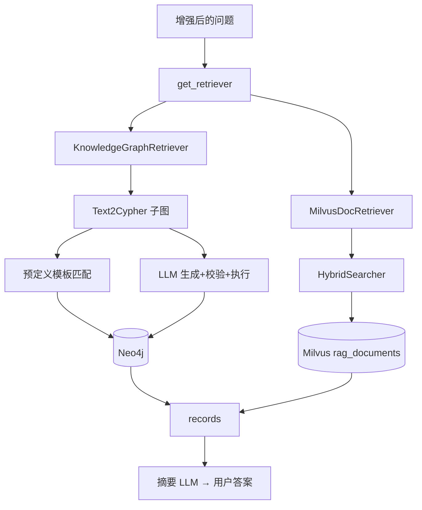
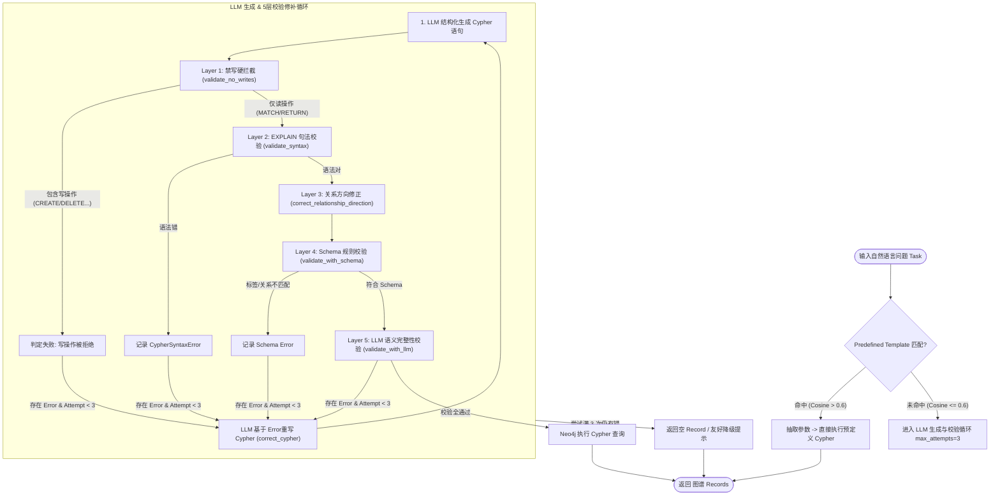
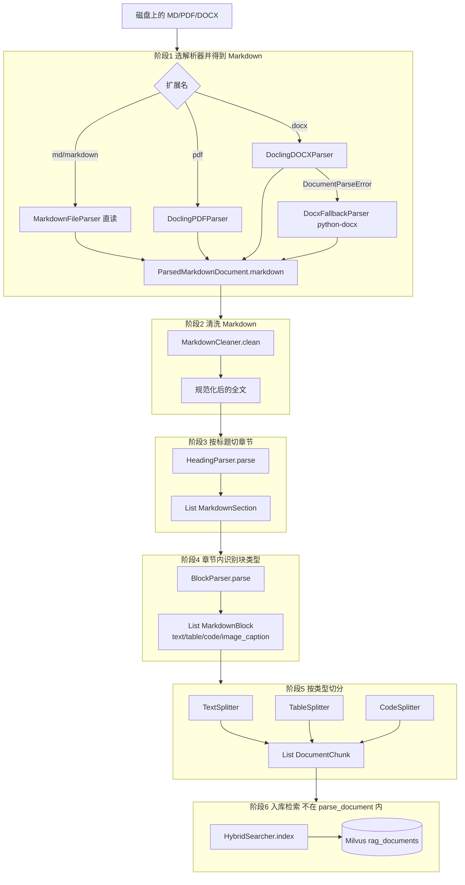
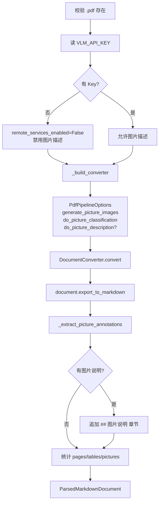
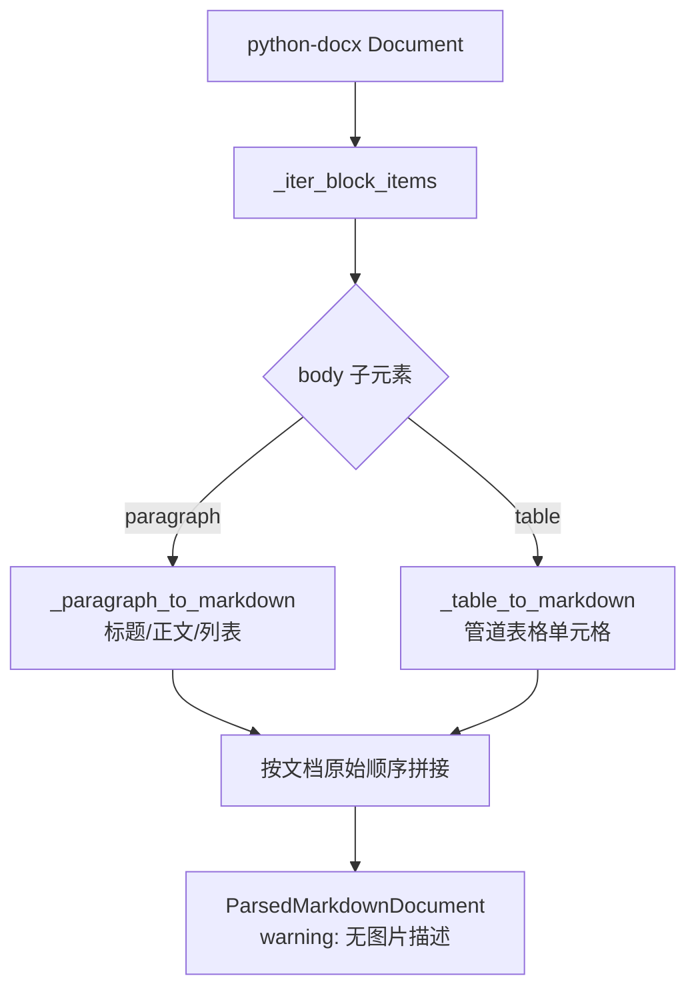
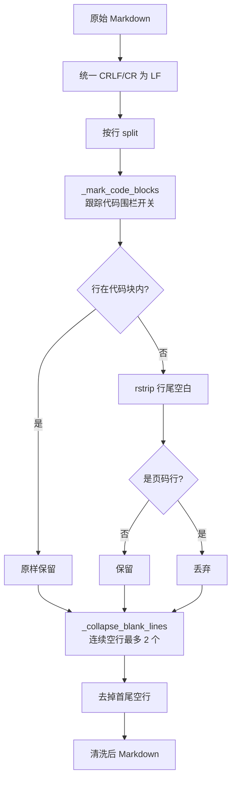
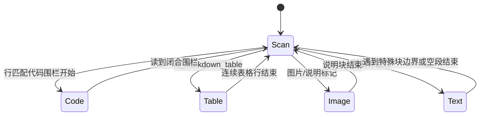
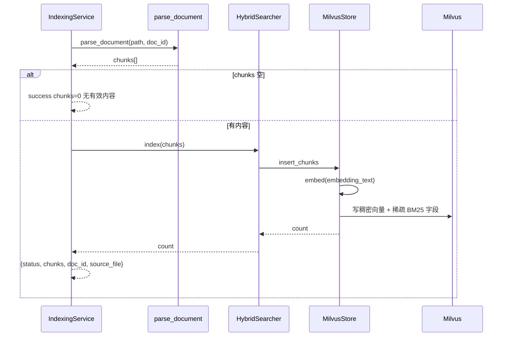
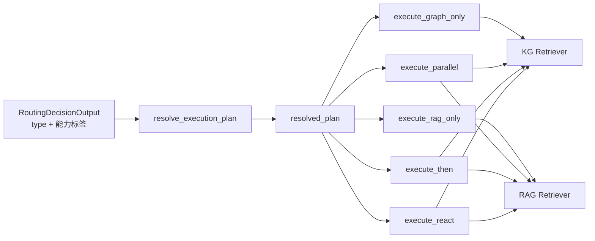

# 05 · 知识检索、图谱与文档解析全解析

> 📖 **函数级明细**：本文末 附录 K · 检索与解析逐函数手册（共享检索核/store/解析管线/切分器/索引服务/评测）。


> **流程图（必看）**：[00-全流程图集.md](00-全流程图集.md) 的 §8 能力标签→路径、§14 Text2Cypher、§15 上传索引、§16 doc_parser。  

## 0.1 学习导航

### 这一章为什么难但必须学

这章最容易把人看晕，因为它同时覆盖了两条知识链路：

1. 图谱检索：适合结构化业务关系问题。
2. 文档检索：适合手册、政策、说明文档。

但它恰恰最能体现这个项目不像“普通聊天机器人”的地方。

### 读这一章前最好先知道什么

1. KG 和 RAG 不是同一种检索，只是都服务于“增强回答”。
2. 文档上传成功，不等于文档已经能被检索到。
3. Text2Cypher 的重点不只是“生成 Cypher”，更是“怎么避免生成危险或无效查询”。

### 这一章学完后你应该会什么

1. 能解释为什么系统要同时保留 Neo4j 和 Milvus。
2. 能讲清 Text2Cypher 的快路径和慢路径。
3. 能讲清 DOCX / PDF / Markdown 从上传到可检索之间经历了哪些步骤。
4. 能解释 Hybrid Search、RRF、rerank 在这里分别起什么作用。

### 推荐阅读方法

1. 先读 §1，确认 KG 和 RAG 的角色分工。
2. 再读 §4 Text2Cypher，理解 KG 路径。
3. 再读 §5 和 §6，理解文档解析和索引路径。
4. 最后读 §7、§8，把检索和主图选路连接起来。

### 常见误区

1. 把 Neo4j 和 Milvus 都理解成“查知识”的两个实现，没有意识到数据形态完全不同。
2. 只会说“文档上传后会切分入库”，但讲不清 parser、splitter、indexer 的边界。
3. 觉得 Text2Cypher 的难点是生成，其实更大的难点是校验和约束。

## 0. 两路检索总览（图）



```mermaid
flowchart LR
FILE[MD/PDF/DOCX] --> API[上传落盘 + 分配 task_id]
API --> EV[Redis Streams<br/>document_index_requested]
EV --> INBOX[MySQL Inbox<br/>claim(task_id)]
INBOX --> W[事件消费者]
W --> PARSE[doc_parser.pipeline]
PARSE --> CH[chunks]
CH --> NORM[按 task_id 固定 chunk_id]
NORM --> IDX[HybridSearcher.index / reindex<br/>idempotency_key=task_id]
IDX --> MV[(Milvus)]
MV --> SEARCH[问答时 RAG search]
```

## 1. 两路知识源

| 路 | 数据 | 入口 | 实现 |
|---|---|---|---|
| **KG** | Neo4j 电商图谱 | `KnowledgeGraphRetriever` | Text2Cypher 子图 + 预定义模板 |
| **RAG** | 上传文档 chunk | `MilvusDocRetriever` | doc_parser hybrid search |

二者统一为 `Retriever` 接口，由主图执行节点 / ReAct 工具调用。

### 1.1 完整模块地图（树状图 + 逐文件）

#### 树状图

```text
app/chat/infrastructure/
├── retrievers/
│   ├── retriever_contracts.py
│   ├── retriever_implementations.py
│   └── retriever_runtime.py
└── kg/
    ├── neo4j_conn.py
    ├── text2cypher_workflow.py
    ├── text2cypher_state.py
    ├── northwind_retriever.py
    ├── predefined_cypher/
    │   ├── cypher_dict.py          # 27 模板
    │   ├── descriptions.py
    │   └── utils.py                # cosine + 匹配器
    └── validation/
        ├── validators.py
        ├── models.py
        ├── schema_validation_rules.py
        └── utils/cypher_extractors.py

app/knowledge/
├── application/
│   ├── indexing_service.py
│   └── indexing_contracts.py
└── infrastructure/doc_parser/
    ├── pipeline.py
    ├── config.py
    ├── exceptions.py
    ├── models.py
    ├── parsers/
    │   ├── base.py
    │   ├── markdown_parser.py
    │   ├── docling_pdf_parser.py
    │   ├── docling_docx_parser.py
    │   └── docx_fallback_parser.py
    ├── markdown/
    │   ├── cleaner.py
    │   ├── heading_parser.py
    │   ├── block_parser.py
    │   └── table_utils.py
    ├── splitters/
    │   ├── text_splitter.py
    │   ├── table_splitter.py
    │   └── code_splitter.py
    └── retrieval/
        ├── config.py
        ├── hybrid_search.py
        ├── milvus_store.py
        └── rrf.py

app/api/upload.py
app/shared/
├── streams.py                    # Stream 发布、消费组、PEL 重放、死信
└── background_tasks.py           # 任务状态协议 + 仅进程内回退
app/platform/
├── events.py                     # document_index_requested handler
└── event_inbox.py                # MySQL Inbox 认领 / 完成 / 重试租约
app/shared/retrieval/milvus_hybrid_core.py
```

#### A. Retriever 与运行时（chat）

| 文件 | 用处 |
|---|---|
| `retrievers/retriever_contracts.py` | `Retriever` ABC、`RetrieverRegistry`、`KG_RETRIEVER_NAME`/`RAG_RETRIEVER_NAME` |
| `retrievers/retriever_implementations.py` | `KnowledgeGraphRetriever`（调 T2C）、`MilvusDocRetriever`（调 HybridSearcher） |
| `retrievers/retriever_runtime.py` | `get_retriever`：容器锁内懒创建并 register |

#### B. 知识图谱 KG（chat/infrastructure/kg）

| 文件 | 用处 |
|---|---|
| `kg/README.md` | KG 说明 |
| `kg/neo4j_conn.py` | 连接池/健康检查/`get_neo4j_graph` |
| `kg/text2cypher_workflow.py` | 预定义匹配节点 + LLM 生成/校验/修正/执行子图 |
| `kg/text2cypher_state.py` | CypherState 等 TypedDict |
| `kg/northwind_retriever.py` | 词重叠 few-shot 示例（给生成 Prompt） |
| `kg/predefined_cypher/cypher_dict.py` | **27** 条 Cypher 模板字典 |
| `kg/predefined_cypher/descriptions.py` | 模板自然语言描述 |
| `kg/predefined_cypher/utils.py` | `_VectorQueryMatcher`、`cosine_similarity_score`、抽参 |
| `kg/validation/validators.py` | EXPLAIN/禁写/方向/schema/LLM 校验编排 |
| `kg/validation/models.py` | 校验输入输出结构 |
| `kg/validation/schema_validation_rules.py` | 标签/关系/属性规则 |
| `kg/validation/utils/cypher_extractors.py` | 正则抽 Cypher 片段 |

#### C. 文档解析与 RAG 索引（knowledge/doc_parser + application）

| 文件 | 用处 |
|---|---|
| `knowledge/application/indexing_service.py` | `process_file`、扩展名判断、`build_doc_id` |
| `knowledge/application/indexing_contracts.py` | `UploadFileInfo`/`IndexingResult`/`PipelineLoader` |
| `knowledge/application/document_indexing_job.py` | `run_document_indexing_job_with_task`：索引结果与文档元数据状态回写 |
| `doc_parser/pipeline.py` | `parse_document` 总控 |
| `doc_parser/config.py` | `ParserConfig`（chunk 大小、VLM 开关等） |
| `doc_parser/exceptions.py` | `UnsupportedFileTypeError`/`DocumentParseError`/… |
| `doc_parser/models.py` | `DocumentChunk`/`ParsedMarkdownDocument`/Section/Block |
| `doc_parser/parsers/base.py` | 解析器基类、文件校验 |
| `doc_parser/parsers/markdown_parser.py` | `.md`/`.markdown` 直读 |
| `doc_parser/parsers/docling_pdf_parser.py` | PDF→Markdown（Docling） |
| `doc_parser/parsers/docling_docx_parser.py` | DOCX→Markdown（Docling） |
| `doc_parser/parsers/docx_fallback_parser.py` | python-docx 兜底 |
| `doc_parser/markdown/cleaner.py` | Markdown 清洗 |
| `doc_parser/markdown/heading_parser.py` | 多级标题→Section |
| `doc_parser/markdown/block_parser.py` | Section→text/table/code/image 块 |
| `doc_parser/markdown/table_utils.py` | Markdown 表解析/重建 |
| `doc_parser/splitters/text_splitter.py` | 文本递归切分+overlap |
| `doc_parser/splitters/table_splitter.py` | 表按行拆+重复表头 |
| `doc_parser/splitters/code_splitter.py` | 代码按函数/类边界 |
| `doc_parser/retrieval/config.py` | `RetrievalConfig`（collection、top_k、rrf_k） |
| `doc_parser/retrieval/hybrid_search.py` | `HybridSearcher.index/search` |
| `doc_parser/retrieval/milvus_store.py` | rag_documents 写入/schema |
| `doc_parser/retrieval/rrf.py` | Cross-Encoder Reranker（可选 FlagEmbedding） |
| `doc_parser/README.md` | 解析模块说明 |

#### D. 共享检索核与上传入口

| 文件 | 用处 |
|---|---|
| `shared/retrieval/milvus_hybrid_core.py` | dense/sparse/hybrid 公共实现（RAG+LTM 复用） |
| `api/upload.py` | HTTP 上传、状态初始化与 `document_index_requested` 事件发布（见 03） |
| `shared/streams.py` | Redis Stream 消费组、PEL 重放、死信与 ACK 顺序 |
| `platform/event_inbox.py` | MySQL Inbox：按 `(tenant_id, event_type, event_id)` 认领、租约、完成与失败审计 |
| `platform/events.py` | `document_index_requested` handler：转入索引任务并复用状态协议 |
| `shared/background_tasks.py` | Redis 任务状态协议；仅事件基础设施不可用时的进程内回退执行 |

---

## 2. Retriever 抽象

目录：`app/chat/infrastructure/retrievers/`

| 文件 | 职责 |
|---|---|
| `retriever_contracts.py` | 接口、注册表、名称常量 |
| `retriever_implementations.py` | KG/RAG 适配器 |
| `retriever_runtime.py` | 懒初始化 + AppContainer 缓存 |

`search(query: str) -> dict` 约定字段：

- `records`: 结果列表  
- 可选 `errors` / `steps` / `raw` 等（KG 路径更丰富）  

---

## 3. Neo4j 连接

文件：`app/chat/infrastructure/kg/neo4j_conn.py`

- 使用 `settings` 中 NEO4J_*  
- 连接缓存在 `AppContainer.neo4j_graph`  
- 带健康检查时间戳，避免频繁重连  
- `get_neo4j_graph()` / 内部 `_get_neo4j_graph(container)`  

不可用时：主图返回友好“图谱暂不可用”类消息（`no_neo4j_response`）。

**连接缓存细节（neo4j_conn）：**

- 缓存在 `AppContainer.neo4j_graph`
- `HEALTH_CHECK_INTERVAL = 30` 秒内不重复探活
- 探活失败则清空缓存并尝试重建
- `get_neo4j_graph()` 异步封装；runtime 内用 `_get_neo4j_graph(container)`


---

## 4. Text2Cypher 工作流

文件：`kg/text2cypher_workflow.py`、`text2cypher_state.py`、`validation/*`、`predefined_cypher/*`、`northwind_retriever.py`

### 4.1 总体策略

```text
用户问题
  ├─ 预定义模板向量匹配（快路径）
  │    命中 → 填参数 → 执行 Cypher
  └─ 未命中 → LLM 生成 Cypher
               → 多层校验
               → 失败则修正循环
               → 执行
               → 返回 records
```

### 4.2 预定义 Cypher

| 文件 | 内容 |
|---|---|
| `predefined_cypher/cypher_dict.py` | 模板字典 |
| `predefined_cypher/descriptions.py` | 模板描述（供语义匹配） |
| `predefined_cypher/utils.py` | 向量匹配器、`cosine_similarity_score`、参数提取 |

匹配流程：

```text
query_name + description → Ollama embed（timeout 10s，失败→零向量）
用户问题 → embed
cosine_similarity_score(question_vec, template_vec)   # NumPy 自研，非 sklearn
match_query：similarity >= 0.5 才进入候选
工作流 predefined_match：similarity > 0.6 才走模板快路径
```

**关键函数（`predefined_cypher/utils.py`）：**

```python
def cosine_similarity_score(left: NDArray, right: NDArray) -> float
# 零向量 → 0.0；否则 dot/(||a||||b||)

def build_embed_payload(model: str, texts: list[str]) -> dict
def fallback_embeddings(count: int, *, embedding_dim: int = 1024) -> list[list[float]]
def extract_parameter_names(cypher_template: str) -> list[str]  # $param
def extract_parameters_with_rules(user_question, param_names) -> dict[str, str]

class _VectorQueryMatcher:
    def match_query(self, user_question: str, top_k: int = 3) -> list[dict]
    # 每项：query_name, similarity, cypher；阈值默认 0.5
    def extract_parameters(self, user_question, query_name, llm=None) -> dict[str, str]

def create_vector_query_matcher(predefined_cypher_dict) -> _VectorQueryMatcher
```

**实现要点：** 不用 sklearn（类型噪声 + 零向量 nan）；embed 失败零向量 → 相似度 0 → 倾向 LLM 生成。

### 4.3 Few-shot 示例

`northwind_retriever.py`：按问题取 Cypher 示例文本，注入生成 Prompt。

### 4.4 校验层（validation/）

| 文件 | 职责 |
|---|---|
| `models.py` | 校验任务/输出结构 |
| `validators.py` | 编排：语法、schema、写操作拦截、LLM 校验、方向修正等 |
| `schema_validation_rules.py` | 纯 schema 规则 |
| `utils/cypher_extractors.py` | 从 Cypher 抽实体等 |

**安全关键：** `validate_no_writes_in_cypher_query` 硬拦截写操作，防止 LLM 生成破坏性语句。

### 4.5 生成 / 修正 Prompt

工作流内嵌 ChatPromptTemplate：

- 生成：schema + fewshot + question → 只输出 Cypher  
- 修正：基于 errors 重写 Cypher  
- LLM 校验：语法/变量/是否足以回答/是否符合 schema  

---


### 4.6 校验函数逐步说明（validators.py）

按 Text2Cypher 工作流实际调用顺序：

| 函数 | 做什么 | 失败时 |
|---|---|---|
| `validate_cypher_query_syntax` | 对 Neo4j 跑 `EXPLAIN`，查语法 | 返回 errors 列表 |
| `validate_no_writes_in_cypher_query` | 子串拦截 CREATE/DELETE/DETACH DELETE/SET/REMOVE/FOREACH/MERGE（**无 DROP**） | 有写操作则 errors |
| `correct_cypher_query_relationship_direction` | 按 schema 修正关系方向 | 返回修正后语句 |
| `validate_cypher_query_with_schema` | 标签/关系/属性是否在 schema 中 | errors |
| `validate_cypher_query_with_llm` | LLM 结构化校验（缺信息、语义） | errors / 建议 |
| `retrieve_and_parse_schema_from_graph_for_prompts` | 从图拉 schema 文本给 Prompt | — |

修正循环：`validate → errors → correct_cypher → validate`，工作流内 **最多 3 次**（以 `text2cypher_workflow` 为准）。

### 4.7 查询改写（execution_utils，执行节点用）

| 函数 | 改写结果 |
|---|---|
| `build_graph_only_query(q)` | `q + "（仅查询结构化数据：价格、库存、订单等）"` |
| `build_rag_only_query(q)` | `q + "（仅查询文档知识：售后政策、保修条款等）"` |
| `build_graph_then_rag_query(q, records)` | `"已知信息：{records}\n\n查询：{q}"` |

`summarize_and_build_response`：用电商客服风格 Prompt + `cypher_model` 链，生成「进度消息 + 最终摘要」两条 AIMessage。


### 4.8 Text2Cypher 图节点编排与 5 层验证流程图



`create_text2cypher_agent(...)` 关键参数：

| 参数 | 默认 | 含义 |
|---|---|---|
| `llm_cypher_validation` | True | 是否启用 LLM 校验 |
| `max_attempts` | **3** | 生成/校验/修正最大轮次 |
| `attempt_cypher_execution_on_final_attempt` | False | 最后一轮是否强行执行 |
| `predefined_cypher_dict` / `query_descriptions` | 可选 | 模板快路径 |

**预定义快路径 `predefined_match`：**

```text
matcher.match_query(task, top_k=1)
if 无命中 或 similarity <= 0.6:
    next_action_cypher = "generate"   # 走 LLM
else:
    params = matcher.extract_parameters(task, query_name, llm=llm)
    records = graph.query(cypher, params=全转 str)
    失败 → records=[] 并打 warning
    next_action_cypher = "execute_cypher"  # 或直接带 records 输出
```

**LLM 路径（概念）：**

```text
generate_cypher(schema + fewshot + question)
  → validate:
       EXPLAIN 语法
       禁写关键字
       关系方向修正 (CypherQueryCorrector)
       schema 校验 和/或 LLM 校验
  → 有 errors 且 attempts < max_attempts → correct_cypher → 再 validate
  → 通过 → execute_cypher → records
  → 空 records 时填充友好 error 占位 dict
```

**`validate_no_writes_in_cypher_query`：** 写操作硬拦截，与 Prompt 层共同构成图谱安全底线。

**`validate_cypher_query_syntax`：** `graph.query(f"EXPLAIN {cypher}")`，捕获 `CypherSyntaxError`。


### 4.9 预定义模板清单（共 27 条）

按 `cypher_dict.py` 分类（面试可答「约 27 条，不是笼统几十」）：

| 类 | 模板名 |
|---|---|
| 产品 | product_by_name, product_by_category, product_by_supplier, products_low_stock, products_popular |
| 客户 | customer_by_name, customer_orders, customer_purchase_history |
| 订单 | order_by_id, order_details, recent_orders, delayed_orders |
| 供应商 | supplier_by_country, supplier_products |
| 类别 | all_categories, category_products, category_product_count |
| 员工 | employee_by_name, employee_processed_orders |
| 评论 | product_reviews, top_rated_products |
| 销售 | product_sales, category_sales, monthly_sales |
| 智能家居示例 | smart_home_products, smart_speakers, smart_lighting |

#### 4.9.1 模板全文（`cypher_dict.py`）

| 模板名 | Cypher |
|---|---|
| `product_by_name` | `MATCH (p:Product) WHERE p.ProductName CONTAINS $product_name RETURN p.ProductName, p.UnitPrice, p.UnitsInStock, p.CategoryName` |
| `product_by_category` | `MATCH (p:Product)-[:BELONGS_TO]->(c:Category) WHERE c.CategoryName = $category_name RETURN p.ProductName, p.UnitPrice, p.UnitsInStock` |
| `product_by_supplier` | `MATCH (p:Product)-[:SUPPLIED_BY]->(s:Supplier) WHERE s.CompanyName = $supplier_name RETURN p.ProductName, p.UnitPrice, p.UnitsInStock` |
| `products_low_stock` | `MATCH (p:Product) WHERE toInteger(p.UnitsInStock) < 10 RETURN p.ProductName, p.UnitsInStock, p.CategoryName ORDER BY toInteger(p.UnitsInStock)` |
| `products_popular` | `MATCH (p:Product)<-[:ABOUT]-(r:Review) RETURN p.ProductName, count(r) as ReviewCount, avg(toFloat(r.Rating)) as AvgRating ORDER BY ReviewCount DESC LIMIT 10` |
| `customer_by_name` | `MATCH (c:Customer) WHERE c.CompanyName CONTAINS $customer_name RETURN c.CompanyName, c.ContactName, c.Phone, c.Country` |
| `customer_orders` | `MATCH (c:Customer)-[:PLACED]->(o:Order) WHERE c.CompanyName = $customer_name RETURN o.orderId, o.OrderDate, o.ShippedDate` |
| `customer_purchase_history` | `MATCH (c:Customer)-[:PLACED]->(o:Order)-[:CONTAINS]->(p:Product) WHERE c.CompanyName = $customer_name RETURN p.ProductName, o.OrderDate, p.UnitPrice` |
| `order_by_id` | `MATCH (o:Order) WHERE o.orderId = $order_id RETURN o.OrderDate, o.RequiredDate, o.ShippedDate, o.CustomerName` |
| `order_details` | `MATCH (o:Order)-[contains:CONTAINS]->(p:Product) WHERE o.orderId = $order_id RETURN p.ProductName, contains.Quantity, contains.UnitPrice, toFloat(contains.Quantity) * toFloat(contains.UnitPrice) as TotalPrice` |
| `recent_orders` | `MATCH (o:Order) RETURN o.orderId, o.OrderDate, o.CustomerName ORDER BY o.OrderDate DESC LIMIT 10` |
| `delayed_orders` | `MATCH (o:Order) WHERE o.RequiredDate < o.ShippedDate OR (o.RequiredDate < date() AND o.ShippedDate IS NULL) RETURN o.orderId, o.OrderDate, o.RequiredDate, o.ShippedDate, o.CustomerName` |
| `supplier_by_country` | `MATCH (s:Supplier) WHERE s.Country = $country RETURN s.CompanyName, s.ContactName, s.Phone` |
| `supplier_products` | `MATCH (s:Supplier)<-[:SUPPLIED_BY]-(p:Product) WHERE s.CompanyName = $supplier_name RETURN p.ProductName, p.UnitPrice, p.UnitsInStock` |
| `all_categories` | `MATCH (c:Category) RETURN c.CategoryName, c.Description` |
| `category_products` | `MATCH (c:Category)<-[:BELONGS_TO]-(p:Product) WHERE c.CategoryName = $category_name RETURN p.ProductName, p.UnitPrice, p.UnitsInStock` |
| `category_product_count` | `MATCH (c:Category)<-[:BELONGS_TO]-(p:Product) RETURN c.CategoryName, count(p) as ProductCount ORDER BY ProductCount DESC` |
| `employee_by_name` | `MATCH (e:Employee) WHERE e.FirstName + ' ' + e.LastName CONTAINS $employee_name RETURN e.FirstName, e.LastName, e.Title, e.HireDate` |
| `employee_processed_orders` | `MATCH (e:Employee)-[:PROCESSED]->(o:Order) WHERE e.FirstName + ' ' + e.LastName = $employee_name RETURN o.orderId, o.OrderDate, o.CustomerName` |
| `product_reviews` | `MATCH (p:Product)<-[:ABOUT]-(r:Review) WHERE p.ProductName = $product_name RETURN r.CustomerName, r.Rating, r.ReviewText, r.ReviewDate ORDER BY r.ReviewDate DESC` |
| `top_rated_products` | `MATCH (p:Product)<-[:ABOUT]-(r:Review) WITH p.ProductName as ProductName, avg(toFloat(r.Rating)) as AvgRating, count(r) as ReviewCount WHERE ReviewCount > 3 RETURN ProductName, AvgRating, ReviewCount ORDER BY AvgRating DESC LIMIT 10` |
| `product_sales` | `MATCH (o:Order)-[c:CONTAINS]->(p:Product) WHERE p.ProductName = $product_name RETURN sum(toFloat(c.Quantity) * toFloat(c.UnitPrice)) as TotalSales` |
| `category_sales` | `MATCH (o:Order)-[c:CONTAINS]->(p:Product)-[:BELONGS_TO]->(cat:Category) RETURN cat.CategoryName, sum(toFloat(c.Quantity) * toFloat(c.UnitPrice)) as TotalSales ORDER BY TotalSales DESC` |
| `monthly_sales` | `MATCH (o:Order)-[c:CONTAINS]->(p:Product) RETURN substring(o.OrderDate, 0, 7) as Month, sum(toFloat(c.Quantity) * toFloat(c.UnitPrice)) as Sales ORDER BY Month` |
| `smart_home_products` | `MATCH (p:Product)-[:BELONGS_TO]->(c:Category) WHERE c.CategoryName CONTAINS '智能' RETURN p.ProductName, p.UnitPrice, p.UnitsInStock, c.CategoryName` |
| `smart_speakers` | `MATCH (p:Product)-[:BELONGS_TO]->(c:Category) WHERE c.CategoryName = '智能音箱' RETURN p.ProductName, p.UnitPrice, p.UnitsInStock` |
| `smart_lighting` | `MATCH (p:Product)-[:BELONGS_TO]->(c:Category) WHERE c.CategoryName = '智能照明' RETURN p.ProductName, p.UnitPrice, p.UnitsInStock` |

**参数占位：** `$product_name` / `$category_name` / `$supplier_name` / `$customer_name` / `$order_id` / `$country` / `$employee_name`。  
规则抽取见 `extract_parameters_with_rules`（product/category/order 有正则）；否则 LLM JSON 抽参。

#### 4.9.2 模板描述（`QUERY_DESCRIPTIONS`，用于 embedding 匹配）

匹配输入文本是：`"{query_name} {description}"`（见 `build_query_texts`）。描述回答「用户可能怎么问」。

| 模板名 | 描述摘要 |
|---|---|
| product_by_name | 某具体产品价格/库存/类别 |
| product_by_category | 某类别下有哪些商品 |
| product_by_supplier | 某供应商提供哪些商品 |
| products_low_stock | 库存低于 10、需补货 |
| products_popular | 评论数最多/最受欢迎 |
| customer_by_name | 客户联系方式/地址 |
| customer_orders | 客户订单历史 |
| customer_purchase_history | 客户买过哪些产品 |
| order_by_id | 订单状态/日期 |
| order_details | 订单含哪些商品与金额 |
| recent_orders | 最近 10 单 |
| delayed_orders | 延迟发货订单 |
| supplier_by_country | 某国供应商 |
| supplier_products | 某供应商产品列表 |
| all_categories | 所有类别 |
| category_products | 类别下产品 |
| category_product_count | 各类别产品数 |
| employee_by_name | 员工职位/入职 |
| employee_processed_orders | 员工处理的订单 |
| product_reviews | 产品评论 |
| top_rated_products | 高评分产品（评论数>3） |
| product_sales | 产品销售额 |
| category_sales | 类别销售额 |
| monthly_sales | 月度销售趋势 |
| smart_home_products | 智能家居相关产品 |
| smart_speakers | 智能音箱 |
| smart_lighting | 智能照明 |


### 4.10 图谱节点与关系（从模板反推）

| 节点标签 | 关系 | 含义 |
|---|---|---|
| Product | BELONGS_TO → Category | 商品归属类别 |
| Product | SUPPLIED_BY → Supplier | 供应 |
| Customer | PLACED → Order | 下单 |
| Order | CONTAINS → Product | 订单行（含 Quantity/UnitPrice） |
| Employee | PROCESSED → Order | 处理订单 |
| Review | ABOUT → Product | 评论 |

常见属性：`ProductName/UnitPrice/UnitsInStock/CategoryName`，`orderId/OrderDate/ShippedDate`，`Rating/ReviewText` 等。

### 4.11 Neo4j 连接探活

- `HEALTH_CHECK_INTERVAL = 30` 秒  
- 间隔内复用 `AppContainer.neo4j_graph`  
- 探活失败清空缓存再连  


### 4.12 Northwind few-shot 示例检索（`northwind_retriever.py`）

用途：给 **LLM 生成 Cypher** 路径提供 few-shot（`get_examples(query, k=5)`），与预定义模板向量匹配是**两条线**。

#### 算法（不是 embedding）

```text
1. 展平 _EXAMPLES_BY_CATEGORY 全部示例
2. 对用户 query 分词 set(re.findall(r"\w+", lower))
3. 每条示例打分：
   - 词重叠数 * 2
   - 若 query 命中重要类 pattern（产品/类别/供应商/订单/客户/员工/物流|配送/评价|评论/手册|说明书）
     且示例 question 也命中 → +3
     且示例落在对应中文分类名里 → +2
4. 按 score 降序取 top k（默认 5）
5. 格式化为多段：
   Question: ...
   Cypher: ...
```

重要 pattern：`产品|商品`、`类别|分类`、`供应商`、`订单`、`客户`、`员工`、`物流|配送`、`评价|评论`、`手册|说明书`。

#### 示例库分类与原文

**产品查询**

| 问题 | Cypher |
|---|---|
| 查询所有智能音箱类产品 | `MATCH (p:Product)-[:BELONGS_TO]->(c:Category) WHERE c.CategoryName = '智能音箱' RETURN p.ProductName, p.UnitPrice, p.UnitsInStock` |
| 查找库存少于20的产品 | `MATCH (p:Product) WHERE p.UnitsInStock < 20 RETURN p.ProductName, p.UnitsInStock ORDER BY p.UnitsInStock` |
| 哪些产品的单价高于5000元？ | `MATCH (p:Product) WHERE p.UnitPrice > 5000 RETURN p.ProductName, p.UnitPrice ORDER BY p.UnitPrice DESC` |

**产品类别**

| 问题 | Cypher |
|---|---|
| 智能家居有哪些产品类别？ | `MATCH (c:Category) RETURN c.CategoryName, c.Description` |
| 智能灯具类别下有哪些产品？ | `MATCH (p:Product)-[:BELONGS_TO]->(c:Category) WHERE c.CategoryName = '智能灯具' RETURN p.ProductName, p.UnitPrice` |

**供应商相关**

| 问题 | Cypher |
|---|---|
| 供应商小米智能家居提供了哪些产品？ | `MATCH (p:Product)-[:SUPPLIED_BY]->(s:Supplier) WHERE s.CompanyName = '小米智能家居' RETURN p.ProductName, p.QuantityPerUnit, p.UnitPrice` |
| 中国供应商提供了哪些产品？ | `MATCH (p:Product)-[:SUPPLIED_BY]->(s:Supplier) WHERE s.Country = '中国' RETURN s.CompanyName, p.ProductName, p.UnitPrice` |

**订单查询**

| 问题 | Cypher |
|---|---|
| 订单1001包含哪些产品？ | `MATCH (o:Order)-[:CONTAINS]->(p:Product) WHERE o.OrderID = 1001 RETURN p.ProductName, p.UnitPrice, o.OrderDate` |
| 谁处理了订单1001？ | `MATCH (o:Order)<-[:PROCESSED]-(e:Employee) WHERE o.OrderID = 1001 RETURN e.FirstName, e.LastName, e.Title` |
| 客户AB123下了哪些订单？ | `MATCH (o:Order)<-[:PLACED]-(c:Customer) WHERE c.CustomerID = 'AB123' RETURN o.OrderID, o.OrderDate, o.ShippedDate ORDER BY o.OrderDate DESC` |

**员工查询**

| 问题 | Cypher |
|---|---|
| 李明处理了哪些订单？ | `MATCH (o:Order)<-[:PROCESSED]-(e:Employee) WHERE e.FirstName = '明' AND e.LastName = '李' RETURN o.OrderID, o.OrderDate, o.ShippedDate ORDER BY o.OrderDate DESC` |
| 谁是张伟的下属？ | `MATCH (e1:Employee)-[:REPORTS_TO]->(e2:Employee) WHERE e2.FirstName = '伟' AND e2.LastName = '张' RETURN e1.FirstName, e1.LastName, e1.Title` |

**物流查询**

| 问题 | Cypher |
|---|---|
| 订单1001是通过哪个物流公司配送的？ | `MATCH (o:Order)-[:SHIPPED_VIA]->(s:Shipper) WHERE o.OrderID = 1001 RETURN s.CompanyName, s.Phone, o.ShippedDate` |
| 顺丰速运负责配送了哪些订单？ | `MATCH (o:Order)-[:SHIPPED_VIA]->(s:Shipper) WHERE s.CompanyName = '顺丰速运' RETURN o.OrderID, o.ShipName, o.ShipAddress, o.ShipCity, o.ShippedDate LIMIT 10` |

**客户查询**

| 问题 | Cypher |
|---|---|
| 哪些客户来自北京？ | `MATCH (c:Customer) WHERE c.City = '北京' RETURN c.CompanyName, c.ContactName, c.Phone` |
| 客户科技创新公司的订单都配送到哪里？ | `MATCH (o:Order)<-[:PLACED]-(c:Customer) WHERE c.CompanyName = '科技创新公司' RETURN o.OrderID, o.ShipAddress, o.ShipCity, o.ShipCountry` |

**复杂查询**

| 问题 | Cypher |
|---|---|
| 销售最多的智能家居产品是什么？ | `MATCH (o:Order)-[rel:CONTAINS]->(p:Product) WITH p.ProductName AS product, SUM(rel.Quantity) AS total_quantity RETURN product, total_quantity ORDER BY total_quantity DESC LIMIT 5` |
| 订单1001中的产品分别由哪些供应商提供？ | `MATCH (o:Order)-[:CONTAINS]->(p:Product)-[:SUPPLIED_BY]->(s:Supplier) WHERE o.OrderID = 1001 RETURN p.ProductName, s.CompanyName, s.ContactName, s.Phone` |
| 王强处理的订单中包含了哪些智能音箱类产品？ | `MATCH (e:Employee)<-[:PROCESSED]-(o:Order)-[:CONTAINS]->(p:Product)-[:BELONGS_TO]->(c:Category) WHERE e.LastName = '王' AND e.FirstName = '强' AND c.CategoryName = '智能音箱' RETURN DISTINCT p.ProductName, p.UnitPrice, o.OrderID ORDER BY p.ProductName` |

**产品评价和使用说明**

| 问题 | Cypher |
|---|---|
| 查询产品小米智能音箱Pro的评价 | `MATCH (p:Product)<-[:ABOUT]-(r:Review) WHERE p.ProductName = '小米 智能音箱 Pro' RETURN r.ReviewText, r.Rating, r.ReviewDate ORDER BY r.ReviewDate DESC` |
| 哪些智能门锁产品的评价超过4.5分？ | `MATCH (p:Product)-[:BELONGS_TO]->(c:Category), (p)<-[:ABOUT]-(r:Review) WHERE c.CategoryName = '智能门锁' AND r.Rating > 4.5 RETURN p.ProductName, AVG(r.Rating) AS 平均评分, COUNT(r) AS 评价数量 ORDER BY 平均评分 DESC` |

**订单统计 / 地理分析**

| 问题 | Cypher |
|---|---|
| 每个月的订单数量统计 | `MATCH (o:Order) WITH SUBSTRING(o.OrderDate, 0, 7) AS month, COUNT(o) AS order_count RETURN month AS 月份, order_count AS 订单数量 ORDER BY 月份` |
| 每个类别产品的销售金额 | `MATCH (o:Order)-[rel:CONTAINS]->(p:Product)-[:BELONGS_TO]->(c:Category) WITH c.CategoryName AS category, SUM(rel.UnitPrice * rel.Quantity * (1-rel.Discount)) AS total_sales RETURN category AS 类别, total_sales AS 销售总额 ORDER BY 销售总额 DESC` |
| 各城市的客户数量统计 | `MATCH (c:Customer) WITH c.City AS city, COUNT(c) AS customer_count RETURN city AS 城市, customer_count AS 客户数 ORDER BY 客户数 DESC LIMIT 10` |
| 查找每个省份的订单数和销售额 | `MATCH (c:Customer)-[:PLACED]->(o:Order)-[rel:CONTAINS]->(p:Product) WITH c.Region AS province, COUNT(DISTINCT o) AS order_count, SUM(rel.UnitPrice * rel.Quantity * (1-rel.Discount)) AS sales RETURN province AS 省份, order_count AS 订单数, sales AS 销售额 ORDER BY 销售额 DESC` |

**与预定义模板的区别（面试必答）：**

| | 预定义模板匹配 | Northwind few-shot |
|---|---|---|
| 目的 | 直接选中可执行模板 | 给 LLM 当生成示例 |
| 相似度 | embedding cosine | 词重叠打分 |
| 命中后 | 抽参 + `graph.query` | 拼进 generation Prompt |
| 文件 | `cypher_dict` + `utils` | `northwind_retriever.py` |


## 5. 文档解析管道 doc_parser（内部全过程）

> 源码入口：`app.knowledge.infrastructure.doc_parser.pipeline.parse_document`  
> 业务触发：`IndexingService.process_file`（`document_index_requested` Stream 消费者；
> 事件基础设施不可用时才走进程内回退）
> 下面按源码逐步展开，不是目录地图。


### 0. 总览：6 个阶段



**阶段 1–5** 由 `parse_document` 同步完成，返回 `List[DocumentChunk]`。  
**阶段 6** 由 `IndexingService` 调用 `HybridSearcher.index` 完成。

---

### 1. 入口：`parse_document`

文件：`pipeline.py`

```python
parse_document(file_path, doc_id=None, config=None) -> List[DocumentChunk]
```

#### 1.1 参数与默认值

| 参数 | 默认 | 说明 |
|---|---|---|
| `file_path` | 必填 | 本地路径，靠扩展名选解析器 |
| `doc_id` | `doc_{uuid12}` | 业务上传时用 `upload_{user_id}_{uuid8}` |
| `config` | `ParserConfig.from_env()` | 切分阈值 + VLM 环境变量 |

#### 1.2 伪代码（与源码一一对应）

```text
1. config = ParserConfig.from_env() if None
2. doc_id = "doc_" + uuid[:12] if None
3. 按扩展名选 parser
   - md / markdown → MarkdownFileParser(config)  # 直读，已是 Markdown
   - pdf  → DoclingPDFParser(config)
   - docx → DoclingDOCXParser(config)
   - 其它 → UnsupportedFileTypeError
4. try:
       doc = parser.parse(file_path, doc_id)
   except DocumentParseError:
       if docx: DocxFallbackParser.parse(...)
       else: re-raise
5. markdown = doc.markdown
6. if enable_markdown_cleaning: markdown = MarkdownCleaner().clean(markdown)
7. sections = HeadingParser().parse(markdown)
8. for section in sections:
       blocks = BlockParser().parse(section)
       for block in blocks:
           按 block_type 选 splitter → 得到 pieces
           for piece in pieces:
               生成 DocumentChunk(raw_text, embedding_text=section_path+raw)
9. return chunks
```

#### 1.3 默认切分配置（`ParserConfig`）

| 字段 | 默认 | 含义 |
|---|---|---|
| `text_chunk_size` | 700 | 文本块最大字符数 |
| `text_chunk_overlap` | 100 | 相邻文本块重叠字符 |
| `max_table_rows_per_chunk` | 50 | 表格每个子表最多数据行 |
| `max_code_lines_per_chunk` | 120 | 代码块最大行数 |
| `enable_markdown_cleaning` | True | 是否清洗 |
| `enable_table_split` | True | 是否切表 |
| `enable_code_split` | True | 是否切代码 |
| `docling_generate_picture_images` | True | PDF 抽图 |
| `docling_do_picture_description` | True | 尝试 VLM 描述图 |
| `vlm_timeout` | 90 | VLM 超时秒 |
| `vlm_max_tokens` | 500 | VLM 输出上限 |

环境变量（`from_env`）：

- `VLM_API_BASE_URL`  
- `VLM_MODEL`  
- `VLM_API_KEY`（名由 `vlm_api_key_env` 决定，默认 `VLM_API_KEY`）  

未配 Key → PDF 解析器自动**关闭图片描述**，不中断解析。

---

### 2. 阶段 1：文件 → Markdown

目标：无论 PDF 还是 DOCX，都变成统一结构：

```text
ParsedMarkdownDocument
  doc_id
  source_file
  markdown                 # 全文 Markdown（后续主路径只用这个）
  page_markdown_list[]     # 页级信息（当前实现常整篇塞成 page=1）
  metadata                 # parser_name / 页数 / 表数 / 图数 / warnings
```

#### 2.1 PDF：`DoclingPDFParser`

文件：`parsers/docling_pdf_parser.py`



**细节：**

1. **校验**：`_validate_file(path, [".pdf"])`  
2. **转换器**：`PdfPipelineOptions` + `PdfFormatOption`  
3. **VLM 双 API 兼容**：优先新 `PictureDescriptionVlmEngineOptions`，失败降旧 API；无 Key 则 `do_picture_description=False`  
4. **图片说明 Prompt**（配置默认）：要求中文描述图表类型/流程/结构/公式，3–6 句，不编造  
5. **导出 Markdown 后**，若有 annotations，追加：

```markdown
### 图片说明

（各图描述拼接）
```

6. 异常统一包装为 `DoclingParseError`（`DocumentParseError` 子类）

#### 2.2 DOCX 主路径：`DoclingDOCXParser`

文件：`parsers/docling_docx_parser.py`

```text
校验 .docx
→ DocumentConverter()（通常无特殊 PDF 管道）
→ convert → export_to_markdown
→ 统计 pages/tables
→ ParsedMarkdownDocument(parser_name=DoclingDOCXParser)
失败 → DoclingParseError
```

#### 2.3 DOCX 兜底：`DocxFallbackParser`

文件：`parsers/docx_fallback_parser.py`  
**仅当** Docling 抛 `DocumentParseError` 且扩展名为 docx 时，由 `pipeline` 捕获后调用。



**为什么需要 fallback：**  
`python-docx` 的 `paragraphs` 与 `tables` 是分开列表，**会打乱顺序**。  
`_iter_block_items` 遍历 `document.element.body`，保证段落/表格交错顺序正确。

---

### 3. 阶段 2：Markdown 清洗

文件：`markdown/cleaner.py` · `MarkdownCleaner.clean`



#### 3.1 页码行匹配规则

| 模式 | 示例 |
|---|---|
| 纯数字 1–4 位 | `12` |
| `第 X 页` | `第 3 页` |
| `Page X` | `Page 5` |
| `- X -` | `- 7 -` |

#### 3.2 代码块保护

`_mark_code_blocks` 用状态机：

- 行 strip 后以 ` ``` ` 开头 → 翻转 inside 标志  
- inside 为 True 的行 **不做 rstrip / 页码删除**  

避免把代码里的数字行误删。

---

### 4. 阶段 3：标题 → 章节树

文件：`markdown/heading_parser.py` · `HeadingParser.parse`

#### 4.1 标题识别

正则：`^(#{1,4})\s+(.+)$`  
只认 **1–4 级** AT 标题。

#### 4.2 状态机

维护 `current_h1..h4`：

| 遇到级别 | 更新行为 |
|---|---|
| `#` h1 | 设 h1，清空 h2/h3/h4 |
| `##` h2 | 设 h2，清空 h3/h4 |
| `###` h3 | 设 h3，清空 h4 |
| `####` h4 | 设 h4 |

每遇到新标题：

1. 把**上一段**积累的 `content_lines` 封成一个 `MarkdownSection`  
2. 更新标题状态  
3. 开始新的内容积累  

文档结束再封最后一段。

#### 4.3 `section_path`

```text
h1="数据库", h2="事务", h3="隔离级别", level=3
→ section_path = "数据库 > 事务 > 隔离级别"
```

规则：只拼接 `level` 及以上已存在的标题；无标题则 `"Untitled"`。

#### 4.4 无标题文档

全文没有 `#` 标题时：

```text
MarkdownSection(
  level=0,
  title="Untitled",
  section_path="Untitled",
  content=全文
)
```

#### 4.5 标题前正文（pre-title）

第一个标题之前的内容也会生成 section，title 可能为默认 `Untitled`。

#### 4.6 输出结构 `MarkdownSection`

| 字段 | 含义 |
|---|---|
| `section_id` | 短 uuid |
| `level` / `title` | 当前标题 |
| `section_path` | 路径串 |
| `h1..h4` | 各级当前值 |
| `content` | **不含标题行本身** 的正文 |

---

### 5. 阶段 4：章节内块识别

文件：`markdown/block_parser.py` · `BlockParser.parse(section)`

对 `section.content` 再跑状态机，产出 `MarkdownBlock`。



#### 5.1 块类型判定优先级

1. **code**：` ```language ` 开始，直到单独 ` ``` `  
   - metadata.language = 语言串（可空）  
   - content = 代码体（**不含** fence 行）  
2. **table**：`is_markdown_table(line)` 为真的连续行  
3. **image_caption**：  
   - ``  
   - `**图片/描述/标题/分类：`  
   - `:::image_caption` … `:::`  
4. **text**：累积普通行，直到撞上以上特殊块  

#### 5.2 继承章节元数据

每个 block 复制 section 的：

- `section_path`, `h1..h4`, `page_start/end`（若有）  

并生成 `block_id`。

#### 5.3 空 content

section.content 空/全空白 → 返回 `[]`，该章节不产生 chunk。

---

### 6. 阶段 5：按类型切分 → DocumentChunk

`pipeline` 对每个 block 分支：

#### 6.1 表格 · `TableSplitter`

条件：`block_type=="table"` 且 `enable_table_split`

```text
parse_markdown_table(content) → (headers, rows)
if 解析失败 → 整表一个 chunk
if len(rows) <= max_table_rows_per_chunk(50) → 一个 chunk
else:
  每 50 行一组
  每组用 build_markdown_table(headers, sub_rows) 重复表头
  row_start / row_end 为 1-based 数据行号
  同一 table_id 串联
```

`embedding_text` 同样会带 `section_path` 前缀（在 pipeline 统一逻辑里，表格走 splitter 返回的 chunk 已含路径逻辑——以 TableSplitter._make_chunk 与 pipeline 分支为准；表格分支在 pipeline 直接 extend table_chunks）。

#### 6.2 代码 · `CodeSplitter`

条件：`block_type=="code"` 且 `enable_code_split`

```text
语言 = block.metadata.language 或从 fence 检测
行数 ≤ 120 → 单块
否则：
  1) 按语言顶层函数/类边界切（缩进 ≤2 且匹配关键词）
     python: def / class / async def
     java/js/ts/go/rust: 各有关键字表
  2) 若切不出多块 → 按 120 行硬切
每块再包回 ```lang ... ```
```

注意：pipeline 里传入的是 `block.content`（通常已无 fence），`CodeSplitter` 内部仍有 strip/wrap fence 逻辑，以兼容两种输入。

#### 6.3 图片说明 · 文本规则

`block_type=="image_caption"`：

- 长度 ≤ `text_chunk_size` → 整块保留  
- 否则走 `TextSplitter`  

#### 6.4 普通文本 · `TextSplitter`

默认 `chunk_size=700`, `overlap=100`。

#### 分隔符优先级（从高到低）

```text
\n\n  →  \n  →  。  →  ！  →  ？  →  ；  →  ，  →  空格  →  硬切字符
```

#### 算法

```text
if len(text) <= chunk_size: return [text]
_recursive_split:
  对每个分隔符 sep:
    若 sep 不在文本 continue
    parts = split(sep)
    merge 小段，尽量拼到 ≤ chunk_size
    对仍超长的段：用下一级分隔符递归；若无下级 → _hard_split
  若所有 sep 都失败 → _hard_split
_apply_overlap:
  从第 2 块起，头部接上块末尾 overlap 字符
  若合并超长则截到 chunk_size
```

#### 6.5 组装 `DocumentChunk`（非表格主路径）

对每个 piece：

```text
chunk_id = f"{doc_id}_{block.block_id}_{i}"
raw_text = piece.strip()   # 空则跳过
embedding_text =
  f"{section_path}\n\n{raw_text}"  if section_path
  else raw_text
```

| 字段 | 来源 |
|---|---|
| `chunk_type` | block.block_type |
| `section_path` / h1..h4 | block |
| `page_start/end` | block |
| `language` | block.metadata（代码） |
| `metadata` | doc_id, source_file, section_path, chunk_type, parser_name, block_id |

**双字段设计意图：**

- `raw_text`：给用户展示，干净  
- `embedding_text`：向量化时带章节路径，提高「保修政策」类检索命中率  

---

### 7. 阶段 6：索引入库（parse 之外）

文件：`indexing_service.py` + `retrieval/hybrid_search.py` + `milvus_store.py`



#### 7.1 检索时（问答）

```text
HybridSearcher.search(query)
  → milvus.hybrid_search(dense + sparse + RRF)
  → 可选 Reranker(bge-reranker-v2-m3)
  → 截断 final_top_k
```

配置见 `retrieval/config.py`（collection 名、top_k、是否 rerank 等）。

---

### 8. 端到端数据变形示例

假设上传一段售后手册片段（简化）：

#### 输入 Markdown（解析后）

```markdown
## 售后政策

### 保修条款

智能门铃保修期为 12 个月。

| 项目 | 时长 |
| --- | --- |
| 主机 | 12个月 |
| 配件 | 6个月 |

### 常见问题

```python
def check_warranty(days):
    return days <= 365
```
```

#### 变形过程

```text
HeadingParser
  Section1: path="售后政策 > 保修条款"
    content: 保修说明 + 表格
  Section2: path="售后政策 > 常见问题"
    content: 代码块

BlockParser(Section1)
  Block text: "智能门铃保修期为 12 个月。"
  Block table: markdown 表

BlockParser(Section2)
  Block code: language=python, body=函数

TextSplitter: 短文本不切 → 1 chunk
TableSplitter: 2 行 < 50 → 1 chunk
CodeSplitter: 行数少 → 1 chunk

最终 3 个 DocumentChunk：
  1. type=text, embedding_text="售后政策 > 保修条款\n\n智能门铃..."
  2. type=table, raw_text=|项目|时长|...
  3. type=code, language=python
```

---

### 9. 异常与降级矩阵

| 情况 | 行为 |
|---|---|
| 扩展名不是 md/markdown/pdf/docx | `UnsupportedFileTypeError` |
| PDF Docling 失败 | `DoclingParseError` 上抛，**无** PDF fallback |
| DOCX Docling 失败 | pipeline 捕获 → `DocxFallbackParser` |
| fallback 也失败 | `DocumentParseError` |
| 无 VLM Key | 关图片描述，解析继续 |
| 清洗关闭 | 跳过 cleaner |
| 表/代码切分关闭 | 当普通逻辑或整块处理（看开关） |
| 解析出 0 chunk | IndexingService 返回 success +「无有效内容」 |
| doc_parser 依赖缺失 | IndexingService warning：文件已存未索引 |

---

### 10. 与上传 API 的衔接（完整调用栈）

```text
POST /api/upload  (Form: file, mode=create|replace, doc_id?, visibility=global)
  validate 扩展名/MIME
  读入 + 大小限制 + 魔数 + content_hash=sha256
  落盘 uploads/{tenant_id}/{user_uuid}/{timestamp}/...
  DocumentService.prepare_create | prepare_replace
    · replace 且 content_hash 与 MySQL 一致 → 返回 unchanged，不 submit
  发布 document_index_requested {task_id, file_info}
    → Redis task:pending + MySQL Inbox 按 task_id 认领
    → Stream handler 执行 run_document_indexing_job:
         IndexingService.process_file
           校验 path/ext/mode/doc_id
           parse_document(path, doc_id=稳定 id)     ← 本文 1–6 节
           task_id 存在 → chunk_id 规范化为稳定 event ID
           create → HybridSearcher.index(chunks, version=1, upsert)
           replace → HybridSearcher.reindex(doc_id)  # 同 task 重放复用已写版本
         DocumentService.apply_indexing_result → MySQL ready|failed
         Redis task:completed {chunks, doc_id, version, ...}
GET /api/upload/status/{task_id} 轮询
GET /api/documents 列表绑定 doc_id 与展示名
GET /api/documents/{doc_id} 文档详情
DELETE /api/documents/{doc_id} 删除（软删后检索立即排除）
```

之后用户提问 → RoutingDecision 在一次结构化输出中给出能力标签，代码可能解析为 `RAG_ONLY` / `PARALLEL` / `AGENT_REACT`
→ `MilvusDocRetriever.search` → 命中上述 chunk 的向量/BM25。

---

### 11. 源码文件对照表

| 步骤 | 文件 |
|---|---|
| 总控 | `pipeline.py` |
| 配置 | `config.py` |
| 模型 | `models.py` |
| 异常 | `exceptions.py` |
| PDF | `parsers/docling_pdf_parser.py` |
| DOCX | `parsers/docling_docx_parser.py` |
| DOCX 兜底 | `parsers/docx_fallback_parser.py` |
| 基类 | `parsers/base.py` |
| 清洗 | `markdown/cleaner.py` |
| 标题 | `markdown/heading_parser.py` |
| 块 | `markdown/block_parser.py` |
| 表工具 | `markdown/table_utils.py` |
| 文本切 | `splitters/text_splitter.py` |
| 表切 | `splitters/table_splitter.py` |
| 代码切 | `splitters/code_splitter.py` |
| 混合检索 | `retrieval/hybrid_search.py` |
| 向量库 | `retrieval/milvus_store.py` |
| RRF/Rerank | `retrieval/rrf.py` |
| 业务索引 | `app/knowledge/application/indexing_service.py` |

---

### 12. 调参与排障

| 现象 | 可能原因 | 调哪里 |
|---|---|---|
| chunk 太碎 | chunk_size 过小 | `text_chunk_size` |
| 语义跨段丢失 | overlap 过小 | `text_chunk_overlap` |
| 大表一个向量很脏 | 未切表 | `enable_table_split` / `max_table_rows_per_chunk` |
| 代码函数被腰斩 | 边界识别失败 | `max_code_lines_per_chunk` / 语言检测 |
| 图片无说明 | 无 VLM_API_KEY | 环境变量 |
| DOCX 顺序乱 | 应走 fallback 的场景却失败 | 看日志是否 Docling 失败后 fallback |
| 能解析不能检索 | index 未成功 / collection 错 | 任务状态、Milvus 日志 |
| 检索不准 | 应用了 raw_text 而非 embedding_text 向量化 | 查 MilvusStore 是否 embed `embedding_text` |

---

### 13. 相关测试

- `tests/knowledge/test_rag_doc_parser_pipeline.py` — 管线级  
- `tests/knowledge/test_indexing_service.py` — 业务索引  
- 解析器/清洗/切分的单测若有则在 knowledge 目录  

---

## 6. 上传索引服务

文件：`knowledge/application/indexing_service.py`、`indexing_contracts.py`

### 6.1 扩展名与 doc_id 辅助函数

```python
def get_document_extension(path: str | Path | None) -> str
# Path(path or "").suffix.lower()

def supports_document_indexing(extension: str) -> bool
# True iff extension in {".pdf", ".docx", ".md", ".markdown"}

def build_doc_id(user_id: int) -> str
# f"upload_{user_id}_{uuid4().hex[:8]}"

def load_pipeline_dependencies() -> tuple[Any, Any]
# 延迟 import：parse_document, HybridSearcher(RetrievalConfig())
```

### 6.2 `IndexingService.process_file`

```python
async def process_file(self, file_info: UploadFileInfo) -> IndexingResult
# UploadFileInfo: path, user_id, mode, doc_id, content_hash, event_id（TypedDict total=False）
```

```text
校验 path 存在、扩展名、mode 与 doc_id
event_id = file_info.event_id（Stream 路径中等于 task_id；无则兼容普通调用）
load_pipeline_dependencies()
chunks = parse_document(path, doc_id=doc_id)
空 chunks → status=success, chunks=0, message=无有效内容
若 event_id：normalize_chunks_for_event(chunks, event_id)
create → searcher.index(..., idempotency_key=event_id)       # Milvus upsert
replace → searcher.reindex(..., idempotency_key=event_id)    # 已写版本直接复用
return {status, chunks, doc_id, source_file, version, ...}
ImportError → status=warning（模块未装，文件已存未索引）
其它异常 → status=error, message=str(exc)
```

**注意：** 索引结果里的 `success` ≠ 任务状态字段 `completed`。
Stream handler 即使业务结果为 `failed`，也会把该次任务状态写全后结束本次 handler；
只有基础设施异常才保留 PEL 重试。成功完成的 handler 由 Inbox 先标 `completed` 再
`XACK`，已完成事件重放不会再次进入 `process_file`。

### 6.3 `parse_document`（管道入口）

```python
def parse_document(
    file_path: str,
    doc_id: str | None = None,
    config: ParserConfig | None = None,
) -> list[DocumentChunk]
```

| 扩展名 | 解析器 |
|---|---|
| `.md` / `.markdown` | `MarkdownFileParser` 直读 UTF-8（兼容中文编码） |
| `.pdf` | `DoclingPDFParser` |
| `.docx` | `DoclingDOCXParser`；`DocumentParseError` → `DocxFallbackParser` |
| 其它 | `UnsupportedFileTypeError` |

返回 chunk 列表后由 HybridSearcher 写入 `rag_documents`。

### 6.4 与 API / Stream 事件协作

见 [02-API接口.md](02-API接口.md) 上传流程；Redis 任务状态协议在
`app/shared/background_tasks.py`，消费幂等与重放在
`app/platform/event_inbox.py` / `app/shared/streams.py`。

---


### 7.1 两个 collection 的 schema 对照（面试硬货）

**文档 `rag_documents`（milvus_store）：**

| 字段 | 类型/说明 |
|---|---|
| chunk_id | VARCHAR PK |
| doc_id / source_file / chunk_type / section_path | 元数据 |
| raw_text | VARCHAR(8192)，**BM25 输入字段** |
| embedding_text | VARCHAR(8192) |
| tenant_id | VARCHAR(64) 租户边界（v3.37 起）；`""` = 平台公共（visibility=global） |
| visibility | VARCHAR(32) 三级可见性 `global` \| `tenant` \| `private` |
| owner_id | VARCHAR(64) `global`=公共；`""`=组织共享；user_id=个人私有 |
| version | INT64 文档版本（replace 软删+新 version） |
| is_deleted | BOOL 软删 |
| updated_at | INT64 更新/软删时间 |
| content_hash | VARCHAR(64) 内容哈希 |
| embedding | FLOAT_VECTOR dim=1024，**由 embedding_text 向量化** |
| sparse_vector | BM25 函数输出（input=raw_text） |

关键点：**稠密向量用 embedding_text，稀疏 BM25 用 raw_text**。  
insert 时：`text = chunk.embedding_text or chunk.raw_text` 做 dense embed。

**长期记忆 `customer_agent_long_memory`：**

| 字段 | 说明 |
|---|---|
| memory_id | PK |
| tenant_id, user_id, **session_id**, memory_type, content | 业务键、会话关联与正文（content max 4096） |
| embedding | 1024 维 |
| created_at, updated_at, last_hit_at, hit_count, is_deleted | 生命周期 |
| sparse_vector | BM25(content) |

`session_id` 常以 **dynamic field** 写入（`enable_dynamic_field=True`），用于删除会话时 `soft_delete_session_memories`。

输出字段常量 `MEMORY_OUTPUT_FIELDS`：memory_id, tenant_id, user_id, **session_id**, memory_type, content, created_at, updated_at, last_hit_at, hit_count, is_deleted。

**collection 名双配置源（注意）：**

| 来源 | 用途 |
|---|---|
| env `MILVUS_COLLECTION_NAME` | 容器装配 LTM 时优先（`platform/container.py`） |
| `AppConfig.memory.ltm.collection_name` | 类默认/未显式传参回退 |

默认值均为 `customer_agent_long_memory`，但两处可独立修改。


### 7.2 RRF 公式与手算（面试算法向）

本项目 **RRF 不自己手写循环**，而是走 Milvus `hybrid_search` + `RRFRanker(k=hybrid_rrf_k)`（见 `shared/retrieval/milvus_hybrid_core.py`）。  
配置：`RetrievalConfig.rrf_k = 60`（注释：k 越大，头部名次的相对优势越弱）。

#### 标准 RRF 分数

对文档 \(d\)，若在多路检索中的排名为 \(r_i(d)\)（**从 1 开始**），则：

\[
\mathrm{RRF}(d)=\sum_{i=1}^{N}\frac{1}{k+r_i(d)}
\]

- 未进入该路 top 列表的文档，该路贡献为 0  
- 只看**名次**，不看原始相似度分数 → 可融合量纲不同的 dense / BM25  

本项目两路：\(N=2\)（向量 + BM25），\(k=60\)。

#### 手算例子

假设 dense 与 BM25 的 top 结果为：

| 排名 | Dense | BM25 |
|---|---|---|
| 1 | 文档 A | 文档 B |
| 2 | 文档 B | 文档 C |
| 3 | 文档 D | 文档 A |

取 \(k=60\)：

| 文档 | Dense 贡献 | BM25 贡献 | RRF |
|---|---|---|---|
| A | \(1/(60+1)=0.01639\) | \(1/(60+3)=0.01587\) | **0.03226** |
| B | \(1/(60+2)=0.01613\) | \(1/(60+1)=0.01639\) | **0.03252** |
| C | 0 | \(1/(60+2)=0.01613\) | **0.01613** |
| D | \(1/(60+3)=0.01587\) | 0 | **0.01587** |

排序：B > A > C > D。  
直觉：B 在两路都靠前，总分最高；只在一路出现的 C/D 较低。

#### 与后续 Reranker 的关系

```text
Milvus hybrid_search (dense + BM25 + RRFRanker)
  → 得到带 rrf_score 的候选
  → 可选 FlagEmbedding bge-reranker-v2-m3 对 (query, raw_text) 打分
  → 按 rerank_score 重排，截断 rerank_top_k（默认 5）
  → HybridSearcher 再截 final_top_k
```

`rrf.py` 文件名历史遗留，**实际类是 Reranker**，不是手写 RRF。  
FlagEmbedding 未装 → rerank 不可用，保留 RRF 序截断。

#### 面试常问

1. **为什么用 RRF 而不是分数加权？** 向量余弦与 BM25 分数不可比，RRF 只融排名。  
2. **k 调大/调小？** k 大 → 各名次贡献更接近、头部优势减弱；k 小 → 更偏向「两路都特别靠前」的文档。  
3. **和 LTM 是否同一套？** LTM 也用 `MilvusHybridSearchCore` + `hybrid_rrf_k=60`，集合与字段不同。  


## 7. 共享检索核

文件：`app/shared/retrieval/milvus_hybrid_core.py`

被 LTM 与文档检索路径复用的底层能力（连接、混合检索骨架）。  
改此处需同时回归：

- `tests/knowledge/*ltm*`  
- `tests/knowledge/test_rag_*`（若有）  
- indexing 相关测试  

---

## 8. 统一路由决策如何选路用到本模块

`route_and_plan_query` 的一次结构化 `RoutingDecisionOutput` 同时给出顶层
`type` 与检索能力标签（`need_graph` / `need_rag` / `mode` / `complexity`）。仅当
`type=rag_doc-query` 通过 Guardrails 后，代码才由 `resolve_execution_plan` 得到
`resolved_plan` 并直接进入执行节点：



| resolved_plan | 能力组合 | 调用 |
|---|---|---|
| GRAPH_ONLY | need_graph | 仅 KG |
| RAG_ONLY | need_rag | 仅 RAG |
| PARALLEL | both + parallel | 同时两端 |
| GRAPH_THEN_RAG | both + sequential | 先 KG 再 RAG |
| AGENT_REACT | multi_hop / 兜底 | 工具动态调用两端 |

详见 [03 §5.1](03-对话与Agent主图.md) 与附录 A；主图状态机见 [00 §6–8](00-全流程图集.md)。

---

## 9. 运维注意

1. Neo4j 无数据时 KG 仍可能“可连接但结果空”  
2. Milvus 未起时 RAG/LTM 降级  
3. 大 PDF 解析耗 CPU/内存，应走异步任务而非同步 API  
4. 上传目录在容器卷 `app_uploads`；宿主机不一定可见文件内容  
5. Cypher 写拦截是安全底线，勿在校验层放开写语句  

---

## 10. 相关测试

- `tests/chat/test_text2cypher_*`、`test_predefined_cypher_utils.py`、`test_lg_neo4j_conn.py`  
- `tests/knowledge/test_indexing_service.py`、`test_rag_doc_parser_pipeline.py`  
- `tests/chat/test_lg_retrievers.py`  

---


---

## 面试深挖：检索与解析

### Q1. 预定义 Cypher 两道阈值？

| 位置 | 阈值 | 作用 |
|---|---|---|
| `_VectorQueryMatcher.similarity_threshold` | **0.5** | `match_query` 过滤低相似 |
| 工作流 `predefined_match` | **similarity > 0.6** 才走模板 | 更严，减少错模板 |

匹配特征：`query_name + description` 拼文本 → Ollama embed（timeout **10s**）→  
`cosine_similarity_score`（NumPy，非 sklearn）。  
embed 失败 → **零向量降级** → 相似度 **0.0** → 倾向走 LLM 生成路径。

### Q2. 参数怎么提取？

1. 从模板抽 `$param` 名  
2. 有 LLM：JSON 抽参 Prompt  
3. 无 LLM：规则正则（product_name / category_name / order_id）  
4. 执行时 **params 值全 `str()`**  

### Q3. 写操作拦截关键字？

`_WRITE_CLAUSES`：`CREATE, DELETE, DETACH DELETE, SET, REMOVE, FOREACH, MERGE`  
检测：`wc in cypher_statement.upper()`（子串包含）。

**追问：能否绕过？** 注释/字符串里出现关键字可能误杀；生产可改为词法级。当前设计偏**宁可误杀不可误放**。

### Q4. EXPLAIN 校验为什么够用？

Neo4j `EXPLAIN` 不执行副作用，只编译计划；`CypherSyntaxError` → 语法错误列表。真正数据安全靠禁写 + 只读账号（运维层）双保险。

### Q5. Retriever 返回结构为何统一 dict？

```text
{task, records, errors, steps, raw?}
```

- 节点层只认 records  
- KG 可塞 raw/steps 便于调试  
- RAG 失败仍返回 records 占位 message + errors，**不抛崩主图**

RAG 实现：`results[:5]` 截断；字段 chunk_type/section_path/raw_text/rrf_score/rerank_score。

### Q6. 文档解析为何必须 embedding_text 带 section_path？

向量空间里「12 个月」无上下文会撞很多段；带上 `售后政策 > 保修条款` 后，query「保修多久」更容易命中正确段。  
展示仍用 `raw_text`，避免标题重复刷屏。

### Q7. TextSplitter 为何这套分隔符顺序？

中文优先句读（。！？；，），再空格，最后硬切。英文/代码混排时 `

`/`
` 仍优先。overlap=100 降低「答案在边界上被切断」。

### Q8. 双 Milvus collection 为什么不能共用？

| | rag_documents | customer_agent_long_memory |
|---|---|---|
| 写入 | 上传索引 | 记忆抽取 |
| 生命周期 | 按文档 | 按用户语义 |
| 过滤 | 文档元数据 | tenant/user/is_deleted |
| 字段语义 | chunk | LongTermMemory |

混用会导致权限过滤、删除策略、维度 schema 纠缠。

### Q9. Hybrid 检索默认参数（背）

- dim=1024 (bge-m3)  
- dense top_k=20, bm25 top_k=20  
- RRF k=60, final_top_k=10  
- rerank top_k=5, model bge-reranker-v2-m3  
- metric COSINE, index IVF_FLAT  

### Q10. DOCX 为何需要 fallback 的 body 遍历？

`doc.paragraphs` 与 `doc.tables` 分列表会丢交错顺序；`iter_block_items` 走 XML body 顺序，表格不会全部沉底。

## 11. 下一步

- 用户画像 → [06-用户与画像.md](06-用户与画像.md)  
- 检索参数、Milvus 字段、Redis 速查 → [07-配置参数与数据字段全览.md](07-配置参数与数据字段全览.md)

## 学习自测

1. 为什么图谱问答和文档问答不能强行共用一套检索逻辑？
2. 为什么预定义 Cypher 模板值得保留，为什么又不能只有模板没有 LLM 生成？
3. 为什么 `parse_document` 成功不等于上传任务已经 `completed`？
4. 为什么 DOCX 需要 fallback 解析器，而不是只依赖一个 Docling 路径？


---

## 附录 C · 面试重头戏：检索 / 图谱 / 文档解析（函数级通关稿）

## C1. 30 秒双塔模型

```text
结构化：Neo4j ← KnowledgeGraphRetriever ← Text2Cypher 子图
          快路径：预定义模板向量匹配（0.5 + 工作流 0.6）
          慢路径：LLM 生成 Cypher → 校验（EXPLAIN/禁写/schema/LLM）→ 最多 3 次修正 → 执行

非结构：上传 MD/PDF/DOCX → parse_document → chunks → HybridSearcher.index → Milvus rag_documents
          问答：MilvusDocRetriever → hybrid dense+BM25+RRF → records → 摘要 LLM
```

## C2. Retriever 契约

```python
class Retriever(ABC):
    async def search(self, task: str) -> dict[str, Any]  # 统一含 records 等

KG_RETRIEVER_NAME = "kg"
RAG_RETRIEVER_NAME = "rag"
# RetrieverRegistry.register / get
```

运行时 `get_retriever(name)` 由 container 懒加载注册（含 Text2Cypher agent、HybridSearcher）。

## C3. 预定义 Cypher 全函数链

```python
# 相似度（不用 sklearn）
cosine_similarity_score(a, b) -> float  # 零向量 0.0

# 匹配器
matcher = create_vector_query_matcher(cypher_dict)
matches = matcher.match_query(question, top_k=1)
# 工作流：similarity > 0.6 才用模板，否则 generate

params = matcher.extract_parameters(question, query_name, llm=cypher_model?)
# 无 LLM：extract_parameters_with_rules（product_name/category_name/order_id 正则）
# 执行：params 值全部 str()
```

**双阈值口诀：** matcher 过滤 0.5，工作流采纳 0.6。

**模板数：** 27（cypher_dict），别说 28。

## C4. Text2Cypher 校验链（顺序背）

1. `validate_cypher_query_syntax` — Neo4j `EXPLAIN`  
2. `validate_no_writes_in_cypher_query` — CREATE/DELETE/DETACH DELETE/SET/REMOVE/FOREACH/MERGE（**无 DROP**）  
3. `correct_cypher_query_relationship_direction`  
4. `validate_cypher_query_with_schema`  
5. `validate_cypher_query_with_llm`（可关）  

`max_attempts=3` 修正循环。写拦截：**宁可误杀不可误放**。

## C5. parse_document / 索引

```python
parse_document(path, doc_id=None, config=None) -> list[DocumentChunk]
# md/markdown → MarkdownFileParser
# pdf → DoclingPDFParser
# docx → DoclingDOCX → fallback DocxFallbackParser

supports_document_indexing(ext)  # .pdf .docx .md .markdown
IndexingService.process_file(file_info) -> {status, chunks, doc_id, ...}
# status: success | error | warning（ImportError）
# 注意 success ≠ task 的 completed
```

管道后半：cleaner → heading → block → text/table/code splitter → embedding_text 带标题路径。

## C6. 双 Collection（别混）

| Collection | 用途 | 典型写入 |
|---|---|---|
| `rag_documents` | 文档 RAG | HybridSearcher.index |
| `customer_agent_long_memory` | 用户 LTM | save_memory |

LTM 名双源：env `MILVUS_COLLECTION_NAME`（容器装配）与 `AppConfig.memory.ltm.collection_name`。

LTM 字段含 **session_id**（dynamic field），删会话 soft delete 靠它。

## C6.5 知识库的隔离语义（重要）

**v3.37 起租户边界常开（SaaS 隔离底线），可见性在边界内做三级精排**：

- **租户边界（常开）**：每次检索都叠加 `(tenant_id == "当前租户") or (tenant_id == "")`
  （`tenant_boundary_filter`）；`tenant_id=""` 是平台公共 chunk（visibility=global），
  对全部租户可见。未登录/脚本上下文 tenant_id 回落 `"default"`。
- **可见性三级（`rag_visibility.enabled=true` 时开启，默认关）**：
  `tenant_visibility_filter` 叠加在租户边界之上——
  - `global`：平台公共（tenant_id 为空串，owner_id=`global`）
  - `tenant`：本组织共享（tenant_id=当前租户，owner_id 为空串）
  - `private`：个人私有（tenant_id=当前租户，owner_id=上传者 user_id）
  - 匿名只能看公共 + 组织共享，看不到个人私有
- **管理归属**：MySQL `user_documents` 的 `(tenant_id, user_id)` 只决定**谁能
  替换/删除**这份文档（上传管理归属），不影响检索可见性——但租户边界
  保证 A 租户看不到 B 租户的 chunk。
- **开关语义**：`app_config.rag_visibility.enabled` 只控制 owner/visibility 精排，
  **不是**租户边界的总开关。
- ⚠️ 开启可见性精排前必须全量 reindex——存量 chunk 无
  `tenant_id/visibility/owner_id` 字段会被过滤排除。
- 另有离线评测：`make eval`（scripts/golden_set.jsonl，hit@k / MRR）。

## C7. Hybrid / RRF

- dense：embedding_text 向量化  
- sparse：BM25（raw_text / content），**由 Milvus 服务端 Function 计算**  
- 融合：Milvus hybrid_search + RRFRanker(k≈60)，**不手写 RRF 循环**  
- 共享核：`app.shared.retrieval.milvus_hybrid_core.MilvusHybridSearchCore`  

> **稀疏查询侧必须传原始文本。**
> collection 上声明了 BM25 `Function`（`raw_text → sparse_vector`），doc 侧的
> token id 由 Milvus 自己的词表生成。查询侧同样把原文交给 Milvus
> （`AnnSearchRequest(data=[query], anns_field="sparse_vector", ...)`），
> 两边才落在同一 id 空间。
>
> v3.33.0 之前这里在客户端用 `abs(hash(token)) % 2**24` 硬算 token id：
> 一来 Python 字符串 hash 默认按进程随机化，二来客户端无从得知 Milvus 的内部编号，
> 结果稀疏分支几乎召不回任何东西，RRF **静默退化成纯向量检索**。
> 调参项：`RetrievalConfig.bm25_drop_ratio`（默认 0.2）。

## C8. 上传异步（与 03 对齐）

```text
validate_upload → _store_upload → submit(process_file)
状态：pending → running → completed|failed
轮询 GET /api/upload/status/{task_id}
```

## C9. 主图如何用到本模块

| plan | 调用 |
|---|---|
| GRAPH_ONLY（need_graph） | kg.search |
| RAG_ONLY（need_rag） | rag.search |
| PARALLEL（both+parallel） | 两端 merge |
| GRAPH_THEN_RAG（both+sequential） | kg 再 rag |
| AGENT_REACT（multi_hop/兜底） | tool neo4j_query / rag_search |

## C10. 高频追问 20 题

1. **为何两套检索？** 结构 vs 非结构，统一 Retriever 接口。  
2. **预定义 vs LLM Cypher？** 延迟/成本/可控 vs 覆盖长尾。  
3. **0.5 和 0.6？** 候选过滤 vs 采纳阈值。  
4. **为何自研 cosine？** 类型清晰 + 零向量 0 而非 nan。  
5. **embed 失败？** 零向量 → 相似度 0 → 走 generate。  
6. **禁写关键字？** 列表无 DROP，有 DETACH DELETE。  
7. **EXPLAIN 够吗？** 语法层；安全靠禁写+只读账号。  
8. **params 为何全 str？** 驱动/模板一致性。  
9. **few-shot 和预定义区别？** Northwind 示例给 LLM；预定义是完整可执行模板。  
10. **MD 为何无需 Docling？** 已是 Markdown，直读进同一清洗切分。  
11. **PDF 图文？** Docling；可选 VLM 图片描述。  
12. **docx fallback？** python-docx 顺序段落/表。  
13. **chunk 双文本？** raw_text 干净；embedding_text 带标题路径。  
14. **RRF k 变大？** 头部优势减弱。  
15. **rag 与 ltm 混 collection？** 禁止，schema/语义不同。  
16. **process_file success 空文档？** 合法，chunks=0。  
17. **task completed vs indexing success？** 任务状态 vs 业务 payload。
18. **GRAPH_THEN_RAG 价值？** 实体锚定后再查政策。  
19. **ReAct 里工具失败？** JSON error 字符串，模型可改问。  
20. **27 还是 28 模板？** **27**。

## C11. 口述演示

「用户问某型号保修：Plan 偏 RAG，chunk 来自上传手册的 hybrid 检索。问订单 10248 状态：预定义模板若 sim>0.6 直接参数化查 Neo4j，否则 Text2Cypher 生成并校验三次内修正。复杂对比多实体则 ReAct 交替调用两个工具。」

## C12. 与 04/05 交界（综合题）

- enrich_question 会把 LTM/画像拼进检索 query → 检索质量依赖记忆是否 before 成功  
- after 压缩后的 solution_note 进入 LTM，下次 hybrid_search 可能命中  
- 删会话 soft delete 该 session 的 LTM，不影响 rag_documents 文档库  


## 附录 · v3.31 文档元数据与动态更新

- MySQL `user_documents`：稳定 `doc_id`、title、original_name、version、status、content_hash
- 入库：`DocumentService.prepare_create/replace` → 发布 `document_index_requested(task_id)` →
  Inbox 认领 → `run_document_indexing_job_with_task` → 策略 2 软删+version →
  `apply_indexing_result`
- 前端：`UploadDrawer`「我的文档 / 更新」列表行绑定 doc_id
- 迁移：`configs/mysql-init/migration_user_documents.sql` 或 `bootstrap_compose_db` create_all


### replace hash 短路（v3.31.1）

`prepare_replace`：若库中 `content_hash` 与新文件 SHA256 均非空且相等 → 返回 `unchanged=true`，`upload` 不发布 `document_index_requested` / 不 reindex。


## 附录 · v3.32 RAG 书面化改写

- 位置：`MilvusDocRetriever.search` → `formalize_rag_query` → `HybridSearcher.search`
- 配置：`AppConfig.rag_rewrite.formalize_enabled`（默认 true）、`timeout_seconds=3`
- 失败/超时：轻量清洗或原问；图谱检索不改写
- 明确不做：HYDE、step-back 退步改写

---

## 附录 K · 函数手册：检索与解析逐函数明细

> 签名与源码逐字一致（v3.37）。📌=热路径 ⚠️=历史踩坑。
> chat 侧检索器（MilvusDocRetriever/KG Retriever/书面化改写）在 [03 附录 G](03-对话与Agent主图.md)。

### K.1 `shared/retrieval/milvus_hybrid_core.py` — 混合检索共享核

被 doc-RAG 与 LTM 复用；**刻意不认识领域 schema**（调用方传
output_fields 自行映射）。全部 pymilvus 调用经 `run_blocking`。

`__init__(milvus_client, embedding_model, collection_name, *, dense_field="embedding", sparse_field="sparse_vector", dense_metric_type="COSINE", dense_search_params=None→{"nprobe":16}, hybrid_rrf_k=60, bm25_drop_ratio=0.2)`

| 方法 | 要点 |
|---|---|
| 📌 `embed_query(text) -> list[float]\|None` | run_blocking 单条；失败 error 日志+None |
| `embed_documents(texts) -> list[list[float]]\|None` | 优先模型的批量接口（一次批推理）；无则线程池逐条回退（保 fake 兼容）；空入参 `[]`；⚠️ v3.33 前逐 chunk N 次前向 |
| ⚠️ `build_sparse_request(query, *, limit, filter_expr) -> AnnSearchRequest` | **data=[原始查询文本]**：collection 声明了服务端 BM25 Function，doc 侧 token id 由 Milvus 词表生成——查询侧同样交给它编码才在同一 id 空间。历史客户端 `abs(hash(token))%2**24` 双重错误（hash 按进程随机化+与服务端词表不同空间），稀疏召回恒空、RRF 静默退化纯向量。param `{"drop_ratio_search": bm25_drop_ratio}` |
| `search_dense(query, *, limit, filter_expr=None, output_fields=None, score_threshold=None)` | embed→client.search→归一化 |
| 📌 `search_hybrid(query, *, limit, …, search_limit=None)` | dense+sparse 两请求→hybrid_search(RRFRanker(k=60))；异常 **warning 后降级 dense-only**（降级必须有日志）；search_limit=每路候选数（LTM 传 2×top_k） |
| `_normalize_hits(raw, *, score_threshold)` | 统一 `{"score": distance, "entity": …}`；低于阈值丢弃 |

### K.2 `doc_parser/retrieval/config.py`

`RetrievalConfig`（dataclass）：⚠️ `milvus_host/port` 用
`default_factory=_default_milvus_host/port` **取自 settings**——曾硬编码
localhost，Docker 下 LTM 连得上而 RAG 连不上。检索调参：
vector_top_k=20 / bm25_top_k=20 / **bm25_drop_ratio=0.2（[0,1) 校验）** /
rrf_k=60 / rrf_final_top_k=10 / enable_rerank=True / rerank_top_k=5。
`__post_init__` 逐项取值校验。

### K.3 `doc_parser/retrieval/doc_lifecycle.py` — 生命周期纯函数

| 函数 | 要点 |
|---|---|
| `now_ts()` | Unix 秒 |
| `validate_doc_id(doc_id) -> str` | 白名单字符校验（防注入 filter 表达式），非法抛 ValueError |
| `escape_milvus_string(value)` | 转义引号/反斜杠——**所有拼进 boolean expr 的字面量必须过这里** |
| `doc_id_filter(doc_id, *, active_only=False)` | `doc_id=="x"[ and 未软删]` |
| `merge_active_filter(user_filter)` | 叠加 `is_deleted==false` |
| `owner_scope_filter(user_owner, *, global_owner="global")` | 分域过滤：匿名→仅共享域；登录→`owner_id in [global, uid]`。⚠️ **已无调用方（v3.37）**——检索过滤由 `tenant_boundary_filter` + `tenant_visibility_filter` 实现，本函数仅保留作纯函数参考 |
| `next_version(max_version)` | max(0,cur)+1，从 1 起 |
| `build_soft_delete_record(chunk_id, *, updated_at=None)` | partial upsert：is_deleted=true+updated_at |
| `hard_purge_filter(*, cutoff_ts)` | 软删 ∧ updated_at<cutoff |

### K.4 `doc_parser/retrieval/milvus_store.py`

`__init__(config, embedding_model=None)`：`_resolve_embedding_model`
未注入时走**共享工厂 get_embedding_model()**（⚠️ 曾自读 os.getenv 形成
第二真相来源）；`MilvusClient(uri=f"http://{host}:{port}")`；建 collection
（schema 含 version/is_deleted/updated_at/content_hash/**owner_id**/
服务端 BM25 Function raw_text→sparse_vector）；组装 retrieval_core。

| 方法 | 签名要点 | 行为 |
|---|---|---|
| `_embed_texts(texts) -> list[list[float]]` | | 批量 embed；数量不匹配 **raise**（zip strict 双保险——宁炸不静默丢 chunk） |
| `_query(filter, *, output_fields, limit=16384)` | | run_blocking 标量查询；行过滤非 dict |
| `get_max_version(doc_id) -> int` | | 含软删的历史最大版本；查询失败 0 |
| `soft_delete_by_doc_id(doc_id) -> {"soft_deleted","max_version"}` | | 查未删 chunk 主键→批量 upsert 软删；各阶段失败降级返回 0 计数 |
| 📌 `insert_chunks(chunks, *, version=1, content_hash="", owner_id="global", tenant_id="", visibility="global", idempotency_key="") -> int` | | 批量 embed→组 rows（owner_id 截 64、tenant_id 截 64、visibility 截 32）；有 idempotency_key 用 Milvus upsert，否则 insert；空入参 0 |
| `reindex_document(doc_id, chunks, *, content_hash="", owner_id="global", tenant_id="", visibility="global", idempotency_key="")` | | 有 ID 时先查 `evt_{id}_*` 活跃 chunk，命中即复用版本；否则软删旧版→next_version→强制对齐 doc_id→按 ID upsert |
| `hard_purge_soft_deleted(*, retention_seconds=7d, batch_limit=16384) -> int` | | 过期软删→按主键物理删；非法参数 0 |
| `_visibility_filter() -> str\|None` | | **开关关闭时仍返回租户边界 scope（非 None）**：从 contextvars 取当前 tenant 构造 `tenant_boundary_filter`（SaaS 隔离底线常开）；开关开启时再叠加 `tenant_visibility_filter`（身份同样来自 contextvars，检索层零传参） |
| `_merge_visibility(filter_expr)` | | 叠加可见域过滤 |
| 📌 `search / hybrid_search(query, top_k=None, filter_expr=None, *, include_deleted=False)` | | 可见域→（默认）活跃过滤→core.search_dense/hybrid→`_format_hits`（vector_score/rrf_score） |

### K.5 `doc_parser/retrieval/hybrid_search.py`

| 函数/方法 | 要点 |
|---|---|
| `HybridSearcher.__init__(config=None, embedding_model=None)` | 组 MilvusStore + 可选 Reranker（enable_rerank） |
| `index(chunks, *, version=1, content_hash="", owner_id="global", tenant_id="", visibility="global", idempotency_key="") -> int` | 透传 insert_chunks；事件路径传 task_id |
| `reindex(doc_id, chunks, *, content_hash="", owner_id="global", tenant_id="", visibility="global", idempotency_key="")` | 透传 reindex_document（replace 策略 2）；同 task 重放复用已写版本 |
| `soft_delete_document(doc_id)` / `hard_purge_soft_deleted(...)` | 透传 |
| 📌 `search(query, top_k=None, filter_expr=None)` | hybrid（候选取 max(final, rerank_top_k)）→ Reranker.available 则精排（⚠️ v3.35.2：`run_blocking` 下线程池——CrossEncoder 同步 CPU 推理曾直接阻塞事件循环）→ 截 final_top_k |
| 🔒 `@lru_cache get_shared_searcher()` / `reset_shared_searcher()` | 进程单例：⚠️ 曾每次上传新建（新 Milvus 连接+重载 embedding 权重）。索引侧与检索侧共用 |

`rrf.py Reranker`：`__init__(model_name="BAAI/bge-reranker-v2-m3")` 延迟
加载 CrossEncoder（导入失败 `available=False` 静默跳过精排）；
`rerank(query, candidates, top_k=5, text_field="raw_text")` 逐对打分排序。

### K.6 `doc_parser/pipeline.py` — 解析主控

- `_build_document_parser(ext, config) -> BaseDocumentParser|None`：
  md/markdown→MarkdownFileParser；pdf→DoclingPDFParser；docx→DoclingDOCXParser
- 📌 `parse_document(file_path, doc_id=None, config=None) -> list[DocumentChunk]`：
  缺省 config=from_env()、doc_id=`doc_{12hex}`。流程：选解析器（无→
  UnsupportedFileTypeError）→ parse 得统一 Markdown 文档（⚠️ DOCX
  Docling 失败自动落 **DocxFallbackParser**(python-docx)）→ 清洗
  （MarkdownCleaner）→ 标题分节（HeadingParser）→ 块解析（BlockParser）
  → 按块类型分派切分器 → DocumentChunk 列表

### K.7 解析与切分组件（签名速查）

**parsers/**：`BaseDocumentParser.__init__(config)/parse(file_path, doc_id)
/_validate_file/_build_metadata`；`MarkdownFileParser._read_text`（UTF-8
失败尝试 GBK 系中文编码）；`DoclingPDFParser` 另有
`_build_converter/_configure_picture_description[_legacy]/
_extract_picture_annotations/_format_picture_annotation/_count_pages`
（图片描述可选启用，跨 Docling 版本 API 兼容）；`DoclingDOCXParser`；
`DocxFallbackParser`（python-docx 提取段落/表格）。

**markdown/**：`MarkdownCleaner.clean`（页码/多余空行；`_mark_code_blocks`
保证代码块内不清洗）；`HeadingParser.parse`（H1–H4 分节，
`_build_section_path` 用 " > " 连接）；`BlockParser.parse`（section →
text/table/code/image_caption 块；各 `_extract_*` 提取器）；
`table_utils.is_markdown_table/parse_markdown_table/build_markdown_table`。

**splitters/**：
- `TextSplitter(chunk_size=700, chunk_overlap=100).split`：递归分隔符
  （段→行→句→字）`_recursive_split` → `_merge_small_chunks` →
  超长 `_hard_split` → `_apply_overlap`
- `TableSplitter(max_rows_per_chunk=50).split(block, doc_id, source_file, chunk_id_prefix)`：
  大表按行分片，**每片重复表头**（embedding_text 语义完整）
- `CodeSplitter(max_lines_per_chunk=120).split(code_block, language)`：
  `_split_by_functions` 按函数/类边界优先切；`_detect_lang/_strip_fences`

### K.8 `application/indexing_service.py`

| 函数 | 要点 |
|---|---|
| `get_document_extension(path)` / `supports_document_indexing(ext)` | 白名单 {.pdf,.docx,.md,.markdown} |
| `load_pipeline_dependencies() -> (ParseDocumentFn, ChunkIndexer)` | 延迟导入 + **get_shared_searcher 单例** |
| `build_doc_id(user_id)` | `upload_{uid}_{8hex}` |
| `normalize_upload_mode(raw) -> str` | create/replace 唯一校验实现（API 层只翻 400）；⚠️ 曾两处各写一份 |
| `_resolve_doc_id(file_info, *, user_id, mode, doc_id_factory)` | 显式 doc_id 校验后用之；replace 缺 id 抛 ValueError；create 生成 |
| `normalize_chunks_for_event(chunks, event_id)` | 将 chunk 主键覆写为 `evt_{event_id}_{index}`；PDF/DOCX 原生随机 ID 在 ACK 前重放时也能稳定 upsert |
| 📌 `IndexingService.process_file(file_info) -> IndexingResult` | 路径/uid 宽松解析→存在性/类型校验→mode+doc_id→解析 `owner_id/visibility/tenant_id` 三元组并推导 chunk 租户边界（global→tenant_id 为空串；tenant/private→当前租户）→parse_document；若有 Stream `event_id/task_id`，统一重写 chunk ID 并把该键传给检索层，重放使用 Milvus upsert；空文档成功返回 chunks=0→replace: `searcher.reindex` / create: `searcher.index(version=1)`→ImportError 返回 warning；其余异常 error 态（不上抛——结果进任务状态） |

`indexing_contracts.py`：UploadFileInfo/IndexingResult/ReindexResult TypedDict；其中
`UploadFileInfo.event_id` 是 Stream/后台任务稳定幂等 ID。`ChunkIndexer` Protocol 的
index/reindex 都接收可选 `idempotency_key`，使业务层无需依赖具体 Milvus 实现。

### K.9 `application/document_service.py`

| 方法 | 要点 |
|---|---|
| `list_user_documents(tenant_id, user_id) / get_user_document(tenant_id, user_id, doc_id)` | repo 透传+to_summary |
| `delete_document(tenant_id, user_id, doc_id)` | **先 MySQL 删行（权威归属，按租户+用户）**→Milvus 软删 chunk（失败 log_degradation 不回滚——残留由 is_deleted 过滤兜底）；归属不符 ResourceNotFoundError |
| `prepare_create(*, tenant_id, user_id, title, …, doc_id=None, last_task_id="")` | 分配/校验 doc_id→写 pending 行 |
| `prepare_replace(*, tenant_id, user_id, doc_id, …, update_title=True)` | `get_owned` 归属校验（无→ValueError→API 400）；**双方 hash 非空且相等→unchanged=true**（幂等跳过 reindex）；否则 mark indexing |
| `bind_task_id(tenant_id, doc_id, task_id)` | 上传提交后回填 |
| `apply_indexing_result(*, tenant_id, doc_id, indexing_result, task_id="")` | 成功→ready+version/chunks；失败→failed+error 摘要 |

`document_indexing_job.py`：`run_document_indexing_job(file_info, *,
task_id="")`（process_file→回写 MySQL；无 doc_id 仅告警）与
`run_document_indexing_job_with_task`（Stream 通道入口；由事件 handler 将
`task_id` 透传为 `event_id`）。

### K.10 `application/rag_eval.py` — 离线评测纯函数

| 对象 | 要点 |
|---|---|
| `EvalCase(query, expect_doc_ids=(), expect_any=())` | __post_init__ 强制非空 query 且至少一种期望 |
| `CaseResult(query, hit_rank, top_k)` | `.hit` / `.reciprocal_rank`（miss=0） |
| `EvalReport(results, top_k, notes)` | `.hit_rate`（hit@k）/`.mrr`/`summary_line()`；空集全 0 不崩 |
| `matches_case(case, retrieved)` | doc_id 命中 或 raw_text 含任一子串（大小写不敏感） |
| `evaluate_case(case, retrieved, *, top_k)` | 前 k 内首个命中名次 |
| `build_report / load_case` | 组装 / JSONL 行→用例 |

CLI `scripts/rag_eval.py`：加载 golden_set→get_shared_searcher 逐条检索→
报告（`--json` 存档对比）；`make eval`。

### K.11 函数 → 测试对照

| 范围 | 测试 |
|---|---|
| 共享核（BM25 原文/批量/降级） | tests/shared/test_milvus_hybrid_core.py |
| store 生命周期/分域/构造 | tests/knowledge/test_milvus_store_lifecycle.py |
| searcher 编排/单例/配置来源 | test_hybrid_searcher.py |
| doc_lifecycle 纯函数 | test_doc_lifecycle.py |
| 解析管线端到端 | test_rag_doc_parser_pipeline.py |
| indexing / document_service | test_indexing_service.py / test_document_service.py |
| 评测指标 | test_rag_eval.py（含 golden set 结构校验） |
