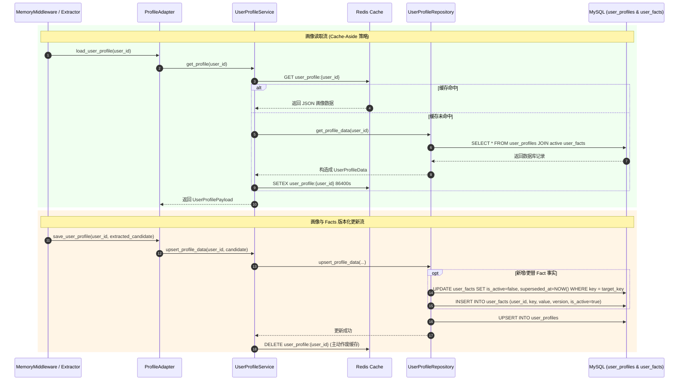

# 06 · 用户与画像全解析

> **流程图**：[00-全流程图集.md](00-全流程图集.md) §17 画像读写。

## 1. 领域边界与完整模块地图

| 归属 | 内容 |
|---|---|
| **user** | durable 用户身份、画像 schema、MySQL 持久化、Redis 缓存编排 |
| **knowledge** | 对话过程中**使用/更新**画像（经 adapter），不拥有表结构 |
| **chat** | 仅在 prompt 中展示画像文本 |

依赖规则：**user 不得 import knowledge**。

### 1.1 树状图

```text
app/user/
├── README.md
├── __init__.py
├── domain/
│   ├── __init__.py
│   ├── schemas.py                    # Profile TypedDict
│   └── profile_payload_support.py    # 规范化
├── application/
│   ├── __init__.py
│   └── user_profile_service.py       # 缓存 + 用例
└── infrastructure/
    ├── __init__.py
    ├── models/
    │   ├── __init__.py
    │   ├── README.md
    │   └── user.py                   # User ORM
    └── repository/
        ├── __init__.py
        └── user_profile_repository.py
```

跨域：

```text
app/knowledge/infrastructure/orchestration/profile_adapter.py
app/chat/infrastructure/graph/memory_context.py   # format_user_profile
app/shared/core/database.py
app/shared/core/app_config.py
```

### 1.2 逐文件职责（`app/user/`）

| 文件 | 用处 |
|---|---|
| `app/user/README.md` | 域边界与目录约定 |
| `domain/__init__.py` | 包初始化 |
| `domain/schemas.py` | `UserProfileFact`、`UserProfileData`、`UserProfilePayload` TypedDict |
| `domain/profile_payload_support.py` | `normalize_optional_text`/`normalize_profile_tags`/`normalize_profile_data`/`coerce_*`、字段名常量 |
| `application/__init__.py` | 包初始化 |
| `application/user_profile_service.py` | `UserProfileService`：`get_profile`/`upsert_profile_data` + 缓存；单例 `user_profile_service` |
| `infrastructure/__init__.py` | 包初始化 |
| `infrastructure/models/__init__.py` | 模型导出 |
| `infrastructure/models/user.py` | `User` ORM（id/username/created_at/conversations） |
| `infrastructure/models/README.md` | 持久化模型说明 |
| `infrastructure/repository/__init__.py` | 包初始化 |
| `infrastructure/repository/user_profile_repository.py` | 画像主表与 `user_facts` 版本化 SQL（get/upsert/fact） |

### 1.3 跨域相关文件（不在 user 包，但必懂）

| 文件 | 用处 |
|---|---|
| `knowledge/infrastructure/orchestration/profile_adapter.py` | 记忆侧读/写画像的唯一端口 |
| `chat/infrastructure/graph/memory_context.py` | `format_user_profile` 注入 P1 文案 |
| `shared/core/database.py` | `Base`/`AsyncSessionLocal` 供 ORM 使用 |
| `shared/core/app_config.py` | `user_profile_cache_ttl` 等 |

---

## 2. 用户模型

文件：`app/user/infrastructure/models/user.py`

| 字段 | 说明 |
|---|---|
| `id` | 主键 |
| `username` | 唯一用户名 |
| `created_at` | 创建时间 |
| `conversations` | relationship → Conversation（cascade delete-orphan） |

说明：

- 当前 API **没有**完整注册/登录接口；`user_id` 多由调用方直接传入  
- MySQL init.sql 中可能有更丰富的历史字段（email/password 等），**以 ORM 模型 + 实际迁移为准**  

---

## 3. 画像数据结构

文件：`app/user/domain/schemas.py`

### 3.1 `UserProfileFact`

```text
{ "key": str, "value": str }
```

### 3.2 `UserProfileData`（partial）

| 字段 | 含义 |
|---|---|
| `preferred_brand` | 偏好品牌 |
| `budget_range` | 预算范围 |
| `preferred_category` | 偏好品类 |
| `tags` | 标签列表 |
| `facts` | 结构化事实列表 |

### 3.3 `UserProfilePayload`

在 Data 基础上增加 `user_id`，作为服务对外返回结构。

---

## 4. Payload 规范化

文件：`app/user/domain/profile_payload_support.py`

| 函数 | 作用 |
|---|---|
| `normalize_optional_text` | 去空白，空→None |
| `normalize_profile_tags` | 过滤非字符串/空/重复，保序 |
| `normalize_profile_facts` | 规范化 fact 列表 |
| `normalize_profile_data` | 主字段 + tags + facts 总收口 |
| `coerce_user_profile_payload` | 任意原始对象 → 稳定 `UserProfilePayload` |

`PROFILE_FIELD_NAMES = preferred_brand / budget_range / preferred_category`。

缓存反序列化、DB 读出、LLM 抽取结果都应经这些函数，避免脏数据进 prompt。

---

## 5. Repository（MySQL）与版本化更新流



文件：`app/user/infrastructure/repository/user_profile_repository.py`

### 5.1 表（逻辑）

| 表 | 用途 |
|---|---|
| `user_profiles` | 主字段 + tags(JSON) |
| `user_facts` | 版本化 facts（`is_active` / `version` / `superseded_by` 等，以实现为准） |

### 5.2 主要方法

| 方法 | 作用 |
|---|---|
| `empty_profile(user_id)` | 稳定空结构 |
| `get_profile(db, user_id)` | 读主表 + 活跃 facts → Payload |
| `upsert_profile_fields` | 更新主字段 |
| `upsert_fact` | 写入/迭代事实版本 |
| `upsert_profile_data` | 批量主字段+facts，返回是否有变更 |

---

## 6. Service（缓存编排）

文件：`app/user/application/user_profile_service.py`  
单例：`user_profile_service`

### 6.1 缓存约定

| 项 | 值 |
|---|---|
| Key | `user:profile:{user_id}` |
| TTL | `settings.app_config.memory.user_profile_cache_ttl`（默认约 1800s） |
| 客户端 | 由调用方传入 Redis（MemoryMiddleware 传入 STM 的 redis） |

### 6.2 `get_profile`（函数级）

```python
async def get_profile(
    self,
    user_id: int,
    redis_client: ProfileCache | None = None,
) -> UserProfilePayload
```

```text
1. Redis GET key=user:profile:{user_id} → JSON → coerce/normalize
2. 未命中 → repository.get_profile(db, user_id)
3. 回填 Redis SETEX(ttl=user_profile_cache_ttl)
4. 任意失败 → empty_profile(user_id)（warning 日志，不抛给主对话）
```

### 6.3 `upsert_profile_data`（函数级）

```python
async def upsert_profile_data(
    self,
    user_id: int,
    profile: UserProfileData,
    redis_client: ProfileCache | None = None,
) -> bool
```

```text
1. profile 空 → True（noop）
2. repository.upsert_profile_data + commit（主字段 + facts 版本化）
3. 有变更则 DELETE 缓存 key（下次 get 重建）
4. 失败 → False + warning
```

**Repository 侧常见方法：** `get_profile` / `upsert_profile_fields` / `upsert_fact`（facts 版本链，见面试深挖）。

---

## 7. 与记忆链路的协作

```text
MemoryMiddleware.before_agent
  → profile_adapter.load_user_profile
      → user_profile_service.get_profile(uid, redis)

MemoryMiddleware.after_agent（压缩并抽取后）
  → profile_adapter.save_user_profile
      → user_profile_service.upsert_profile_data(uid, profile, redis)
```

画像在 prompt 中的展示见 `memory_context.format_user_profile`（P1 段）。

---

## 8. 会话归属

- Conversation.user_id → FK users.id  
- 删除用户时 cascade 删除会话元信息（ORM 配置）  
- **不会**自动清理 Redis STM / Milvus LTM 中该用户数据（当前边界，运维需知）  

---

## 9. 安全与隐私

1. MemoryExtractor 会对手机/身份证/银行卡/邮箱等做过滤或脱敏（配置 sensitive patterns）  
2. 画像 facts 避免直接存明文敏感证件  
3. 当前无鉴权：任何知道 user_id 的调用方可读写对应会话/问答上下文  

---

## 10. 相关测试

- `tests/user/test_user_profile_service.py`  
- `tests/user/test_user_profile_repository.py`  
- `tests/knowledge/test_profile_utils.py`  

---


---

## 面试深挖：用户与画像

### Q1. facts 为何版本化而不是 UPDATE 覆盖？

`upsert_fact`：值相同 return False；不同则 deactivate 旧行、insert version+1、superseded_by 链接。  
可追溯「用户预算从 3k 变成 5k」的历史，便于审计与回滚分析。

### Q2. 缓存一致性？

读：Redis → MySQL → 回填。  
写：DB commit 成功且 data_changed → **DELETE** cache（不是写穿更新），下次读重建。简单可靠。

### Q3. 空画像为何还返回结构？

`empty_profile` 保证 Prompt/类型稳定，避免 None 分叉；字段全 None/[]。

### Q4. knowledge 如何更新画像还不反向依赖？

`profile_adapter` 在 knowledge 包内，**import user.application**；user 永不 import knowledge。单向依赖。

### Q5. 为什么删会话不删画像？

因为画像是用户级 durable 资产，不是单会话的临时上下文。  
删会话时应该清掉 STM 和按 `session_id` 绑定的 LTM，但不应该把用户长期偏好和事实历史一起抹掉。

## 11. 当前边界与生产化改进

### 11.1 当前边界

1. 当前没有登录鉴权，`user_id` 来自调用方，默认信任外部传入。
2. 当前没有对外的“删除用户并清理全部画像/记忆”的完整 API。
3. 画像缓存是 **删除缓存、下次重建**，不是写穿更新；这是保守做法，但不是最低延迟做法。
4. `user_facts` 做了版本化，但当前主要强调可追溯，没有额外做历史版本归档和保留策略管理。
5. 删除会话时不会删除用户画像，因为画像是跨会话 durable 资产，不归单会话所有。

### 11.2 为什么这些边界值得主动讲

因为这能体现你对系统边界是清楚的，而不是只会背“这里用了 Redis 缓存、那里用了 MySQL 表”。

面试时可以这样表达：

```text
当前实现重点是把画像和对话记忆拆开：画像是用户级 durable 资产，记忆是会话级增强上下文。
所以删会话会清 STM/LTM，但不会清画像；如果未来要做用户注销，需要单独补用户级数据治理链路。
```

## 12. 实习面试讲法

### 12.1 这一块最值得讲什么

1. 画像为什么不放进 knowledge 域，而是放进 user 域。
2. 为什么 `user_facts` 要版本化，而不是直接更新。
3. 为什么缓存更新采用“DB commit 成功后删缓存，下次重建”。
4. 为什么删会话不删画像。

### 12.2 60 秒讲法模板

```text
用户画像这块我理解成两层：一层是 user_profiles 这种相对稳定的主字段，比如偏好品牌、预算范围、偏好品类；另一层是 user_facts 这种可变事实，比如用户最近提到过的需求或偏好，它做了 version 化而不是直接覆盖。读取时先走 Redis 缓存，miss 了再查 MySQL，写入时数据库提交成功后删缓存。知识域不会直接拥有画像表，而是通过 profile_adapter 调 user 域服务，这样 durable 用户数据和对话记忆的边界就比较清楚。
```

### 12.3 如果被追问“你觉得这里还有什么可以改”

1. 增加 JWT 和 user_id 真实性校验。
2. 增加删除用户时的画像、缓存、记忆一体化清理流程。
3. 给 facts 增加更细粒度的来源、置信度和更新时间策略。
4. 如果画像字段继续变多，可以从 TypedDict 逐步升级到更强约束的数据模型和迁移方案。

## 13. 下一步

- 配置默认值、缓存 TTL、字段总表 → [07-配置参数与数据字段全览.md](07-配置参数与数据字段全览.md)  
- 返回项目主线重新串联 → [01-系统总览.md](01-系统总览.md)


---

## 附录 · 用户与画像深度通关（把 P1 讲透）

## U1. 数据模型（表级）

### users

| 列 | ORM | 说明 |
|---|---|---|
| id | PK int | API 传入的 user_id 即此 id |
| username | unique | 当前几乎无注册 API，可能靠 init 数据 |
| created_at | datetime | 创建时间 |

relationship：`conversations` → `Conversation`（`cascade="all, delete-orphan"` 语义：删用户会级联会话；**但当前无删用户 API**）。

### user_profiles（逻辑）

| 列 | 说明 |
|---|---|
| user_id | PK/FK |
| preferred_brand / budget_range / preferred_category | 主画像字段，可空 |
| tags | JSON 字符串数组 |

### user_facts（版本化事实）

| 列 | 说明 |
|---|---|
| id | PK |
| user_id, fact_key, fact_value | 业务键 |
| version | 递增 |
| is_active | 仅一条 active |
| superseded_by | 指向新版本 id |

**为何版本化：** 保留偏好变迁审计；UPDATE 覆盖会丢历史。写路径：旧行 `is_active=false`，插入新 version。

## U2. Repository 方法级

文件：`user_profile_repository.py`

| 方法 | SQL 意图 |
|---|---|
| `empty_profile(user_id)` | 纯内存默认结构，不查库 |
| `get_profile(db, user_id)` | SELECT 主表 + active facts → 组装 Payload |
| `upsert_profile_fields(...)` | 主字段 INSERT/UPDATE；tags json.dumps |
| `upsert_fact(...)` | 查当前 active → 变则 deactivate + insert 新 version + link superseded_by |
| `upsert_profile_data(db, user_id, profile)` | 拆主字段 + 遍历 facts 调 upsert_fact |

## U3. Service 缓存时序（必画）

```text
get_profile(user_id, redis?):
  key = user:profile:{user_id}
  if redis:
    GET → json.loads → coerce_user_profile_payload
  else miss:
    MySQL get_profile
    SETEX key TTL profile_json
  on error → empty_profile（主对话不崩）

upsert_profile_data(user_id, profile, redis?):
  if profile empty → True
  MySQL upsert + commit
  if changed and redis: DELETE key   # 下次 get 重建
  on error → False
```

TTL：`settings.app_config.memory.user_profile_cache_ttl`（默认 1800s）。

## U4. 规范化（profile_payload_support）

| 函数 | 作用 |
|---|---|
| `normalize_optional_text` | 空白→None |
| `normalize_profile_tags` | 去空、去重、保序 |
| `normalize_profile_data` | 主字段+tags+facts 清洗 |
| `coerce_user_profile_payload` | 缓存/脏 JSON → 标准 Payload |

## U5. 与记忆协作（跨域时序）

```text
before_agent:
  profile_adapter.load_user_profile(uid, redis_from_stm)
    → user_profile_service.get_profile
  → memory_context.format_user_profile → P1 段落

after_agent（仅压缩成功且 extractor 给出 profile）:
  profile_adapter.save_user_profile(uid, profile, redis)
    → upsert_profile_data
```

**依赖方向：** knowledge → user.application/domain；**禁止** user → knowledge。

## U6. 边界口令（面试）

- 删**会话**不清画像；删**用户**（若做）会级联会话，画像表需单独策略  
- 无 JWT：user_id 信任调用方（生产要改）  
- 空画像也返回结构，方便 Prompt 稳定  

## U7. 相关测试

- `tests/user/test_user_profile_service.py`  
- `tests/user/test_user_profile_repository.py`  
