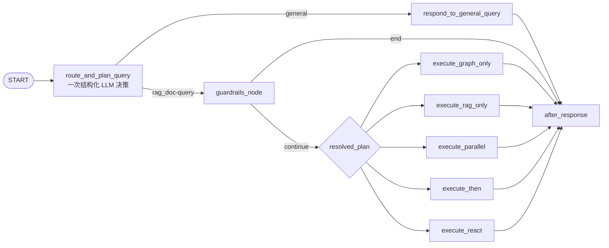

# Router 与 RetrievalPlan 合并设计

## 目标

把 LangGraph 主图中连续的两个 LLM 决策层合并为一个结构化节点，减少知识查询
请求的一次模型调用与一次状态跳转，同时保持 Guardrails 作为独立的安全/业务范围
硬门。

当前路径：

```text
analyze_and_route_query → guardrails_node → retrieval_plan_route → execute_*
```

目标路径：

```text
route_and_plan_query → guardrails_node → execute_*
```

`general` 请求仍直接进入通用回复，不进入 Guardrails，与现有行为保持一致。

## 决策

1. 新节点名为 `route_and_plan_query`，一次调用 `router_model`。
2. 模型输出 `RoutingDecisionOutput`：
   `type`、`logic`、`need_graph`、`need_rag`、`mode`、`complexity`。
3. 节点内仍由确定性函数 `resolve_execution_plan` 计算 `resolved_plan`；LLM 不直接做
   五选一，避免编排规则分散到 Prompt。
4. `AgentState.router` 与 `AgentState.retrieval_plan` 合并为
   `routing_decision`，使状态也反映单一决策边界。
5. Guardrails 只负责 `continue/end`。`continue` 时直接读取
   `routing_decision.resolved_plan` 选择 `execute_*`；`end` 时进入
   `after_response`。
6. 移除 `retrieval_plan_model`、`retrieval_plan_route` 和对应 Prompt 覆盖键。
   本地 Prompt 覆盖改用 `routing_decision`；旧的 `router_system` /
   `retrieval_plan_router` 不能安全拼接，必须合并为完整的新 Prompt。

## 数据流与错误语义



- `general` 的能力标签固定为 false / `single` / `simple`，且
  `resolved_plan=None`；它不会误进入执行器。
- `rag_doc-query` 由代码规范化枚举、计算执行计划；字段缺失或异常值按现有规则
  回退到 `AGENT_REACT`，不产生未映射的图边。
- Guardrails 拦截逻辑、拒答文案和提示词注入防护不改变。
- 该图没有持久化 checkpointer，因此无需对历史图状态做数据库迁移。

## 验收与文档

- 单元测试覆盖：一次结构化输出写入统一状态、general/retrieval 分支、五类执行计划、
  Guardrails 直连执行/拒答分支，以及已移除节点不再注册。
- 更新 Prompt 配置说明、模型角色/超时表、主图/时序图、状态字段说明、架构索引和
  面试手册。
- 运行相关 pytest、ruff、mypy（若基线允许）和 Markdown 链接/围栏检查。
