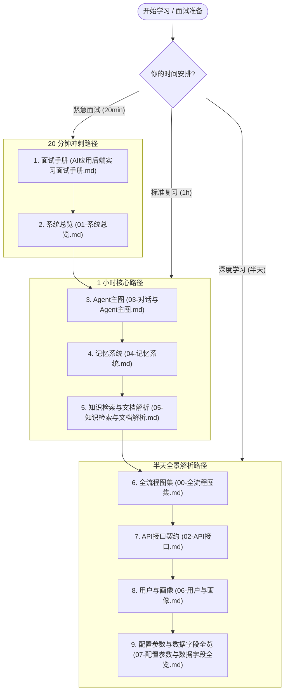

# AssistGen 学习与面试索引

> 目标：让你把这个项目讲成一个完整的 AI 应用后端项目，而不是背一堆零散知识点。  
> 事实口径：以当前仓库里的 `app/`、`frontend/`、`docker-compose.yml`、`tests/` 为准。

## 1. 先抓住项目主线

这不是一个“接了大模型接口的聊天页”，而是一个面向智能客服场景的 AI 应用后端：

1. 对外暴露会话管理、文档上传、文档列表和 SSE 问答接口。
2. 内部不是单次 LLM 调用，而是用 LangGraph 显式编排路由、守卫、检索计划和执行路径。
3. 知识来源不是单一数据库，而是同时使用：
   - Neo4j 处理结构化关系型问题。
   - Milvus 处理文档检索和长期记忆。
   - Redis 处理短期上下文、任务状态和持久化 Stream 事件。
   - MySQL 处理会话元信息、完整历史、用户画像和 Stream 消费 Inbox。

如果你先把这 3 点讲顺，后面的章节才不会越看越散。

## 2. 这套文档应该怎么读

| 你的时间 | 推荐顺序 | 目标 |
|---|---|---|
| 20 分钟 | [AI应用后端实习面试手册.md](AI应用后端实习面试手册.md) → [01-系统总览.md](modules/01-系统总览.md) | 先把项目介绍和主链路讲顺 |
| 1 小时 | 手册 → [01](modules/01-系统总览.md) → [03](modules/03-对话与Agent主图.md) → [04](modules/04-记忆系统.md) → [05](modules/05-知识检索与文档解析.md) | 准备核心面试追问 |
| 半天 | [00](modules/00-全流程图集.md) → [01](modules/01-系统总览.md) → [02](modules/02-API接口.md) → [03](modules/03-对话与Agent主图.md) → [04](modules/04-记忆系统.md) → [05](modules/05-知识检索与文档解析.md) → [06](modules/06-用户与画像.md) → [07](modules/07-配置参数与数据字段全览.md) | 建立完整心智模型 |

推荐顺序不是按“文档厚度”，而是按“面试里最容易先被问到什么”。

## 3. 每份文档分别解决什么问题

| 文档 | 你读完应该会什么 |
|---|---|
| [AI应用后端实习面试手册.md](AI应用后端实习面试手册.md) | 能完整介绍项目，能回答高频追问，能区分当前实现与边界 |
| [00-全流程图集.md](modules/00-全流程图集.md) | 能把请求流、记忆流、上传流、Inbox 状态机和数据落点画出来 |
| [01-系统总览.md](modules/01-系统总览.md) | 能讲清仓库边界、目录分层、数据为什么这样拆 |
| [02-API接口.md](modules/02-API接口.md) | 能讲清会话、上传、文档、SSE 及 Stream 事件幂等契约 |
| [03-对话与Agent主图.md](modules/03-对话与Agent主图.md) | 能讲清 Router、Guardrails、Retrieval Plan、ReAct |
| [04-记忆系统.md](modules/04-记忆系统.md) | 能讲清 P0-P3 和记忆读写时机 |
| [05-知识检索与文档解析.md](modules/05-知识检索与文档解析.md) | 能讲清 Neo4j、Milvus、Text2Cypher、文档解析链路 |
| [06-用户与画像.md](modules/06-用户与画像.md) | 能讲清 facts 版本化、画像缓存、画像与记忆的边界 |
| [07-配置参数与数据字段全览.md](modules/07-配置参数与数据字段全览.md) | 查数字、查字段、查 Redis key、查 Milvus schema |

## 4. 面试题应该倒查哪份文档

| 面试官问题 | 优先看哪份 |
|---|---|
| 这个项目到底是做什么的？ | [AI应用后端实习面试手册.md](AI应用后端实习面试手册.md)、[01-系统总览.md](modules/01-系统总览.md) |
| 一次用户提问在系统里怎么走？ | [00-全流程图集.md](modules/00-全流程图集.md)、[03-对话与Agent主图.md](modules/03-对话与Agent主图.md) |
| 为什么不是一个大 Prompt 直接解决？ | [03-对话与Agent主图.md](modules/03-对话与Agent主图.md) |
| 为什么同时用了 MySQL、Redis、Neo4j、Milvus？ | [01-系统总览.md](modules/01-系统总览.md)、[04](modules/04-记忆系统.md)、[05](modules/05-知识检索与文档解析.md) |
| 文档上传后为什么能被问到？ | [02-API接口.md](modules/02-API接口.md)、[05-知识检索与文档解析.md](modules/05-知识检索与文档解析.md) |
| 多轮对话为什么能记住上下文？ | [04-记忆系统.md](modules/04-记忆系统.md)、[06-用户与画像.md](modules/06-用户与画像.md) |
| 用户画像为什么单独建模？ | [06-用户与画像.md](modules/06-用户与画像.md) |
| 你实际做了哪些部分？ | [AI应用后端实习面试手册.md](AI应用后端实习面试手册.md) |

## 5. 你真正需要掌握的 8 件事

读完这套文档后，你至少应该能独立讲清下面 8 件事：

1. 这个项目的业务目标是什么。
2. 一次问答请求从 HTTP 到最终回复的完整路径。
3. LangGraph 主图为什么要拆成路由、守卫、计划、执行。
4. 为什么图谱检索和文档检索不能合并成一条链路。
5. 为什么记忆要分成最近消息、画像、摘要、长期记忆。
6. 为什么上传必须异步而不是同步阻塞。
7. 当前事件为什么仍是至少一次投递，以及 Inbox、事件 ID 与业务落点如何共同收敛重放。
8. 你自己真实参与的部分，怎么讲得清楚又不虚。

## 6. 读文档时最容易讲错的边界

1. 这是一个以后端为主的 AI 应用项目，前端存在，但不是主线。
2. 会话消息是双轨：MySQL `messages` 保存给人看的完整历史，Redis STM 保存给模型的窗口上下文。
3. `conversation_id` 和 LangGraph `thread_id` 在当前接口契约里对齐使用，但语义并不完全相同。
4. 用户画像是 durable 的用户级资产，不等于会话级记忆。
5. 当前工程强调可运行和可讲清，但并不等于已经完成完整生产级安全治理。

## 7. 最后怎么用这套文档

如果你是为了面试：

1. 先看 [AI应用后端实习面试手册.md](AI应用后端实习面试手册.md)。
2. 再看 [01-系统总览.md](modules/01-系统总览.md)、[03-对话与Agent主图.md](modules/03-对话与Agent主图.md)、[04-记忆系统.md](modules/04-记忆系统.md)、[05-知识检索与文档解析.md](modules/05-知识检索与文档解析.md)。
3. 最后遇到具体数字、字段、键名，再查 [07-配置参数与数据字段全览.md](modules/07-配置参数与数据字段全览.md)。

如果你是为了系统学习：

1. 先看 [00-全流程图集.md](modules/00-全流程图集.md)。
2. 再按 `01 → 02 → 03 → 04 → 05 → 06` 的顺序看。
3. 每读完一章，都回到源码里把对应目录打开确认一次。

> **函数级明细（v3.35.1 起）**：01/02/03/04/05/06/07 每篇末尾均附「函数手册」附录——对应域全部函数的签名/参数/返回/异常/调用关系/历史踩坑，与源码逐字对齐。
